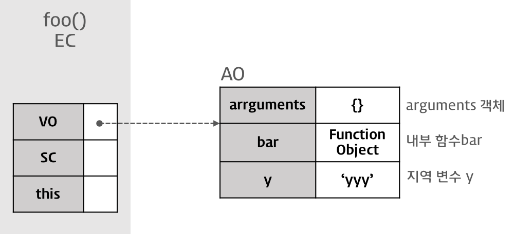

# 실행 컨텍스트

변수나 함수의 실행 컨텍스트(execution context)는 scope, hosting, this, function, closure 등의 동작원리를 담고 있는 핵심원리로 **다른 데이터에 접근할 수 있는지, 어떻게 행동하는지를 규정**한다. 

ECMAScript에 따르면 실행 컨텍스트를 실행 가능한 코드를 형상화하고, 구분하는 추상적인 개념으로 즉, **실행 컨텍스트는 실행 가능한 코드가 실행되기 위해 필요한 환경**이라 말할 수 있다.

- 전역 코드 : 전체 영역에 존재하는 코드
- eval 코드 : `eval` 함수로 실행되는 코드
- 함수 코드 : 함수 내에 존재하는 코드

일반적으로 실행 가능한 코드는 전역 코드와 함수 내 코드이다.

#### 실행에 필요한 정보

- 변수 : 전역변수, 지역변수, 매개변수, 객체의 프로퍼티
- 함수 선언
- scope
- this

```js
var x = 'xxx';

function foo(){
  var y = 'yyy';
  
  function bar(){
    var z = 'zzz';
    console.log(x + y + z);
  }
  bar();
}
foo();
```

위 코드를 실행하면 아래와 같이 실행 컨텍스트(stack)이 생성하고 소멸된다. 현재 실행 중인 컨텍스트와 상관 없는 코드(예를 들어 다른 함수)가 실행되면 새로운 컨텍스트가 생성된다.


1. 컨트롤이 실행 가능한 코드로 이동하면 논리적 스택 구조를 가지는 실행 컨텍스트 스택이 생성된다.
2. 전역 코드(global code)로 컨트롤이 진입하면 전역 실행 컨텍스트가 생성되고 실행 컨텍스트 스택에 쌓인다. 전역 실행 컨텍스트는 애플리케이션이 종료될때(웹 페이지에서 나가거나 브라우저를 닫을때)까지 유지된다.
3. 함수를 호출하면 해당 함수의 실행 컨텍스트가 생성되며 직전에 실행된 코드 블록의 실행 컨텍스트 위에 쌓인다.
4. 함수 실행이 끝나면 해당 함수의 실행 컨텍스트를 파기하고 직전의 실행 컨텍스트에 컨트롤을 반환한다.

실행 컨텍스트는 포함된 코드가 모두 실행될 때 파기되는데, 이때 해당 컨텍스트 내부에서 정의된 변수와 함수도 함께 파괴된다.

## 실행 컨텍스트 객체

실행 컨텍스트는 실행 가능한 코드를 형상화하고 구분하는 추상적인 개념이지만 물리적으로는 객체의 형태를 가진다.


### Variable Object ( VO ) 변수객체

실행 컨텍스트가 생성되면 자바스크립트 엔진은 실행에 필요한 여러 정보들을 담을 객체를 생성하는데 이를 Variable Object라고 한다. Variable Object는 코드가 실행될 때 엔진에 의해 참조되며 코드에서는 접근할 수 없다.

- 변수
- 매개변수(parameter)와 인수(arguments)
- 함수 선언( 함수 표현식 제외 )

#### 전역 컨텍스트

Variable Object는 유일하며 최상위에 위치하고 모든 전역 변수, 전역 함수 등을 포함하는 **전역 객체(Global Object )**를 가리킨다. 전역 객체는 전역에 선언된 전역 변수와 전역 함수를 프로퍼티로 소유한다.


#### 함수 컨텍스트

Variable Object는 **활성 객체(Activation Object)**를 가리키며 매개 변수와 인수들의 정보를 배열의 형태로 담고 있는 객체인 **arguments** object가 추가된다.




### Scope Chain

Scope Chain은 일종의 리스트로 전역 객체와 중첩된 함수의 스코프의 레퍼런스를 차례로 저장하고 있다. 즉, 스코프 체인은 전역 객체(  GO) 혹은 활성 객체(AO)의 리스트를 가리킨다.

## 참조 페이지

- [실행 컨텍스트와 자바스크립트의 동작 원리](https://poiemaweb.com/js-execution-context)