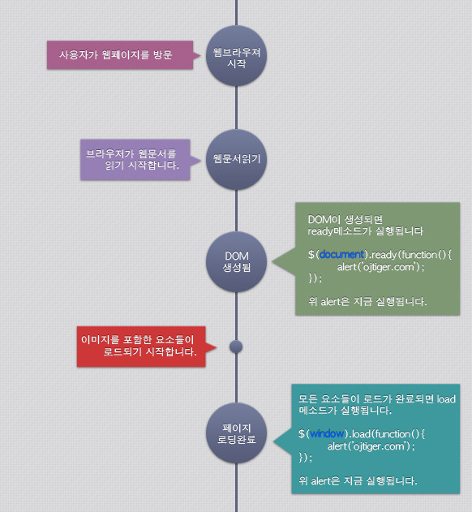

# Image Object

패션이미지 추천서비스를 구현할 당시 이미지 로딩이 완료된 후에 해당 이미지의 해상도를 구해야하는 경우가 있었다.

처음엔 단순히 아래와 같이 `load` 이벤트를 bind해서 처리했다.

```js
$('#targetImg').bind('load',function(event){
		// ...
		$(this).unbind(event);
});
```
```js
$('#targetImg').once('load', function(){
	//... 
});
```

이 경우에는 이미지가 로딩되지 않고 이벤트가 처리되는 경우가 발생했다.
그 이유는 Resource와 상관 없이 DOM만 생성되어도 이벤트가 호출되기 때문이다.
즉, 이미지와 같이 resource를 요구하는 페이지일 경우 이미지 로딩 완료와 상관없이 진행된다.

그래서 다음과 같이 리소스 호출이 완료된 후에 호출하는 `.onload` 로 시도해봤다.

```js
window.onload = function(){};
```



`.onload()`는 이미지가 브라우저 캐시에 저장된 경우에는 이벤트가 발생하지 않아 이 방법도 불가능했다.

결국 Image Object로 해결할 수 있었다. **`Image()` 객체는 이미지를 동적으로 생성할 때 사용**한다. `.onload` 이벤트는 이미지가 로딩이 완료되면 실행되는 함수이다.

```js
var img = new Image();
img.onload = function(){
	var imgW =   img.width;
  var imgW =   img.height;
};
img.src = 'image_path';
```

다음과 같이 `Image()` 객체를 생성해 `.onload()` 이벤트로 이미지 크기를 정확이 구할 수 있었다.

## 참조 문서

- [https://stackoverflow.com/questions/3877027/jquery-callback-on-image-load-even-when-the-image-is-cached](https://stackoverflow.com/questions/3877027/jquery-callback-on-image-load-even-when-the-image-is-cached)
- [https://kkk-kkk.tistory.com/entry/%EC%98%88%EC%A0%9C-9-14-onload%EB%A1%9C-%EC%9D%B4%EB%AF%B8%EC%A7%80-%ED%81%AC%EA%B8%B0-%EC%95%8C%EC%95%84%EB%82%B4%EA%B8%B0](https://kkk-kkk.tistory.com/entry/예제-9-14-onload로-이미지-크기-알아내기)