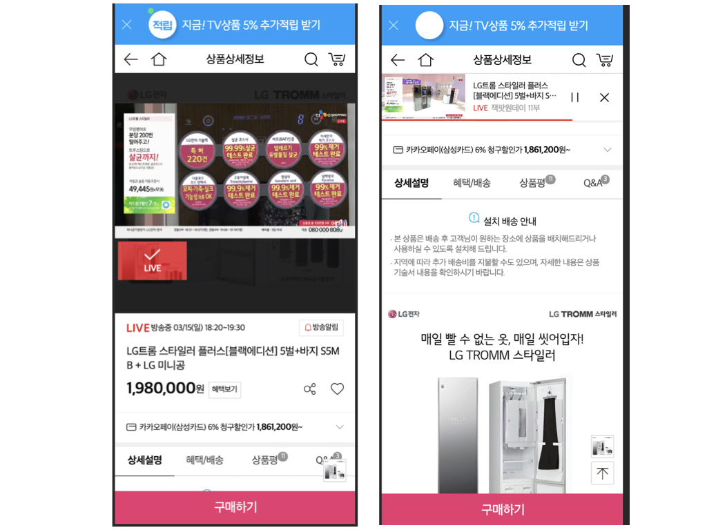

# Intersection Observer

동영상 레이어 플레이어 작업을 진행하면서, 현재 특정 element가 보이는지 여부에 따라서 레이어 플레이어 혹은 상단 비디오 플레이어를 노출 이벤트를 처리해야하는 경우가 생겼다.



Intersection Observer API는 element가 viewport에서 "보이는지 안보이는지"(visible)에 따라 비동기로 이벤트 처리를 할 수 있게 해준다.

```js
const intersectionObserver = new IntersectionObserver((entries, observer) => {
    entries.forEach(entry => {
        if (entry.isIntersecting) {
            // do something
            observer.unobserve(entry.target);
        }
    });
});

intersectionObserver.observe(element);
```

기본적인 사용방법은 다음과 같다.

그리고 아래의 3가지 옵션을 줄 수 있다.

- root :  `Element` 또는 `null` 값으로 target (관측 대상) 을 감싸는 element 를 지정한다고 할 수 있습니다. 
  만약 null 로 지정한다면 viewport로 지정됩니다.
- rootMargin : root요소를 감싸는 margin 값을 지정한다.
- threshold : target element 가 root 와 몇 % 교차했을 때, callback 을 실행할지 결정하는 값이다.

이번의 경우에는 헤더의 높이와 현재 플레이어가 노출되는 비율을 계산하여 레이어 플레이어를 노출해야하는 경우여서 `threshold` 옵션을 사용해 영역 노출여부를 판단했다.

```js
_setObserveIstance: function(videoPlayerView, controlOptions){
		  var s = this;
		  var $header = $('#header');
		  var $player = $('#player');
		  var threshold = ($header.outerHeight() / $player.height()).toPrecision(1);
		  var observerOptions = {
				  threshold: Number(threshold)
		  };
			// 재생중인 경우 레이어 플레이어 노출
		  var observerInstance = new IntersectionObserver(function(entries, observer) {
				entries.forEach(function(entry){
					if(entry.intersectionRatio > threshold){
            // 보여지는 영역 비율이 threshold보다 크면 상단 플레이어 노출
					}else{
            // 보여지는 영역 비율이 threshold보다 작으면 레이어플레이어 노출
					}
				});
			}, observerOptions);
				  
			observerInstance.observe(videoPlayerView.$el.get(0));
	  }
	} );
```

동영상이 일시정지되거나 종료된 경우에는 `observer.unobserve(element);` 로 observing을 종료해주었다.


## 참조 페이지

- [https://developer.mozilla.org/ko/docs/Web/API/IntersectionObserver/IntersectionObserver](https://developer.mozilla.org/ko/docs/Web/API/IntersectionObserver/IntersectionObserver)
- [https://velog.io/@doondoony/IntersectionObserver](https://velog.io/@doondoony/IntersectionObserver)