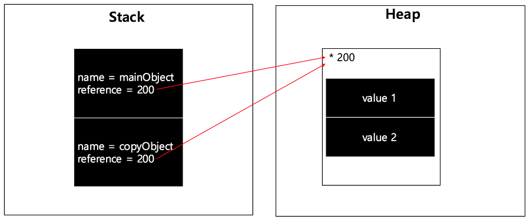
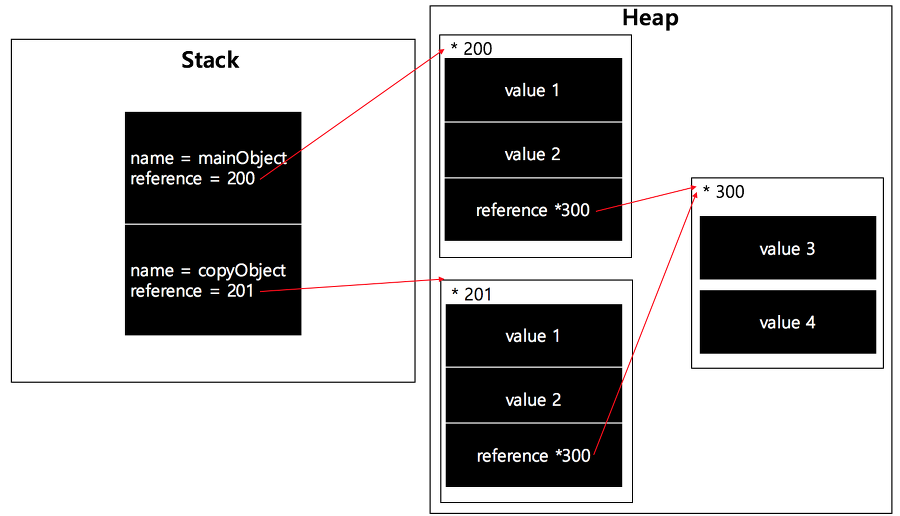
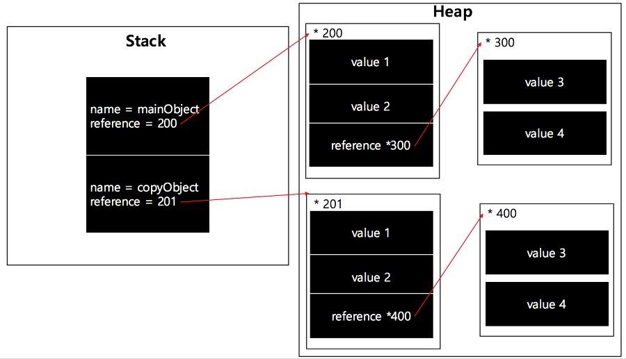

# Shallow Copy vs Deep Copy

ECMAScript의 변수는 '원시 값'과 '참조 값' 두 가지 타입의 데이터를 저장할 수 있다.
원시 값은 단순한 데이터이며 Undefined, Null, Boolean, 숫자, 문자열이고,
참조 값은 여러 값으로 구성된 객체로 메모리에 저장된 객체를 가리킨다.

## 대입 연산자(=)

```js
let person = {
	name: "정다혜",
	age: 26
};

let  copyPerson = person;
copyPerson.age = 30;

console.log(person.age);			// 30
console.log(copyPerson.age);	// 30
```

참조 값을 변수에서 다른 변수로 복사하게 되면 그 값이 객체 자체가 아니라 heap에 저장된 객체를 가리키는 포인터이기때문에 한쪽을 변경하면 다른 쪽에도 반영이된다.



위 그림처럼 다른 변수는 같은 객체를 바라보고 있는 것을 알 수 있다. 즉,  **`=` 를 사용한 객체 복사는 참조만 하는 것**이다. 이러한 방식은 객체의 불변성을 깨뜨리고, 버그를 유발할 수 있다. 실제로, 작업을 하면서 단순 대입으로 변수를 복사해 버그가 유발된 경우도 있었다.

## Shallow Copy (얕은 복사)

shallow copy는 말 그대로 한 depth만 복사한다.

얕은 복사란 새로운 객체에 원본 객체의 프로퍼티의 값을 정확히 복사하는 것이다. 값이 객체라면 해당 객체의 주소를 복사하게되는 것이다.



아래의 예시를 보면 이해하기가 더 쉬울 것이다.

```js
let obj = {
  a: 1,
  b: 2,
  c: {
    c1: 1,
    c2: 2
  }
}

let copyObj = Object.assign({}, obj);

copyObj.a = 10;
copyObj.c.c1 = 4;

console.log(obj.a); 		// 1
console.log(obj.c.c1);  // 4
```

객체의 경우 객체의 참조 값을 복사하게 되므로, 복사한 변수에서 값을 변경해도 원래 변수값까지 변경되는 것을 확인할 수 있다.

- _.clone()

```js
var person = {
  name: 'faker',
  age: 25
};
var copyPerson = _.clone(person);
```

- $.extend()

```js
var person = {
  name: 'faker',
  age: 25
};
var copyPerson = $.extend({},person);
```

다음과 같이 underscore.js의 `_.clone()` 과 jQuery의 `$.extend()` 를 사용해서도 얕은 복사를 할 수 있다.

## Deep Copy(깊은 복사)

Deep Copy는 원본 객체를 완전히 복사하게 된다. Shallow Copy에서 주소를 복사한 것 또한 새로운 메모리 공간을 확보해 생성하게된다. 



주로 구현하는 방법은 아래와 같은 방법이 있다.

- 재귀호출로 복사

```js
function deepCopy(obj) {
  if (obj === null || typeof(obj) !== "object") {
    return obj;
  }
    
  let copy = {};
  for(let key in obj) {
    copy[key] = deepCopy(obj[key]);
  }
  return copy;
}
```

- JSON

```js
let copyObj = JSON.parse(JSON.stringify(obj));
```

Stringily 메소드는 function의 경우에 undefined로 처리하므로 주의해서 사용해야한다.

- 라이브러리(jQuery)

```js
var person = {
  name: 'faker',
  age: 25
};
var copyPerson = $.extend(true, {},person); // DeepCopy flag를 true로 설정
```


## 참고 페이지

- [마이구미의 HelloWorld - Javascript:Shallow and Deep Copy :: 마이구미](https://mygumi.tistory.com/322 ) 
- [DailyEngineering - JavaScript에서 객체 복사하기](https://hyunseob.github.io/2016/02/08/copy-object-in-javascript/)

