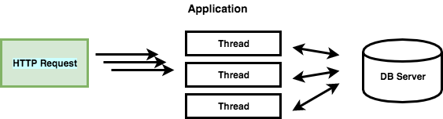
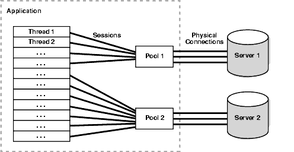

# Connection Pool

다음은 [JDBC](https://dahye-jeong.gitbook.io/til/jsp/chap07-jdbc) 드라이버를 이용해 DB에 접속하는 예제이다.

```java
String driverPath = "net.sourceforge.jtds.jdbc.Driver";
String address = "jdbc:jtds:sqlserver://IP/DB";
String userName = "user";
String password = "password";
String query = "SELECT ... where id = ?";
try {
 Class.forName(driverPath);
 Connection connection = DriverManager.getConnection(address, userName, password);
 PreparedStatement ps = con.prepareStatement(query);
 ps.setString(1, id);
 ResultSet rs = get.executeQuery();
 // ....
} catch (Exception e) { }
} finally {
 rs.close();
 ps.close();
}
```

JDBC를 이용해 원하는 데이터를 얻기까지 과정에서 가장 비용이 많이 발생하는 부분은 웹 서버에서 물리적으로 DB서버에 최초로 연결되어 Connection 객체를 생성하는 부분이다.



웹 애플리케이션은 HTTP 요청에 따라 Thread를 생성하게되고, 대부분의 비즈니스 로직은 DB 서버로 부터 데이터를 얻게된다. 만약 위와 같이 모든 요청에대해 DB 접속을 위한 Driver를 로드하고, Connection 객체를 생성하여 연결한다면 물리적으로 DB 서버에 지속적으로 접근해야될 것이다.

이러한 경우에 DBCP(Database Connection Pool)을 이용해 DB Connection **객체를 생성하는 부분에 대한 비용과 시간을 줄이고, 네트워크 연결에 대한 부담을 줄일 수 있다**.

## DBCP

Connection Pool을 이용하면 다수의 HTTP 요청에 대한 Thread를 효율적으로 처리할 수 있게된다.

*[WAS](https://dahye-jeong.gitbook.io/til/jsp/2020-03-16-webserver) 가 실행될 떄 애플리케이션은 Connection Pool 라이브러리를 통해 Connection Pool 구현체를 사용할 수 있다.[[Apache Common DBCP 오픈소스 라이브러리][http://commons.apache.org/]*]



Connection Pool이란 DB와 미리 연결(connection)을 해놓은 객체들을 웅덩이(Pool)에 저장해두었다가 클라이언트 요청이 오면 connection을 빌려주고, 작업이 끝나면 다시 connection을 돌려받아 pool에 저장하는 방식을 말한다.

1. WAS가 실행되면서 미리 일정량의 DB Connection 객체를 생성하고 Pool에 저장해둔다.
2. HTTP 요청에 따라 필요할 때 Pool에서 Connection 객체를 가져다 쓰고 반환한다.
3. 이와 같은 방식으로 HTTP 요청 마다 DB Driver를 로드하고 물리적인 연결에 의한 Connection 객체를 생성하는 비용이 줄어들게 된다.


서버는 동시에 사용할 수 있는 사람의 수가 있는데, 일반적인 Connection Pool 이용시 동시 접속자 수를 벗어나게 될 경우 에러(예외)가 발생하므로, 크기는 서버 접속자 수 등 서버 부하에 따라서 조정해야한다. Connection 또한 객체이므로 메모리를 차지하게 된다. 그러므로 무작정 많이 늘리는 것은 오히려 성능이 떨어질 수 있다.

Connection Pool에서 생성되어 있는 Connection의 수는 한정적이다. 동시 접속자가 많아져 남아있는 Connection이 없는 경우 해당 클라이언트는 대기 상태로 전환이되고, 반환되면 대기하고 있는 순서대로 Connectoin이 제공된다.


## 참고

- [https://www.holaxprogramming.com/2013/01/10/devops-how-to-manage-dbcp/](https://www.holaxprogramming.com/2013/01/10/devops-how-to-manage-dbcp/)
- [https://brownbears.tistory.com/289](https://brownbears.tistory.com/289)