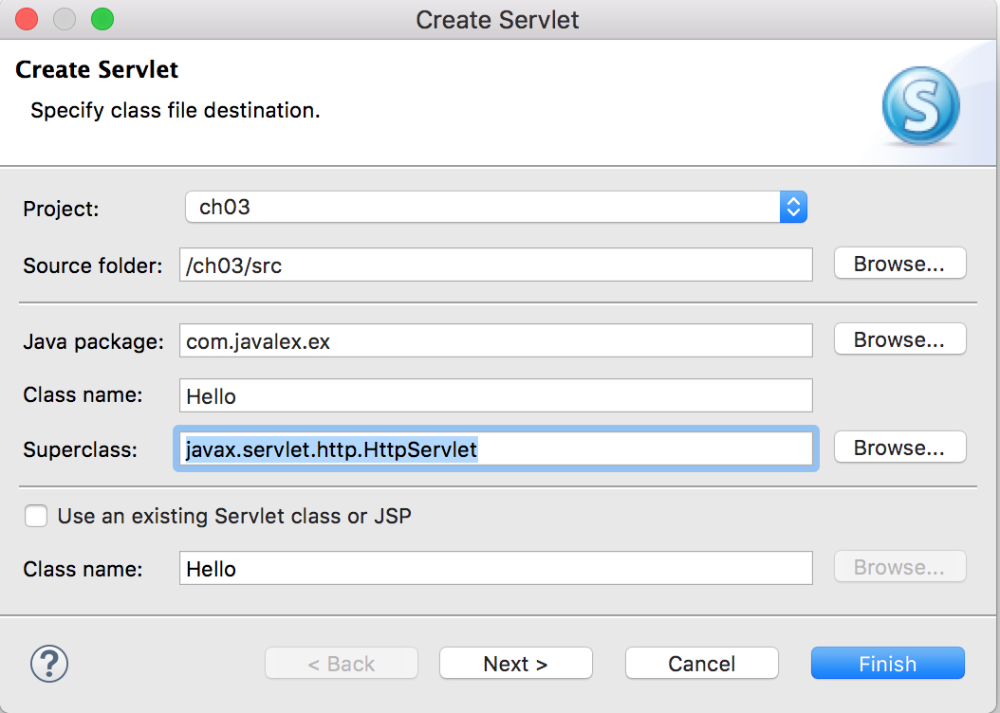
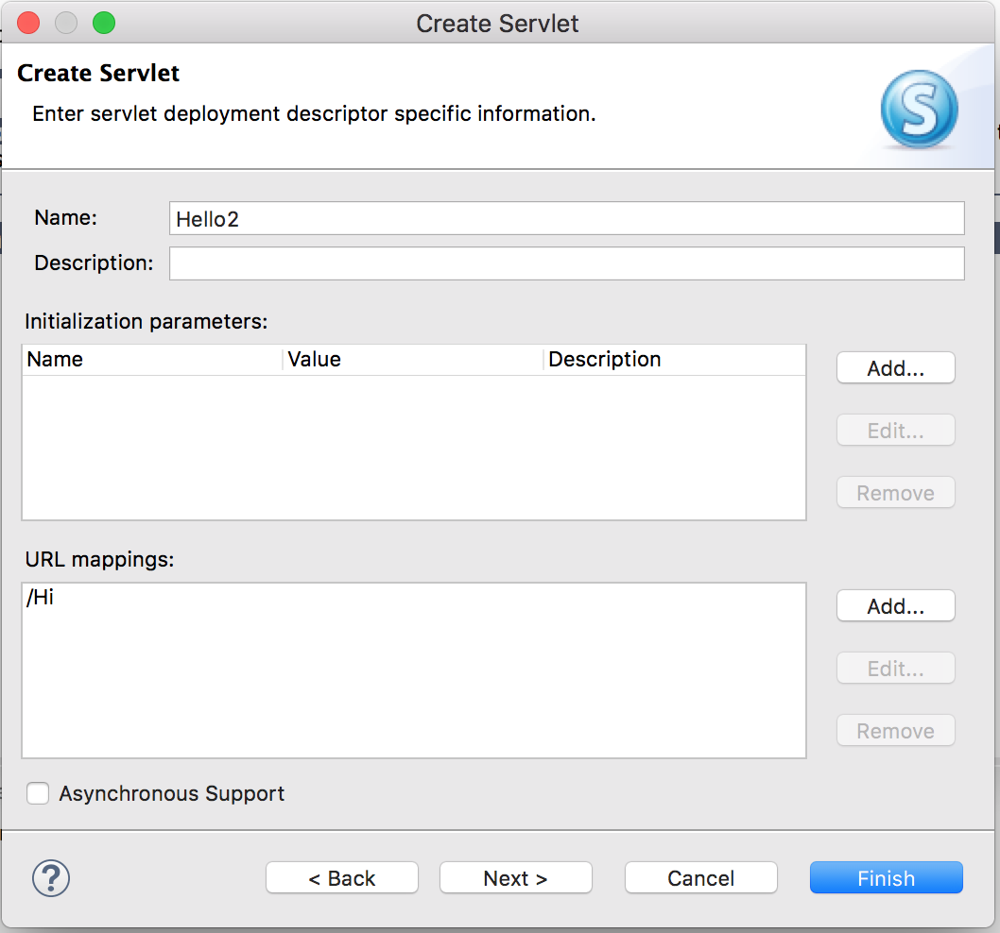
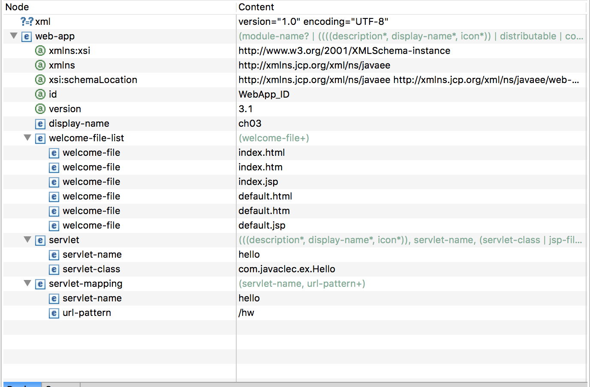

# 3. JSP/Servlet 맛보기


#### 프로젝트 생성하기

```
new → project → web/Dynamic Web Project → finish
```

## JSP 맛보기

### JSP 특징

- **동적 웹어플리케이션** 컴포넌트이다. (html은 정적이다.)
- `.jsp` 확장자를 사용한다.
- 클라이언트의 요청에 동적으로 작동하고, 응답은 html을 이용한다.
- jsp는 **servlet으로 변환되어 실행**된다.
- MVC 패턴에서 **View**로 이용된다.

### JSP파일 생성하기

```
new → JSP File
```

WebContent 폴더 안에 JSP파일이 생성된다.

### JSP 아키텍쳐

`filename.jsp` →`filename_jsp.java` →`filename_jsp.class`

- jsp파일은 java파일로 변환된다.
- java파일은 `javac.exe` 컴파일러가 class파일로 컴파일한다.

```jsp
<%@ page language="java" contentType="text/html; charset=UTF-8"
    pageEncoding="UTF-8"%>
<!DOCTYPE html PUBLIC "-//W3C//DTD HTML 4.01 Transitional//EN" "http://www.w3.org/TR/html4/loose.dtd">
<html>

<head>
<meta http-equiv="Content-Type" content="text/html; charset=UTF-8">
<title>Insert title here</title>
</head>
<body>
	<h1>Hello</h1>
</body>
</html>
```

## servlet 맛보기

### servlet특징

- 동적 웹어플리케이션 컴포넌트.
- `.java` 확장자.
- 클라이언트의 요청에 동적으로 작동하고, 응답은 html을 이용.
- **java thread이용**하여 동작(가장 큰 강점)
  - thread를 이용해 서버에 부하가 적다.
- MVC패턴에서 **Controller**로 이용됨.

### servlet 파일 생성하기



servlet 파일은 Java Resources 폴더 안에 생성된다.



mapping은 nickname정도라 생각하면 좋을 것 같다. (routes)

```java
package com.javalex.ex;

import java.io.IOException;
import javax.servlet.ServletException;
import javax.servlet.annotation.WebServlet;
import javax.servlet.http.HttpServlet;
import javax.servlet.http.HttpServletRequest;
import javax.servlet.http.HttpServletResponse;

/**
 * Servlet implementation class Hello
 */
@WebServlet("/Hello")
public class Hello extends HttpServlet {
	private static final long serialVersionUID = 1L;
       
    /**
     * @see HttpServlet#HttpServlet()
     */
    public Hello() {
        super();
        // TODO Auto-generated constructor stub
    }

	/**
	 * @see HttpServlet#doGet(HttpServletRequest request, HttpServletResponse response)
	 */
	protected void doGet(HttpServletRequest request, HttpServletResponse response) throws ServletException, IOException {
		// TODO Auto-generated method stub
		System.out.println("Hello");
	}

	/**
	 * @see HttpServlet#doPost(HttpServletRequest request, HttpServletResponse response)
	 */
	protected void doPost(HttpServletRequest request, HttpServletResponse response) throws ServletException, IOException {
		// TODO Auto-generated method stub
	}
}
```

```
http://localhost:8181/ch03/Hello
```

아까 mapping시켜준 것으로 연결되는 것을 확인할 수 있다.

### Servlet mapping

너무 길고, 보안에 노출되어 있는 경로를 간단하게 맵핑한다.

```
http://localhost:8181/ch03/servlet/com.javalec.ex.Hello
```

```
http://localhost:8181/ch03/Hello
```

#### 1. web.xml에 sevlet mapping



```xml
<?xml version="1.0" encoding="UTF-8"?>
<web-app xmlns:xsi="http://www.w3.org/2001/XMLSchema-instance" xmlns="http://xmlns.jcp.org/xml/ns/javaee" xsi:schemaLocation="http://xmlns.jcp.org/xml/ns/javaee http://xmlns.jcp.org/xml/ns/javaee/web-app_3_1.xsd" id="WebApp_ID" version="3.1">
  <display-name>ch03</display-name>
  <welcome-file-list>
    <welcome-file>index.html</welcome-file>
    <welcome-file>index.htm</welcome-file>
    <welcome-file>index.jsp</welcome-file>
    <welcome-file>default.html</welcome-file>
    <welcome-file>default.htm</welcome-file>
    <welcome-file>default.jsp</welcome-file>
  </welcome-file-list>
  <servlet>
  	<servlet-name>hello</servlet-name>
  	<servlet-class>com.javaclec.ex.Hello</servlet-class>
  </servlet>
  <servlet-mapping>
  	<servlet-name>hello</servlet-name>
  	<url-pattern>/hw</url-pattern>
  </servlet-mapping>
</web-app>
```

#### 2. 어노테이션을 이용한 servlet mapping

```java
@WebServlet("/Hello")
```

