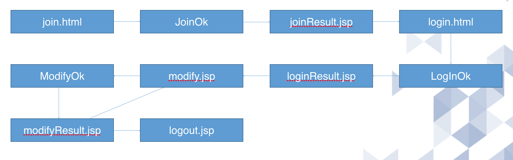

# 회원가입 및 회원정보 수정 프로그래밍



다음과 같은 과정으로 진행된다.

#### View

- html 파일 : join.html , login.html
- jsp 파일 : joinResult.jsp , modify.jsp, loginResult.jsp, modifyResult.jsp

#### Model + Controller

- servlet : JoinOk, ModifyOk, LoginOK


## 코드

### 회원가입에 사용할 테이블 생성

```sql
create table member( name varchar(20), id varchar(20), pw varchar(20), phone1 varchar(20), phone2 varchar(20), phone3 varchar(20), gender varchar(20));
```

### join.html

```html
<!DOCTYPE html>
<html>
<head>
<meta charset="UTF-8">
<title>Insert title here</title>
</head>
<body>

	<form action="JoinOk" method="post">
		이름 : <input type="text" name="name" size="10"><br />
		아이디 : <input type="text" name="id" size="10"><br />
		비밀번호 : <input type="text" name="pw" size="10"><br />
		전화번호 : <select name="phone1">
			<option value="010">010</option>
			<option value="016">016</option>
			<option value="017">017</option>
			<option value="018">018</option>
			<option value="019">019</option>
			<option value="011">011</option>
		</select> - 
		<input type="text" name="phone2" size="5"> - <input type="text" name="phone3" size="5"> <br />
		성별 : <input type="radio" name="gender" value="man">남 &nbsp;<input type="radio" name="gender" value="woman">여 <br />
		<input type="submit" value="회원가입하기"> <input type="reset" value="리셋">
	</form>

</body>
</html>
```

### JoinOk.java

```java
package com.javalec.ex;

import java.io.IOException;
import java.io.PrintWriter;
import java.sql.Connection;
import java.sql.Driver;
import java.sql.DriverManager;
import java.sql.PreparedStatement;
import java.sql.ResultSet;
import java.sql.SQLException;
import java.sql.Statement;
import java.util.Arrays;

import javax.servlet.ServletException;
import javax.servlet.annotation.WebServlet;
import javax.servlet.http.HttpServlet;
import javax.servlet.http.HttpServletRequest;
import javax.servlet.http.HttpServletResponse;

/**
 * Servlet implementation class JoinOk
 */
@WebServlet("/JoinOk")
public class JoinOk extends HttpServlet {
	private static final long serialVersionUID = 1L;
    
	private Connection connection;
	private Statement stmt;
	
	private String name, id, pw, phone1, phone2, phone3, gender;
	
    /**
     * @see HttpServlet#HttpServlet()
     */
    public JoinOk() {
        super();
        // TODO Auto-generated constructor stub
        
    }

	/**
	 * @see HttpServlet#doGet(HttpServletRequest request, HttpServletResponse response)
	 */
	protected void doGet(HttpServletRequest request, HttpServletResponse response) throws ServletException, IOException {
		System.out.println("doGet");
		actionDo(request, response);
	}

	/**
	 * @see HttpServlet#doPost(HttpServletRequest request, HttpServletResponse response)
	 */
	protected void doPost(HttpServletRequest request, HttpServletResponse response) throws ServletException, IOException {
		System.out.println("doPost");
		actionDo(request, response);
	}
	
	private void actionDo(HttpServletRequest request, HttpServletResponse response) throws ServletException, IOException {
		
		request.setCharacterEncoding("UTF-8");
		
		name = request.getParameter("name");
		id = request.getParameter("id");
		pw = request.getParameter("pw");
		phone1 = request.getParameter("phone1");
		phone2 = request.getParameter("phone2");
		phone3 = request.getParameter("phone3");
		gender = request.getParameter("gender");
		
		String query = "insert into member values('" + name + "', '" + id + "', '" + pw + "', '" + phone1 + "', '" + phone2 + "', '"+ phone3 + "', '" + gender + "')";
		
		try {
			Class.forName("com.mysql.jdbc.Driver");
			connection = DriverManager.getConnection("jdbc:mysql://localhost:3306/javaproject" , "root" , "비밀번호");
			stmt = connection.createStatement();
			int i = stmt.executeUpdate(query);
			if(i == 1){
				System.out.println("insert success");
				response.sendRedirect("joinResult.jsp");
			} else {
				System.out.println("insert fail");
				response.sendRedirect("join.html");
			}
			
			
		} catch (Exception e) {
			e.printStackTrace();
		} finally {
			try {
				if(stmt != null) stmt.close();
				if(connection != null) connection.close();
			} catch (Exception e) {}
		}
		
	}

}

```

### joinResult.jsp

```jsp
<%@ page language="java" contentType="text/html; charset=UTF-8"
    pageEncoding="UTF-8"%>
<!DOCTYPE html PUBLIC "-//W3C//DTD HTML 4.01 Transitional//EN" "http://www.w3.org/TR/html4/loose.dtd">
<html>
<head>
<meta http-equiv="Content-Type" content="text/html; charset=UTF-8">
<title>Insert title here</title>
</head>
<body>

회원가입이 완료되었습니다.<br />
<a href="login.html">로그인하기</a>

</body>
</html>
```

### login.html

```html
<!DOCTYPE html>
<html>
<head>
<meta charset="UTF-8">
<title>Insert title here</title>
</head>
<body>

<form action="LogInOk" method="post">
	아이디 : <input type="text" name="id"><br />
	비밀번호 : <input type="text" name="pw"><br />
	<input type="submit" value="로그인">
</form>

</body>
</html>
```

### LoginOk.java

```java
package com.javalec.ex;

import java.io.IOException;
import java.sql.Connection;
import java.sql.DriverManager;
import java.sql.ResultSet;
import java.sql.Statement;
import java.util.Arrays;

import javax.servlet.ServletException;
import javax.servlet.annotation.WebServlet;
import javax.servlet.http.HttpServlet;
import javax.servlet.http.HttpServletRequest;
import javax.servlet.http.HttpServletResponse;
import javax.servlet.http.HttpSession;

/**
 * Servlet implementation class LogInOk
 */
@WebServlet("/LogInOk")
public class LogInOk extends HttpServlet {
	private static final long serialVersionUID = 1L;
	
	private Connection connection;
	private Statement stmt;
	private ResultSet resultSet;
	
	private String name, id, pw, phone1, phone2, phone3, gender;
       
    /**
     * @see HttpServlet#HttpServlet()
     */
    public LogInOk() {
        super();
        // TODO Auto-generated constructor stub
    }

	/**
	 * @see HttpServlet#doGet(HttpServletRequest request, HttpServletResponse response)
	 */
	protected void doGet(HttpServletRequest request, HttpServletResponse response) throws ServletException, IOException {
		actionDo(request, response);
	}

	/**
	 * @see HttpServlet#doPost(HttpServletRequest request, HttpServletResponse response)
	 */
	protected void doPost(HttpServletRequest request, HttpServletResponse response) throws ServletException, IOException {
		actionDo(request, response);
	}
	
	private void actionDo(HttpServletRequest request, HttpServletResponse response) throws ServletException, IOException {
		
		id = request.getParameter("id");
		pw = request.getParameter("pw");
		
		String query = "select * from member where id = '" + id + "' and pw = '" + pw + "'";
		
		try {
			Class.forName("com.mysql.jdbc.Driver");
			connection = DriverManager.getConnection("jdbc:mysql://localhost:3306/javaproject" , "root" , "비밀번호");
			stmt = connection.createStatement();
			resultSet =  stmt.executeQuery(query);
			
			while (resultSet.next()) {
				name = resultSet.getString("name");
				id = resultSet.getString("id");
				pw = resultSet.getString("pw");
				phone1 = resultSet.getString("phone1");
				phone2 = resultSet.getString("phone2");
				phone3 = resultSet.getString("phone3");
				gender = resultSet.getString("gender");
			}
			
			HttpSession httpSession = request.getSession();
			httpSession.setAttribute("name", name);
			httpSession.setAttribute("id", id);
			httpSession.setAttribute("pw", pw);
			
			response.sendRedirect("loginResult.jsp");
			
		} catch (Exception e) {
			e.printStackTrace();
		} finally {
			try {
				if(resultSet != null) resultSet.close();
				if(stmt != null) stmt.close();
				if(connection != null) connection.close();
			} catch (Exception e2) {
				e2.printStackTrace();
			}
		}
		
	}

}

```

### loginResult.jsp

```jsp
<%@ page language="java" contentType="text/html; charset=UTF-8"
    pageEncoding="UTF-8"%>
    
    <%!
    	String name, id, pw;
    %>
    
<!DOCTYPE html PUBLIC "-//W3C//DTD HTML 4.01 Transitional//EN" "http://www.w3.org/TR/html4/loose.dtd">
<html>
<head>
<meta http-equiv="Content-Type" content="text/html; charset=UTF-8">
<title>Insert title here</title>
</head>
<body>

	<%
		name = (String)session.getAttribute("name");
		id = (String)session.getAttribute("id");
		pw = (String)session.getAttribute("pw");
	%>
		
	<%= name %>님 안녕하세요<br />
	<a href="modify.jsp">회원정보 수정하기</a>
	
</body>
</html>
```

### modify.jsp

```jsp
<%@page import="java.sql.DriverManager"%>
<%@page import="java.sql.ResultSet"%>
<%@page import="java.sql.Statement"%>
<%@page import="java.sql.Connection"%>
<%@ page language="java" contentType="text/html; charset=EUC-KR"
    pageEncoding="UTF-8"%>
    
    <%!
    	Connection connection;
    	Statement statement;
    	ResultSet resultSet;
    
    	String name, id, pw, phone1, phone2, phone3, gender;
    %>
<!DOCTYPE html PUBLIC "-//W3C//DTD HTML 4.01 Transitional//EN" "http://www.w3.org/TR/html4/loose.dtd">
<html>
<head>
<meta http-equiv="Content-Type" content="text/html; charset=EUC-KR">
<title>Insert title here</title>
</head>
<body>
	
	<%
		id = (String)session.getAttribute("id");
	
		String query = "select * from member where id = '" + id + "'";
		
		Class.forName("com.mysql.jdbc.Driver");
		connection = DriverManager.getConnection("jdbc:mysql://localhost:3306/javaproject" , "root" , "비밀번호");
		statement = connection.createStatement();
		resultSet =  statement.executeQuery(query);
		
		while(resultSet.next()) {
			name = resultSet.getString("name");
			pw = resultSet.getString("pw");
			phone1 = resultSet.getString("phone1");
			phone2 = resultSet.getString("phone2");
			phone3 = resultSet.getString("phone3");
			gender = resultSet.getString("gender");
		}
		
	%>
	
	<form action="ModifyOk" method="post">
		이름 : <input type="text" name="name" size="10" value=<%=name %>><br />
		아이디 : <%=id %><br />
		비밀번호 : <input type="text" name="pw" size="10"><br />
		핸드폰번호 : <select name="phone1">
			<option value="010">010</option>
			<option value="016">016</option>
			<option value="017">017</option>
			<option value="018">018</option>
			<option value="019">019</option>
			<option value="011">011</option>
		</select> - 
		<input type="text" name="phone2" size="5" value=<%=phone2 %>> - <input type="text" name="phone3" size="5" value=<%=phone3 %>> <br />
		<%
			if(gender.equals("man")) {
		%>
		성별 : <input type="radio" name="gender" value="man" checked="checked">남 &nbsp;<input type="radio" name="gender" value="woman">여<br />
		<%
			} else {
		%>
		성별 : <input type="radio" name="gender" value="man" >남 &nbsp;<input type="radio" name="gender" value="woman" checked="checked">여 <br />
		<%
			}
		%>
		<input type="submit" value="정보수정하기"> <input type="reset" value="취소">
	</form>

</body>
</html>
```

### ModifyOk.java

```java
package com.javalec.ex;

import java.io.IOException;
import java.sql.Connection;
import java.sql.DriverManager;
import java.sql.Statement;

import javax.servlet.ServletException;
import javax.servlet.annotation.WebServlet;
import javax.servlet.http.HttpServlet;
import javax.servlet.http.HttpServletRequest;
import javax.servlet.http.HttpServletResponse;
import javax.servlet.http.HttpSession;

/**
 * Servlet implementation class ModifyOk
 */
@WebServlet("/ModifyOk")
public class ModifyOk extends HttpServlet {
	private static final long serialVersionUID = 1L;
    
	private Connection connection;
	private Statement stmt;
	
	private String name, id, pw, phone1, phone2, phone3, gender;
	
	HttpSession httpSession;
    /**
     * @see HttpServlet#HttpServlet()
     */
    public ModifyOk() {
        super();
        // TODO Auto-generated constructor stub
    }

	/**
	 * @see HttpServlet#doGet(HttpServletRequest request, HttpServletResponse response)
	 */
	protected void doGet(HttpServletRequest request, HttpServletResponse response) throws ServletException, IOException {
		actionDo(request, response);
	}

	/**
	 * @see HttpServlet#doPost(HttpServletRequest request, HttpServletResponse response)
	 */
	protected void doPost(HttpServletRequest request, HttpServletResponse response) throws ServletException, IOException {
		actionDo(request, response);
	}
	
	private void actionDo(HttpServletRequest request, HttpServletResponse response) throws ServletException, IOException {
		
		request.setCharacterEncoding("UTF-8");
		httpSession = request.getSession();
		
		name = request.getParameter("name");
		id = request.getParameter("id");
		pw = request.getParameter("pw");
		phone1 = request.getParameter("phone1");
		phone2 = request.getParameter("phone2");
		phone3 = request.getParameter("phone3");
		gender = request.getParameter("gender");
		
		if(pwConfirm()){
			System.out.println("OK");
			
			String query = "update member set name ='" + name + "', phone1= '" + phone1 + "', phone2 = '" + phone2 + "', phone3 = '" + phone3 + "', gender = '" + gender + "'";
//			System.out.println(query);
			try {
				Class.forName("com.mysql.jdbc.Driver");
				connection = DriverManager.getConnection("jdbc:mysql://localhost:3306/javaproject" , "root" , "비밀번호");
				stmt = connection.createStatement();
				int i = stmt.executeUpdate(query);
				if(i ==1 ){
					System.out.println("update success");
					httpSession.setAttribute("name", name);
					response.sendRedirect("modifyResult.jsp");
				} else {
					System.out.println("update fail");
					response.sendRedirect("modify.jsp");
				}
			} catch(Exception e) {
				e.printStackTrace();
			} finally {
				try {
					if(stmt != null) stmt.close();
					if(connection != null) connection.close();
				} catch (Exception e) {}
			}
			
		} else {
			System.out.println("NG");
		}
		
	}
	
	private boolean pwConfirm() {
		boolean rs = false;
		
		String sessionPw =  (String)httpSession.getAttribute("pw");
		
		if(sessionPw.equals(pw)) {
			rs = true;
		} else {
			rs = false;
		}
		
		return rs;
	}

}

```

### modifyResult.jsp

```jsp
<%@ page language="java" contentType="text/html; charset=UTF-8"
    pageEncoding="UTF-8"%>
<!DOCTYPE html PUBLIC "-//W3C//DTD HTML 4.01 Transitional//EN" "http://www.w3.org/TR/html4/loose.dtd">
<html>
<head>
<meta http-equiv="Content-Type" content="text/html; charset=UTF-8">
<title>Insert title here</title>
</head>
<body>

<%= session.getAttribute("name") %>님의 회원정보가 수정되었습니다.<br />
<a href="logout.jsp">로그아웃</a> &nbsp;&nbsp; <a href="modify.jsp">회원정보수정</a>

</body>
</html>
```

### logout.jsp

```jsp
<%@ page language="java" contentType="text/html; charset=UTF-8"
    pageEncoding="UTF-8"%>
<!DOCTYPE html PUBLIC "-//W3C//DTD HTML 4.01 Transitional//EN" "http://www.w3.org/TR/html4/loose.dtd">
<html>
<head>
<meta http-equiv="Content-Type" content="text/html; charset=UTF-8">
<title>Insert title here</title>
</head>
<body>
	<%
		session.invalidate();
		response.sendRedirect("login.html");
	%>
</body>
</html>
```

