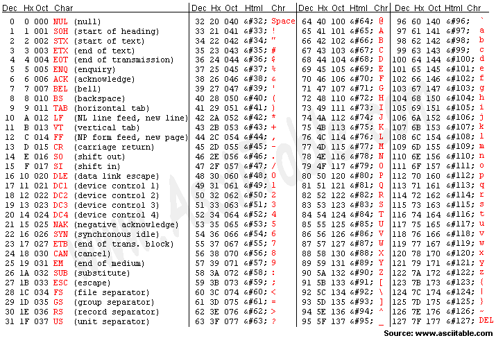

# 네트워크 기본 개념

## 컴퓨터 네트워크란

**컴퓨터 네트워크**란 컴퓨터 간의 네트워크를 연결한 것으로, 두 대 이상의 컴퓨터가 연결되어 있는 경우를 말하며, 컴퓨터 네트워크를 통해 컴퓨터간 필요한 데이터(정보)를 주고 받을 수 있다.
즉, 네트워크는 **컴퓨터를 두 대 이상 연결해 서로 데이터를 전송할 수 있는 통신망**이다.
컴퓨터 한 대로는 할 수 있는 일이 제한되지만, 컴퓨터가 여러대 연결되면 다음과 같이 다양한 일을 할 수 있다.

- 컴퓨터 간의 데이터(파일) 전송
- 웹 사이트 열람
- 메일 송/수신

### 인터넷

TCP/IP 프로토콜을 사용하는 세계 최대 규모의 네트워크이다. 
**전 세계의 큰 네트워크부터 작은 네트워크까지 연결하는 거대한 네트워크**를 말한다. 

## 패킷이란

네트워크나 인터넷에서 데이터를 주고 받기 위한 규칙이 있으며, 이때, **패킷**을 이용한다.
즉, 패킷은 컴퓨터 간에 데이터를 주고 받을 때 **네트워크를 통해 전송되는 데이터의 작은 조각**이다.
큰 데이터를 그대로 보내면 네트워크의 대역폭을 많이 차지해서 다른 패킷의 흐름을 막을 위험이 있기때문에 큰 데이터를 작은 조각(패킷)으로 나누어서 보낸다.

(*대역폭 : 네트워크에서 이용 가능한 최대 전송 속도로 단위 시간당 전송량을 말함.*)

큰 데이터를 패킷을 분할하여 전송하는 경우 다음과 같은 문제가 있다.

- 목적지에서는 보낸 패킷이 순서대로 도착하지 않을 수 있음.
- 네트워크가 지연되어 패킷이 늦게 도착하거나 누락될 수 있음.

이런 문제점을 해결하기 위해서, 패킷 전송시 각 패킷에 순서대로 번호를 붙여서 보낸다.

## 비트(bit)와 바이트(byte)

- 디지털 데이터 : 0과 1의 집합
- 비트(bit) : 0과 1의 정보를 나타내는 최소 단위
- 바이트(byte) : 0과 1인 숫자 8개 집합. 즉, 8 bit

컴퓨터는 기본적으로 바이트 단위로 데이터를 읽고 쓰는 작업을 한다.

### 문자 코드

숫자와 문자의 대응표

#### ASCII 코드

American Standard Code for Information Interchnage의 약자

문자 코드 중 하나로, 알파벳, 기호, 숫자 등을 다룰 수 있는 기본적인 문자 코드이다.
ASCII 코드가 있기 때문에 키보드에서 C를 누르면 컴퓨터로 문자 코드(65)가 전달되며, 컴퓨터는 그 키에 대응하는 문자코드(65)를 확인하고, 화면에 해당 문자 C를 표시하는 것이다.

## 네트워크 범위

### LAN과 WAN

- **LAN**(Local Area Network) : 건물 안이나 특정 지역을 범위로 하는 네트워크
    - 사무실, 집, 학원과 같이 지리적으로 제한된 공간
    - 연결하는 범위가 짧은 만큼 신호가 약해지거나 오류가 발생할 확률 낮음
    - 속도 빠름
    
- **WAN**(Wide Area Network) : 지리적으로 넓은 범위에 구축된 네트워크
    - ISP(Internet Service Provide) 인터넷 서비스 제공자가 제공하는 서비스를 사용해 구축된 네트워크
        - 인터넷 상용 서비스 사업을 하고 있는 KT, U+, SK브로드밴드 등과 같은 사업자
        - 인터넷에 접속하는 수단을 제공하는 주체
    - LAN과 LAN을 연결
    - 특정 도시, 국가, 대륙과 같이 매우 넓은 범위를 연결하는 네트워크
    - 넓은 지역에 설치된 컴퓨터들 간의 정보와 자원을 공유하기에 적합하도록 설계한 통신망
    - 멀리 떨어져 있는 랜과 연결해, 신호가 약해지거나 오류가 발생할 확률이 높아짐
    - 속도 느림

#### LAN vs WAN

|      | LAN                      | WAN                    |
| ---- | ------------------------ | ---------------------- |
| 범위 | 좁다(건물이나 특정 지역) | 넓다(LAN과 LAN을 연결) |
| 속도 | 빠르다                   | 느리다                 |
| 오류 | 적다                     | 많다                   |

## 네트워크 구성

### 가정에서의 LAN 네트워크 구성

- 인터넷 개통시 ISP와 인터넷 회선을 결정
    - 인터넷 회선은 보통 광랜을 많이 사용
    - 광랜이란
        - 통신망의 하부 구조인 통신매체로, 광섬유 케이블을 사용하면서 IEEE 802의 표준 프로토콜을 따르는 랜(LAN)
        - 광섬유를 사용하여 고속 통신이 가능하고 전자파의 잡음 영향이 적음
- 인터넷 공유기(broadband router) 필요
    - 가정이나 소규모 기업에서 인터넷에 접속할 때 사용
    - 가정용으로 만든 라우터
    - 스위칭 허브, 허브, 방화벽과 같은 다양한 기능 제공
- 인터넷 공유기를 중심으로 내부 사설망을 구성하고, 다양한 기기를 연결할 수 있다.
    - 유선 랜 : 랜 케이블이 필요한 경우 
    - 무선 랜: 랜 케이블이 필요하지 않은 경우

### 회사(SOHO)에서의 LAN 네트워크 구성

SOHO(Small Office/Home Office) : 소규모 회사

가정에서의 랜 구성과 가장 다른 점은 DMZ(DeMilitarized Zone)라는 네트워크 영역이 존재한다는 것이다.

- DMZ : 외부 네트워크와 내부 네트워크 사이에 위치한 중간지대(서브넷)을 의미
    - 네트워크 보안 영역으로 외부 공격자가 내부 네트워크에 침투하는 것을 막아준다.
- 외부망 용도
    - 웹 서버 : 웹 사이트를 불특정 다수의 외부 사용자에게 공개하기 위해 공개
    - 메일 서버 : 외부 사용자와 메일을 주고 받기 위해 공개
    - DNS 서버 : 외부에서 도메인 이름을 사용해 회사 서버에 접속하기 위해 공개
- 직원 수(사용자 수)가 많을 수록 스위치와 같은 장비, 랜 케이블의 배선도 증가
- 회사에서 서버를 운영하기 위한 방법
    - on-premise : 데이터 센터 혹은 사내에 서버를 두고 운영하는 것
        - 사내에 서버장비실 구축해 랙(선반) 설치. 이때, 랙에 설치하기 적합한 서버, 라우터, 스위치를 설치
        - 데이터 센터 : 대량의 데이터를 보관하기 위해 데이터 센터 서버나 네트워크 기기를 설치한 전용 시설
    - 클라우드 : 인터넷을 통해 소프트웨어나 하드웨어 등의 컴퓨팅 서비스 제공하는 것으로 인터넷에 접속하기만 하면 언제 어디서든 이용 가능
- 각 서버는 스위치와 연결해 서로 통신 가능
- 사무실 내부에서 사용하는 컴퓨터와 프린터도 근처에 있는 스위치와 연결하거나 무선 랜 기능을 통해 랜에 연결해야 네트워크 사용 가능

여기서 서버란, 컴퓨터 네트워크에서 다른 컴퓨터에 서비스를 제공하기 위한 컴퓨터 혹은 프로그램을 뜻하며, 클라이언트는 서버에서 보내주는 정보 서비스를 받거나 요구하는 측의 컴퓨터 혹은 프로그램을 뜻한다.

## 참고

- [https://smartinternet.co.kr/%EA%B4%91%EB%9E%9C#none](https://smartinternet.co.kr/%EA%B4%91%EB%9E%9C#none)
