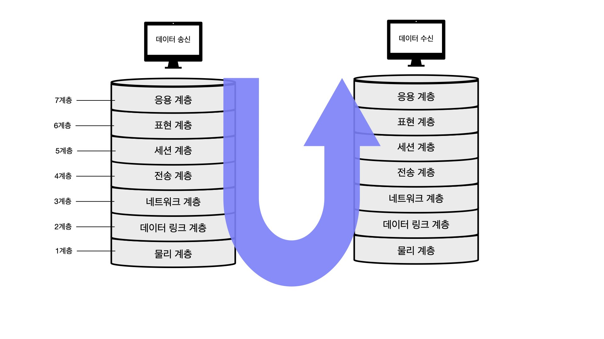
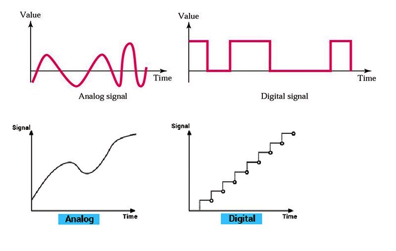
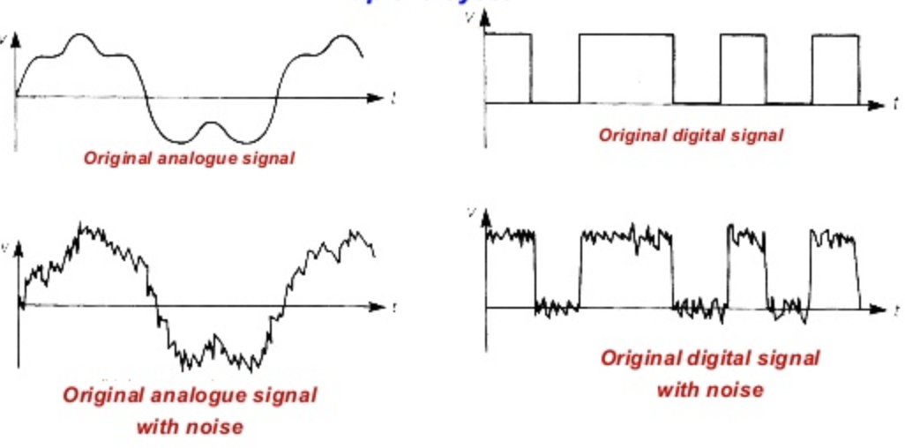
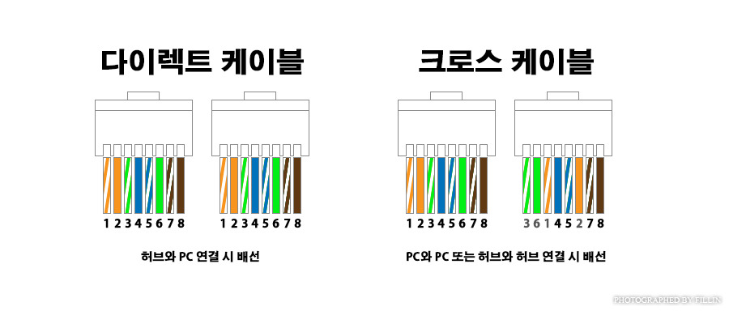
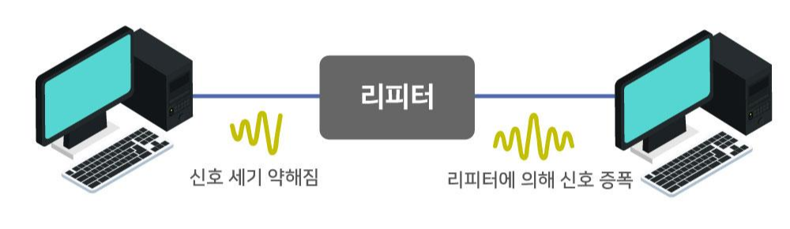
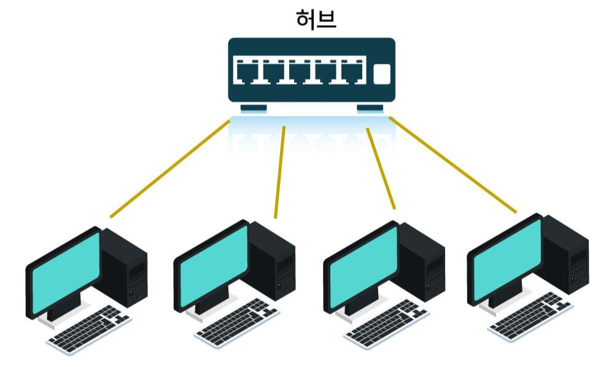
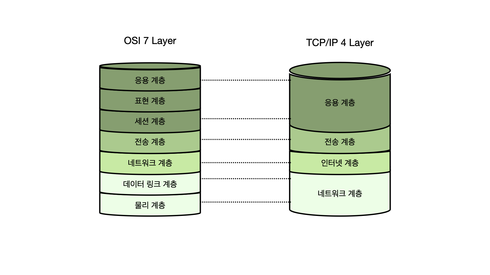
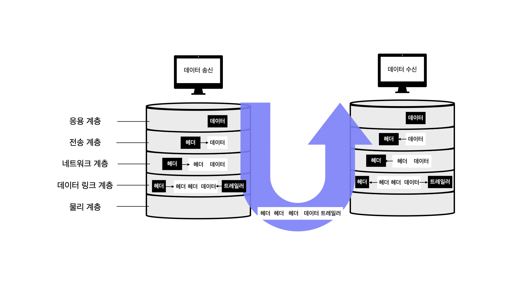

# 네트워크 기본 규칙

## 프로토콜

컴퓨터간 정보를 주고받을 때 **통신 방법에 대한 규칙이나 표준**

## OSI 모델

OSI모델은 ISO(International Organization for Standardization) 국제표준화 기구에서 정한 표준규격이다.

데이터 송수신시 컴퓨터 내부에서 여러가지 일을 하는데, 이때 7개 계층(레이어)이 역할을 나누어 한다.

| 계층  | 이름                                    | 설명                                                         |
| ----- | --------------------------------------- | ------------------------------------------------------------ |
| 7계층 | 응용 계층 (Application Layer)      | 이메일, 파일 전송, 웹 사이트 조회 등 애플리케이션에 대한 서비스 제공 |
| 6계층 | 표현 계층 (Presentation Layer)     | 문자 코드, 압축, 암호화 등 데이터를 변환                     |
| 5계층 | 세션 계층 (Session Layer)          | 세션 체결, 통신 방식 결정                                    |
| 4계층 | 전송 계층 (Transport Layer)        | 신뢰할 수 있는 통신 구현                                     |
| 3계층 | 네트워크 계층 (Network Layer)      | 다른 네트워크와 통신하기 위한 경로 설정 및 논리 주소 결정    |
| 2계층 | 데이터 링크 계층 (Data Link Layer) | 네트워크 기기 간의 데이터 전송 및 물리주소 결정              |
| 1계층 | 물리 계층 (Physical Layer)         | 시스템 간의 물리적인 연결과 전기 신호 변환 및 제어           |

- 데이터 송신측에서 데이터를 보내기 위해 상위 계층에서 하위 계층으로 데이를 전달
- 각 계층은 독립적이므로, 데이터가 전달되는 동안 다른 계층의 영향을 받지 않음
- 데이터 수신측은 하위 계층에서 상의 계층으로 전달된 데이터를 받음

### 물리 계층

- OSI 최하위 계층
- 데이터를 전송하기 위해 시스템 간의 물리적인 연결을
- 전기 신호의 변환 및 제어하는 역할
- 전송 매체를 통해 데이터를 통신할 수 있는 전기 신호로 바꾸어 전송

즉, **물리 계층은 컴퓨터와 네트워크 장비를 연결하고 컴퓨터와 네트워크 장비 간에 전송되는 데이터를 전기 신호로 변환하는 계층**이다.

#### 전기 신호란?

전기 신호는 전압이 일정 패턴으로 변해 생기는 일련의 흐름으로 전압의 변화가 모여서 만들어진 신호이다.
데이터는 전기 신호로 변환되어 네트워크를 통해 전달된다.
0과 1의 비트열은 전기 신호로 변환되어 전송되고, 수신인은 받은 전기 신호를 다시 0과 1의 비트열로 복원한다.

- 아날로그 신호 : 전화 회선, 라디오 방송에 사용
- 디지털 신호 : 아날로그 신호를 전류의 유무, 극성, 위상의 동일이나 반대 등 물리적 현상을 이용해 이진수(0과 1)에 대응시켜 나타내는 신호

#### 랜 카드

- 컴퓨터의 네트워크 연결 및 데이터 전송을 담당
- 컴퓨터는 네트워크를 통해 데이터를 송수신할 수 있도록 랜 카드를 별도로 가지고 있음.
- 0과 1의 정보가 컴퓨터 내부의 랜카드로 전송되고 , **랜 카드는 0과 1을 전기 신호로 변환**
- "네트워크 카드", "네트워크 인터페이스 컨트롤러(NIC)"라고도 불림

#### 네트워크 전송 매체

전송 매체는 데이터가 흐르는 물리적 선로로 크게 유선과 무선 2가지 종류가 있다.

- 유선 : 트위스트 페어 케이블, 광케이블
- 무선 : 라디오파, 마이크로파, 적외선

여기서 가장 많이 사용하는 것은 **트위스트 페어 케이블(=랜 케이블)**이다.
트위스트 페어 케이블의 종류에는 UTP(Unshielded Twist Pair) 케이블과 STP(Shield Twist Pair) 케이블이 있다.
각 케이블을 설명하기에 앞서 *실드는 금속 호일이나 금속의 매듭같은 것으로 외부에서 발생하는 노이즈를 막는 역할*을 한다.

- UTP 케이블 : 구리 선 여덟 개를 두 개씩 꼬아 만든 네 쌍의 전선으로 실드(shield)로 보호되어있지 않은 케이블이다.
    - 실드로 보호받지 않아 노이즈 영향을 받기 쉬움
    - 가격이 저렴해 일반적으로 많이 사용
- STP 케이블 : 두 개씩 꼬아 만든 선을 실드로 보호한 케이블
    - 노이즈 영향을 매우 적게 받음
    - 가격이 비싸 보편적으로 사용하지 않음.

노이즈는 케이블에 전기 신호가 흐를 때 발생하며, 노이즈 영향을 받게되면 다음과 같이 전기 신호의 형태가 외곡 된다.
랜 케이블(트위스트 페어 케이블)은 분류에 따라 규격과 속도가 다르므로 목적에 맞게 사용해야한다.
랜 케이블에는 `RJ-45`라 불리는 커넥터가 붙어있으며, 이 커넥터를 컴퓨터 랜 포트나 네트워크 기기에 연결해서 사용한다.

랜 케이블의 종류에는 다이렉트 케이블과 크로스 케이블이 있다.

- 다이렉트 케이블 : 구리선 여덟 개를 같은 순서로 커넥터에 연결한 케이블
    - 컴퓨터와 스위치를 연결할 때 사용
- 크로스 케이블 : 구리선 여덟개 중 한쪽 커넥터의 1번과 2번에 연결되는 구리선을 다른쪽 3번, 6번에 연결한 케이블
    - 컴퓨터 간에 직접 랜 케이블로 연결할 때 사용
    - 양쪽 컴퓨터에서 데이터를 동시에 전송하면 충돌하는 경우를 막기 위해 일부러 중간에 전선을 교차시켜, 송신 측과 수신 측이 연결되도록 함

두 케이블 모두 실제로는 1,2,3,6번 구리선을 사용하고 있으며, 나머지 4개의 선은 사용하지 않는다.

#### 리피터

**리피터는 전기 신호를 정형하고, 증폭하는 기능을 가진 네트워크 중계 장비**이다.
멀리 있는 상대방과도 통신할 수 있도록 파형을 정상으로 만드는 기능을한다.
최근에는 다른 네트워크 장비가 리피터 기능을 지원하기 때문에, 별도 리피터를 사용할 필요가 없어졌으며, 리피터라는 네트워크가 있다는 정도의 개념만 알고 있으면 된다.

#### 허브

허브는 포트(실제로 통신하는 통로)를 여러 개 가지고 있으며, 리피터 허브라고도 부른다.
리피터는 1대 1 통신만 가능하지만, 허브는 포트를 여러 개 가지고 있어, 컴퓨터 여러 대와 통신할 수 있다.

- 전기 신호를 정형하고 증폭하는 기능
- 컴퓨터 여러대와 통신 가능
- 허브는 **특정 포트로부터 데이터를 받을 때, 해당 포트를 제외한 나머지 모든 포트로 받은 데이터를 전송**
    - ex) 컴퓨터 1 -> 컴퓨터2로 데이터 전송시 컴퓨터 1을 제외한 컴퓨터2,3,4,5,6 모두 데이터를 받음
    - 허브는 스스로 판단하지 않고, 전기 신호를 모든 포트로 보내 "더미 허브"라고 불리기도 한다.
    - 이러한 단점의 대책으로 **스위치(switch)** 네트워크 장비가 나왔다.

> auto MDIX(Medium-Dependent Interface crossover)
>
> 다이렉트 케이블과 크로스 케이블을 자동으로 판단하는 기능
>
> - MDI(Media Dependent Interface) : 컴퓨터, 라우터의 인터페이스 
> - MDI-X(Media Dependent Interface crossover) : 허브, 스위치 인터페이스
>
> 일반적으로 MDI와 MDI-X 연결시 다이렉트 케이블 사용하고,
> MDI끼리나  MDI-X끼리 연결시 크로스 케이블 사용
>
> 최근에는 MDI와 MDI-X의 차이를 자동으로 판단해 연결 신호를 전환하는 기능을 가진 허브나 스위츠를 많이 사용한다.
> (허브 간 연결, 컴퓨터-허브 연결시 케이블 차이를 고려하지 않아도 된다.)

## TCP/IP 모델

## 캡슐화와 역캡슐화

데이터를 보내기 위해서는 데이터의 앞부분에 전송하는데 필요한 정보(헤더)를 붙여 다음 계층으로 보낸다.

- **헤더** : 저장되거나 전송되는 데이터의 맨 앞에 위치하는 **추가적인 정보 데이터**
    - 데이터의 내용이나 성격을 식별하고 제어하는데 사용
    - 전달받을 상대방에 대한 정보도 포함
- 트레일러 : 데이터 전달시 데이터의 마지막에 추가하는 정보
- 캡슐화 : 상위 계층의 통신 프로토콜 정보(헤더/트레일러)를 데이터에 추가하여 하위 계층으로 전송
    - 응용 -> 전송 -> 네트워크 -> 데이터링크 순서로 캡슐화
- 역캡슐화 :  상위 계층의 통신 프로토콜에서 하위 계층에서 추가한 정보(헤더/트레일러)와 데이터를 분리하는 기술
    - 데이터 링크 -> 네트워크 -> 전송 -> 응용 순서로 역캡슐화
- 데이터 링크 계층에서 만들어진 데이터는 전기 신호로 변환되어 수신 측에 전송

> VPN(Virtual Private Network) 가상 사설망
>
> 가상 통신 터널을 만들어 기업 본사나 지사와 같은 거점 간을 연결하여 통신하거나 외부에서 인터넷으로 사내에 접속하는 것을 말한다.
>
> - 인터넷 VPN
>     거점 간 접속은 IPsec 암호 기술 프로토콜을 사용해 접속하고, 원격 접속 연결은 외부에서 사용하는 컴퓨터와 사내 네트워크를 연결하기 떄문에 암호화된 통신로를 만든다.
> - IP-VPN
>     MPLS 기술을 사용해 인터넷망이 아닌 통신 사업자 전용 폐쇄망을 사용하며, 폐쇄망을 사용하기 때문에 해킹이나 데이터 변조 위험이 없어, 암호화 기능이 불필요하다.

## 참고

- [https://handreamnet.tistory.com/501](https://handreamnet.tistory.com/501)

