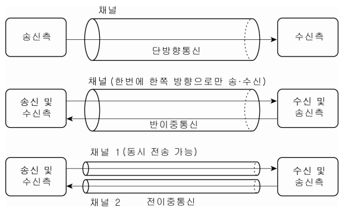

# 네트워크 기본 규칙

## 프로토콜

컴퓨터간 정보를 주고받을 때 **통신 방법에 대한 규칙이나 표준**

## OSI 모델

OSI모델은 ISO(International Organization for Standardization) 국제표준화 기구에서 정한 표준규격이다.

데이터 송수신시 컴퓨터 내부에서 여러가지 일을 하는데, 이때 7개 계층(레이어)이 역할을 나누어 한다.


| 계층  | 이름                                    | 설명                                                         |
| ----- | --------------------------------------- | ------------------------------------------------------------ |
| 7계층 | 응용 계층<br />(Application Layer)      | 이메일, 파일 전송, 웹 사이트 조회 등 애플리케이션에 대한 서비스 제공 |
| 6계층 | 표현 계층<br />(Presentation Layer)     | 문자 코드, 압축, 암호화 등 데이터를 변환                     |
| 5계층 | 세션 계층<br />(Session Layer)          | 세션 체결, 통신 방식 결정                                    |
| 4계층 | 전송 계층<br />(Transport Layer)        | 신뢰할 수 있는 통신 구현                                     |
| 3계층 | 네트워크 계층<br />(Network Layer)      | 다른 네트워크와 통신하기 위한 경로 설정 및 논리 주소 결정    |
| 2계층 | 데이터 링크 계층<br />(Data Link Layer) | 네트워크 기기 간의 데이터 전송 및 물리주소 결정              |
| 1계층 | 물리 계층<br />(Physical Layer)         | 시스템 간의 물리적인 연결과 전기 신호 변환 및 제어           |

- 데이터 송신측에서 데이터를 보내기 위해 상위 계층에서 하위 계층으로 데이를 전달
- 각 계층은 독립적이므로, 데이터가 전달되는 동안 다른 계층의 영향을 받지 않음
- 데이터 수신측은 하위 계층에서 상의 계층으로 전달된 데이터를 받음


## TCP/IP 모델


## 캡슐화와 역캡슐화


데이터를 보내기 위해서는 데이터의 앞부분에 전송하는데 필요한 정보(헤더)를 붙여 다음 계층으로 보낸다.

- **헤더** : 저장되거나 전송되는 데이터의 맨 앞에 위치하는 **추가적인 정보 데이터**
    - 데이터의 내용이나 성격을 식별하고 제어하는데 사용
    - 전달받을 상대방에 대한 정보도 포함
- 트레일러 : 데이터 전달시 데이터의 마지막에 추가하는 정보
- 캡슐화 : 상위 계층의 통신 프로토콜 정보(헤더/트레일러)를 데이터에 추가하여 하위 계층으로 전송
    - 응용 -> 전송 -> 네트워크 -> 데이터링크 순서로 캡슐화
- 역캡슐화 :  상위 계층의 통신 프로토콜에서 하위 계층에서 추가한 정보(헤더/트레일러)와 데이터를 분리하는 기술
    - 데이터 링크 -> 네트워크 -> 전송 -> 응용 순서로 역캡슐화
- 데이터 링크 계층에서 만들어진 데이터는 전기 신호로 변환되어 수신 측에 전송


> VPN(Virtual Private Network) 가상 사설망
>
> 가상 통신 터널을 만들어 기업 본사나 지사와 같은 거점 간을 연결하여 통신하거나 외부에서 인터넷으로 사내에 접속하는 것을 말한다.
>
> - 인터넷 VPN
>     거점 간 접속은 IPsec 암호 기술 프로토콜을 사용해 접속하고, 원격 접속 연결은 외부에서 사용하는 컴퓨터와 사내 네트워크를 연결하기 떄문에 암호화된 통신로를 만든다.
> - IP-VPN
>     MPLS 기술을 사용해 인터넷망이 아닌 통신 사업자 전용 폐쇄망을 사용하며, 폐쇄망을 사용하기 때문에 해킹이나 데이터 변조 위험이 없어, 암호화 기능이 불필요하다.

## 물리 계층

- OSI 최하위 계층
- 데이터를 전송하기 위해 시스템 간의 물리적인 연결을
- 전기 신호의 변환 및 제어하는 역할
- 전송 매체를 통해 데이터를 통신할 수 있는 전기 신호로 바꾸어 전송

즉, **물리 계층은 컴퓨터와 네트워크 장비를 연결하고 컴퓨터와 네트워크 장비 간에 전송되는 데이터를 전기 신호로 변환하는 계층**이다.

### 전기 신호란?

전기 신호는 전압이 일정 패턴으로 변해 생기는 일련의 흐름으로 전압의 변화가 모여서 만들어진 신호이다.
데이터는 전기 신호로 변환되어 네트워크를 통해 전달된다.
0과 1의 비트열은 전기 신호로 변환되어 전송되고, 수신인은 받은 전기 신호를 다시 0과 1의 비트열로 복원한다.


- 아날로그 신호 : 전화 회선, 라디오 방송에 사용
- 디지털 신호 : 아날로그 신호를 전류의 유무, 극성, 위상의 동일이나 반대 등 물리적 현상을 이용해 이진수(0과 1)에 대응시켜 나타내는 신호

### 랜 카드

- 컴퓨터의 네트워크 연결 및 데이터 전송을 담당
- 컴퓨터는 네트워크를 통해 데이터를 송수신할 수 있도록 랜 카드를 별도로 가지고 있음.
- 0과 1의 정보가 컴퓨터 내부의 랜카드로 전송되고 , **랜 카드는 0과 1을 전기 신호로 변환**
- "네트워크 카드", "네트워크 인터페이스 컨트롤러(NIC)"라고도 불림


### 네트워크 전송 매체

전송 매체는 데이터가 흐르는 물리적 선로로 크게 유선과 무선 2가지 종류가 있다.

- 유선 : 트위스트 페어 케이블, 광케이블
- 무선 : 라디오파, 마이크로파, 적외선

여기서 가장 많이 사용하는 것은 **트위스트 페어 케이블(=랜 케이블)**이다.
트위스트 페어 케이블의 종류에는 UTP(Unshielded Twist Pair) 케이블과 STP(Shield Twist Pair) 케이블이 있다.
각 케이블을 설명하기에 앞서 *실드는 금속 호일이나 금속의 매듭같은 것으로 외부에서 발생하는 노이즈를 막는 역할*을 한다.

- UTP 케이블 : 구리 선 여덟 개를 두 개씩 꼬아 만든 네 쌍의 전선으로 실드(shield)로 보호되어있지 않은 케이블이다.
    - 실드로 보호받지 않아 노이즈 영향을 받기 쉬움
    - 가격이 저렴해 일반적으로 많이 사용
- STP 케이블 : 두 개씩 꼬아 만든 선을 실드로 보호한 케이블
    - 노이즈 영향을 매우 적게 받음
    - 가격이 비싸 보편적으로 사용하지 않음.


노이즈는 케이블에 전기 신호가 흐를 때 발생하며, 노이즈 영향을 받게되면 다음과 같이 전기 신호의 형태가 외곡 된다.
랜 케이블(트위스트 페어 케이블)은 분류에 따라 규격과 속도가 다르므로 목적에 맞게 사용해야한다.
랜 케이블에는 `RJ-45`라 불리는 커넥터가 붙어있으며, 이 커넥터를 컴퓨터 랜 포트나 네트워크 기기에 연결해서 사용한다.


랜 케이블의 종류에는 다이렉트 케이블과 크로스 케이블이 있다.

- 다이렉트 케이블 : 구리선 여덟 개를 같은 순서로 커넥터에 연결한 케이블
    - 컴퓨터와 스위치를 연결할 때 사용
- 크로스 케이블 : 구리선 여덟개 중 한쪽 커넥터의 1번과 2번에 연결되는 구리선을 다른쪽 3번, 6번에 연결한 케이블
    - 컴퓨터 간에 직접 랜 케이블로 연결할 때 사용
    - 양쪽 컴퓨터에서 데이터를 동시에 전송하면 충돌하는 경우를 막기 위해 일부러 중간에 전선을 교차시켜, 송신 측과 수신 측이 연결되도록 함

두 케이블 모두 실제로는 1,2,3,6번 구리선을 사용하고 있으며, 나머지 4개의 선은 사용하지 않는다.

### 리피터


**리피터는 전기 신호를 정형하고, 증폭하는 기능을 가진 네트워크 중계 장비**이다.
멀리 있는 상대방과도 통신할 수 있도록 파형을 정상으로 만드는 기능을한다.
최근에는 다른 네트워크 장비가 리피터 기능을 지원하기 때문에, 별도 리피터를 사용할 필요가 없어졌으며, 리피터라는 네트워크가 있다는 정도의 개념만 알고 있으면 된다.

### 허브


허브는 포트(실제로 통신하는 통로)를 여러 개 가지고 있으며, 리피터 허브라고도 부른다.
리피터는 1대 1 통신만 가능하지만, 허브는 포트를 여러 개 가지고 있어, 컴퓨터 여러 대와 통신할 수 있다.

- 전기 신호를 정형하고 증폭하는 기능
- 컴퓨터 여러대와 통신 가능
- 허브는 **특정 포트로부터 데이터를 받을 때, 해당 포트를 제외한 나머지 모든 포트로 받은 데이터를 전송**
    - ex) 컴퓨터 1 -> 컴퓨터2로 데이터 전송시 컴퓨터 1을 제외한 컴퓨터2,3,4,5,6 모두 데이터를 받음
    - 허브는 스스로 판단하지 않고, 전기 신호를 모든 포트로 보내 "더미 허브"라고 불리기도 한다.
    - 이러한 단점의 대책으로 **스위치(switch)** 네트워크 장비가 나왔다.

> auto MDIX(Medium-Dependent Interface crossover)
>
> 다이렉트 케이블과 크로스 케이블을 자동으로 판단하는 기능
>
> - MDI(Media Dependent Interface) : 컴퓨터, 라우터의 인터페이스 
> - MDI-X(Media Dependent Interface crossover) : 허브, 스위치 인터페이스
>
> 일반적으로 MDI와 MDI-X 연결시 다이렉트 케이블 사용하고,
> MDI끼리나  MDI-X끼리 연결시 크로스 케이블 사용
>
> 최근에는 MDI와 MDI-X의 차이를 자동으로 판단해 연결 신호를 전환하는 기능을 가진 허브나 스위츠를 많이 사용한다.
> (허브 간 연결, 컴퓨터-허브 연결시 케이블 차이를 고려하지 않아도 된다.)

## 데이터 링크 계층

데이터 링크 계층은 **네트워크 장비 간에 신호를 주고받는 규칙을 정하는 계층**으로, 랜에서 데이터를 주고 받기 위해 필요한 계층이다.

### 이더넷

이더넷은 **랜에서 적용되는 규칙**으로, 허브와 같은 장비에 연결된 컴퓨터와 데이터를 주고 받을 때 사용한다.
허브를 사용하는 랜 환경에서는 특정한 컴퓨터 한 대에 데이터를 보내려고 해도 다른 모든 컴퓨터에 전기 신호가 전달된다. 이때, 데이터에 **목적지 정보를 추가**해서 보내, 목적지 이외의 컴퓨터는 데이터를 받더라도 무시하도록 규칙이 정해져있다.
컴퓨터 여러대가 동시에 데이터를 보내면, 데이터들이 서로 충돌(collision) 할 수 있어, 이더넷은 여러 컴퓨터가 동시에 데이터를 전송해도 충돌이 되지 않는 구조로 되어있다.


- CSMA/CD(Carrier Sense Multiple Access with Collision Detection)
    - 데이터가 동시에 케이블을 지나가면 충돌이 발생하므로, 이더넷에서 데이터를 보내는 시점을 늦추는 방법
    - CS : 데이터를 보내려고 하는 컴퓨터가 케이블에 신호가 흐르고 있는지 아닌지 확인
    - MA : 케이블에 데이터가 흐르고 있지 않다면, 데이터를 보내도 좋다.
    - CD : 충돌이 발생하고 있는지 확인한다.
    - 현재는 효율이 좋지 않다는 이유로 거의 사용하지 않음

### MAC 주소

Media Access Control Adderess의 줄임말

랜 카드에는 MAC주소가 정해져있다. **MAC주소**는 제조할 때 새겨지므로 **물리 주소**라 불리며, 전 세계에서 **유일한 번호로 할당**된다.


- 16진수 48비트로 구성
- 앞 24비트 : 랜 카드를 만든 제조사 번호
- 뒤 24비트 : 제조사가 랜 카드에 붙인 일련번호

데이터 링크 계층(네트워크 계층)에서 이더넷 헤더와 트레일러를 붙인다.


### 이더넷 헤더

- 목적지 MAC 주소(6 byte)

- 출발지 MAC주소(6 byte)

- 유형(2 byte) : 이더넷으로 전송되는 상위 계층 프로토콜의 종류를 나타낸다.
    ( 유형번호를 기억할 필요는 없으며, 프로토콜 종류를 식별하는 번호가 들어간다는 것은 알고 있어야한다.)

    | 유형번호 | 프로토콜           |
    | -------- | ------------------ |
    | 0800     | IPv4               |
    | 0806     | ARP                |
    | 8035     | RARP               |
    | 814C     | SNMP over Ethernet |
    | 86DD     | IPv6               |

### 트레일러(FCS)

- FCS : Frame Check Sequence 
- 데이터 전송 도중에 오류가 발생하는지 확인하ㅣ는 용도

### 프레임

이더넷 헤더와 트레일러가 추가된 데이터


데이터 링크 계층에서 데이터에 이더넷 헤더와 트레일러를 추가해 프레임을 만들고(캡슐화), 물리 계층에서 이 프레임 비트열을 전기신호로 변환해 네트워크를 통해 전송한다.헤더에 목적지 MAC주소가 있으므로, MAC주소가 다른 컴퓨터에서는 데이터를 파기하고, 목적지 MAC주소에 해당하는 컴퓨터만 데이터를 수신한다.
목적지 데이터 링크 계층에서는 이더넷 헤더와 트레일러를 분리하는 작업(역캡슐화)을 해준다.

### 스위치

데이터 링크 계층에서 동작하며, 레이어 2 스위치, 스위칭 허브라고 불린다.

- 스위치 내부에 **MAC 주소 테이블**(MAC address table)이 존재
    - 스위치의 포트 번호와 해당 포트에 연결되어 있는 컴퓨터의 MAC주소가 등록되는 데이터 베이스

**MAC 주소 테이블에 주소가 등록되는 과정**

컴퓨터 A : AA-AA-AA-AA-AA-AA
컴퓨터 B : BB-BB-BB-BB-BB-BB
컴퓨터 C : CC-CC-CC-CC-CC-CC
컴퓨터 D : DD-DD-DD-DD-DD-DD
컴퓨터 E : EE-EE-EE-EE-EE-EE

1. 컴퓨터A에서 컴퓨터C로 데이터 전송

    | 포트 | MAC주소           |
    | ---- | ----------------- |
    | 1    | AA-AA-AA-AA-AA-AA |
    | 2    |                   |
    | 3    |                   |
    | 4    |                   |
    | 5    |                   |

2. 목적지 컴퓨터 C의 주소가 테이블에 등록되어 있지 않아, 송신 포트(1)외의 다른 포트(2~5)에 데이터 프레임을 전송
    이렇게 수신 포트 이외의 모든 포트에 데이터를 보내는 것을 **플러딩(flooding)**이라 한다.

3. 서로 통신이 이루어지고 나면, MAC Address에 주소가 등록된다.

    | 포트 | MAC주소               |
    | ---- | --------------------- |
    | 1    | AA-AA-AA-AA-AA-AA     |
    | 2    |                       |
    | 3    | **CC-CC-CC-CC-CC-CC** |
    | 4    |                       |
    | 5    |                       |

만약 이미 목적지 MAC주소가 등록되어있다면, 목적지 컴퓨터에만 데이터가 전송된다.

- **MAC 주소 필터링** : MAC주소를 기준으로 목적지를 선택하는 것을 말하며, 즉, 불필요한 데이터를 네트워크에 전송하지 않게 된다.

### 전이중 통신과 반이중 통신



#### **전이중 통신**

- 데이터 송수신을 동시에 통신하는 방식
- 데이터를 동시에 전송해도 충돌이 발생하지 않음
- **컴퓨터 간 랜케이블로 직접 연결**시 크로스 케이블을 사용하며, 이때 전이중 통신 방식을 사용한다.
- **스위치**는 충돌이 이루어지지 않는 구조로 되어있어, 전이중 통신 방식으로 데이터를 주고 받을 수 있다.
    - 허브 사용시 충돌로 인한 네트워크 지연이 발생하므로, 스위치를 사용하는 것이 표준

#### **반이중 통신**

- 회선 하나로 송신과 수신을 번갈아가면서 통신하는 방식
- 데이터를 동시에 전송하면 충돌 발생
- 허브를 사용하면 회선 하나를 송신과 수신이 번갈아가면서 사용하는 반이중 통신 방식을 사용한다.

### 충돌 도메인


충돌이 발생할 때, 그 영향이 미치는 범위를 **충돌 도메인(collision domain)**이라 한다.

- 허브는 왼쪽 그림과 같이 **연결되어 있는 컴퓨터 전체가 하나의 충돌 도메인**이 된다.
    - 허브는 반이중 통신 방식으로, 동시에 데이터를 전송하면 충돌이 발생한다.
- 스위치는 오른쪽 그림과 같이 충돌 도메인이 좁다.
    - 전이중 통신 방식이므로, 충돌이 발생되지 않는다.
    - 접속되어있는 모든 컴퓨터에 영향을 미치지 않는다.

충돌 도메인의 범위가 넓을수록 네트워키가 지연되므로, 네트워크를 지연시키지 않기 위해서라도 충돌 도메인의 범위를 좁히는 것이 매우 중요하다.

> ARP(Address Resolution Protocol)
>
> 목적지 컴퓨터의 IP주소를 이용해 MAC주소를 찾기 위한 프로토콜이다. 즉, 네트워크 계층 주소와 데이터 링크 계층 주소 사이의 변환을 담당
>
> - **ARP 요청** : 출발지 컴퓨터가 목적지 주소를 모르는 경우 MAC주소를 알아내기 위해 네트워크에 브로드캐스트
> - **ARP 응답** : 요청에 대해 지정된 IP주소를 가진 컴퓨터는 MAC 주소를 응답하고, 아닌 컴퓨터는 응답하지 않는다.
> - ARP 테이블 : 출발지 컴퓨터에서 MAC주소를 얻은 후 MAC주소와 IP 주소의 매핑 정보를 메모리에 보관
>     - 이후 데이터 통신은 ARP 테이블을 참고해 전송
>     - IP 주소 변경시 해당 MAC주소도 함께 변경되므로, ARP 테이블에서는 보존기간을 캐시로 지정하고, 일정 기간이 지나면 삭제하고, 다시 ARP 요청을 한다.
>
> ```bash
> $ arp -an # ARP 캐시 확인
> ```

### 이더넷 규격

이더넷은 케이블 종류, 통신 속도에 따라 다양한 규격으로 분류된다.

| 규격 이름  | 통신속도 | 케이블                | 케이블 최대 길이 | 표준화 연도 |
| ---------- | -------- | --------------------- | ---------------- | ----------- |
| 10BASE5    | 10Mbps   | 동축케이블            | 500m             | 1982년      |
| 10BASE2    | 10Mbps   | 동축케이블            | 185m             | 1988년      |
| 10BASE-T   | 10Mbps   | UTP 케이블(Cat3이상)  | 100m             | 1990년      |
| 100BASE-TX | 100Mbps  | UTP 케이블(Cat5이상)  | 100m             | 1995년      |
| 1000BASE-T | 1000Mbps | UTP 케이블(Cat5이상)  | 100m             | 1999년      |
| 10GBASE-T  | 10Gbps   | UTP 케이블(Cat6a이상) | 100m             | 2006년      |

- 앞의 숫자 : 통신속도
- BASE : 전송방식
- 마지막 문자 : 케이블

## 네트워크 계층

네트워크 계층은 다른 네트워크와 통신하기 위한 경로 설정을 위해 라우터를 통한 라우팅을 하며, 패킷 전송을 담당한다.

### IP

IP(Internet Protocol) : 인터넷에 있는 한 컴퓨터에서 다른 컴퓨터로 데이터를 보내는데 사용되는 네트워크 계층 프로토콜이다.

네트워크 계층에서 캡슐화시 아래 IP 헤더를 붙인다.


IP 헤더에 출발지 IP주소와 목적지 IP 주소가 포함되어 있다.

#### IP 패킷

IP 프로토콜을 사용해 캡슐화 할 때 데이터에 IP 헤더가 추가된 것

#### IP 주소


- **IP주소**는 인터넷상에 있는 컴퓨터의 고유한 주소
- 데이터를 보내려는 상대의 목적지를 모르면 라우터도 목적지까지 경로를 알려주지 못한다.
- 네트워크를 식별할 수 있음.
- 10진수 32비트로 구현
    - 10진수로 나타내지만, 이진수 32비트로 구현되어 있음
    - 8비트를 옥텟(octet)이라 부름.
    - 옥텟은 0~255 사이의 10진수
- 네트워크 ID(어떤 네트워크 인지) + 호스트 ID(해당 네트워크의 어느 컴퓨터인지)로 구현


- 공인 IP 주소 : ISP에서 제공
    - 인터넷에 직접 연결되는 컴퓨터나 라우터에 할당
- 사설 IP 주소 : 네트워크 관리자가 자유롭게 할당하거나, DHCP 기능을 사용해 주소 자동으로 할당
    - 회사나 가정의 랜에 있는 컴퓨터는 사설 IP 주소 할당

> DHCP(Dynamic Host Configuration Protocol)
>
> IP주소를 자동으로 할당하는 프로토콜

#### IPv4 vs IPv6

처음 IPv4 주소 약 43억개면, 충분하다고 생각했으나 인터넷이 보급되면서 IP 주소가 부족해졌고, IPv6가 나오게 됐다.

| 구분        | IPv4                     | IPv6                                                         |
| ----------- | ------------------------ | ------------------------------------------------------------ |
| 주소 길이   | 32비트                   | 128비트                                                      |
| 주소 개수   | 약 43억개                | 2^128개 (43억 * 43억 * 43억 * 43억)                          |
| 주소 형태   | 221.23.222.222           | 2001:0db8:85a3:08d3:1319:8a2e:0380:7334                      |
| 패킷 헤더   | 변동 사이즈              | 고정 사이즈                                                  |
| 헤더 필드수 | 8                        | 12                                                           |
| 품질        | 제한적 품질 보장         | 확장된 품질 보장<br />등급별, 서비스 별 패킷을 구분할 수 있어 품질 보장 용이 |
| 보안        | IPsec 프로토콜 별도 설치 | 확장 기능에서 기본으로 제공                                  |
| P & P       | 없음                     | 자동 구성으로 지원                                           |
| 이동성      | 곤란                     | 가능                                                         |

#### IP 주소 클래스

네트워크 ID를 크게 만들어(= 호스트 ID를 작게 만들어) 네트워크 크기를 조정할 수 있다.
네트워크 크기는 아래 클래스라는 개념으로 구분하고 있다.

| Class   | IP주소 첫 8Bit | 범위    | IP주소 범위(이론상)         | 사설 IP 주소                  | 설명                  |
| ------- | -------------- | ------- | --------------------------- | ----------------------------- | --------------------- |
| A Class | 0XXX XXXX      | 1~127   | 0.0.0.0 ~ 127.255.255.255   | 10.0.0.0~10.255.255.255       | 대규모 네트워크 주소  |
| B Class | 10XX XXXX      | 128~191 | 128.0.0.0 ~ 191.255.255.255 | 172.16.0.0~172.31.255.255     | 중형 네트워크 주소    |
| C Class | 110X XXXX      | 192~223 | 192.0.0.0 ~ 223.255.255.255 | 192.168.0.0 ~ 192.168.255.255 | 소규모 네트워크 주소  |
| D Class | 111X XXXX      | 224~239 | 224.0.0.0 ~ 239.255.255.255 |                               | 멀티캐스트 주소       |
| E Class | 1111 XXXX      | 240~255 | 240.0.0.0 ~ 255.255.255.255 |                               | 연구 및 특수용도 주소 |

일반 네트워크에서는 A~C까지 사용가능하다.
사설 IP주소와, 공인 IP주소의 범위가 별도로 있으며, 사설 IP주소는 절대로 공인 IP주로로 사용 불가능하다.

```bash
$ ifconfig | grep inet # mac
$ ipconfig getifaddr en0 # mac
$ ipconfig # window
```

### 네트워크 주소와 브로드캐스트 주소

네트워크 주소와 브로드캐스트 주소는 컴퓨터나 라우터가 자신의 IP로 사용하면 안되는 주소이다.


#### 네트워크 주소

- 호스트 ID가 10진수로 0, 2진수로 00000000인 주소
- 전체 네트워크에서 작은 네트워크를 식별하는데 사용
- 전체 네트워크의 대표 주소
- ex) 192.168.1.1 ~ 192.168.1.7은 192.168.1.0의 네트워크에 있다.

#### 브로드캐스트 주소

- 호스트 ID가 10진수로 255, 2진수로 11111111인 주소
- 네트워크에 있는 컴퓨터나 장비 모두에게 한번에 데이터를 전송하는데 사용하는 전용 IP
- ex) 192.168.1.255로 데이터 전송시 해당 네트워크 안(192.168.0)에 있는 모든 컴퓨터가 데이터 수신

### 서브넷

많은 수의 컴퓨터가 브로드캐스트 패킷을 전송하면, 모든 컴퓨터에 패킷이 전송되어 네트워크가 혼잡해진다.


대규모의 네트워크를 작은 네트워크로 분할해 브로드캐스트로 전송되는 패킷의 범위를 좁힐 수 있다.
이렇게 범위를 줄이면, 더 많은 네트워크를 만들 수 있어서 IP 주소를 더 효율적으로 사용할 수 있다.


- 서브넷팅: 네트워크를 분할하기 위해 IP 주소의 구성을 변경하는 작업
- 서브넷: 분할된 네트워크
    - 네트워크 ID + 서브넷 ID + 호스트 ID로 분할
    - 호스트 ID에서 비트를 빌려 서브넷 ID로 만듦

#### 서브넷 마스크

서브네팅 후 네트워크 ID와 호스트 ID인지 판단하기 어려워, **네트워크 ID와 호스트 ID를 식별하기 위한 값**이다.
IP주소의 네트워크 부분만 나타나게 해, 같은 네트워크인지 판별한다.

서브넷 마스크는 프리픽스(prefix) 표기법으로 사용될 수 있다.

- 각 클래스별 서브넷 마스크
    - A : 255.0.0.0
    - B : 255.255.0.0
    - C : 255.255.255.0

- 프리픽스 표기법 : 서브넷 마스크를 슬래시(/비트수)로 나타낸 것

  ```
  11111111 11111111 11111111 00000000
  |_          24비트       _|
  ```
  
  위 예 255.255.255.0은 /24이다.


이미지에서 네트워크 ID 24 bit +  서브넷 ID 3bit + 호스트 ID 5bit이다.

- 서브넷 마스크 : 255.255.255.224
- 프리픽스 표기법 : 255.255.255.224 /27


### 라우터

네트워크 계층을 통해 다른 네트워크로 데이터를 전송하려면 **라우터(router)**가 필요하다.

- 서로 다른 네트워크를 연결해주는 장치로, 현재 네트워크에서 다른 네트워크로 패킷을 전송할 수 있게 한다.
- 데이터 목적지가 정해지면 해당 목적지까지 어떤 경로로 가는것이 좋은지를 알려준다.
- 인터넷 공유기(=브로드밴드 라우터 = 라우터) : 가정이나 소규모 기업 용도로 만든 라우터
- 목적지 IP주소가 있어야, 데이터를 전송할 수 있다.


이때 스위치(레이어 2 스위치)만 있는 네트워크에서는 모든 컴퓨터와 스위치가 동일한 네트워크에 속한다.
하지만, **라우터가 있으면 네트워크를 분할** 할 수 있다.
네트워크 분할 후 컴퓨터1에서 컴퓨터 6으로 접속한다고 가정을 하면, 컴퓨터1은 다른 네트워크로 데이터를 보낼 때 어디로 전송해야하는지 모르므로 네트워크 출입구(라우터 IP 주소) 설정이 필요하다.

- 기본 게이트웨이 : 네트워크의 출입구를 설정(라우터 IP 주소 설정)

위 그림에서는 `192.168.1.1`, `192.168.2.1`로 기본 게이트웨이를 설정하고 있다.


맥에서는 설정 > 네트워크에서 네트워크를 임의로 추가해, 설정할 수 있다.

- [맥에서 인터넷 IP설정하기](http://macswitching.blogspot.com/2012/09/ip_27.html)

#### 라우팅

**경로 정보를 기반으로 현재 네트워크에서 다른 네트워크로 최적의 경로를 통해 데이터를 전송하는 방식**이다.

#### 라우팅 테이블


컴퓨터 네트워크에서 목적지 주소를 목적지에 도달하기 위한 네트워크 노선으로 변환하는 목적으로 사용된다.
즉, **최적화된 경로 정보가 등록**되어있는 것이다.

- 수동으로 등록하는 방법 : 소규모 네트워크에 적합
    - 네트워크 관리자가 수동으로 등록
- 자동으로 등록하는 방법 : 대규모 네트워크에 적합
    - 라우터 간에 경로 정보를 서로 교환해서, 라우팅 테이블 정보를 자동으로 수정

#### 라우팅 프로토콜

라우터 간에 라우팅 정보를 교환하기 위한 프로토콜이다.
라우팅 프로토콜을 설정해 라우터간에 경로 정보를 서로 교환하고, 라우팅 테이블에 등록해서 나가게된다.

- RIP
- OSPF
- BGP

가 대표적인 라우팅 프로토콜이다.

#### mac에서 확인해보기

```bash
$ netstat -rn # 네트워크 게이트웨이(라우팅 테이블)
$ route get default # default gateway 확인
```

## 전송 계층

물리 계층, 데이터 링크 계층, 네트워크 계층이 있으면 목적지에 데이터를 보낼 수 있지만, 데이터가 손상되거나 유실되더라도 3개 계층에서는 아무것도 하지 않는다.
그래서 필요한게 전송 계층이다. **전송 계층은 목적지에 신뢰할 수 있는 데이터를 전송하기 위해 필요**하다.

1. 오류 점검 기능 : 오류 발생시 데이터 재전송
2. 전송된 데이터의 목적지가 어떤 애플리케이션인지 식별하는 기능

즉, 신뢰할 수 있는 데이터를 순차적으로 전달하는 역할을 하므로, 상위 계층이 데이터 전달의 유효성이나 효율성을 신경쓰지 않도록한다. 또한, 데이터가 중복되거나 누락되지 않고 오류 없이 순서에 맞게 전송되도록 관리한다.

### 특징


- **신뢰성/정확성** : 데이터를 목적지에 문제없이 전달하는  것
    - **연결형 통신** : 상대편과 확인하면서 통신
    - 신뢰할 수 있고, 정확한 데이터 전송이 필요한 애플리케이션
    - 프로토콜 : **TCP**
- **효율성** : 데이터를 빠르고 효율적으로 전달하는 것
    - **비연결형 통신** : 상대편을 확인하지 않고, 일방적으로 데이터 전송
    - 효율적인 데이터 전송
    - ex) 동영상
    - 프로토콜 : **UDP**

### TCP

**신뢰성과 정확성을 우선으로 하는 연결형 통신의 프로토콜**이다.

#### TCP 헤더

![TCP Header [정보통신기술용어해설]](./assets/nogNvfAx6NVpdcGdA7VJkWm-MoD0pFbInK5V4wvDw8NaD3rgktvdJnNY-cgssNCktohw5C-D_vfZcvw9VP7WM8DB5g.jpeg)

- TCP 헤더 : TCP로 전송할 때 붙이는 헤더
    - 목적지까지 데이터를 제대로 전송하기 위해 필요한 정보를 가지고 있다.
- 세그먼트(segment) : TCP 헤더가 붙은 데이터

데이터를 전송 하기 위해서는 연결(connection)이라는 가상의 독점 통신로를 확보해야, 데이터를 전송할 수 있다.
헤더에서 예약 다음의 코드비트를 보면 다음과 같다.

- 코드 비트(6bit) : 연결의 제어 정보가 기록, 초깃값은 0이고, 비트가 활성화 되면 1

    | URG  | ACK  | PSH  | RST  | SYN  | FIN  |
    | ---- | ---- | ---- | ---- | ---- | ---- |
    | 0    | 0    | 0    | 0    | 0    | 0    |

    - SYN : 연결 요청
    - ACK : 확인 응답

#### 3-way 핸드셰이크

연결은 아래와 같이 **SYC**와 **ACK**를 사용해 확립할 수 있다.
신뢰할 수 있는 연결을 하려면, 데이터 전송전에 패킷 교환을 3번 한다.


1. 컴퓨터1에서 컴퓨터2로 연결 확립 허가를 받기 위한 요청(SYN)을 보낸다.

    | URG  | ACK  | PSH  | RST  | SYN   | FIN  |
    | ---- | ---- | ---- | ---- | ----- | ---- |
    | 0    | 0    | 0    | 0    | **1** | 0    |

2. 컴퓨터2에서 컴퓨터1이 보낸 요청을 받은 후 허가한다는 연결 확립 응답(ACK)를 보내며, 컴퓨터2도 컴퓨터1에 연결 확립 요청(SYN)을 보낸다.

    | URG  | ACK   | PSH  | RST  | SYN  | FIN  |
    | ---- | ----- | ---- | ---- | ---- | ---- |
    | 0    | **1** | 0    | 0    | 0    | 0    |

3. 컴퓨터2의 요청을 받은 컴퓨터1이 컴퓨터2로 요청을 허가한다는 연결 확립 응답(ACK)를 보낸다.

    | URG  | ACK   | PSH  | RST  | SYN  | FIN  |
    | ---- | ----- | ---- | ---- | ---- | ---- |
    | 0    | **1** | 0    | 0    | 0    | 0    |

다음과 같이 데이터를 보내기 전에 연결을 확립하기 위해 패킷 요청을 3번 교환하는 것을 **3-way 핸드셰이크(handshake)**라 한다.

#### 연결 끊기

데이터를 전송한 후에는 연결을 끊기 위한 요청을 해야한다.

- FIN : 연결 종료


1. 컴퓨터1에서 컴퓨터2로 연결 종료 요청(FIN)

    | URG  | ACK  | PSH  | RST  | SYN  | FIN   |
    | ---- | ---- | ---- | ---- | ---- | ----- |
    | 0    | 0    | 0    | 0    | 0    | **1** |

2. 컴퓨터2에서 컴퓨터1로 연결 종료 응답(ACK)

    | URG  | ACK   | PSH  | RST  | SYN  | FIN  |
    | ---- | ----- | ---- | ---- | ---- | ---- |
    | 0    | **1** | 0    | 0    | 0    | 0    |

3. 컴퓨터2에서 컴퓨터 1로 연결 종료 요청(FIN)

    | URG  | ACK  | PSH  | RST  | SYN  | FIN   |
    | ---- | ---- | ---- | ---- | ---- | ----- |
    | 0    | 0    | 0    | 0    | 0    | **1** |

4. 컴퓨터1에서 컴퓨터2로 연결 종료 응답(ACK)

    | URG  | ACK   | PSH  | RST  | SYN  | FIN  |
    | ---- | ----- | ---- | ---- | ---- | ---- |
    | 0    | **1** | 0    | 0    | 0    | 0    |

#### 일련번호와 확인 응답

![TCP Header [정보통신기술용어해설]](./assets/nogNvfAx6NVpdcGdA7VJkWm-MoD0pFbInK5V4wvDw8NaD3rgktvdJnNY-cgssNCktohw5C-D_vfZcvw9VP7WM8DB5g.jpeg)


3-way 핸드셰이크 종료 후, 실제 데이터를 보내거나 받을 때는 TCP 헤더의 일련번호(sequence number)와 확인 응답 번호(acknowledgement number)를 사용한다.

- 일련번호 : TCP는 데이터를 분할해서 보내는데 송신 측에서 수신 측에 이 데이터가 **몇번째 데이터**인지 알려주는 역할
- 확인 응답 번호 : 수신 측이 **몇 번째 데이터를 수신했는지** 송신측에 알려주는 역할
    - 다음 번호의 데이터를 요청하는 경우에도 사용된다.
    - 10번 데이터 수신 후, 11번 데이터를 송신측에 요청하는데, 이를 확인 응답이라 한다.

예를 한가지 살펴볼 것이다.


- 데이터 전송 전 3-way 핸드셰이크에서 연결 수립시, 통신에서 사용하는 일련번호와 확인 응답번호가 결정된다.
- 컴퓨터1은 컴퓨터2로 200바이트 데이터 전송
- 컴퓨터2는 200바이트 데이터 수신하고, 다음에 수신하고 자하는 데이터 번호(3001 + 200 = 3201)를 확인 응답번호에 넣어 전달.
- 컴퓨터1은 컴퓨터2로 3201부터 200바이트 데이터 전송
- 컴퓨터2는 200바이트 데이터 수신하고, 다음에 수신하고 자하는 데이터 번호(3201 + 200 = 3401)를 확인 응답번호에 넣어 전달.

이 과정을 데이터 전송이 완료될 때까지 반복한다.

일련번호와 확인 응답 번호를 사용해 데이터가 손상되거나 유실된 경우에 데이터를 재전송하게 되어있으며, 이를 **재전송 제어**라고 한다.
즉, 데이터 전송 중 오류가 발생하면 일정시간 대기 후 재전송을 한다.

#### 윈도우 크기

위에서 설명한 방식은 세그먼트(데이터) 하나를 보낼 때 마다 확인 응답을 한 번 반환하고 있는 통신이다. 하지만 이 통신 방법은, 데이터를 보낼 때마다 매번 응답을 반환하는 방식이기때문에 효율이 높지 않다.
매번 확인 응답을 기다리는 대신 세그먼트를 연속해서 보내고 난 다음 확인 응답을 반환하면, 효율이 높아진다.

이때, 받은 세그먼트들을 일시적으로 보관하는 장소, 버퍼(buffer)가 있으며, 버퍼 덕분에 세그먼트를 연속해서 보내도 수신측은 대응할 수 있다. 또한, 확이 인 응답의 효율도 높아진다.
하지만, 너무 많은 데이터를 보내면, 오버플로(overflow)가 발생할 수 있다.

오버플로가 발생하지 않도록 버퍼의 한계크기를 알고 있어야 하는데, **TCP 헤더의 윈도우크기가 버퍼의 한계 크기 값**이다.
즉, 윈도우 크기는 얼마나 많은 용량의 데이터를 저장해둘 수 있는지이며, 다시말해 확인 응답을 일일히 하지 않고 연속해서 송수신할 수 있는 데이터 크기이다.


윈도우 크기는 3-way 핸드셰이크시 판단한다.

- 컴퓨터1의 윈도우 크기를 연결 확립 요청시 전달
- 컴퓨터2의 연결 확립 응답 + 연결 확립 요청시 컴퓨터2 윈도우 크기 전달


윈도우 크기를 알고 있으면, 확인 응답을 기다리지 않고 세그먼트를 연속해서 보내면 위 그림과 같이 연속으로 보낼 수 있다.

#### 포트 번호

**목적지가 어떤 애플리케이션인지 구분**하기 위해 TCP 헤더의 **출발지 포트 번호**와 **목적지 포트 번호**가 필요하다.
즉, TCP 헤더에 포트 번호가 있기 때문에 애플리케이션을 구분할 수 있다.

- 포트 번호 : 0 ~ 65535번 사용 가능
- well-kwon ports(0~1023 포트) : 주요 프로토콜이 사용하도록 예약되어 있음
    - 서버 측 애플리케이션에서 사용
- 1024 포트 : 예약되어 있지만, 사용되지 않는 포트
- random ports(1025~) : 클라이언트 측 송신 포트

**잘 알려진 포트**

|  포트   | TCP  | UDP  |                             설명                             |     상태     |
| :-----: | :--: | :--: | :----------------------------------------------------------: | :----------: |
|    0    |      | UDP  |                    예약됨; 사용하지 않음                     |     공식     |
|    1    | TCP  |      | [TCPMUX](https://ko.wikipedia.org/wiki/TCPMUX) (TCP 포트 서비스 멀티플렉서) |     공식     |
|    7    | TCP  | UDP  | [ECHO](https://ko.wikipedia.org/w/index.php?title=ECHO&action=edit&redlink=1) 프로토콜 |     공식     |
|    9    | TCP  | UDP  | [DISCARD](https://ko.wikipedia.org/w/index.php?title=DISCARD&action=edit&redlink=1) 프로토콜 |     공식     |
|   13    | TCP  | UDP  | [DAYTIME](https://ko.wikipedia.org/w/index.php?title=DAYTIME&action=edit&redlink=1) 프로토콜 |     공식     |
|   17    | TCP  |      | [QOTD](https://ko.wikipedia.org/w/index.php?title=QOTD&action=edit&redlink=1) (Quote of the Day) 프로토콜 |     공식     |
|   19    | TCP  | UDP  | [CHARGEN](https://ko.wikipedia.org/w/index.php?title=CHARGEN&action=edit&redlink=1) (Character Generator) 프로토콜 - 원격 오류 수정 |     공식     |
|   20    | TCP  |      | [파일 전송 프로토콜 (FTP, File Transfer Protocol)](https://ko.wikipedia.org/wiki/파일_전송_프로토콜) - 데이터 포트 |     공식     |
|   21    | TCP  |      | [파일 전송 프로토콜 (FTP, File Transfer Protocol)](https://ko.wikipedia.org/wiki/FTP) - 제어 포트 |     공식     |
| **22**  | TCP  |      | [시큐어 셸 (SSH, Secure SHell)](https://ko.wikipedia.org/wiki/시큐어_셸) - [ssh](https://ko.wikipedia.org/wiki/시큐어_셸) [scp](https://ko.wikipedia.org/wiki/Scp), [sftp](https://ko.wikipedia.org/wiki/SSH_파일_전송_프로토콜)같은 프로토콜 및 포트 포워딩 |     공식     |
|   23    | TCP  |      | [텔넷 프로토콜 (Telnet Protocol)](https://ko.wikipedia.org/wiki/텔넷) - 암호화되지 않은 텍스트 통신 |     공식     |
|   24    | TCP  |      |                       개인메일 시스템                        |     공식     |
| **25**  | TCP  |      | [SMTP](https://ko.wikipedia.org/wiki/SMTP) (Simple Mail Transfer Protocol) - [이메일](https://ko.wikipedia.org/wiki/이메일) 전송에 사용 |     공식     |
|   37    | TCP  | UDP  | [TIME](https://ko.wikipedia.org/w/index.php?title=TIME&action=edit&redlink=1) 프로토콜 |     공식     |
|   49    |      | UDP  | [TACACS](https://ko.wikipedia.org/w/index.php?title=TACACS&action=edit&redlink=1) 프로토콜 |     공식     |
| **53**  | TCP  | UDP  | [도메인 네임 시스템 (DNS, Domain Name System)](https://ko.wikipedia.org/wiki/도메인_네임_시스템) |     공식     |
|   67    |      | UDP  | [BOOTP](https://ko.wikipedia.org/w/index.php?title=BOOTP&action=edit&redlink=1) (부트스트랩 프로토콜) 서버. [DHCP](https://ko.wikipedia.org/wiki/DHCP)로도 사용 |     공식     |
|   68    |      | UDP  | [BOOTP](https://ko.wikipedia.org/w/index.php?title=BOOTP&action=edit&redlink=1) (부트스트랩 프로토콜) 클라이언트. [DHCP](https://ko.wikipedia.org/wiki/DHCP)로도 사용 |     공식     |
|   69    |      | UDP  | [간단한 파일 전송 프로토콜 (TFTP, Trivial File Transfer Protocol)](https://ko.wikipedia.org/wiki/TFTP) |     공식     |
|   70    | TCP  |      | [고퍼 프로토콜 (Gopher Protocol)](https://ko.wikipedia.org/wiki/고퍼_(프로토콜)) |     공식     |
|   79    | TCP  |      | [Finger](https://ko.wikipedia.org/w/index.php?title=Finger_프로토콜&action=edit&redlink=1) 프로토콜 |     공식     |
| **80**  | TCP  | UDP  | [HTTP](https://ko.wikipedia.org/wiki/HTTP) (HyperText Transfer Protocol) - 웹 페이지 전송 |     공식     |
|   88    | TCP  |      | [커베로스](https://ko.wikipedia.org/wiki/커베로스) - 인증 에이전트 |     공식     |
|   109   | TCP  |      | [POP2](https://ko.wikipedia.org/w/index.php?title=POP2&action=edit&redlink=1) (Post Office Protocol version 2) - [전자우편](https://ko.wikipedia.org/wiki/전자우편) 가져오기에 사용 |     공식     |
| **110** | TCP  |      | [POP3](https://ko.wikipedia.org/wiki/POP3) (Post Office Protocol version 3) - [전자우편](https://ko.wikipedia.org/wiki/전자우편) 가져오기에 사용 |     공식     |
|   111   | TCP  | UDP  | [RPC](https://ko.wikipedia.org/wiki/RPC) (Remote Procedure Call) |     공식     |
|   113   | TCP  |      | [ident](https://ko.wikipedia.org/w/index.php?title=Ident&action=edit&redlink=1) - 예전 서버 인증 시스템, 현재는 [IRC](https://ko.wikipedia.org/wiki/IRC) 서버에서 사용자 인증에 사용 |     공식     |
|   119   | TCP  |      | [NNTP](https://ko.wikipedia.org/wiki/NNTP) (Network News Transfer Protocol) - 뉴스 그룹 메시지 가져오기에 사용 |     공식     |
|   123   |      | UDP  | [NTP](https://ko.wikipedia.org/wiki/NTP) (Network Time Protocol) - 시간 동기화 |     공식     |
|   139   | TCP  |      | [넷바이오스 (NetBIOS, Network Basic Input/Output System)](https://ko.wikipedia.org/wiki/넷바이오스) |     공식     |
|   143   | TCP  |      | [인터넷 메시지 접속 프로토콜 4 (IMAP4, Internet Message Access Protocol 4)](https://ko.wikipedia.org/wiki/인터넷_메시지_접속_프로토콜) - [이메일](https://ko.wikipedia.org/wiki/이메일) 가져오기에 사용 |     공식     |
|   161   |      | UDP  | [SNMP](https://ko.wikipedia.org/wiki/SNMP) (Simple Network Management Protocol) - Agent 포트 |     공식     |
|   162   |      | UDP  |  [SNMP](https://ko.wikipedia.org/wiki/SNMP) - Manager 포트   |     공식     |
|   179   | TCP  |      | [BGP](https://ko.wikipedia.org/wiki/BGP) (Border Gateway Protocol) |     공식     |
|   194   | TCP  |      | [IRC](https://ko.wikipedia.org/wiki/IRC) (Internet Relay Chat) |     공식     |
|   220   | TCP  |      | [인터넷 메시지 접속 프로토콜 3 (IMAP3, Internet Message Access Protocol 3)](https://ko.wikipedia.org/wiki/인터넷_메시지_접속_프로토콜) |              |
|   389   | TCP  |      | [LDAP](https://ko.wikipedia.org/wiki/LDAP) (Lightweight Directory Access Protocol) |     공식     |
| **443** | TCP  |      | [HTTPS](https://ko.wikipedia.org/wiki/HTTPS) - [보안 소켓 레이어 (SSL, Secure Socket Layer)](https://ko.wikipedia.org/wiki/전송_계층_보안) 위의 [HTTP](https://ko.wikipedia.org/wiki/HTTP) (암호화 전송) |     공식     |
|   445   | TCP  |      | Microsoft-DS ([액티브 디렉터리](https://ko.wikipedia.org/wiki/액티브_디렉터리), 윈도 공유, [Sasser](https://ko.wikipedia.org/w/index.php?title=Sasser&action=edit&redlink=1)-worm, Agobot, Zobotworm) |     공식     |
|   445   |      | UDP  | Microsoft-DS [SMB](https://ko.wikipedia.org/wiki/서버_메시지_블록) 파일 공유 |     공식     |
|   465   | TCP  |      | [SSL](https://ko.wikipedia.org/wiki/SSL) 위의 [SMTP](https://ko.wikipedia.org/wiki/SMTP) - Cisco 프로토콜과 충돌 | 비공식, 충돌 |
|   514   |      | UDP  | [syslog](https://ko.wikipedia.org/w/index.php?title=Syslog&action=edit&redlink=1) 프로토콜 - 시스템 로그 작성 |     공식     |
|   515   | TCP  |      | [LPD](https://ko.wikipedia.org/w/index.php?title=LPD&action=edit&redlink=1) 프로토콜 - 라인 프린터 데몬 서비스 |     공식     |
|   540   | TCP  |      | [UUCP](https://ko.wikipedia.org/wiki/UUCP) (Unix-to-Unix Copy Protocol) |     공식     |
|   542   | TCP  | UDP  | [상용](https://ko.wikipedia.org/wiki/상업) (Commerce Applications) (RFC maintained by: Randy Epstein [repstein at host.net]) |     공식     |
|   587   | TCP  |      | email message submission ([SMTP](https://ko.wikipedia.org/wiki/SMTP)) ([RFC](https://ko.wikipedia.org/wiki/RFC) 2476) |     공식     |
|   591   | TCP  |      | [파일메이커](https://ko.wikipedia.org/wiki/파일메이커) 6.0 Web Sharing *(HTTP Alternate, see port 80)* |     공식     |
|   631   | TCP  |      |                    인터넷 프린팅 프로토콜                    |     공식     |
|   636   | TCP  |      | [SSL](https://ko.wikipedia.org/wiki/SSL) 위의 [LDAP](https://ko.wikipedia.org/wiki/LDAP) (암호화된 전송) |     공식     |
|   666   | TCP  |      | [id 소프트웨어](https://ko.wikipedia.org/wiki/Id_소프트웨어)의 *[둠](https://ko.wikipedia.org/wiki/둠)* 멀티플레이어 게임 |     공식     |
|   873   | TCP  |      | [rsync](https://ko.wikipedia.org/wiki/Rsync) 파일 동기화 프로토콜 |     공식     |
|   981   | TCP  |      | [SofaWare Technologies](https://ko.wikipedia.org/w/index.php?title=SofaWare_Technologies&action=edit&redlink=1) [Checkpoint Firewall-1](https://ko.wikipedia.org/w/index.php?title=Checkpoint_Firewall-1&action=edit&redlink=1) 소프트웨어 내장 방화벽의 원격 HTTPS 관리 |    비공식    |
|   990   | TCP  |      | [SSL](https://ko.wikipedia.org/wiki/SSL) 위의 [FTP](https://ko.wikipedia.org/wiki/FTP) (암호화 전송) |     공식     |
|   992   | TCP  |      | [SSL](https://ko.wikipedia.org/wiki/SSL) 위의 [Telnet](https://ko.wikipedia.org/wiki/TELNET) (암호화 전송) |     공식     |
|   993   | TCP  |      | [SSL](https://ko.wikipedia.org/wiki/SSL) 위의 [IMAP4](https://ko.wikipedia.org/w/index.php?title=IMAP4&action=edit&redlink=1) (암호화 전송) |     공식     |
|   995   | TCP  |      | [SSL](https://ko.wikipedia.org/wiki/SSL) 위의 [POP3](https://ko.wikipedia.org/wiki/POP3) (암호화 전송) |     공식     |

다음과 같이 애플리케이션은 각각 포트 번호가 있어서 다른 애플리케이션과 서로 구분된다. 데이터 전송 시 상대방 IP주소가 필요하지만, 어떤 애플리케이션이 사용되고 있는지 구분하려면 포트 번호가 필요하다.
그렇기 때문에, 포트 번호 없이 통신시 컴퓨터에 데이터가 도착하더라도 애플리케이션까지 전달할 수 없다.
이때, 웹 브라우저 접속시 웹 브라우저에는 임의의 포트가 자동으로 할당 된다. 그렇기때문에 서버 측에서는 포트 번호를 정해둬야하지만, 클라이언트 측은 정하지 않아도 된다.

### UDP

- 비연결형 통신
- 효율성을 중요하게 여기는 프로토콜
- 데이터를 효율적으로 빠르게 보내는 것
- 스트리밍 방식으로 전송하는 곳에 사용 ex) 동영상 서비스

#### UDP 헤더

올바른 목적지의 애플리케이션으로 데이터를 전송하기 위해 필요한 정보가 기록되어있다.


- UDP 데이터그램 : UDP 헤더 + 데이터

UDP는 신뢰성과 정확성이 필요하지 않아 위 정보만으로도 충분하다.

#### TCP vs UDP


**TCP는 신뢰성과 정확성을 요구하기 때문에 여러번 확인 응답을 보내면서 전송**하지만, **UDP는 효율성과 빠른 속도가 중요하므로, 상대방을 확인하지 않고 연속으로 데이터를 전송**한다.

#### UDP broadcast


UDP를 사용하면, 랜에 있는 컴퓨터나 네트워크 장비에 데이터를 일괄로 보낼 수 있다. 이렇게 일괄로 데이터를 보내는 것을 브로드캐스트라고 한다.
TCP는 3-way 핸드셰이크와 같이 데이터 전송시에도 확인 응답을 보내야하기 떄문에, 브로드캐스트와 같이 불특정 다수에게 보내는 통신에는 적합하지 않다.

## 참고

- [https://handreamnet.tistory.com/501](https://handreamnet.tistory.com/501)

