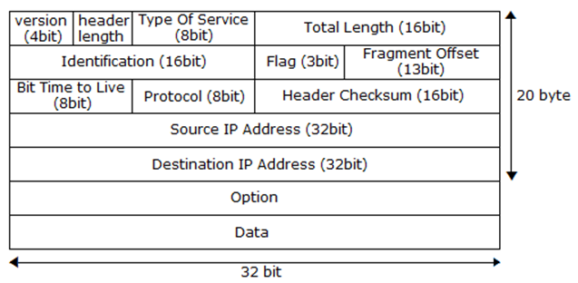
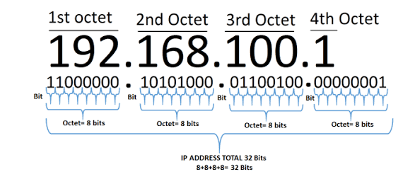
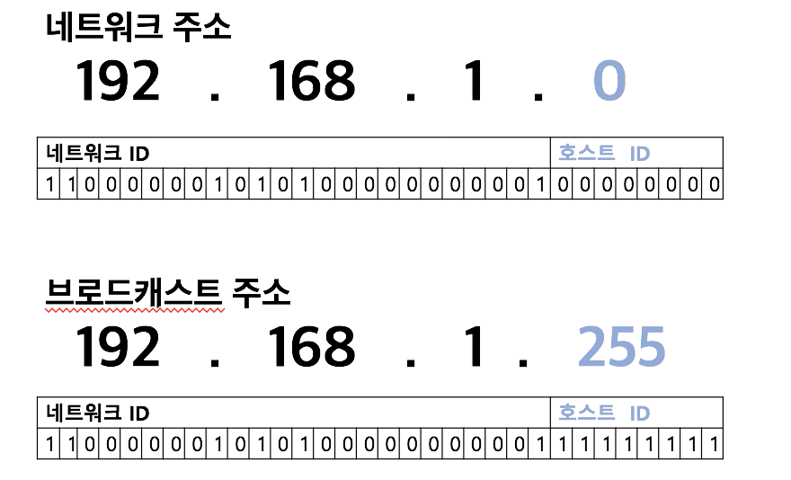
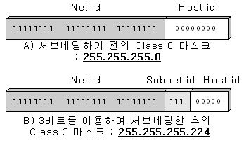
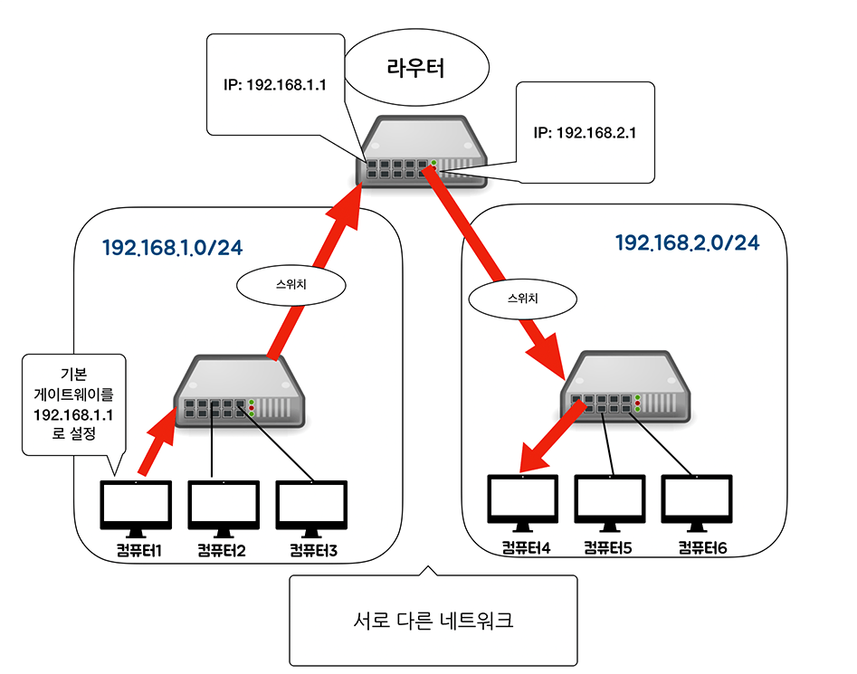
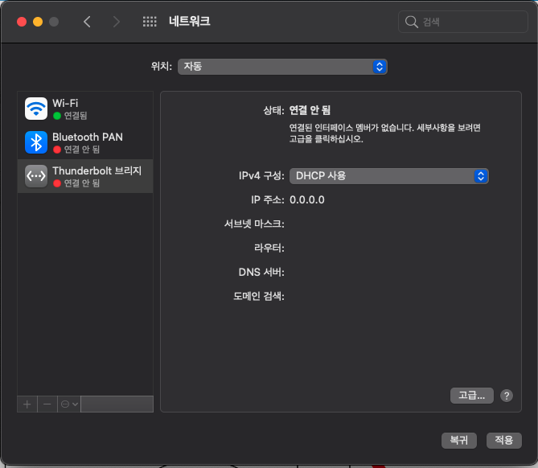
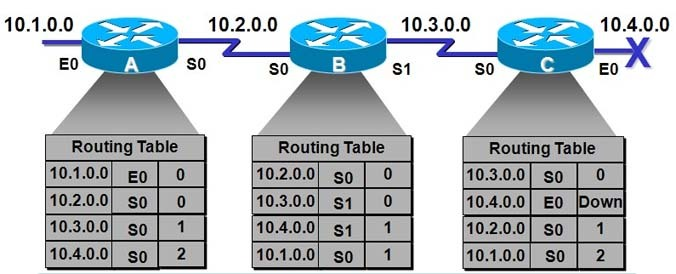

# 네트워크 계층

네트워크 계층은 다른 네트워크와 통신하기 위한 경로 설정을 위해 라우터를 통한 라우팅을 하며, 패킷 전송을 담당한다.

## IP

IP(Internet Protocol) : 인터넷에 있는 한 컴퓨터에서 다른 컴퓨터로 데이터를 보내는데 사용되는 네트워크 계층 프로토콜이다.

네트워크 계층에서 캡슐화시 아래 IP 헤더를 붙인다.



IP 헤더에 출발지 IP주소와 목적지 IP 주소가 포함되어 있다.

### IP 패킷

IP 프로토콜을 사용해 캡슐화 할 때 데이터에 IP 헤더가 추가된 것

### IP 주소



- **IP주소**는 인터넷상에 있는 컴퓨터의 고유한 주소
- 데이터를 보내려는 상대의 목적지를 모르면 라우터도 목적지까지 경로를 알려주지 못한다.
- 네트워크를 식별할 수 있음.
- 10진수 32비트로 구현
    - 10진수로 나타내지만, 이진수 32비트로 구현되어 있음
    - 8비트를 옥텟(octet)이라 부름.
    - 옥텟은 0~255 사이의 10진수
- 네트워크 ID(어떤 네트워크 인지) + 호스트 ID(해당 네트워크의 어느 컴퓨터인지)로 구현


- 공인 IP 주소 : ISP에서 제공
    - 인터넷에 직접 연결되는 컴퓨터나 라우터에 할당
- 사설 IP 주소 : 네트워크 관리자가 자유롭게 할당하거나, DHCP 기능을 사용해 주소 자동으로 할당
    - 회사나 가정의 랜에 있는 컴퓨터는 사설 IP 주소 할당

> DHCP(Dynamic Host Configuration Protocol)
>
> IP주소를 자동으로 할당하는 프로토콜

### IPv4 vs IPv6

처음 IPv4 주소 약 43억개면, 충분하다고 생각했으나 인터넷이 보급되면서 IP 주소가 부족해졌고, IPv6가 나오게 됐다.

| 구분        | IPv4                     | IPv6                                                         |
| ----------- | ------------------------ | ------------------------------------------------------------ |
| 주소 길이   | 32비트                   | 128비트                                                      |
| 주소 개수   | 약 43억개                | 2^128개 (43억 * 43억 * 43억 * 43억)                          |
| 주소 형태   | 221.23.222.222           | 2001:0db8:85a3:08d3:1319:8a2e:0380:7334                      |
| 패킷 헤더   | 변동 사이즈              | 고정 사이즈                                                  |
| 헤더 필드수 | 8                        | 12                                                           |
| 품질        | 제한적 품질 보장         | 확장된 품질 보장<br />등급별, 서비스 별 패킷을 구분할 수 있어 품질 보장 용이 |
| 보안        | IPsec 프로토콜 별도 설치 | 확장 기능에서 기본으로 제공                                  |
| P & P       | 없음                     | 자동 구성으로 지원                                           |
| 이동성      | 곤란                     | 가능                                                         |

### IP 주소 클래스

네트워크 ID를 크게 만들어(= 호스트 ID를 작게 만들어) 네트워크 크기를 조정할 수 있다.
네트워크 크기는 아래 클래스라는 개념으로 구분하고 있다.

| Class   | IP주소 첫 8Bit | 범위    | IP주소 범위(이론상)         | 사설 IP 주소                  | 설명                  |
| ------- | -------------- | ------- | --------------------------- | ----------------------------- | --------------------- |
| A Class | 0XXX XXXX      | 1~127   | 0.0.0.0 ~ 127.255.255.255   | 10.0.0.0~10.255.255.255       | 대규모 네트워크 주소  |
| B Class | 10XX XXXX      | 128~191 | 128.0.0.0 ~ 191.255.255.255 | 172.16.0.0~172.31.255.255     | 중형 네트워크 주소    |
| C Class | 110X XXXX      | 192~223 | 192.0.0.0 ~ 223.255.255.255 | 192.168.0.0 ~ 192.168.255.255 | 소규모 네트워크 주소  |
| D Class | 111X XXXX      | 224~239 | 224.0.0.0 ~ 239.255.255.255 |                               | 멀티캐스트 주소       |
| E Class | 1111 XXXX      | 240~255 | 240.0.0.0 ~ 255.255.255.255 |                               | 연구 및 특수용도 주소 |

일반 네트워크에서는 A~C까지 사용가능하다.
사설 IP주소와, 공인 IP주소의 범위가 별도로 있으며, 사설 IP주소는 절대로 공인 IP주로로 사용 불가능하다.

```bash
$ ifconfig | grep inet # mac
$ ipconfig getifaddr en0 # mac
$ ipconfig # window
```

## 네트워크 주소와 브로드캐스트 주소

네트워크 주소와 브로드캐스트 주소는 컴퓨터나 라우터가 자신의 IP로 사용하면 안되는 주소이다.



### 네트워크 주소

- 호스트 ID가 10진수로 0, 2진수로 00000000인 주소
- 전체 네트워크에서 작은 네트워크를 식별하는데 사용
- 전체 네트워크의 대표 주소
- ex) 192.168.1.1 ~ 192.168.1.7은 192.168.1.0의 네트워크에 있다.

### 브로드캐스트 주소

- 호스트 ID가 10진수로 255, 2진수로 11111111인 주소
- 네트워크에 있는 컴퓨터나 장비 모두에게 한번에 데이터를 전송하는데 사용하는 전용 IP
- ex) 192.168.1.255로 데이터 전송시 해당 네트워크 안(192.168.0)에 있는 모든 컴퓨터가 데이터 수신

## 서브넷

많은 수의 컴퓨터가 브로드캐스트 패킷을 전송하면, 모든 컴퓨터에 패킷이 전송되어 네트워크가 혼잡해진다.


대규모의 네트워크를 작은 네트워크로 분할해 브로드캐스트로 전송되는 패킷의 범위를 좁힐 수 있다.
이렇게 범위를 줄이면, 더 많은 네트워크를 만들 수 있어서 IP 주소를 더 효율적으로 사용할 수 있다.



- 서브넷팅: 네트워크를 분할하기 위해 IP 주소의 구성을 변경하는 작업
- 서브넷: 분할된 네트워크
    - 네트워크 ID + 서브넷 ID + 호스트 ID로 분할
    - 호스트 ID에서 비트를 빌려 서브넷 ID로 만듦

### 서브넷 마스크

서브네팅 후 네트워크 ID와 호스트 ID인지 판단하기 어려워, **네트워크 ID와 호스트 ID를 식별하기 위한 값**이다.
IP주소의 네트워크 부분만 나타나게 해, 같은 네트워크인지 판별한다.

서브넷 마스크는 프리픽스(prefix) 표기법으로 사용될 수 있다.

- 각 클래스별 서브넷 마스크
    - A : 255.0.0.0
    - B : 255.255.0.0
    - C : 255.255.255.0

#### 프리픽스 표기법

: 서브넷 마스크를 슬래시(/비트수)로 나타낸 것

```
11111111 11111111 11111111 00000000
|_          24비트       _|
```

위 예 255.255.255.0은 /24이다.
    


이미지에서 네트워크 ID 24 bit +  서브넷 ID 3bit + 호스트 ID 5bit이다.

- 서브넷 마스크 : 255.255.255.224
- 프리픽스 표기법 : 255.255.255.224 /27


## 라우터

네트워크 계층을 통해 다른 네트워크로 데이터를 전송하려면 **라우터(router)**가 필요하다.

- 서로 다른 네트워크를 연결해주는 장치로, 현재 네트워크에서 다른 네트워크로 패킷을 전송할 수 있게 한다.
- 데이터 목적지가 정해지면 해당 목적지까지 어떤 경로로 가는것이 좋은지를 알려준다.
- 인터넷 공유기(=브로드밴드 라우터 = 라우터) : 가정이나 소규모 기업 용도로 만든 라우터
- 목적지 IP주소가 있어야, 데이터를 전송할 수 있다.



이때 스위치(레이어 2 스위치)만 있는 네트워크에서는 모든 컴퓨터와 스위치가 동일한 네트워크에 속한다.
하지만, **라우터가 있으면 네트워크를 분할** 할 수 있다.
네트워크 분할 후 컴퓨터1에서 컴퓨터 6으로 접속한다고 가정을 하면, 컴퓨터1은 다른 네트워크로 데이터를 보낼 때 어디로 전송해야하는지 모르므로 네트워크 출입구(라우터 IP 주소) 설정이 필요하다.

- 기본 게이트웨이 : 네트워크의 출입구를 설정(라우터 IP 주소 설정)

위 그림에서는 `192.168.1.1`, `192.168.2.1`로 기본 게이트웨이를 설정하고 있다.



맥에서는 설정 > 네트워크에서 네트워크를 임의로 추가해, 설정할 수 있다.

- [맥에서 인터넷 IP설정하기](http://macswitching.blogspot.com/2012/09/ip_27.html)

### 라우팅

**경로 정보를 기반으로 현재 네트워크에서 다른 네트워크로 최적의 경로를 통해 데이터를 전송하는 방식**이다.

#### 라우팅 테이블



컴퓨터 네트워크에서 목적지 주소를 목적지에 도달하기 위한 네트워크 노선으로 변환하는 목적으로 사용된다.
즉, **최적화된 경로 정보가 등록**되어있는 것이다.

- 수동으로 등록하는 방법 : 소규모 네트워크에 적합
    - 네트워크 관리자가 수동으로 등록
- 자동으로 등록하는 방법 : 대규모 네트워크에 적합
    - 라우터 간에 경로 정보를 서로 교환해서, 라우팅 테이블 정보를 자동으로 수정

#### 라우팅 프로토콜

라우터 간에 라우팅 정보를 교환하기 위한 프로토콜이다.
라우팅 프로토콜을 설정해 라우터간에 경로 정보를 서로 교환하고, 라우팅 테이블에 등록해서 나가게된다.

- RIP
- OSPF
- BGP

가 대표적인 라우팅 프로토콜이다.

#### mac에서 확인해보기

```bash
$ netstat -rn # 네트워크 게이트웨이(라우팅 테이블)
$ route get default # default gateway 확인
```