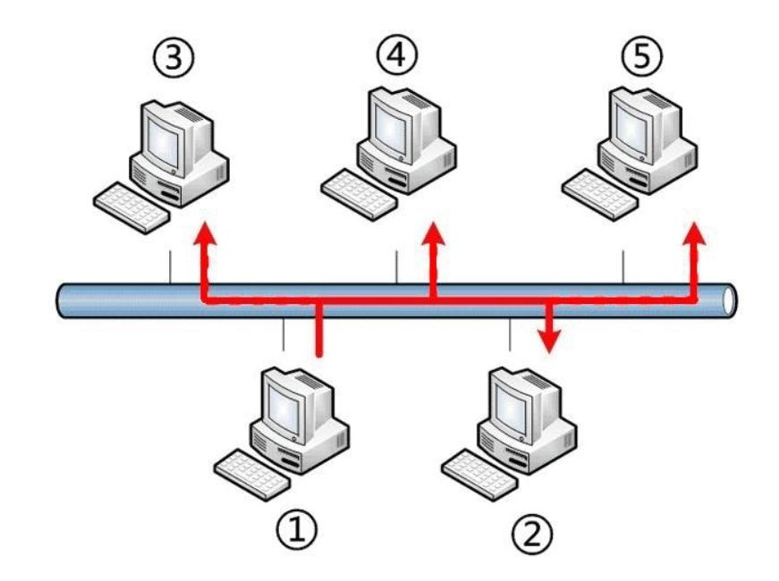

## 전송 계층

물리 계층, 데이터 링크 계층, 네트워크 계층이 있으면 목적지에 데이터를 보낼 수 있지만, 데이터가 손상되거나 유실되더라도 3개 계층에서는 아무것도 하지 않는다.
그래서 필요한게 전송 계층이다. **전송 계층은 목적지에 신뢰할 수 있는 데이터를 전송하기 위해 필요**하다.

1. 오류 점검 기능 : 오류 발생시 데이터 재전송
2. 전송된 데이터의 목적지가 어떤 애플리케이션인지 식별하는 기능

즉, 신뢰할 수 있는 데이터를 순차적으로 전달하는 역할을 하므로, 상위 계층이 데이터 전달의 유효성이나 효율성을 신경쓰지 않도록한다. 또한, 데이터가 중복되거나 누락되지 않고 오류 없이 순서에 맞게 전송되도록 관리한다.

### 특징

- **신뢰성/정확성** : 데이터를 목적지에 문제없이 전달하는  것
    - **연결형 통신** : 상대편과 확인하면서 통신
    - 신뢰할 수 있고, 정확한 데이터 전송이 필요한 애플리케이션
    - 프로토콜 : **TCP**
- **효율성** : 데이터를 빠르고 효율적으로 전달하는 것
    - **비연결형 통신** : 상대편을 확인하지 않고, 일방적으로 데이터 전송
    - 효율적인 데이터 전송
    - ex) 동영상
    - 프로토콜 : **UDP**

### TCP

**신뢰성과 정확성을 우선으로 하는 연결형 통신의 프로토콜**이다.

#### TCP 헤더

![TCP Header [정보통신기술용어해설]](./assets/nogNvfAx6NVpdcGdA7VJkWm-MoD0pFbInK5V4wvDw8NaD3rgktvdJnNY-cgssNCktohw5C-D_vfZcvw9VP7WM8DB5g.jpeg)

- TCP 헤더 : TCP로 전송할 때 붙이는 헤더
    - 목적지까지 데이터를 제대로 전송하기 위해 필요한 정보를 가지고 있다.
- 세그먼트(segment) : TCP 헤더가 붙은 데이터

데이터를 전송 하기 위해서는 연결(connection)이라는 가상의 독점 통신로를 확보해야, 데이터를 전송할 수 있다.
헤더에서 예약 다음의 코드비트를 보면 다음과 같다.

- 코드 비트(6bit) : 연결의 제어 정보가 기록, 초깃값은 0이고, 비트가 활성화 되면 1

    | URG  | ACK  | PSH  | RST  | SYN  | FIN  |
    | ---- | ---- | ---- | ---- | ---- | ---- |
    | 0    | 0    | 0    | 0    | 0    | 0    |

    - SYN : 연결 요청
    - ACK : 확인 응답

#### 3-way 핸드셰이크

연결은 아래와 같이 **SYC**와 **ACK**를 사용해 확립할 수 있다.
신뢰할 수 있는 연결을 하려면, 데이터 전송전에 패킷 교환을 3번 한다.

1. 컴퓨터1에서 컴퓨터2로 연결 확립 허가를 받기 위한 요청(SYN)을 보낸다.

    | URG  | ACK  | PSH  | RST  | SYN   | FIN  |
    | ---- | ---- | ---- | ---- | ----- | ---- |
    | 0    | 0    | 0    | 0    | **1** | 0    |

2. 컴퓨터2에서 컴퓨터1이 보낸 요청을 받은 후 허가한다는 연결 확립 응답(ACK)를 보내며, 컴퓨터2도 컴퓨터1에 연결 확립 요청(SYN)을 보낸다.

    | URG  | ACK   | PSH  | RST  | SYN  | FIN  |
    | ---- | ----- | ---- | ---- | ---- | ---- |
    | 0    | **1** | 0    | 0    | 0    | 0    |

3. 컴퓨터2의 요청을 받은 컴퓨터1이 컴퓨터2로 요청을 허가한다는 연결 확립 응답(ACK)를 보낸다.

    | URG  | ACK   | PSH  | RST  | SYN  | FIN  |
    | ---- | ----- | ---- | ---- | ---- | ---- |
    | 0    | **1** | 0    | 0    | 0    | 0    |

다음과 같이 데이터를 보내기 전에 연결을 확립하기 위해 패킷 요청을 3번 교환하는 것을 **3-way 핸드셰이크(handshake)**라 한다.

#### 연결 끊기

데이터를 전송한 후에는 연결을 끊기 위한 요청을 해야한다.

- FIN : 연결 종료

1. 컴퓨터1에서 컴퓨터2로 연결 종료 요청(FIN)

    | URG  | ACK  | PSH  | RST  | SYN  | FIN   |
    | ---- | ---- | ---- | ---- | ---- | ----- |
    | 0    | 0    | 0    | 0    | 0    | **1** |

2. 컴퓨터2에서 컴퓨터1로 연결 종료 응답(ACK)

    | URG  | ACK   | PSH  | RST  | SYN  | FIN  |
    | ---- | ----- | ---- | ---- | ---- | ---- |
    | 0    | **1** | 0    | 0    | 0    | 0    |

3. 컴퓨터2에서 컴퓨터 1로 연결 종료 요청(FIN)

    | URG  | ACK  | PSH  | RST  | SYN  | FIN   |
    | ---- | ---- | ---- | ---- | ---- | ----- |
    | 0    | 0    | 0    | 0    | 0    | **1** |

4. 컴퓨터1에서 컴퓨터2로 연결 종료 응답(ACK)

    | URG  | ACK   | PSH  | RST  | SYN  | FIN  |
    | ---- | ----- | ---- | ---- | ---- | ---- |
    | 0    | **1** | 0    | 0    | 0    | 0    |

#### 일련번호와 확인 응답

![TCP Header [정보통신기술용어해설]](./assets/nogNvfAx6NVpdcGdA7VJkWm-MoD0pFbInK5V4wvDw8NaD3rgktvdJnNY-cgssNCktohw5C-D_vfZcvw9VP7WM8DB5g.jpeg)

3-way 핸드셰이크 종료 후, 실제 데이터를 보내거나 받을 때는 TCP 헤더의 일련번호(sequence number)와 확인 응답 번호(acknowledgement number)를 사용한다.

- 일련번호 : TCP는 데이터를 분할해서 보내는데 송신 측에서 수신 측에 이 데이터가 **몇번째 데이터**인지 알려주는 역할
- 확인 응답 번호 : 수신 측이 **몇 번째 데이터를 수신했는지** 송신측에 알려주는 역할
    - 다음 번호의 데이터를 요청하는 경우에도 사용된다.
    - 10번 데이터 수신 후, 11번 데이터를 송신측에 요청하는데, 이를 확인 응답이라 한다.

예를 한가지 살펴볼 것이다.

- 데이터 전송 전 3-way 핸드셰이크에서 연결 수립시, 통신에서 사용하는 일련번호와 확인 응답번호가 결정된다.
- 컴퓨터1은 컴퓨터2로 200바이트 데이터 전송
- 컴퓨터2는 200바이트 데이터 수신하고, 다음에 수신하고 자하는 데이터 번호(3001 + 200 = 3201)를 확인 응답번호에 넣어 전달.
- 컴퓨터1은 컴퓨터2로 3201부터 200바이트 데이터 전송
- 컴퓨터2는 200바이트 데이터 수신하고, 다음에 수신하고 자하는 데이터 번호(3201 + 200 = 3401)를 확인 응답번호에 넣어 전달.

이 과정을 데이터 전송이 완료될 때까지 반복한다.

일련번호와 확인 응답 번호를 사용해 데이터가 손상되거나 유실된 경우에 데이터를 재전송하게 되어있으며, 이를 **재전송 제어**라고 한다.
즉, 데이터 전송 중 오류가 발생하면 일정시간 대기 후 재전송을 한다.

#### 윈도우 크기

위에서 설명한 방식은 세그먼트(데이터) 하나를 보낼 때 마다 확인 응답을 한 번 반환하고 있는 통신이다. 하지만 이 통신 방법은, 데이터를 보낼 때마다 매번 응답을 반환하는 방식이기때문에 효율이 높지 않다.
매번 확인 응답을 기다리는 대신 세그먼트를 연속해서 보내고 난 다음 확인 응답을 반환하면, 효율이 높아진다.

이때, 받은 세그먼트들을 일시적으로 보관하는 장소, 버퍼(buffer)가 있으며, 버퍼 덕분에 세그먼트를 연속해서 보내도 수신측은 대응할 수 있다. 또한, 확이 인 응답의 효율도 높아진다.
하지만, 너무 많은 데이터를 보내면, 오버플로(overflow)가 발생할 수 있다.

오버플로가 발생하지 않도록 버퍼의 한계크기를 알고 있어야 하는데, **TCP 헤더의 윈도우크기가 버퍼의 한계 크기 값**이다.
즉, 윈도우 크기는 얼마나 많은 용량의 데이터를 저장해둘 수 있는지이며, 다시말해 확인 응답을 일일히 하지 않고 연속해서 송수신할 수 있는 데이터 크기이다.

윈도우 크기는 3-way 핸드셰이크시 판단한다.

- 컴퓨터1의 윈도우 크기를 연결 확립 요청시 전달
- 컴퓨터2의 연결 확립 응답 + 연결 확립 요청시 컴퓨터2 윈도우 크기 전달

윈도우 크기를 알고 있으면, 확인 응답을 기다리지 않고 세그먼트를 연속해서 보내면 위 그림과 같이 연속으로 보낼 수 있다.

#### 포트 번호

**목적지가 어떤 애플리케이션인지 구분**하기 위해 TCP 헤더의 **출발지 포트 번호**와 **목적지 포트 번호**가 필요하다.
즉, TCP 헤더에 포트 번호가 있기 때문에 애플리케이션을 구분할 수 있다.

- 포트 번호 : 0 ~ 65535번 사용 가능
- well-kwon ports(0~1023 포트) : 주요 프로토콜이 사용하도록 예약되어 있음
    - 서버 측 애플리케이션에서 사용
- 1024 포트 : 예약되어 있지만, 사용되지 않는 포트
- random ports(1025~) : 클라이언트 측 송신 포트

**잘 알려진 포트**

|  포트   | TCP  | UDP  |                             설명                             |     상태     |
| :-----: | :--: | :--: | :----------------------------------------------------------: | :----------: |
|    0    |      | UDP  |                    예약됨; 사용하지 않음                     |     공식     |
|    1    | TCP  |      | [TCPMUX](https://ko.wikipedia.org/wiki/TCPMUX) (TCP 포트 서비스 멀티플렉서) |     공식     |
|    7    | TCP  | UDP  | [ECHO](https://ko.wikipedia.org/w/index.php?title=ECHO&action=edit&redlink=1) 프로토콜 |     공식     |
|    9    | TCP  | UDP  | [DISCARD](https://ko.wikipedia.org/w/index.php?title=DISCARD&action=edit&redlink=1) 프로토콜 |     공식     |
|   13    | TCP  | UDP  | [DAYTIME](https://ko.wikipedia.org/w/index.php?title=DAYTIME&action=edit&redlink=1) 프로토콜 |     공식     |
|   17    | TCP  |      | [QOTD](https://ko.wikipedia.org/w/index.php?title=QOTD&action=edit&redlink=1) (Quote of the Day) 프로토콜 |     공식     |
|   19    | TCP  | UDP  | [CHARGEN](https://ko.wikipedia.org/w/index.php?title=CHARGEN&action=edit&redlink=1) (Character Generator) 프로토콜 - 원격 오류 수정 |     공식     |
|   20    | TCP  |      | [파일 전송 프로토콜 (FTP, File Transfer Protocol)](https://ko.wikipedia.org/wiki/파일_전송_프로토콜) - 데이터 포트 |     공식     |
|   21    | TCP  |      | [파일 전송 프로토콜 (FTP, File Transfer Protocol)](https://ko.wikipedia.org/wiki/FTP) - 제어 포트 |     공식     |
| **22**  | TCP  |      | [시큐어 셸 (SSH, Secure SHell)](https://ko.wikipedia.org/wiki/시큐어_셸) - [ssh](https://ko.wikipedia.org/wiki/시큐어_셸) [scp](https://ko.wikipedia.org/wiki/Scp), [sftp](https://ko.wikipedia.org/wiki/SSH_파일_전송_프로토콜)같은 프로토콜 및 포트 포워딩 |     공식     |
|   23    | TCP  |      | [텔넷 프로토콜 (Telnet Protocol)](https://ko.wikipedia.org/wiki/텔넷) - 암호화되지 않은 텍스트 통신 |     공식     |
|   24    | TCP  |      |                       개인메일 시스템                        |     공식     |
| **25**  | TCP  |      | [SMTP](https://ko.wikipedia.org/wiki/SMTP) (Simple Mail Transfer Protocol) - [이메일](https://ko.wikipedia.org/wiki/이메일) 전송에 사용 |     공식     |
|   37    | TCP  | UDP  | [TIME](https://ko.wikipedia.org/w/index.php?title=TIME&action=edit&redlink=1) 프로토콜 |     공식     |
|   49    |      | UDP  | [TACACS](https://ko.wikipedia.org/w/index.php?title=TACACS&action=edit&redlink=1) 프로토콜 |     공식     |
| **53**  | TCP  | UDP  | [도메인 네임 시스템 (DNS, Domain Name System)](https://ko.wikipedia.org/wiki/도메인_네임_시스템) |     공식     |
|   67    |      | UDP  | [BOOTP](https://ko.wikipedia.org/w/index.php?title=BOOTP&action=edit&redlink=1) (부트스트랩 프로토콜) 서버. [DHCP](https://ko.wikipedia.org/wiki/DHCP)로도 사용 |     공식     |
|   68    |      | UDP  | [BOOTP](https://ko.wikipedia.org/w/index.php?title=BOOTP&action=edit&redlink=1) (부트스트랩 프로토콜) 클라이언트. [DHCP](https://ko.wikipedia.org/wiki/DHCP)로도 사용 |     공식     |
|   69    |      | UDP  | [간단한 파일 전송 프로토콜 (TFTP, Trivial File Transfer Protocol)](https://ko.wikipedia.org/wiki/TFTP) |     공식     |
|   70    | TCP  |      | [고퍼 프로토콜 (Gopher Protocol)](https://ko.wikipedia.org/wiki/고퍼_(프로토콜)) |     공식     |
|   79    | TCP  |      | [Finger](https://ko.wikipedia.org/w/index.php?title=Finger_프로토콜&action=edit&redlink=1) 프로토콜 |     공식     |
| **80**  | TCP  | UDP  | [HTTP](https://ko.wikipedia.org/wiki/HTTP) (HyperText Transfer Protocol) - 웹 페이지 전송 |     공식     |
|   88    | TCP  |      | [커베로스](https://ko.wikipedia.org/wiki/커베로스) - 인증 에이전트 |     공식     |
|   109   | TCP  |      | [POP2](https://ko.wikipedia.org/w/index.php?title=POP2&action=edit&redlink=1) (Post Office Protocol version 2) - [전자우편](https://ko.wikipedia.org/wiki/전자우편) 가져오기에 사용 |     공식     |
| **110** | TCP  |      | [POP3](https://ko.wikipedia.org/wiki/POP3) (Post Office Protocol version 3) - [전자우편](https://ko.wikipedia.org/wiki/전자우편) 가져오기에 사용 |     공식     |
|   111   | TCP  | UDP  | [RPC](https://ko.wikipedia.org/wiki/RPC) (Remote Procedure Call) |     공식     |
|   113   | TCP  |      | [ident](https://ko.wikipedia.org/w/index.php?title=Ident&action=edit&redlink=1) - 예전 서버 인증 시스템, 현재는 [IRC](https://ko.wikipedia.org/wiki/IRC) 서버에서 사용자 인증에 사용 |     공식     |
|   119   | TCP  |      | [NNTP](https://ko.wikipedia.org/wiki/NNTP) (Network News Transfer Protocol) - 뉴스 그룹 메시지 가져오기에 사용 |     공식     |
|   123   |      | UDP  | [NTP](https://ko.wikipedia.org/wiki/NTP) (Network Time Protocol) - 시간 동기화 |     공식     |
|   139   | TCP  |      | [넷바이오스 (NetBIOS, Network Basic Input/Output System)](https://ko.wikipedia.org/wiki/넷바이오스) |     공식     |
|   143   | TCP  |      | [인터넷 메시지 접속 프로토콜 4 (IMAP4, Internet Message Access Protocol 4)](https://ko.wikipedia.org/wiki/인터넷_메시지_접속_프로토콜) - [이메일](https://ko.wikipedia.org/wiki/이메일) 가져오기에 사용 |     공식     |
|   161   |      | UDP  | [SNMP](https://ko.wikipedia.org/wiki/SNMP) (Simple Network Management Protocol) - Agent 포트 |     공식     |
|   162   |      | UDP  |  [SNMP](https://ko.wikipedia.org/wiki/SNMP) - Manager 포트   |     공식     |
|   179   | TCP  |      | [BGP](https://ko.wikipedia.org/wiki/BGP) (Border Gateway Protocol) |     공식     |
|   194   | TCP  |      | [IRC](https://ko.wikipedia.org/wiki/IRC) (Internet Relay Chat) |     공식     |
|   220   | TCP  |      | [인터넷 메시지 접속 프로토콜 3 (IMAP3, Internet Message Access Protocol 3)](https://ko.wikipedia.org/wiki/인터넷_메시지_접속_프로토콜) |              |
|   389   | TCP  |      | [LDAP](https://ko.wikipedia.org/wiki/LDAP) (Lightweight Directory Access Protocol) |     공식     |
| **443** | TCP  |      | [HTTPS](https://ko.wikipedia.org/wiki/HTTPS) - [보안 소켓 레이어 (SSL, Secure Socket Layer)](https://ko.wikipedia.org/wiki/전송_계층_보안) 위의 [HTTP](https://ko.wikipedia.org/wiki/HTTP) (암호화 전송) |     공식     |
|   445   | TCP  |      | Microsoft-DS ([액티브 디렉터리](https://ko.wikipedia.org/wiki/액티브_디렉터리), 윈도 공유, [Sasser](https://ko.wikipedia.org/w/index.php?title=Sasser&action=edit&redlink=1)-worm, Agobot, Zobotworm) |     공식     |
|   445   |      | UDP  | Microsoft-DS [SMB](https://ko.wikipedia.org/wiki/서버_메시지_블록) 파일 공유 |     공식     |
|   465   | TCP  |      | [SSL](https://ko.wikipedia.org/wiki/SSL) 위의 [SMTP](https://ko.wikipedia.org/wiki/SMTP) - Cisco 프로토콜과 충돌 | 비공식, 충돌 |
|   514   |      | UDP  | [syslog](https://ko.wikipedia.org/w/index.php?title=Syslog&action=edit&redlink=1) 프로토콜 - 시스템 로그 작성 |     공식     |
|   515   | TCP  |      | [LPD](https://ko.wikipedia.org/w/index.php?title=LPD&action=edit&redlink=1) 프로토콜 - 라인 프린터 데몬 서비스 |     공식     |
|   540   | TCP  |      | [UUCP](https://ko.wikipedia.org/wiki/UUCP) (Unix-to-Unix Copy Protocol) |     공식     |
|   542   | TCP  | UDP  | [상용](https://ko.wikipedia.org/wiki/상업) (Commerce Applications) (RFC maintained by: Randy Epstein [repstein at host.net]) |     공식     |
|   587   | TCP  |      | email message submission ([SMTP](https://ko.wikipedia.org/wiki/SMTP)) ([RFC](https://ko.wikipedia.org/wiki/RFC) 2476) |     공식     |
|   591   | TCP  |      | [파일메이커](https://ko.wikipedia.org/wiki/파일메이커) 6.0 Web Sharing *(HTTP Alternate, see port 80)* |     공식     |
|   631   | TCP  |      |                    인터넷 프린팅 프로토콜                    |     공식     |
|   636   | TCP  |      | [SSL](https://ko.wikipedia.org/wiki/SSL) 위의 [LDAP](https://ko.wikipedia.org/wiki/LDAP) (암호화된 전송) |     공식     |
|   666   | TCP  |      | [id 소프트웨어](https://ko.wikipedia.org/wiki/Id_소프트웨어)의 *[둠](https://ko.wikipedia.org/wiki/둠)* 멀티플레이어 게임 |     공식     |
|   873   | TCP  |      | [rsync](https://ko.wikipedia.org/wiki/Rsync) 파일 동기화 프로토콜 |     공식     |
|   981   | TCP  |      | [SofaWare Technologies](https://ko.wikipedia.org/w/index.php?title=SofaWare_Technologies&action=edit&redlink=1) [Checkpoint Firewall-1](https://ko.wikipedia.org/w/index.php?title=Checkpoint_Firewall-1&action=edit&redlink=1) 소프트웨어 내장 방화벽의 원격 HTTPS 관리 |    비공식    |
|   990   | TCP  |      | [SSL](https://ko.wikipedia.org/wiki/SSL) 위의 [FTP](https://ko.wikipedia.org/wiki/FTP) (암호화 전송) |     공식     |
|   992   | TCP  |      | [SSL](https://ko.wikipedia.org/wiki/SSL) 위의 [Telnet](https://ko.wikipedia.org/wiki/TELNET) (암호화 전송) |     공식     |
|   993   | TCP  |      | [SSL](https://ko.wikipedia.org/wiki/SSL) 위의 [IMAP4](https://ko.wikipedia.org/w/index.php?title=IMAP4&action=edit&redlink=1) (암호화 전송) |     공식     |
|   995   | TCP  |      | [SSL](https://ko.wikipedia.org/wiki/SSL) 위의 [POP3](https://ko.wikipedia.org/wiki/POP3) (암호화 전송) |     공식     |

다음과 같이 애플리케이션은 각각 포트 번호가 있어서 다른 애플리케이션과 서로 구분된다. 데이터 전송 시 상대방 IP주소가 필요하지만, 어떤 애플리케이션이 사용되고 있는지 구분하려면 포트 번호가 필요하다.
그렇기 때문에, 포트 번호 없이 통신시 컴퓨터에 데이터가 도착하더라도 애플리케이션까지 전달할 수 없다.
이때, 웹 브라우저 접속시 웹 브라우저에는 임의의 포트가 자동으로 할당 된다. 그렇기때문에 서버 측에서는 포트 번호를 정해둬야하지만, 클라이언트 측은 정하지 않아도 된다.

### UDP

- 비연결형 통신
- 효율성을 중요하게 여기는 프로토콜
- 데이터를 효율적으로 빠르게 보내는 것
- 스트리밍 방식으로 전송하는 곳에 사용 ex) 동영상 서비스

#### UDP 헤더

올바른 목적지의 애플리케이션으로 데이터를 전송하기 위해 필요한 정보가 기록되어있다.

- UDP 데이터그램 : UDP 헤더 + 데이터

UDP는 신뢰성과 정확성이 필요하지 않아 위 정보만으로도 충분하다.

#### TCP vs UDP

**TCP는 신뢰성과 정확성을 요구하기 때문에 여러번 확인 응답을 보내면서 전송**하지만, **UDP는 효율성과 빠른 속도가 중요하므로, 상대방을 확인하지 않고 연속으로 데이터를 전송**한다.

#### UDP broadcast

UDP를 사용하면, 랜에 있는 컴퓨터나 네트워크 장비에 데이터를 일괄로 보낼 수 있다. 이렇게 일괄로 데이터를 보내는 것을 브로드캐스트라고 한다.
TCP는 3-way 핸드셰이크와 같이 데이터 전송시에도 확인 응답을 보내야하기 떄문에, 브로드캐스트와 같이 불특정 다수에게 보내는 통신에는 적합하지 않다.
