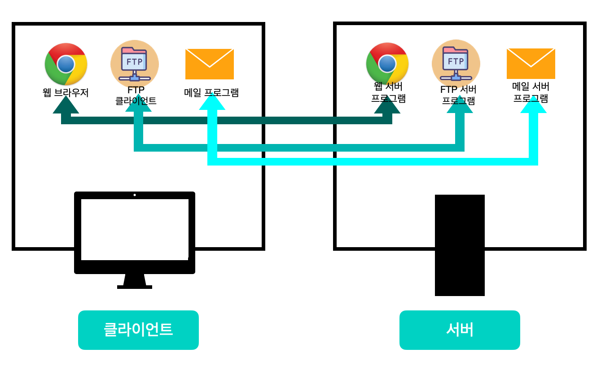
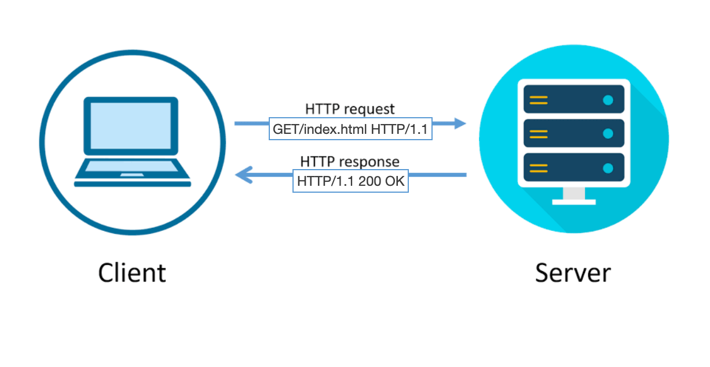
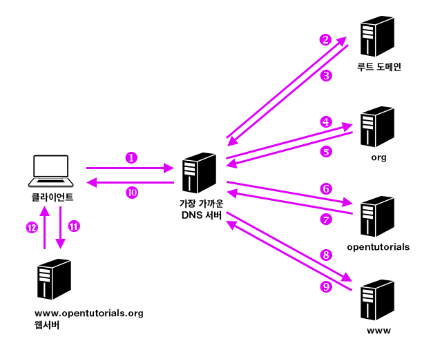

# 응용 계층

응용계층은 OSI 모델의 최상위 계층으로 다양하게 존재하는 응용 환경에서 공통적으로 필요한 기능을 다룬다. 시스템 간의 응용 처리는 상호 간에 통신하면서 일련의 업무를 처리할 수 있도록 필요한 서비스를 제공한다.
이메일, 파일 전송, 웹 사이트 조회 등 **애플리케이션에 대한 서비스를 제공하는 계층**이다.

- 서비스 : 네트워크 애플리케이션이 제공하는 기능이나 동적, 정보 등

애플리케이션은 **서비스를 요청하는 측(클라이언트)**과 **서비스를 제공하는 측(서버)**로 분류할 수 있다.

- 클라이언트 : 웹 브라우저, 메일 프로그램
- 서버 : 웹 서버 프로그램, 메일 서버 프로그램

( 여기서 응용 계층은 세션 계층과 표현 계층을 포함하는 기준으로 다룰 것이다. )

응용계층은 클라이언트의 요청을 전달하기 위해 서버가 이해할 수 있는 메세지(데이터)로 변환하고 전송 계층으로 전달하는 역할을 한다.



위 그림과 같이 클라이언트 측 어플리케이션이 서버 측 애플리케이션으로 통신하려면, 응용 계층의 **프로토콜**을 사용해야한다.

#### 프로토콜

| 프로토콜                                 | 내용                                                         |
| ---------------------------------------- | ------------------------------------------------------------ |
| HTTP<br />(HyperText Transfer Protocol)  | 웹 사이트 접속                                               |
| DNS<br />(Domain Name System)            | 이름 해석<br />네트워크에서 컴퓨터나 네트워크 장비에 붙여진 이름을 기반으로  IP 주소 파악하는 것 |
| FTP<br />(File Transfer Protocol)        | 파일 전송                                                    |
| SMTP<br />(Simple Mail Transfer)         | 메일 송신                                                    |
| POP3<br />(Post Office Protocol version) | 메일 수신                                                    |

응용 계층에서는 각각의 애플링케이션에 대응되는 데이터를 전송하는 역할을 하며, 응용 계층에서 보내려는 데이터는 하위 계층(전송, 네트워크, 데이터 링크, 물리)에 순차적으로 처리된다.

## WWW란?

WWW(World Wide Web)은 줄여서 W3나 웹이라고 부른다. 웹은 아래 3가지 기술을 사용한다.

- HTML : 문장 구조나 문자를 꾸미는 태그를 사용해 작성하는 마크업 언어([HTML Basic](https://github.com/dh00023/TIL/blob/master/HTML&CSS/2017-03-17-html-basic.md))
- URL 
- HTTP

### HTTP

클라이언트(웹 브라우저)는  웹 사이트를 보기 위해 서버의 **80번 포트**를 사용해 **HTTP** 통신을 한다.



- request : 데이터나 작업 처리를 요청하는 메세지
- response : 상대에게 보낸 데이터나 처리 요청에 대한 응답

클라이언트가 데이터 요청시 HTTP method, 데이터, 버전 등을 서버에 전송하면, 서버는 응답으로 정상적으로 처리가 됐다는 status 정보와 요청한 데이터를 반환한다.

### HTTP 1.0 / 1.1 / 2


#### HTTP/1.0

HTTP 1.0 버전에서는 요청을 보낼 때마다 연결했다 끊는 작업을 반복했다. 
웹 페이지 하나를 띄우는데, 모든 요청을 보낼때 마다 연결했다 끊는 작업을 반복해 클라이언트 입장에서는 모든 데이터가 응답하는데 오래 걸리는 것처럼 느껴진다.

#### HTTP/1.1

HTTP/1.1버전에서 **keepalive** 기능이 추가 됐다.
한번 연결을 수립하고 나면, 데이터 교환을 마칠 때까지 연결을 유지하고, 데이터 교환을 모두 끝내면 연결을 끊는 구조이다.
keepalive는 요청도 순서 대로 처리하는 특징이 있어서, 순서대로 요청에 대해 응답을 반환한다.

HTTP/1.1은 요청을 보낸 순서대로 응답을 반환하는데, 이전 요청을 처리하는 데 시간이 길어지면 다음 요청에 대한 처리가 늦어지는 문제가 있다.

####  HTTP/2


HTTP/2 버전에서는 요청을 보낸 순서대로 응답을 반환하지 않아도 되며, 컨텐츠를 더 빠르게 표시할 수 있다.'

## DNS


컴퓨터 서버에 접속을 하기 위해서는 IP 주소를 입력해야하는데, [https://www.naver.com/](https://www.naver.com/)를 입력해도 웹 사이트에 접속이 가능하다.

이는 DNS때문에 가능한 것인데, **DNS는 URL을 IP로 변환하는 서비스**(시스템)이다.
[125.209.222.141](125.209.222.141)와 같이 IP주소를 입력해야 된다면, 기억하기 어렵기때문에 주소를 사용하여 접속하도록 돕는 것을 이름 해석(name resolution)이라고 한다.

- 이름 해석:  [https://www.naver.com/](https://www.naver.com/)에 접속하면 DNS 서버가 웹 사이트 서버의 IP 주소를 알려주는 것이다.
- 도메인 이름 : 컴퓨터나 네트워크를 식별하기 위한 이름
    - naver.com
- 호스트 이름(서버 이름)
    -  www

#### nslookup

도메인 네임을 얻거나, IP 주소 매핑, 다른 특정한 DNS 레코드를 DNS에 질의할 때 사용

```bash
$ nslookup naver.com
Server:		
Address:	

Non-authoritative answer:
Name:	naver.com
Address: 125.209.222.141
Name:	naver.com
Address: 223.130.195.200
Name:	naver.com
Address: 125.209.222.142
Name:	naver.com
Address: 223.130.195.95
```


#### 컴퓨터와 DNS 서버간 IP 주소 교환 과정


웹 사이트의 IP 주소를 모르기 때문에, DNS 서버에 요청하여 IP 주소를 확인하고, 웹 서버에 접속한다. 하지만, DNS 서버가 도메인의 IP 주소를 모르는 경우도 있다.



그런 경우 가장 가까운  DNS 서버에 요청을 하고, DNS 서버가 모르는 경우 다른 DNS 서버에 도메인에 대한 IP 주소를 요청한다.

DNS 서버는 전 세계에 흩어져 있으며, 모두 계층적으로 연결되어 있다.


## 메일의 송수신 구조

- SMTP : 메일을 보내는데 사용되는 프로토콜
    - 포트번호 : 25
    - 메일 서버 간의 메일 전송에도 이용
- POP3 : 메일을 받는데 사용하는 프로토콜
    - 포트번호 : 110

### 메일 송수신 과정


1. SMTP를 사용해 송신인 메일 서버로 메일을 보낸다.
    - 세션 시작을 통지
    - 송신자의 메일 주소 통지
    - 목적지 메일 주소 통지
    - 메일 본문 전송 통지
    - 메일 본문 송신
    - 세션 종료 통지
2. SMTP를 사용해 송신인 메일 서버에서 수신인 메일 서버로 메일을 보낸다.
    - 메일 서버에는 메일을 보관해주는 기능이 있다. (메일박스 등)
3. POP3를 사용해 수신인 메일 서버에서 수신인 컴퓨터로 메일 데이터를 보낸다.
    - 세션 시작 통지
    - **수신자의 사용자 이름 통지** ( 사용자 인증 필요 )
    - **수신자의 비밀번호 통지** ( 사용자 인증 필요 )
    - 메일 존재 확인
    - 메일 전송 요청
    - 세션 종료 총지


#### ping

목적지 컴퓨터와 통신을 확인하기 위한 명령어
ICMP(Internet Control Message Protocol) 프로토콜을 사용해 목적지 컴퓨터에 ICMP 패킷을 전송하고 패킷에 대한 응답이 제대로 오는지 확인하는 명령어이다.
ping 명령이 정상으로 실행되면 네트워크 연결이 정상이라고 판단할 수 있으므로, 문제 확인시 자주 사용한다.

```bash
$ ping 목적지 IP 주소
$ ping 목적지 호스트 이름
```

```bash
$ ping -c 5 www.google.co.kr
PING www.google.co.kr (172.217.175.227): 56 data bytes
64 bytes from 172.217.175.227: icmp_seq=0 ttl=115 time=34.613 ms
64 bytes from 172.217.175.227: icmp_seq=1 ttl=115 time=44.762 ms
64 bytes from 172.217.175.227: icmp_seq=2 ttl=115 time=33.232 ms
64 bytes from 172.217.175.227: icmp_seq=3 ttl=115 time=39.156 ms
64 bytes from 172.217.175.227: icmp_seq=4 ttl=115 time=34.495 ms

--- www.google.co.kr ping statistics ---
5 packets transmitted, 5 packets received, 0.0% packet loss
round-trip min/avg/max/stddev = 33.232/37.252/44.762/4.260 ms
```

