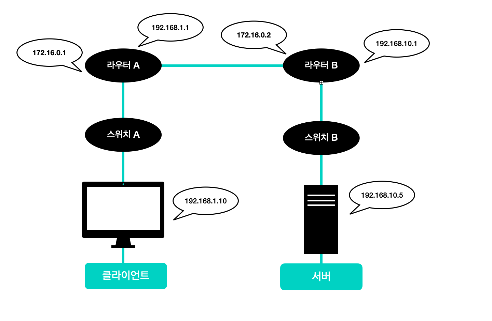
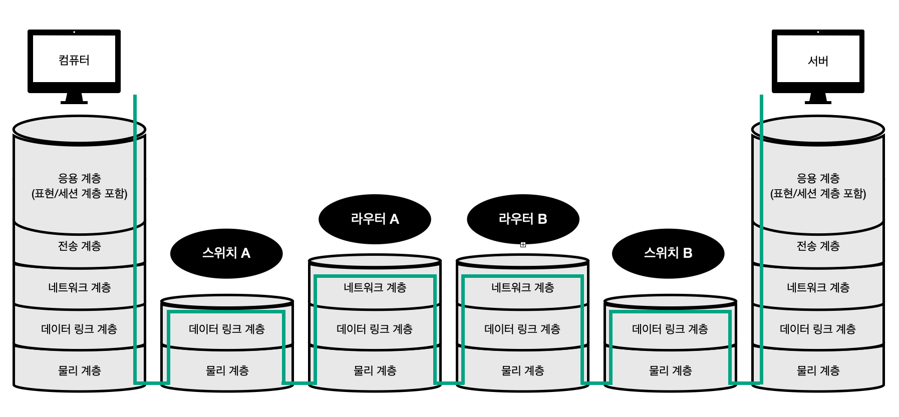
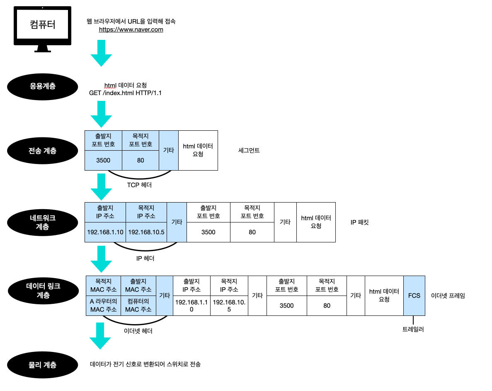
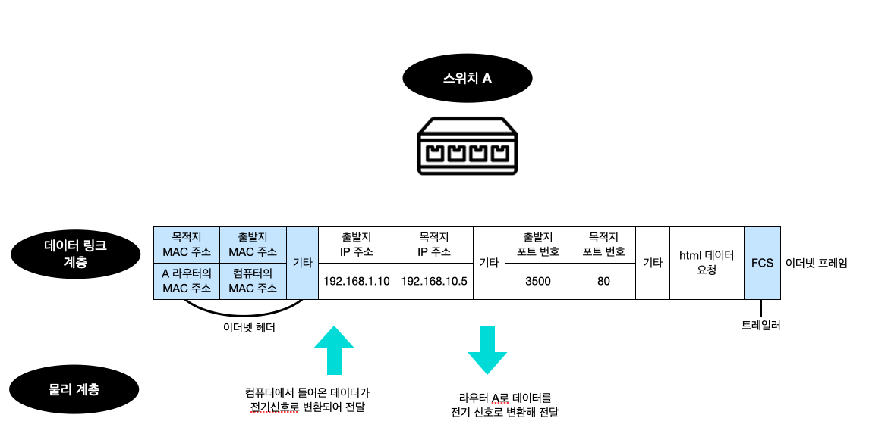
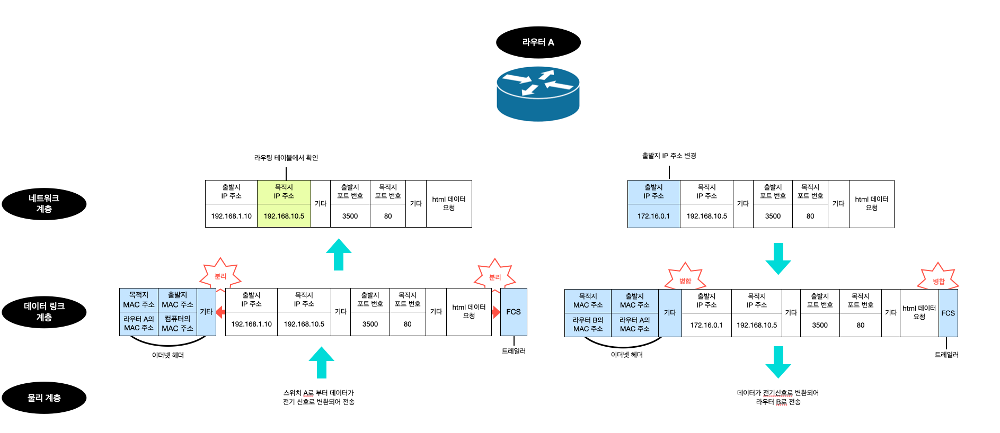
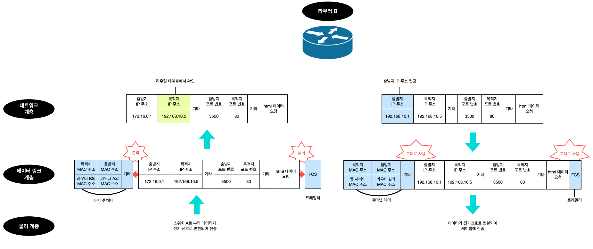
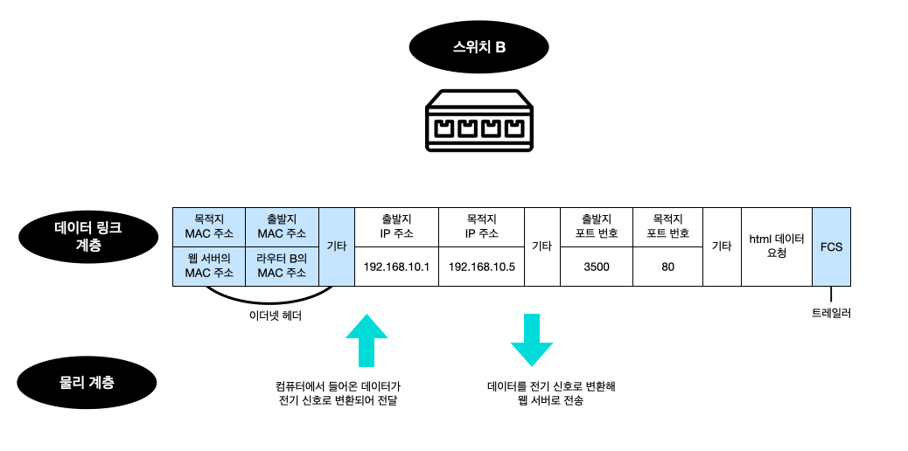
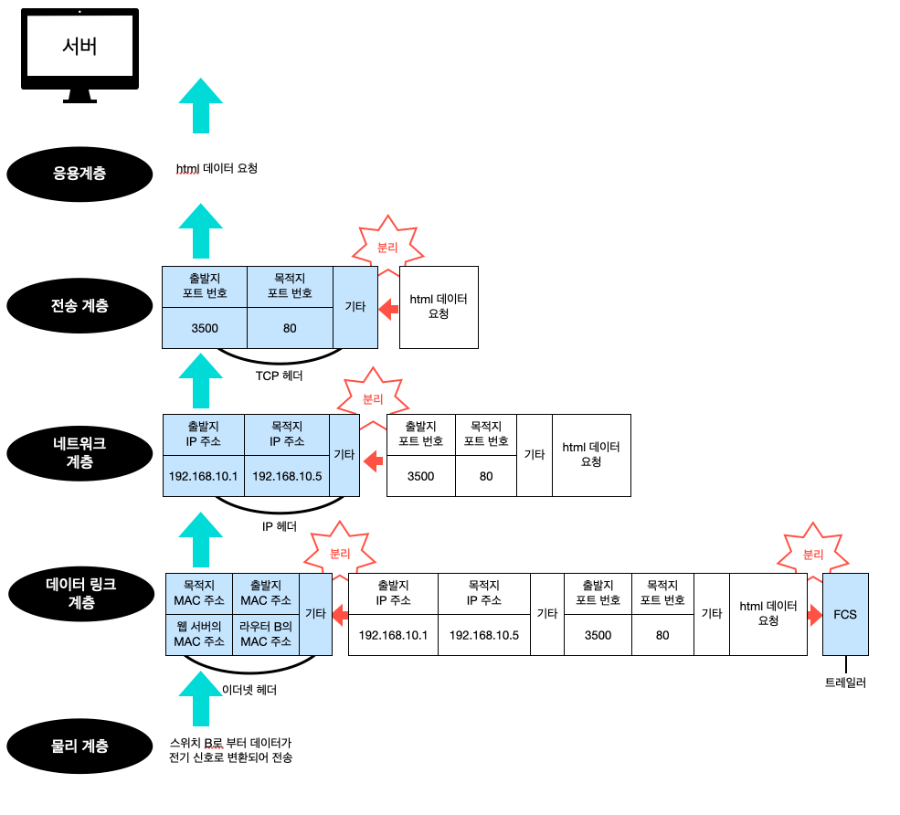

# 네트워크 전체 흐름

다음 그림과 같이 컴퓨터, 스위치, 라우터, 서버로 구성된 네트워크가 있다고 가정해 볼 것이다.

위 네트워크는 총 3개의 네트워크로 구성되어 있다.

- 192.168.1.0/24
- 172.16.0.0/24
- 192.168.10.0/24

OSI 모델로 나타내면, 위 그림과 같이 네트워크 구성이 되는 것을 볼 수 있다.

OSI 모델 기준으로 각 단계별로 어떻게 캡슐화, 역캡슐화가 이루어지는지 한단계씩 살펴볼 것이다.

#### 컴퓨터 -> 스위치

(3-way 핸드셰이크는 이미 완료되어 연결이 확립되어있다고 가정)

1. 웹 브라우저에서 URL을 입력하고 접속

2. 응용 계층 : HTTP 메세지 `GET /index.html HTTP/1.1` 전송

3. 전송 계층 : TCP 헤더가 붙음

    - 데이터 + TCP 헤더 = 세그먼트

    - TCP 헤더에 출발지 포트 번호와 목적지 포트 번호 포함
    - 출발지 포트 번호는 잘 알려진 포트가 아닌(1025이상) 중에서 무작위 선택
    - HTTP 요청이므로, 목적지 포트는 80

4. 네트워크 계층 : IP 헤더 추가

    - 세그먼트 + IP 헤더 = IP 패킷
    - IP 헤더에 출발지, 목적지 IP 주소 포함

5. 데이터 링크 계층 : 이더넷헤더, 트레일러 추가

    - 이더넷 헤더 + IP 패킷 + 트레일러 = 이더넷 프레임

6. 물리 계층 : 전기신호로 변환되어 네트워크로 전송

    - 랜 카드를 사용해 전기신호로 변환

#### 스위치 -> 라우터

스위치 A는 데이터 링크 계층에서 데이터를 전기 신호로 변환해 라우터 A로 전송한다.

#### 라우터 A -> 라우터 B

1. 데이터 링크 계층 : 목적지 MAC 주소와 자신의 MAC 주소 비교 후 주소가 동일하다면, 이더넷 헤더와 트레일러 분리
2. 네트워크 계층 : 라우팅 테이블과 목적지 IP 비교
3. 네트워크 계층 : 출발지 주소를 라우터의 외부 IP 주소(WAN)로 변경
4. 데이터 링크 계층 : 이더넷 헤더 + IP 패킷 + 트레일러, 이더넷 프레임을 물리 계층으로 전달
5. 물리 계층 : 데이터를 전기신호로 변환해 전송

#### 라우터 B -> 스위치 B

1. 데이터 링크 계층 : 이더넷 프레임의 목적지 MAC 주소와 자신의 MAC주소를 비교해 동일하면, 역캡슐화(트레일러, 이더넷 헤더 분리) 진행
2. 네트워크 계층 : 라우팅 테이블에서 목적지 IP 주소 비교
3. 네트워크 계층 : 출발지 주소를 라우터의 내부 IP 주소(LAN)로 변경
4. 데이터 링크 계층 : 이더넷 헤더 + IP 패킷 + 트레일러, 이더넷 프레임을 물리 계층으로 전달
5. 물리 계층 : 데이터를 전기신호로 변환해 전송

#### 스위치B -> 웹서버

스위치 B는 데이터 링크 계층에서 데이터를 전기 신호로 변환해 웹서버로 전송한다.

#### 웹 서버

1. 물리 계층 : 전기신호로 변환된 데이터 전송
2. 데이터 링크 계층 : 이더넷 프레임의 목적지 MAC 주소와 자신의 MAC주소를 비교해 동일하면, 역캡슐화(트레일러, 이더넷 헤더 분리) 진행
3. 네트워크 계층 : 목적지 IP 주소와 웹 서버의 IP 주소가 동일한지 비교후 동일하면 IP 헤더 분리
4. 전송 계층 : 목적지 포트 번호를 확인해 어떤 어플리케이션으로 전달할지 판단하고, TCP 헤더 분리