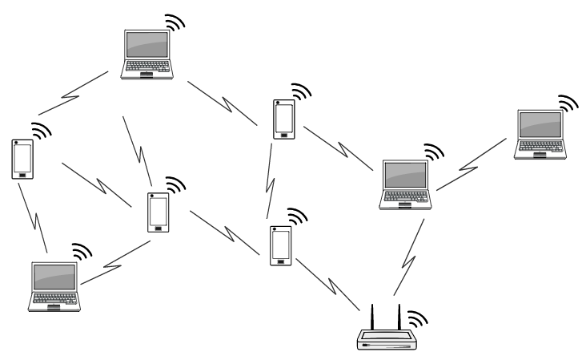

# 무선 랜

무선 랜은 랜 케이블을 사용하지 않고 눈에 보이지 않는 전파를 이용해 무선으로 컴퓨터를 서로 연결한다.

#### 장점

- 케이블이 없어 편함
- 랜 케이블이 닿지 않는 곳에서도 통신 할 수 있음

#### 단점

- 유선보다 속도가 불안정
- 전파가 약하면 연결이 잘 안됨
- 해킹될 위험이 유선보다 높음

무선랜은 **무선 액세스 포인트(WAP, Wireless Access Point)**와 **무선 클라이언트**(컴퓨터, 스마트폰 등)로 구성된다.
WAP는 무선 공유기 혹은 무선 AP라 부르기도하며, WAP와 통신하기 위해서는 무선 랜 칩과 무선 랜 어댑터가 필요하다.

#### 무선랜 어댑터

- USB 메모리 방식
- 컴퓨터 카드 방식

#### WAP

- 무선 공유기
- 기업같은 경우는 넓은 공간에 전파가 잘되야하므로 WAP를 여러대 설치가 필요

## 무선랜 연결 방식

### 인프라스트럭처 방식

- 무선 액세스 포인트(WAP)를 통해 통신하는 방식
- 주로 사용

### 애드혹 방식

- 무선 클라이언트끼리 직접 통신하는 방식

## 무선랜 규격

- [IEEE802.11](https://ko.wikipedia.org/wiki/IEEE_802.11)

| 무선랜 규격  | 통신 속도(최대) | 주파수 대역 | 특징                                                      | 최초 배포   |
| ------------ | --------------- | ----------- | --------------------------------------------------------- | ----------- |
| IEEE802.11ay | 40Gbps          | 60GHz       | 고효율 무선 네트워크 단순히 ad를 개선한 것           | 2019년      |
| IEEE802.11ax | 14Gbps          | 6GHz        | 고효율 무선 네트워크                                      | 2019년      |
| IEEE802.11ad | 6.7Gbps         | 60GHz       | 초고속 통신                                               | 2012년 12월 |
| IEEE802.11ac | 6.9Gbps         | 5GHz        | 장애물이 많아도 고속 통신 가능 전파 간섭을 조금 받음 | 2012년 12월 |
| IEEE802.11n  | 300Mbps         | 2.4GHz 대역 | 장애물에 강하지만 전파 간섭 쉽게 받음                     | 2009년 10월 |
|              |                 | 5GHz 대역   | 장애물에 강하지만 전파 간섭 쉽게 받음                     | 2009년 10월 |
| IEEE802.11a  | 54Mbps          | 5GHz 대역   | 장애물에 강하지만 전파 간섭 쉽게 받음                     | 1999년 9월  |
| IEEE802.11g  | 54Mbps          | 2.4GHz 대역 | 장애물에 강하지만 전파 간섭 쉽게 받음                     | 2003년 1월  |
| IEEE802.11b  | 11Mbps          | 2.4GHz 대역 | 장애물에 강하지만 전파 간섭 쉽게 받음                     | 1999년 9월  |

무선 공유기 통신 규격에 IEEE802.11ax/ac/n/b/a 이면 5개 규격 모두 지원한다는 의미이다.
이때 무선 클라이언트도 해당 규격을 지원해야지 해당 규격을 사용할 수 있다.

## SSID

- SSID(Service Set IDentifier) : 액세스 포인트의 고유 이름

무선 액세스 포인트와 무선 클라이언트를 연결할 때, 혼선을 피하기 위해서 네트워크 이름, 인증, 암호화, 암호화키 설정 필요하다.
위 설정을 해 둬야 무선 클라이언트가 자동으로 무선 액세스 포인트를 찾아서 통신할 수 있다.

*비컨(beacon) : 무선 액세스 포인트의 자신을 알리는 신호*

- 무선 엑세스 포인트는 비컨을 네트워크에 있는 모든 기기에 주기적으로 전송하며, 클라이언트는 이 신호를 잡아서 연결
- 같은 SSID인지 확인 후, 인증 방식이 올바르다면 무선 클라이언트는 WAP에 연결 요청
- 연결 요청에 승인을 받으면 서로 통신할 수 있게 연결됨

## 채널

WAP와 무선 클라이언트 사이가 멀수록 전파가 약해져 접속이 잘 안되거나 통신 속도가 느려질 수 있다.
그런 경우에는 WAP를 여러 대 설치해야한다.
이때, 무선 랜은 여러 기기를 동시에 연결할 수 있게 주파수 대역을 분할하는데, 이 주파수 대역을 채널이라고 한다.

- Co-Channel 기준으로 WAP에 연결하는 무선 클라이언트들은 모두 같은 채널을 설정(같은 주파수 대역 사용)
- Adjacent-Channel 기준
    -  WAP 4, 5, 6은 각각 다른 채널을 설정
        - 다른 채널로 설정해 전파는 겹치지만 주파수는 겹치지 않음.
        - 다른 채널을 사용했지만 IEEE802.11b와 IEEE802.11g의 경우 일부에서 같은 주파수를 사용해 전파 간섭이 발생하기도 함
    - 전파가 겹치는 무선 공유기들이 같은 채널로 설정되어 있으면, 전파 간섭이 생기고 통신 속도가 느려짐
    - 같은 채널을 사용하려면 전파가 겹치지 않도록 거리를 떨어트려 설치 필요

보통 무선 액세스 포인트는 자동으로 최적의 채널을 찾아주며, 연결이 불안정하거나 통신 속도가 느려질 때는 채널이 원인일 수 있으므로, 수동으로 채널을 변경해보는 것도 방법이다.

