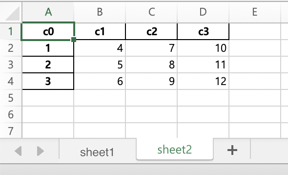

# 데이터 입출력

## 데이터 가져오기

### 외부 파일 읽어오기
Pandas는 다양한 형태의 외부 파일을 읽어와 DataFrame으로 변환하는 함수를 제공한다. 어떠한 파일이든 DataFrame으로 변환하면 Pandas의 모든 함수와 기능을 자유롭게 사용할 수 있다.

| File Format     | Reader         | Writer       |
| --------------- | -------------- | ------------ |
| CSV             | read_csv       | to_csv       |
| JSON            | read_json      | to_json      |
| HTML            | read_html      | to_html      |
| Local clipboard | read_clipboard | to_clipboard |
| MS Excel        | read_excel     | to_excel     |
| HDF5 Format     | read_hdf       | to_hdf       |
| SQL             | read_sql       | to_sql       |

#### CSV

CSV(Comma-Separated Values)는 데이터 값을 쉼표(`,`)로 구분하고 있다는 의미의 텍스트 파일이다. 쉼표로 열을 구분하고 줄바꿈으로 행을 구분하고 있다.

```python
pandas.read_csv(file)
```

| 옵션              | 설명                                                         |
| ----------------- | ------------------------------------------------------------ |
| path              | 파일의 위치(파일명 포함), URL                                |
| sep(or delimiter) | 텍스트 데이터를 필드별로 구분하는 문자                       |
| header            | 열 이름으로 사용될 행의 번호( default = 0)<br/>header가 없고 첫 행부터 데이터가 있는 경우 None으로 지정가능 |
| index_col         | 행 인덱스로 사용할 열의 번호 또는 열 이름                    |
| names             | 열 이름으로 사용할 문자열의 리스트                           |
| skiprows          | 처음 몇 줄을 skip할 것인지 설정<br/>skip하려는 행의 번호를 담은 리스트로 설정 가능(`[1,3,5]`) |
| parse_dates       | 날짜 텍스트를 datetime64로 변환할 것인지 설정(default=False) |
| skip_footer       | 마지막 몇 줄을 skip할 것인지 설정                            |
| encoding          | 텍스트 인코딩 종류를 지정                                    |

```python
>>> import pandas as pd
>>> file_path = './qna.csv'
>>> df = pd.read_csv(file_path,  encoding='ms949')
>>> print(df)
       ITEM_CD  ...                                           CONTENTS
0     62938619  ...  88사이즈 밖에 없는데 99사이즈도 입어도 되나요 많이 넉넉하게 나왔나요  선물 할...
1     62491750  ...                                       다음방송은 언제인가요?
2     62006040  ...  44사이즈도 만들어 주세요\n바지는  정말~~~~예쁘고 입고 싶은 스탈인데 55사이...
```

#### Excel

```python
pandas.read_excel(file)
```

read_excel()은 앞의 `read_csv()` 와 거의 유사하다. 대부분의 옵션을 그대로 사용할 수 있다.

```python
>>> df = pd.read_excel('./django.xlsx', header=1)
>>> print(df)
                                     Django 프로젝트 간트차트                              Unnamed: 1 Unnamed: 2  ... Unnamed: 72    Unnamed: 73 Unnamed: 74
0                                           작성자 : 정다혜                                     NaN        NaN  ...         NaN            NaN         NaN
1                             작성일 : 2019년 11월 22일 (금)                                     NaN        NaN  ...         NaN            NaN         NaN
2                                                 NaN                                     NaN        NaN  ...         NaN            NaN         NaN
3                                                 NaN                                   작업 이름         기간  ...         NaN  2019년 11월 24일         NaN
4                                                 NaN                                     NaN        NaN  ...        23.0             24        25.0
5                                                   1                                    사전공부       21 일  ...         NaN            NaN         NaN
6                                                   2                      Django + python 공부       11 일  ...         NaN            NaN         NaN
7                                                   3                  Vue.js + javascirpt 공부        6 일  ...         NaN            NaN         NaN
```

- ImportError

```
>>> df = pd.read_excel('./django.xlsx')
Traceback (most recent call last):
  File "<stdin>", line 1, in <module>
  File "/Users/jeongdaye/.pyenv/versions/pandas/lib/python3.7/site-packages/pandas/io/excel/_base.py", line 304, in read_excel
    io = ExcelFile(io, engine=engine)
  File "/Users/jeongdaye/.pyenv/versions/pandas/lib/python3.7/site-packages/pandas/io/excel/_base.py", line 824, in __init__
    self._reader = self._engines[engine](self._io)
  File "/Users/jeongdaye/.pyenv/versions/pandas/lib/python3.7/site-packages/pandas/io/excel/_xlrd.py", line 20, in __init__
    import_optional_dependency("xlrd", extra=err_msg)
  File "/Users/jeongdaye/.pyenv/versions/pandas/lib/python3.7/site-packages/pandas/compat/_optional.py", line 92, in import_optional_dependency
    raise ImportError(msg) from None
ImportError: Missing optional dependency 'xlrd'. Install xlrd >= 1.0.0 for Excel support Use pip or conda to install xlrd.
```

excel파일을 읽어오려고 할때 다음과 같은 오류가 발생할 수 있다. 이 경우에는 해당 라이브러리를 설치해주면된다.

```bash
$ pip install xlrd
```


#### JSON

JSON 파일은 데이터 공유를 목적으로 개발된 특수한 파일 형식이다.

```python
pandas.read_json(file)
```

```python
>>> df = pd.read_json('./itemInfo.json')
>>> print(df)
                  code        serialID resCode resMsg                                             result  description  status  errorCode message
benefitInfo          1  20200429114333                   {'noInterestMonth': 10, 'isFreeDelivery': True}          NaN     200        NaN
cateInfo             1  20200429114333                 {'llargeCategoryId': 'G00007', 'llargeCategory...          NaN     200        NaN
channelCode          1  20200429114333                                                          50001001          NaN     200        NaN
detailInfo           1  20200429114333                 {'itemType': 'CJMALL', 'slPrc': 188000, 'clpSl...          NaN     200        NaN
exceptionCode        1  20200429114333                                                                00          NaN     200        NaN
exceptionMsg         1  20200429114333                                                                정상          NaN     200        NaN
imagesInfo           1  20200429114333                 {'timeStamp': 1567555709718, 'itemImages': ['/...          NaN     200        NaN
itemButton           1  20200429114333                 {'giftDeliv': False, 'type': 'BUY', 'cart': Fa...          NaN     200        NaN
marketingBanners     1  20200429114333                                                                []          NaN     200        NaN
mobilePlus           1  20200429114333                                                                 0          NaN     200        NaN
shareEventInfo       1  20200429114333                                                              None          NaN     200        NaN
videoInfo            1  20200429114333                 {'internetLive': None, 'broadcastItemType': 'E...          NaN     200        NaN
```

### Web에서 가져오기

#### HTML 웹 페이지에서 속성 가져오기

```python
pandas.read_html(url or htmlfile)
```

`read_html()` 메소드는 HTML에 있는 `<table>` 태그에서 표 형식의 데이터를 모두 찾아서 DataFrame으로 변환한다.

```python
>>> url = './corona.html'
>>> tables = pd.read_html(url)
>>> print(len(tables))
4
>>> for i in range(len(tables)):
...     print("tables[%s]"  % i)
...     print(tables[i])
...     print("\n")
...
tables[0]
   지역  확진환자수     비율
0  대구   6856  63.5%
1  경북   1366  12.6%
2  경기    680   6.3%
3  서울    637   5.9%
4  검역    458   4.2%
5  충남    143   1.3%
6  부산    138   1.2%
7  경남    117   1.0%
8  인천     95   0.8%
9  강원     53   0.4%


tables[1]
   지역  확진환자수    비율
0  세종     46  0.4%
1  충북     45  0.4%
2  울산     43  0.4%
3  대전     40  0.3%
4  광주     30  0.2%
5  전북     18  0.1%
6  전남     15  0.1%
7  제주     13  0.1%


tables[2]
     국가          총확진자   실질확진자         사망률(수)
0    미국  113011529918  888912   5.9%(66,224)
1   스페인    2165821366   74234  11.6%(25,100)
2  이탈리아    2093281900  100704  13.7%(28,710)
3    영국    1822604806  154225  15.4%(28,131)
4    독일     164967890   29155    4.1%(6,812)
5   프랑스     130979794   92496  18.9%(24,760)
6    터키    1243751983   62780    2.7%(3,336)
7   러시아    1240549623  107819    1.0%(1,222)


tables[3]
     국가       총확진자  실질확진자        사망률(수)
0   브라질  965594970  49402   7.0%(6,750)
1    이란   96448802  12942   6.4%(6,156)
2    중국     828772    557   5.6%(4,633)
3   캐나다  567143057  30428   6.3%(3,566)
4   벨기에   49517485  29541  15.7%(7,765)
5    페루  425342075  28900   2.8%(1,200)
6  네덜란드   40236445  35249  12.4%(4,987)
7    인도   35776733  27557   3.4%(1,223)


>>> df = tables[1]
>>> df
   지역  확진환자수    비율
0  세종     46  0.4%
1  충북     45  0.4%
2  울산     43  0.4%
3  대전     40  0.3%
4  광주     30  0.2%
5  전북     18  0.1%
6  전남     15  0.1%
7  제주     13  0.1%
>>> df.set_index(['지역'], inplace=True)
>>> df
    확진환자수    비율
지역
세종     46  0.4%
충북     45  0.4%
울산     43  0.4%
대전     40  0.3%
광주     30  0.2%
전북     18  0.1%
전남     15  0.1%
제주     13  0.1%
```

- Import Error

```
Traceback (most recent call last):
  File "<stdin>", line 1, in <module>
  File "/Users/jeongdaye/.pyenv/versions/pandas/lib/python3.7/site-packages/pandas/io/html.py", line 1100, in read_html
    displayed_only=displayed_only,
  File "/Users/jeongdaye/.pyenv/versions/pandas/lib/python3.7/site-packages/pandas/io/html.py", line 891, in _parse
    parser = _parser_dispatch(flav)
  File "/Users/jeongdaye/.pyenv/versions/pandas/lib/python3.7/site-packages/pandas/io/html.py", line 848, in _parser_dispatch
    raise ImportError("lxml not found, please install it")
ImportError: lxml not found, please install it
```

다음과 같이 오류가 발생하는 경우에는 `lxml` 라이브러리를 설치해주면된다.

```bash
$ pip install lxml
```

#### Web Scraping

BeautifulSoup 등 웹 스크래핑 도구로 수집한 데이터를 Pandas DataFrame으로 정리할 수 있다. 이때는 Scraping한 내용을 python list, dictionary로 변환한 뒤, DataFrame으로 변환한다.

- Install BeautifulSoup

```bash
$ pip install beautifulsoup4
```

```python
from bs4 import BeautifulSoup
import requests
import re
import pandas as pd


url = "https://en.wikipedia.org/wiki/List_of_American_exchange-traded_funds"
resp = requests.get(url, verify=False)
soup = BeautifulSoup(resp.text, 'lxml')
rows = soup.select('div > ul > li')

etfs = {}

for row in rows:
	try:
		etf_name = re.findall('^(.*) \(NYSE', rows[10].text)
		etf_market = re.findall('\((.*)\|', row.text)
		etf_ticker = re.findall('NYSE Arca\|(.*)\)', row.text)
		if(len(etf_ticker)>0) & (len(etf_market)>0):
			etfs[etf_ticker[0]] = [etf_market[0], etf_name[0]]

	except AttributeError as err:
		pass


print(etfs)
{'ITOT': ['NYSE Arca', 'iShares Core S&P Total US Stock Mkt'], 'IWV': ['NYSE Arca', 'iShares Core S&P Total US Stock Mkt'], 'SCHB': ['NYSE Arca', 'iShares Core S&P Total US Stock Mkt'], 'FNDB': ['NYSE Arca', 'iShares Core S&P Total US Stock Mkt'], 'VT': ['NYSE Arca', 'iShares Core S&P Total US Stock Mkt'], 'VTI': ['NYSE Arca', 'iShares Core S&P Total US Stock Mkt'], 'VXUS': ['NYSE Arca', 'iShares Core S&P Total US Stock Mkt'], 'VTHR': ['NYSE Arca', 'iShares Core S&P Total US Stock Mkt'], 'DIA': ['NYSE Arca', 'iShares Core S&P Total US Stock Mkt'], 'RSP': ['NYSE Arca', 'iShares Core S&P Total US Stock Mkt'], 'IOO': ['NYSE Arca', 'iShares Core S&P Total US Stock Mkt'], 'IVV': ['NYSE Arca', 'iShares Core S&P Total US Stock Mkt'], 'SPY': ['NYSE Arca', 'iShares Core S&P Total US Stock Mkt'], 'VOO': ['NYSE Arca', 'iShares Core S&P Total US Stock Mkt'], 'IWM': ['NYSE Arca', 'iShares Core S&P Total US Stock Mkt'], 'OEF': ['NYSE Arca', 'iShares Core S&P Total US Stock Mkt'], 'CVY': ['NYSE Arca', 'iShares Core S&P Total US Stock Mkt'], 'RPG': ['NYSE Arca', 'iShares Core S&P Total US Stock Mkt'], 'RPV': ['NYSE Arca', 'iShares Core S&P Total US Stock Mkt'], 'IWB': ['NYSE Arca', 'iShares Core S&P Total US Stock Mkt'], 'PKW': ['NYSE Arca', 'iShares Core S&P Total US Stock Mkt'], 'PRF': ['NYSE Arca', 'iShares Core S&P Total US Stock Mkt'], 'SPLV': ['NYSE Arca', 'iShares Core S&P Total US Stock Mkt'], 'SCHX': ['NYSE Arca', 'iShares Core S&P Total U ...']}


df = pd.DataFrame(etfs)
print(df)
                                  ITOT                                  IWV                                 SCHB                                 FNDB  ...                                  ICB                                  RRF                                 USDU                                 WDTI
0                            NYSE Arca                            NYSE Arca                            NYSE Arca                            NYSE Arca  ...                            NYSE Arca                            NYSE Arca                            NYSE Arca                            NYSE Arca
1  iShares Core S&P Total US Stock Mkt  iShares Core S&P Total US Stock Mkt  iShares Core S&P Total US Stock Mkt  iShares Core S&P Total US Stock Mkt  ...  iShares Core S&P Total US Stock Mkt  iShares Core S&P Total US Stock Mkt  iShares Core S&P Total US Stock Mkt  iShares Core S&P Total US Stock Mkt
```


**requests** 를 이용해서 html을 가져올 것이다. 이때, SSLError가 발생할 수 있다.

- SSLError

```python
requests.exceptions.SSLError: HTTPSConnectionPool(host='en.wikipedia.org', port=443): Max retries exceeded with url: /wiki/List_of_American_exchange-traded_funds (Caused by SSLError(SSLCertVerificationError(1, '[SSL: CERTIFICATE_VERIFY_FAILED] certificate verify failed: unable to get local issuer certificate (_ssl.c:1051)')))
```

신뢰할 수 없는 인증서로 발생하는 오류인데, `verify=False` 옵션으로 해결할 수 있다.

```python
>>> resp = requests.get(url, verify=False)
/Users/jeongdaye/.pyenv/versions/pandas/lib/python3.7/site-packages/urllib3/connectionpool.py:986: InsecureRequestWarning: Unverified HTTPS request is being made to host 'en.wikipedia.org'. Adding certificate verification is strongly advised. See: https://urllib3.readthedocs.io/en/latest/advanced-usage.html#ssl-warnings
  InsecureRequestWarning,
```

### API 활용해 데이터 가져오기
[로또 당첨 번호 API](https://www.nlotto.co.kr/common.do?method=getLottoNumber&drwNo=819)를 이용해 drwNo(회차)에 대한 결과 값을 받을 것이다.

```python
import pandas as pd
import requests
import json

rqst = requests.get("https://www.nlotto.co.kr/common.do?method=getLottoNumber&drwNo=819", verify=False)
result = json.loads(rqst.text)

df = pd.DataFrame(result, index=[0])
print(df)
  totSellamnt returnValue   drwNoDate  ...  drwtNo2  drwtNo3  drwtNo1
0  74578907000     success  2018-08-11  ...       25       33       16
```

## 데이터 저장하기

### CSV 파일로 저장

```python
df.to_csv("file")
```
```python
>>> import pandas as pd
>>> data = {'name': ['Jerry', 'Riah', 'Paul'], 'algol': ['A', 'A+', 'B'],
... 'basic': ['C','B','B+']
... , 'c++': ['B+', 'C', 'C+'],}
>>> df = pd.DataFrame(data)
>>> df.set_index('name', inplace=True)
>>> df.to_csv('./df_sample.csv')
```
```bash
$ ls
bs.py              django.xlsx        premium_review.csv serires.py
corona.html        itemInfo.json      qna.csv
df_sample.csv      lotto.py           requirements.txt
```
```csv
name,algol,basic,c++
Jerry,A,C,B+
Riah,A+,B,C
Paul,B,B+,C+
```

### JSON 파일로 저장

```python
df.to_json(file)
```

위의 DataFrame 객체인 df로 json형태로 데이터를 내보낼 것이다.

```python
df.to_json('./df_sample.json')
```

```bash
$ ls
bs.py              df_sample.json     lotto.py           requirements.txt
corona.html        django.xlsx        premium_review.csv serires.py
df_sample.csv      itemInfo.json      qna.csv
```

```json
{"algol":{"Jerry":"A","Riah":"A+","Paul":"B"},"basic":{"Jerry":"C","Riah":"B","Paul":"B+"},"c++":{"Jerry":"B+","Riah":"C","Paul":"C+"}}
```

### Excel 파일로 저장

```python
df.to_excel(file
```

```python
df.to_excel('./df_sample.xlsx')
```
to_excel 메소드 이용시 아래와 같이 moduleNotFoundError가 발생할 수 있다. 

- ModuleNotFoundError

```python
from openpyxl.workbook import Workbook
ModuleNotFoundError: No module named 'openpyx'
```
openpyx를 설치하면 제대로 되는 것을 확인할 수 있다.

```bash
$ pip install openpyx
```

```bash
$ ls
bs.py              df_sample.json     itemInfo.json      qna.csv
corona.html        df_sample.xlsx     lotto.py           requirements.txt
df_sample.csv      django.xlsx        premium_review.csv serires.py
```


#### 여러개의 DataFrame을 하나의 Excel 파일로 저장

```python
pandas.ExcelWriter(file)
```

```python
>>> import pandas as pd
>>> data = {'name': ['Jerry', 'Riah', 'Paul'], 'algol': ['A', 'A+', 'B'],'basic': ['C','B','B+'], 'c++': ['B+', 'C', 'C+'],}
>>> df = pd.DataFrame(data)
>>> df.set_index('name', inplace=True)
>>> data2 = {'c0':[1,2,3], 'c1':[4,5,6], 'c2':[7,8,9], 'c3':[10,11,12]}
>>> df2 = pd.DataFrame(data2)
>>> df2.set_index('c0', inplace=True)
>>> df
      algol basic c++
name
Jerry     A     C  B+
Riah     A+     B   C
Paul      B    B+  C+
>>> df2
    c1  c2  c3
c0
1    4   7  10
2    5   8  11
3    6   9  12
>>> writer = pd.ExcelWriter('./df_excelwriter.xlsx')
>>> df.to_excel(writer, sheet_name="sheet1")
>>> df2.to_excel(writer, sheet_name="sheet2")
>>> writer.save()
```

```bash
$ ls
bs.py               df_sample.json      lotto.py            serires.py
corona.html         df_sample.xlsx      premium_review.csv  
df_excelwriter.xlsx django.xlsx         qna.csv
df_sample.csv       itemInfo.json       requirements.txt
```




## 참고

- [파이썬 머신러닝 판다스 데이터 분석](http://digital.kyobobook.co.kr/digital/ebook/ebookDetail.ink?LINK=NVE&category=001&barcode=4808956748337)
- [pandas API](https://pandas.pydata.org/pandas-docs/stable/reference/api/pandas.read_excel.html)
- [SSLError](https://blog.naver.com/PostView.nhn?blogId=gracehappyworld&logNo=221585937573&categoryNo=32&parentCategoryNo=0)
