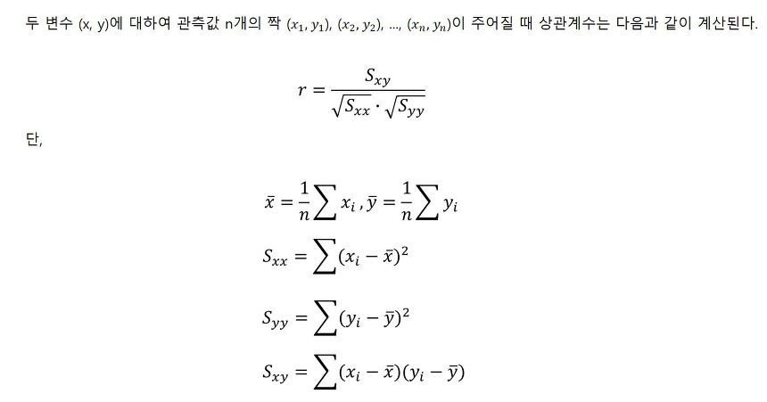
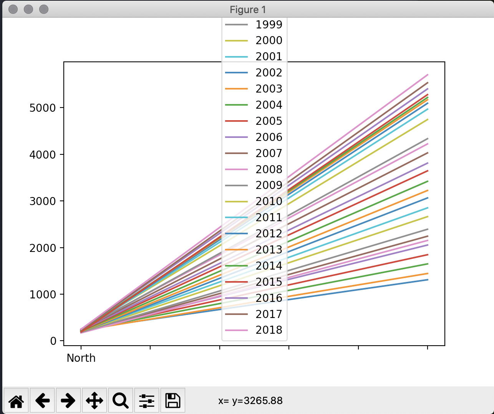
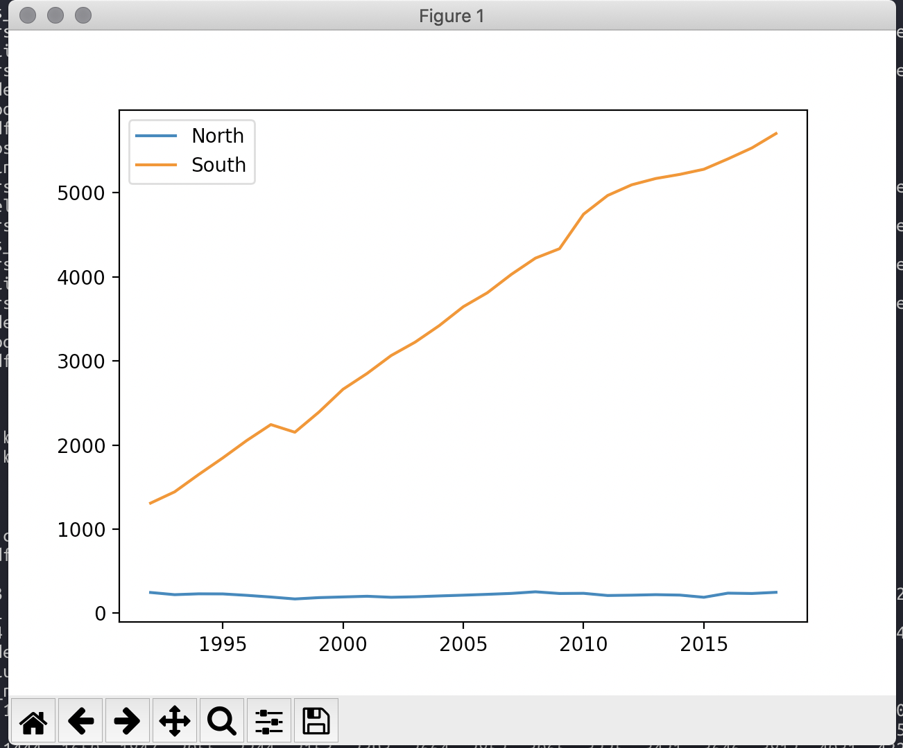
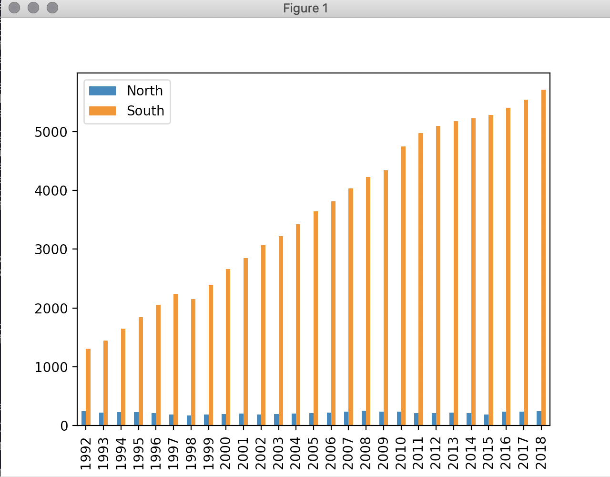
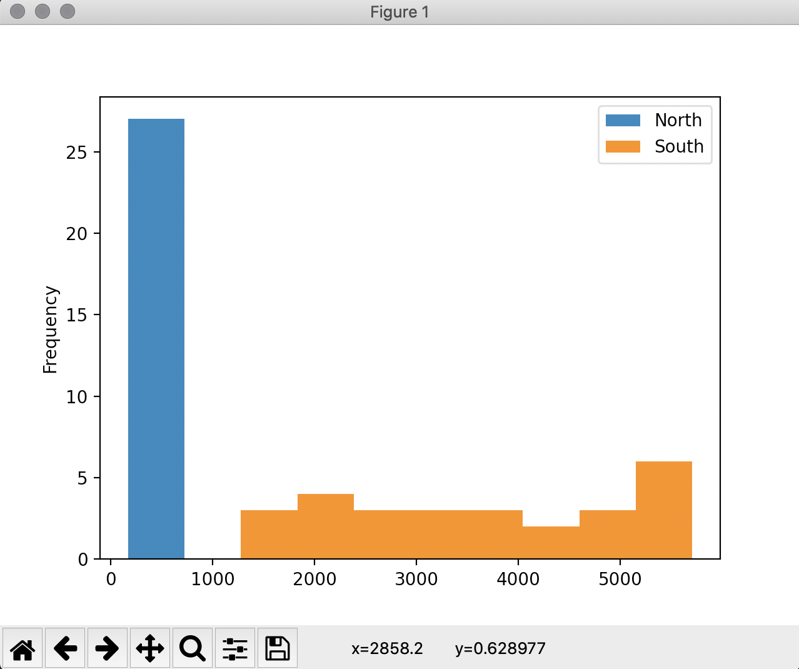
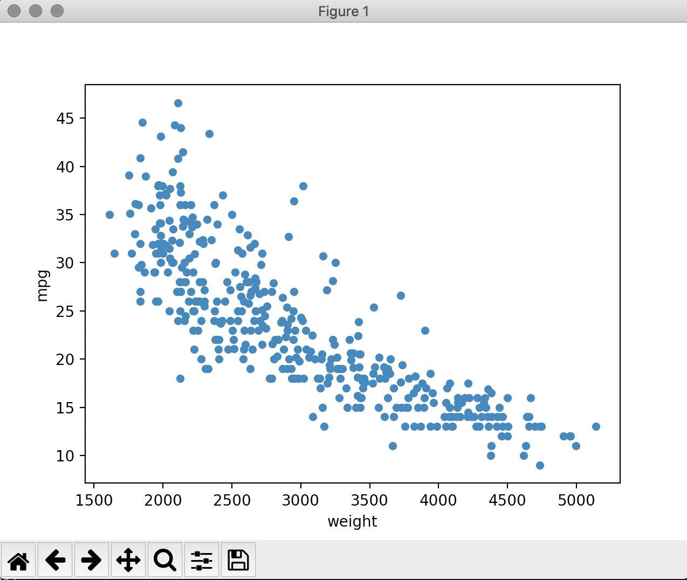
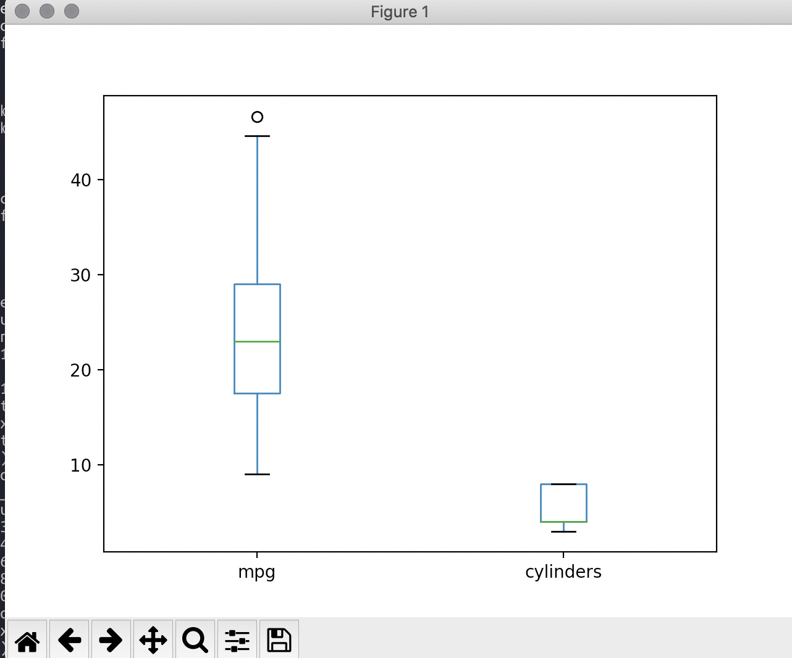

# DataFrame Data 살펴보기

## DataFrame 구조

### DataFrame 정보 확인하기

- 앞,뒤 부분 데이터 미리보기

```python
df.head(n)
df.tail(n)
```

첫 n행과 마지막 n행을 출력하고 내용과 구조를 살펴볼 수 있다. 이때 n을 입력하지 않으면 default 5행을 출력한다.

```python
>>> print(df.head(6))
    mpg  cylinders  displacement horsepower  weight  acceleration  model year  origin                         name
0  18.0          8         307.0      130.0    3504          12.0          70       1  "chevrolet chevelle malibu"
1  15.0          8         350.0      165.0    3693          11.5          70       1          "buick skylark 320"
2  18.0          8         318.0      150.0    3436          11.0          70       1         "plymouth satellite"
3  16.0          8         304.0      150.0    3433          12.0          70       1              "amc rebel sst"
4  17.0          8         302.0      140.0    3449          10.5          70       1                "ford torino"
5  15.0          8         429.0      198.0    4341          10.0          70       1           "ford galaxie 500"
```
```python
>>> print(df.tail())
      mpg  cylinders  displacement horsepower  weight  acceleration  model year  origin               name
393  27.0          4         140.0      86.00    2790          15.6          82       1  "ford mustang gl"
394  44.0          4          97.0      52.00    2130          24.6          82       2        "vw pickup"
395  32.0          4         135.0      84.00    2295          11.6          82       1    "dodge rampage"
396  28.0          4         120.0      79.00    2625          18.6          82       1      "ford ranger"
397  31.0          4         119.0      82.00    2720          19.4          82       1       "chevy s-10"
```

### 요약 정보 확인하기

- DataFrame의 크기(행, 열)

```python
df.shape
```

df에 저장된 DataFrame의 크기(행의 개수, 열의 개수)를 확인할 수 있다.

```python
>>> df.shape
(398, 9)
```

- DataFrame의 기본 정보

```python
df.info()
```

클래스 유형, 행 인덱스의 구성, 열 이름의 종류와 수, 각 열의 자료형과 개수, 메모리 할당량에 대한 기본 정보를 출력한다.

```python
>>> df.info()
<class 'pandas.core.frame.DataFrame'>
RangeIndex: 398 entries, 0 to 397
Data columns (total 9 columns):
 #   Column        Non-Null Count  Dtype
---  ------        --------------  -----
 0   mpg           398 non-null    float64
 1   cylinders     398 non-null    int64
 2   displacement  398 non-null    float64
 3   horsepower    398 non-null    object
 4   weight        398 non-null    int64
 5   acceleration  398 non-null    float64
 6   model year    398 non-null    int64
 7   origin        398 non-null    int64
 8   name          398 non-null    object
dtypes: float64(3), int64(4), object(2)
memory usage: 28.1+ KB
```

- 열의 자료형 확인

```python
df.dtypes
df.colum명.dtypes
```

```python
>>> df.dtypes
mpg             float64
cylinders         int64
displacement    float64
horsepower       object
weight            int64
acceleration    float64
model year        int64
origin            int64
name             object
dtype: object
>>> df.mpg.dtypes
dtype('float64')
```

- 기술 통계 정보 요약

```python
df.describe()
```

산술 데이터를 갖는 열에 대한 주요 기술 통계 정보(평균, 표준편차, 최대값, 최소값, 중간값 등)를 요약 출력한다.

```python
>>> df.describe()
              mpg   cylinders  displacement       weight  acceleration  model year      origin
count  398.000000  398.000000    398.000000   398.000000    398.000000  398.000000  398.000000
mean    23.514573    5.454774    193.425879  2970.424623     15.568090   76.010050    1.572864
std      7.815984    1.701004    104.269838   846.841774      2.757689    3.697627    0.802055
min      9.000000    3.000000     68.000000  1613.000000      8.000000   70.000000    1.000000
25%     17.500000    4.000000    104.250000  2223.750000     13.825000   73.000000    1.000000
50%     23.000000    4.000000    148.500000  2803.500000     15.500000   76.000000    1.000000
75%     29.000000    8.000000    262.000000  3608.000000     17.175000   79.000000    2.000000
max     46.600000    8.000000    455.000000  5140.000000     24.800000   82.000000    3.000000
```

만약 산술 데이터가 아닌 열에 대한 정보를 포함하고 싶을 떄는 `include='all'` 옵션을 추가하면된다.

```python
>>> df.describe(include='all')
               mpg   cylinders  displacement horsepower       weight  acceleration  model year      origin          name
count   398.000000  398.000000    398.000000        398   398.000000    398.000000  398.000000  398.000000           398
unique         NaN         NaN           NaN         94          NaN           NaN         NaN         NaN           305
top            NaN         NaN           NaN      150.0          NaN           NaN         NaN         NaN  "ford pinto"
freq           NaN         NaN           NaN         22          NaN           NaN         NaN         NaN             6
mean     23.514573    5.454774    193.425879        NaN  2970.424623     15.568090   76.010050    1.572864           NaN
std       7.815984    1.701004    104.269838        NaN   846.841774      2.757689    3.697627    0.802055           NaN
min       9.000000    3.000000     68.000000        NaN  1613.000000      8.000000   70.000000    1.000000           NaN
25%      17.500000    4.000000    104.250000        NaN  2223.750000     13.825000   73.000000    1.000000           NaN
50%      23.000000    4.000000    148.500000        NaN  2803.500000     15.500000   76.000000    1.000000           NaN
75%      29.000000    8.000000    262.000000        NaN  3608.000000     17.175000   79.000000    2.000000           NaN
max      46.600000    8.000000    455.000000        NaN  5140.000000     24.800000   82.000000    3.000000           NaN
```

문자열 데이터가 들어가 있는 열의 unique(고유값 개수), top(최빈값), freq(빈도수) 정보가 추가된다.

### 데이터 개수 확인

- 각 열의 데이터 수

```python
df.count()
```

각 열이 가지고 있는 데이터 개수를 Series 객체로 반환한다. 이때 유효한 값의 개수만을 계산하는 점을 주의해야한다.

```python
>>> df.count()
mpg             398
cylinders       398
displacement    398
horsepower      398
weight          398
acceleration    398
model year      398
origin          398
name            398
dtype: int64
```

- 각 열의 고유값 수

```python
df.["열 이름"].value_counts()
```

Series 객체의 고유값 개수를 세는데 사용한다.

`dropna=True` 옵션을 설정하면, 데이터 값 중에서 NaN을 제외한 개수를 계산한다.

```python
>>> df['origin'].value_counts()
1    249
3     79
2     70
Name: origin, dtype: int64
```

## 통계 함수

|          | 전체 열 메소드 | 특정 열 메소드            |
| -------- | -------------- | ------------------------- |
| 평균값   | df.mean()      | df["열 이름"].mean()      |
| 중간값   | df.median()    | df["열 이름"].median()    |
| 최대값   | df.max()       | df["열 이름"].max()       |
| 최소값   | df.min()       | df["열 이름"].min()       |
| 표준편차 | df.std()       | df["열 이름"].std()       |
| 상관계수 | df.corr()      | df[열 이름 리스트].corr() |


### 평균값

```python
df.mean() 						# 모든 열의 평균값
df["열 이름"].mean()	# 특정 열의 평균값
```

```python
>>> df.mean()
mpg               23.514573
cylinders          5.454774
displacement     193.425879
weight          2970.424623
acceleration      15.568090
model year        76.010050
origin             1.572864
dtype: float64
>>> df['mpg'].mean()
23.514572864321607
```

### 중간값

```python
df.median()							# 모든 열의 중간값
df['열 이름'].median()	# 특정 열의 중간값
```

```python
>>> df.median()
mpg               23.0
cylinders          4.0
displacement     148.5
weight          2803.5
acceleration      15.5
model year        76.0
origin             1.0
dtype: float64
>>> df['mpg'].median()
23.0
```

### 최대값

```python
df.max()
df["열 이름"].max()
```

산술 데이터를 가진 열에 대해서는 가장 큰 숫자를 찾아서 최대값으로 반환한다. 문자열 데이터를 가진 열에 대해서는 문자열을. ASCII 숫자로 변환해 크고 작음을 비교한다.

```python
>>> df.max()
mpg                    46.6
cylinders                 8
displacement            455
horsepower      ?
weight                 5140
acceleration           24.8
model year               82
origin                    3
name            "vw rabbit"
dtype: object
>>> df['mpg'].max()
46.6
```

### 최소값

```python
df.min()
df["열 이름"].min()
```

산술 데이터를 가진 열에 대해서는 가장 작은 숫자를 찾아서 최소값으로 반환한다. 문자열 데이터를 가진 열에 대해서는 문자열을. ASCII 숫자로 변환해 크고 작음을 비교한다.

```python
>>> df.min()
mpg                                     9
cylinders                               3
displacement                           68
horsepower                          100.0
weight                               1613
acceleration                            8
model year                             70
origin                                  1
name            "amc ambassador brougham"
dtype: object
>>> df['mpg'].min()
9.0
```

### 표준편차

```python
df.std()
df["열 이름"].std()
```

산술 데이터를 갖는 열의 표준편차를 계산해 Series 객체로 변환한다.

```python
>>> df.std()
mpg               7.815984
cylinders         1.701004
displacement    104.269838
weight          846.841774
acceleration      2.757689
model year        3.697627
origin            0.802055
dtype: float64
>>> df['mpg'].std()
7.815984312565782
```

> 표준 편차  는 
>
> 
>
> 로 정의된다.
>
> 표준 편차는 자료의 산포도를 나타내는 수치로, 분산의 양의 제곱근으로 정의한다.
>
> _[위키피디아](https://ko.wikipedia.org/wiki/표준편차)_

### 상관계수

```python
df.corr()
df[열 이름 리스트].corr()
```

corr()는 두 열 간의 상관계수를 계산한다. 산술 데이터를 갖는 모든 열에 대해 2개씩 서로 짝을 짓고, 각각의 경우에 대해 상관계수를 계산한다.

```python
>>> df.corr()
                   mpg  cylinders  displacement    weight  acceleration  model year    origin
mpg           1.000000  -0.775396     -0.804203 -0.831741      0.420289    0.579267  0.563450
cylinders    -0.775396   1.000000      0.950721  0.896017     -0.505419   -0.348746 -0.562543
displacement -0.804203   0.950721      1.000000  0.932824     -0.543684   -0.370164 -0.609409
weight       -0.831741   0.896017      0.932824  1.000000     -0.417457   -0.306564 -0.581024
acceleration  0.420289  -0.505419     -0.543684 -0.417457      1.000000    0.288137  0.205873
model year    0.579267  -0.348746     -0.370164 -0.306564      0.288137    1.000000  0.180662
origin        0.563450  -0.562543     -0.609409 -0.581024      0.205873    0.180662  1.000000
>>> df[['mpg','weight']].corr()
             mpg    weight
mpg     1.000000 -0.831741
weight -0.831741  1.000000
```

>**상관계수란?** 두 변수 x,y 사이의 상관관계의 정도를 나타내는 수치이다.
>
>
>
>1. 상관계수 r은 항상 -1과 1 사이에 있다.
>
>2. 상관계수의 절대값의 크기는 직선관계에 가까운 정도를 나타내고, 부호는 직선관계의 방향을 나타낸다. 상관계수의 절대값이 클수록, 즉 상관계수의 값이 1 또는 -1에 가까울 수록 두 변수 사이의 연관성이 크고, 0에 가까울 수록 매우 약함을 의미한다.
>   1. r > 0 - 양의 상관관계 : 산점도에서 점들이 우상향방향으로 띠를 형성한다. 즉, 한 변수의 값이 작으면 다른 변수의 값도 작고, 한 변수의 값이 크면 다른 변수의 값도 크다. 이러한 경향을 하나의 직선으로 나타냈을 때 그 직선의 기울기는 양수가 된다. 
>   2. r < 0 - 음의 상관관계 : 산점도에서 점들이 우하향방향으로 띠를 형성한다. 즉, 한 변수의 값이 작으면 다른 변수의 값은 크다. 이러한 경향을 하나의 직선으로 나타냈을 때 그 직선의 기울기는 음수가 된다.
>   3. r = +1 : 모든 점이 정확히 기울기가 양수인 직선 위에 위치한다.
>   4. r = -1 : 모든 점이 정확히 기울기가 음수인 직선 위에 위치한다.
>
>3. 상관계수의 단위는 없다. 따라서 단위가 다른 여러 쌍의 변수에서 직선관계의 정도를 비교할 수 있다.
>
>
>
>* 출처 : [슈퍼짱짱](https://leedakyeong.tistory.com/entry/기초통계-상관계수란-What-is-correlation-coefficient)

## 내장 그래프 도구

그래프를 이용한 시각화 방법은 데이터의 분포와 패턴을 파악하는데 크게 도움이 된다. Pandas는 matplotlib 라이브러리의 기능을 일부 내장하고 있어, 별도로 import를 하지 않고도 간단한 그래프를 그릴 수 있다.

Series 혹은 DataFrame 객체에 plot() 메소드를 적용해 그래프를 그릴 수 있으며, kind 옵션으로 그래프 종류를 선택할 수 있다.

| kind option | 설명               | kind option | 설명                 |
| ----------- | ------------------ | ----------- | -------------------- |
| line        | 선 그래프(default) | kde         | 커널 밀도 그래프     |
| bar         | 수직 막대 그래프   | area        | 면적 그래프          |
| barh        | 수평 막대 그래프   | pie         | 파이 그래프          |
| his         | 히스토그램         | scatter     | 산점도 그래프        |
| box         | 박스 플롯          | hexbin      | 고밀도 산점도 그래프 |

### 선 그래프

```python
df.plot()
```

mac terminer에서  `plot()` 으로 그래프를 그려도 다음과 같이 보여지지 않는다.

```python
>>> df_ns.plot()
<matplotlib.axes._subplots.AxesSubplot object at 0x10e9c5710>
```

이때는 `matplotlib.pyplot` 을 import하고 show()메소드로 보이게 할 수 있다.

```python
import pandas as pd
import matplotlib.pyplot as plt

df = pd.read_excel('./korea_20200506120515.xlsx')
df_ns = df.iloc[[1,2],3:]
df_ns.index = ['North','South']
df_ns.columns = df_ns.columns.map(int)
print(df_ns.tail())
df_ns.plot()
plt.show()
```



시간의 흐름에 따른 연도별 발전량 변화 추이를 보기 위해서는 연도 값을 x축에 표시하는 것이 적절하다. 행렬을 전치하여 변경할 수 있다.

```python
tdf_ns = df_ns.T
>>> print(tdf_ns.head())
     North South
1992   247  1310
1993   221  1444
1994   231  1650
1995   230  1847
1996   213  2055
>>> tdf_ns.plot()
<matplotlib.axes._subplots.AxesSubplot object at 0x114a61eb8>
>>> plt.show()
```



### 막대 그래프

```python
df.plot(kind='bar')
```

```python
tdf_ns.plot(kind='bar')
plt.show()
```



### 히스토그램

```python
df.plot(kind='hist')
```

히스토그램의 x축은 발전량을 일정한 간격을 갖는 여러 구간으로 나눈 것이며, y축은 연간 발전량이 x축에서 나눈 발전량 구간에 속하는 연도의 수를 빈도로 나타낸 것이다.



### 산점도

```python
import pandas as pd
import matplotlib.pyplot as plt

df = pd.read_csv('./auto-mpg.csv')
df.columns = ['mpg', 'cylinders', 'displacement', 'horsepower', 'weight', 'acceleration', 'model year', 'origin', 'name']
df.plot(x='weight', y='mpg', kind='scatter')
<matplotlib.axes._subplots.AxesSubplot object at 0x11a76c358>
plt.show()
```



x축(weight)과 y축(mpg)의 관계는 차량의 무게가 클수록 mpg(연비)가 전반적으로 낮아지는 경향을 보이며, 역 상관관계를 갖는다고 해석할 수 있다.

#### 박스 플롯

박스 플롯은 특정 변수의 데이터 분포와 분산 정도에 대한 정보를 제공한다.

```python
>>> df[['mpg','cylinders']].plot(kind='box')
<matplotlib.axes._subplots.AxesSubplot object at 0x11a7ecb70>
>>> plt.show()
```



각 변수들의 데이터가 퍼져있는 정도를 확인할 때 사용한다.

## 참고

- [https://stackoverflow.com/questions/35594501/pandas-plotting-in-windows-terminal](https://stackoverflow.com/questions/35594501/pandas-plotting-in-windows-terminal)

- [위키피디아](https://ko.wikipedia.org/wiki/표준_편차)
- [슈퍼짱짱](https://leedakyeong.tistory.com/entry/기초통계-상관계수란-What-is-correlation-coefficient)
- [파이썬 머신러닝 판다스 데이터 분석](http://digital.kyobobook.co.kr/digital/ebook/ebookDetail.ink?LINK=NVE&category=001&barcode=4808956748337)