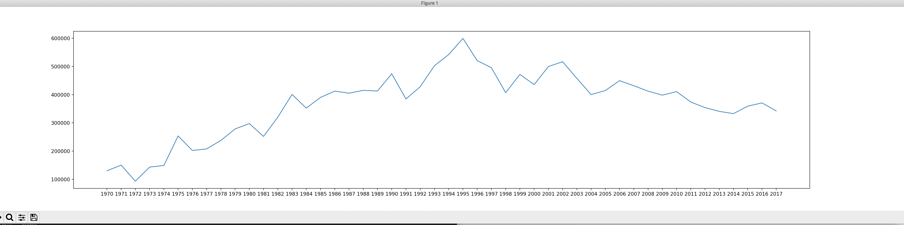
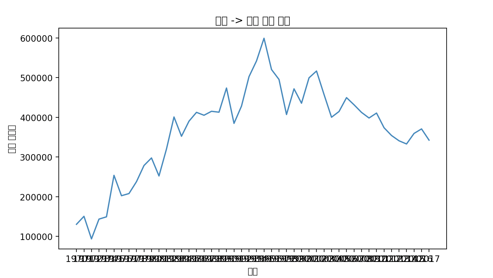
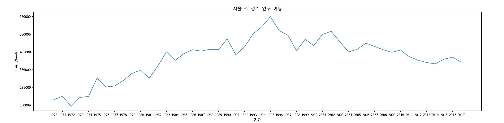
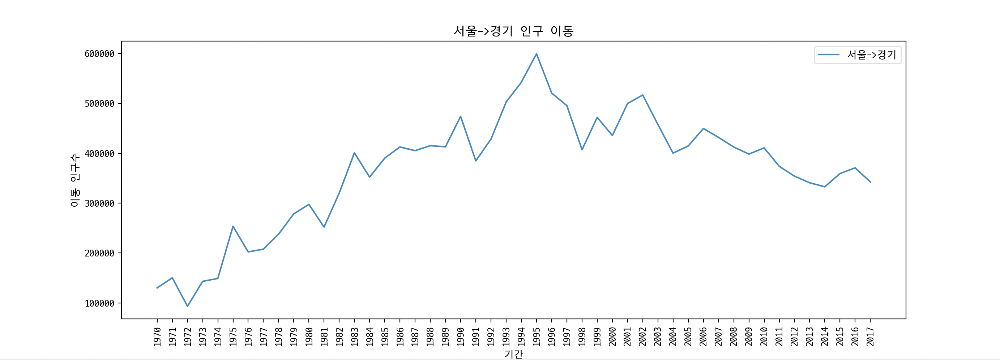
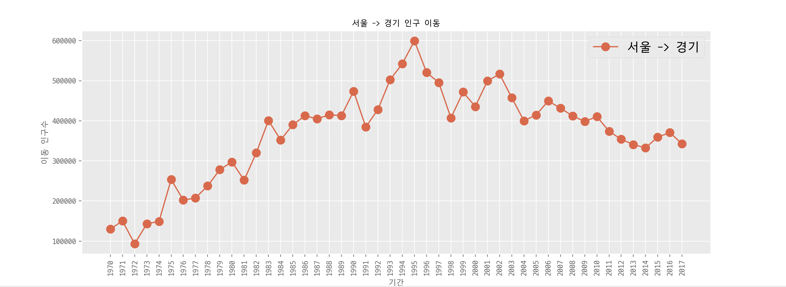
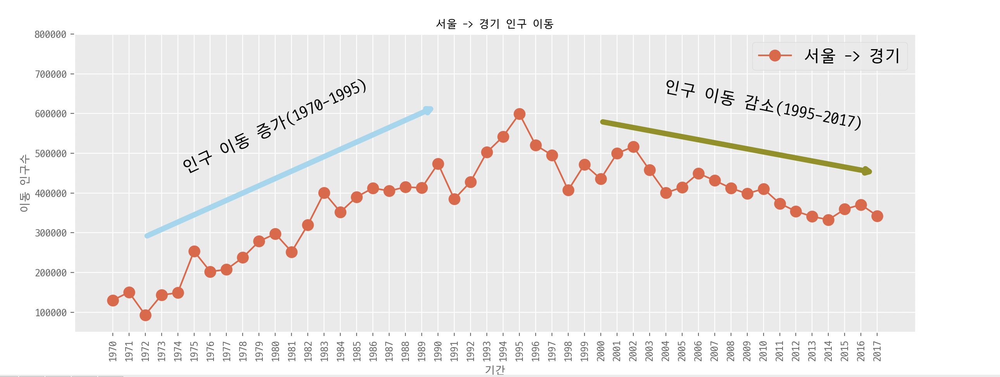
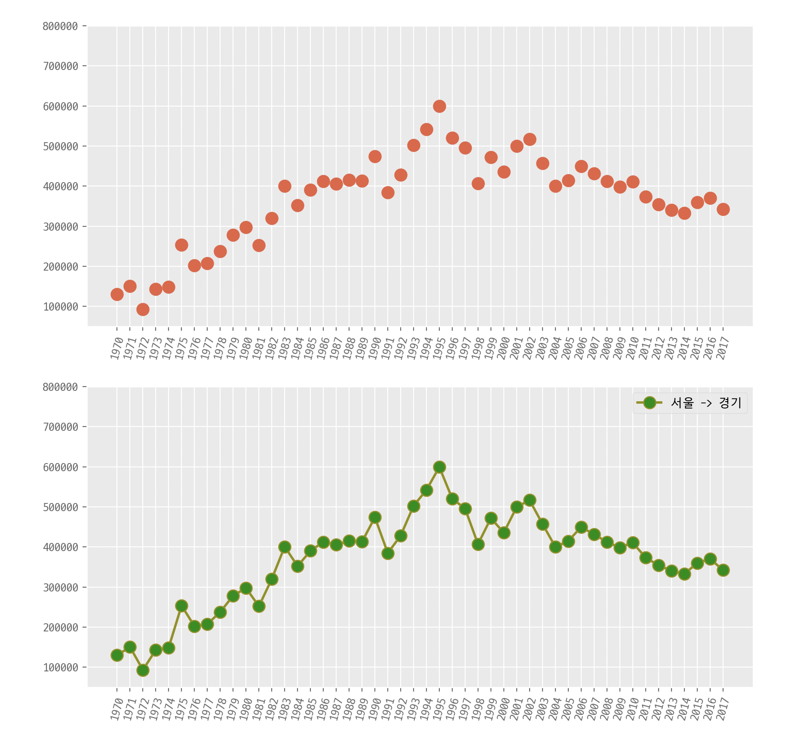
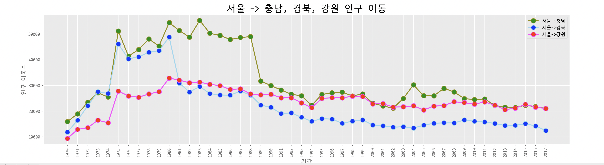
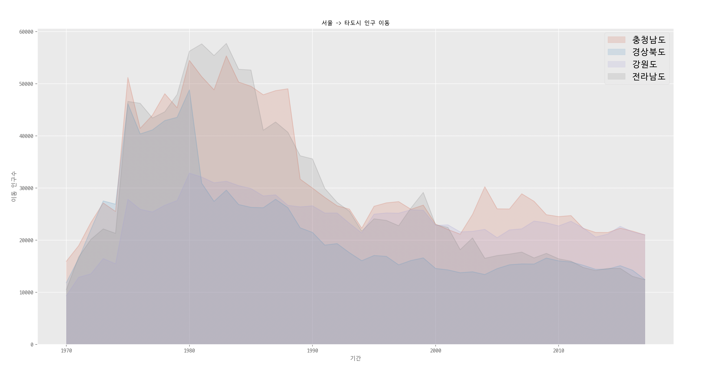
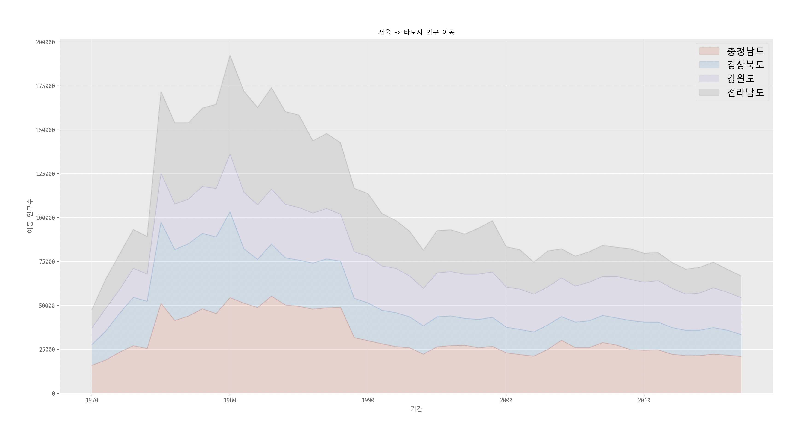

# 시각화 도구

## Matplotlib

데이터 분석시 다루는 데이터의 종류는 매우 다양하며, 크기 또한 방대한 경우가 많다. 시각화를 통해 데이터의 구조와 패턴을 파악하기 용이하며, 다양한 관점에서 데이터에 대한 통찰력을 제공한다.

Matplotlib은 파이썬 표준 시각화 도구라고 부를 수 있을 정도로 2D 평면 그래프에 대한 다양한 포맷과 기능을 제공하고 있다.

```python
import matplotlib.pyplot as plt
```

데이터 시각화에 사용할 matplotlib.pyplot 모듈을 import해 사용한다.

KOSIS의 시도별 전출입 인구수 데이터를 시각화해볼 것이다.

```python
>>> import pandas as pd
>>> import matplotlib.pyplot as plt
>>> df = pd.read_excel('시도별 전출입 인구수.xlsx', fillna=0, header=0)
>>> df.head()
   전출지별   전입지별      1970      1971      1972      1973      1974      1975      1976  ...      2009      2010      2011      2012      2013      2014      2015      2016      2017
0  전출지별   전입지별  이동자수 (명)  이동자수 (명)  이동자수 (명)  이동자수 (명)  이동자수 (명)  이동자수 (명)  이동자수 (명)  ...  이동자수 (명)  이동자수 (명)  이동자수 (명)  이동자수 (명)  이동자수 (명)  이동자수 (명)  이동자수 (명)  이동자수 (명)  이동자수 (명)
1    전국     전국   4046536   4210164   3687938   4860418   5297969   9011440   6773250  ...   8487275   8226594   8127195   7506691   7411784   7629098   7755286   7378430   7154226
2   NaN  서울특별시   1742813   1671705   1349333   1831858   2050392   3396662   2756510  ...   1873188   1733015   1721748   1555281   1520090   1573594   1589431   1515602   1472937
3   NaN  부산광역시    448577    389797    362202    482061    680984    805979    724664  ...    519310    519334    508043    461042    478451    485710    507031    459015    439073
4   NaN  대구광역시         -         -         -         -         -         -         -  ...    398626    370817    370563    348642    351873    350213    351424    328228    321182
```

NaN 데이터가 들어 있는 것을 확인할 수 있다. 누락 데이터는 `method=ffill` 옵션을 사용하면 누락데이터가 들어있는 행의 바로 앞에 위치한 행의 데이터 값을 채울 수 있다.

```python
>>> df = df.fillna(method='ffill')
>>> df.head()
   전출지별   전입지별      1970      1971      1972      1973      1974      1975      1976  ...      2009      2010      2011      2012      2013      2014      2015      2016      2017
0  전출지별   전입지별  이동자수 (명)  이동자수 (명)  이동자수 (명)  이동자수 (명)  이동자수 (명)  이동자수 (명)  이동자수 (명)  ...  이동자수 (명)  이동자수 (명)  이동자수 (명)  이동자수 (명)  이동자수 (명)  이동자수 (명)  이동자수 (명)  이동자수 (명)  이동자수 (명)
1    전국     전국   4046536   4210164   3687938   4860418   5297969   9011440   6773250  ...   8487275   8226594   8127195   7506691   7411784   7629098   7755286   7378430   7154226
2    전국  서울특별시   1742813   1671705   1349333   1831858   2050392   3396662   2756510  ...   1873188   1733015   1721748   1555281   1520090   1573594   1589431   1515602   1472937
3    전국  부산광역시    448577    389797    362202    482061    680984    805979    724664  ...    519310    519334    508043    461042    478451    485710    507031    459015    439073
4    전국  대구광역시         -         -         -         -         -         -         -  ...    398626    370817    370563    348642    351873    350213    351424    328228    321182
```

서울에서 다른 지역으로 이동한 데이터만 추출하여 데이터를 정리할 수 있다.

```python
>>> mask = (df['전출지별'] == '서울특별시') & (df['전입지별'] != '서울특별시')
>>> mask
0      False
1      False
2      False
3      False
4      False
       ...
320    False
321    False
322    False
323    False
324    False
Length: 325, dtype: bool
>>> df_seoul = df[mask]
>>> df_seoul = df_seoul.drop(['전출지별'], axis=1)
>>> df_seoul.rename({'전입지별':'전입지'},axis=1,inplace=True)
>>> df_seoul.set_index('전입지', inplace=True)
>>> df_seoul.head()
          1970     1971     1972     1973     1974     1975     1976     1977     1978  ...     2009     2010     2011     2012     2013     2014     2015     2016     2017
전입지                                                                                     ...
전국     1448985  1419016  1210559  1647268  1819660  2937093  2495620  2678007  3028911  ...  1925452  1848038  1834806  1658928  1620640  1661425  1726687  1655859  1571423
부산광역시    11568    11130    11768    16307    22220    27515    23732    27213    29856  ...    17738    17418    18816    16135    16153    17320    17009    15062    14484
대구광역시        -        -        -        -        -        -        -        -        -  ...    10464    10277    10397    10135    10631    10062    10191     9623     8891
인천광역시        -        -        -        -        -        -        -        -        -  ...    45392    46082    51641    49640    47424    43212    44915    43745    40485
광주광역시        -        -        -        -        -        -        -        -        -  ...    11725    11095    10587    10154     9129     9759     9216     8354     7932
```

## 선 그래프 

그 중 경기도로 이동한 데이터를 추출해 그래프로 그리면 다음과 같다.

```python
>>> sr_one = df_seoul.loc['경기도']
>>> sr_one.head()
1970    130149
1971    150313
1972     93333
1973    143234
1974    149045

Name: 경기도, dtype: object
>>> plt.plot(sr_one.index, sr_one.values)
[<matplotlib.lines.Line2D object at 0x11a80f278>]
>>> plt.show()
```



```python
plt.plot(sr_one)
```

다음과 같이 객체를 전달해도 똑같은 결과를 얻을 수 있다.

### 차트 제목, 축 이름 추가

```python
plt.title('차트제목')
plt.xlabel('x축이름')
plt.ylabel('y축이름')
```

```python
>>> plt.plot(sr_one.index, sr_one.values)
[<matplotlib.lines.Line2D object at 0x11409fe80>]
>>> plt.ylabel('이동 인구수')
Text(0, 0.5, '이동 인구수')
>>> plt.xlabel('기간')
Text(0.5, 0, '기간')
>>> plt.title('서울 -> 경기 인구 이동')
Text(0.5, 1.0, '서울 -> 경기 인구 이동')
>>> plt.show()
```


### 한글 출력 오류



차트 제목과 축 이름을 한글로 설정해 출력하는 경우 다음과 같이 깨지는 경우가 발생할 수 있다.

```python
...
.pyenv/versions/pandas/lib/python3.7/site-packages/matplotlib/backends/backend_agg.py:183: RuntimeWarning: Glyph 44221 missing from current font.
  font.set_text(s, 0, flags=flags)
```

이때는 한글 설정을 해줘야한다. 2가지 방법으로 해결할 수 있는데(mac os기준), 첫번째는 서체관리자에 저장된 폰트로 설정하는 방법이다.

```python
plt.rc('font', family='D2Coding')
print(plt.rcParams['font.family'])
['D2Coding']
```

두번째는 폰트 파일을 직접 불러와 해결하는 방법이다.

```python
from matplotlib import font_manager, rc
font_path = './malgun.ttf'
font_name = font_manager.FontProperties(fname=font_path).get_name()
rc('font',family=font_name)
```

한글 설정 후에 다시 plot을 그리면 정상적으로 노출되는 것을 확인할 수 있다.



### 그래프 꾸미기

- 그래프 가로, 세로 사이즈 설정하기

```python
plt.figure(figsize=(width, height))
```

- x축/y축 범위 지정(최소/최대)

```python
plt.xlim(min, max)
plt.ylim(min, max)
```

- x축/y축 라벨 설정

```python
plt.xticks(rotation='vertical') # 라벨 회전
plt.xticks(size=n) # 폰트 크기 설정

plt.yticks(rotation=n) # n도 만큼 회전
plt.yticks(size=n)# 폰트 크기 설정
```

- 범례

```python
plt.legend(labels=['라벨'],loc='위치')
```

loc는 범례를 어느 위치에 노출시킬 것인지 지정하는 옵션이다. loc='best'는 자동으로 최적의 위치를 계산하여 노출시킨다. 

| Location String | Location Code |
| --------------- | ------------- |
| 'best'          | 0             |
| 'upper right'   | 1             |
| 'upper left'    | 2             |
| 'lower left'    | 3             |
| 'lower right'   | 4             |
| 'right'         | 5             |
| 'center left'   | 6             |
| 'center right'  | 7             |
| 'lower center'  | 8             |
| 'upper center'  | 9             |
| 'center'        | 10            |

```python
>>> plt.figure(figsize=(14,5))
<Figure size 1400x500 with 0 Axes>
>>> plt.xticks(rotation='vertical')
(array([0. , 0.2, 0.4, 0.6, 0.8, 1. ]), <a list of 6 Text major ticklabel objects>)
>>> plt.plot(sr_one.index, sr_one.values)
[<matplotlib.lines.Line2D object at 0x11c2222e8>]
>>> plt.xlabel('기간')
Text(0.5, 0, '기간')
>>> plt.ylabel('이동 인구수')
Text(0, 0.5, '이동 인구수')
>>> plt.title('서울->경기 인구 이동')
Text(0.5, 1.0, '서울->경기 인구 이동')
>>> plt.legend(labels=['서울->경기'],loc='best')
<matplotlib.legend.Legend object at 0x11c1f96d8>
>>> plt.show()
```




#### 스타일 서식 지정

색, 폰트 등 디자인 요소를 변경할 수 있는데, 이는 Matplotlib 실행 환경 설정을 변경하는 것이므로, 다른 파일을 실행할 때도 계속 적용되는 점에 유의한다.

- 테마 설정하기

```python
plt.style.use('테마명')
```

이때 어떤 종류가 있는지 확인 할 수 있다.

```python
>>> print(plt.style.available)
['Solarize_Light2', '_classic_test_patch', 'bmh', 'classic', 'dark_background', 'fast', 'fivethirtyeight', 'ggplot', 'grayscale', 'seaborn', 'seaborn-bright', 'seaborn-colorblind', 'seaborn-dark', 'seaborn-dark-palette', 'seaborn-darkgrid', 'seaborn-deep', 'seaborn-muted', 'seaborn-notebook', 'seaborn-paper', 'seaborn-pastel', 'seaborn-poster', 'seaborn-talk', 'seaborn-ticks', 'seaborn-white', 'seaborn-whitegrid', 'tableau-colorblind10']
```

[https://matplotlib.org/gallery/style_sheets/style_sheets_reference.html](https://matplotlib.org/gallery/style_sheets/style_sheets_reference.html) 에서 어떻게 적용되는지 확인할 수 있다.

- 마커 설정 

```python
plt.plot(x축, 
         y축, 
         marker='O', 			# 마커 모양
         markersize=10, 	# 마커 크기
         markerfacecolor='color', # 마커 색
         linewidth=n, 			# 선 굵기
         color='color'		# 선색상
        ) 
```

| 옵션                    | 설명                              |
| ----------------------- | --------------------------------- |
| 'o'                     | 선 그래프가 아닌 점 그래프로 표현 |
| marker='o'              | 마커 모양('o', '+', '*', '.')     |
| markerfacecolor='color' | 마커 배경색                       |
| markersize=n            | 마커 크기                         |
| color='color'           | 선 색상                           |
| linewidth=n             | 선 두께                           |
| label='text'            | 라벨 지정                         |

사용할 수 있는 색의 종류는 다음 방법으로 확인할 수 있다.

```python
>>> import matplotlib.colors as mat_colors
>>> colors = {}
>>> for name, hex in mat_colors.cnames.items():
...     colors[name]=hex
...
>>> print(colors)
{'aliceblue': '#F0F8FF', 'antiquewhite': '#FAEBD7', 'aqua': '#00FFFF', 'aquamarine': '#7FFFD4', 'azure': '#F0FFFF', 'beige': '#F5F5DC', 'bisque': '#FFE4C4', 'black': '#000000', 'blanchedalmond': '#FFEBCD', 'blue': '#0000FF', 'blueviolet': '#8A2BE2', 'brown': '#A52A2A', ...}
```

```python
import pandas as pd
import matplotlib.pyplot as plt

plt.rc('font', family='D2Coding')

df = pd.read_excel('./시도별 전출입 인구수.xlsx', fillna=0, header=0)
df = df.fillna(method='ffill') # NaN이전 행값과 같은 값으로 채우기

mask = (df['전출지별'] == '서울특별시') & (df['전입지별'] != '서울특별시')

df_seoul = df[mask]


df_seoul = df_seoul.drop(['전출지별'], axis=1)
df_seoul.rename({'전입지별':'전입지'}, axis=1, inplace=True)
df_seoul.set_index('전입지', inplace=True)


sr_one = df_seoul.loc['경기도']

plt.style.use('ggplot') # ggplot 스타일 사용
plt.figure(figsize=(14,5))

plt.xticks(size=10, rotation=90)
plt.plot(sr_one.index, sr_one.values, marker='o', markersize=10)

plt.title('서울 -> 경기 인구 이동', size=10)
plt.xlabel('기간', size=10)
plt.ylabel('이동 인구수', size=10)

plt.legend(labels=['서울 -> 경기'], loc='best', fontsize=15)

plt.show()
```




- 그래프 주석

```python
plt.annotate('', 
               xy=(x1,y1), # 화살표 머리 부분
               xytext=(x2,y2), # 화살표 꼬리 부분
               xycoords='data', # 좌표체계
               arrowprops=() # 화살표 서식
              )

plt.annotate('텍스트', # 텍스트 입력
              xy=(x1,y1), # 텍스트 위치 기준점
              rotation=n,		# 텍스트 회전 각도
              va='baseline',	# 텍스트 상하 정렬
              ha='center',		# 텍스트 좌우 정렬
              fontsize=n,		# 텍스트 크기
              )
```

```python
plt.ylim(50000, 800000) # y축 범위 지정


# 화살표 그리기(주석)
plt.annotate('', 
	xy=(20, 620000), 
	xytext=(2,290000), 
	xycoords='data', 
	arrowprops=dict(arrowstyle='->', color='skyblue',lw=5),
) 

plt.annotate('', 
	xy=(47, 450000), 
	xytext=(30,580000), 
	xycoords='data', 
	arrowprops=dict(arrowstyle='->', color='olive',lw=5),
) 


# 텍스트 표시(주석)
plt.annotate('인구 이동 증가(1970-1995)', # 텍스트 입력
	xy=(10,450000), # 텍스트 위치 기준점
	rotation=25,		# 텍스트 회전 각도
	va='baseline',	# 텍스트 상하 정렬
	ha='center',		# 텍스트 좌우 정렬
	fontsize=15,		# 텍스트 크기
	)

plt.annotate('인구 이동 감소(1995-2017)', # 텍스트 입력
	xy=(40,560000), # 텍스트 위치 기준점
	rotation=-11,		# 텍스트 회전 각도
	va='baseline',	# 텍스트 상하 정렬
	ha='center',		# 텍스트 좌우 정렬
	fontsize=15,		# 텍스트 크기
	)

plt.show()
```





### 화면을 분할해 그래프 여러 개 그리기

화면을 여러개로 분할하고 분할된 각 화면에 서로 다른 그래프를 그릴 수 있다. 한 화면에서 여러개의 그래프를 비교하거나 다양한 정보를 동시에 보여줄 때 사용하면 좋다.

figure() 함수를 사용해 그래프를 그리는 그림틀을 만들고, 그림틀 객체에 add_subplot() 메소드를 적용하여 그림틀을 여러개로 분할할 수 있다. 이때 **나눠진 각 부분을 axe 객체**라고 부른다.

```python
fig = plt.figure(figsize=(w,h))
axe = fig.add_subplot(행, 열, 순서)
```


```python
fig = plt.figure(figsize=(10,10))
axe1 = fig.add_subplot(2, 1, 1)
axe2 = fig.add_subplot(2, 1, 2)

axe1.plot(sr_one, 'o', markersize=10)
axe2.plot(sr_one, marker='o', markerfacecolor='green', markersize=10, color='olive', linewidth=2, label='서울 -> 경기')
axe2.legend(loc='best')

axe1.set_ylim(50000,800000)
axe2.set_ylim(50000,800000)

axe1.set_xticklabels(sr_one.index, rotation=75)
axe2.set_xticklabels(sr_one.index, rotation=75)

plt.show()
```



### 동일한 그래프에 여러 개의 그래프 그리기

같은 axe 객체에 plot()으로 그래프 여러 개를 동시에 그릴 수 있다.

```python
col_years = list(map(str, range(1970, 2018)))
df_3 = df_seoul.loc[['충청남도','경상북도', '강원도'], col_years]

fig = plt.figure(figsize=(20,5))
ax = fig.add_subplot(1,1,1)

ax.plot(col_years, df_3.loc['충청남도',:], marker='o', markerfacecolor='green', markersize=10, color='olive', linewidth=2, label='서울->충남')
ax.plot(col_years, df_3.loc['경상북도',:], marker='o', markerfacecolor='blue', markersize=10, color='skyblue', linewidth=2, label='서울->경북')
ax.plot(col_years, df_3.loc['강원도',:], marker='o', markerfacecolor='red', markersize=10, color='magenta', linewidth=2, label='서울->강원')

ax.legend(loc='best')

ax.set_title('서울 -> 충남, 경북, 강원 인구 이동', size=20)
ax.set_xlabel('기간', size=12)
ax.set_ylabel('인구 이동수', size=12)

ax.set_xticklabels(col_years, rotation=90)

ax.tick_params(axis='x', labelsize=10)
ax.tick_params(axis='y', labelsize=10)

plt.show()
```



## 면적 그래프(area plot)

면적 그래프는 각 열의 데이터를 선 그래프로 구현하며, 선 그래프와 x축 사이의 공간이 색으로 채워진다. 색의 투명도(alpha)는 기본값 0.5로 투과되어 보인다.

이때 그래프를 누적할지 여부를 `stacked=True` 옵션으로 설정할 수 있다. `stacked=False` 로 옵션을 지정하면 각 열의 선 그래프들은 누적되지 않고 서로 겹치도록 표신된다.

```python
df.plot(kind='area', stacked=bool, alpha=n, figsize(w,h))
```

```python
df_4 = df_4.T
df_4.index = df_4.index.map(int)

df_4.plot(kind='area', stacked=False, alpha=0.2, figsize=(20,10))
plt.title('서울 -> 타도시 인구 이동', size=10)
plt.xlabel('기간', size=10)
plt.ylabel('이동 인구수', size=10)

plt.legend(loc='best', fontsize=15)

plt.show()
```





## 참고

- [https://m.blog.naver.com/PostView.nhn?blogId=wideeyed&logNo=221225208497&proxyReferer=https:%2F%2Fwww.google.com%2F](https://m.blog.naver.com/PostView.nhn?blogId=wideeyed&logNo=221225208497&proxyReferer=https:%2F%2Fwww.google.com%2F)
- [파이썬 머신러닝 판다스 데이터 분석](http://digital.kyobobook.co.kr/digital/ebook/ebookDetail.ink?LINK=NVE&category=001&barcode=4808956748337)

