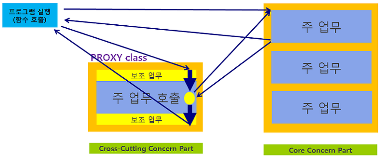

# AOP (2) Proxy

## Proxy란?


Proxy는 사전적의미로 "**대리인**"이라는 뜻이다. java에서의 프록시는 대리를 수행하는 클래스라 생각할 수 있다.

즉, Proxy는 Client가 사용하려고 하는 실재 대상인 것처럼 위장을 해서 클라이언트의 요청을 받아준다. Proxy를 통해 최종적으로 요청을 위임받아 처리하는 실제 오브젝트를 **타겟(target)** or **실체(real subject)**라 부른다.

실제 타겟이 담당하는 역할 요청을 대신받아서 요청 이전, 이후에 대한 추가적인 로직을 할 수 있는 객체이다. 이렇게 하면 실제 타겟이 담당하는 역할에 대해서 관여하지 않으면서 추가적인 역할을 할 수 있기 때문이다.


### Proxy의 특징

1. target과 같은 인터페이스를 구현
2. proxy가 target을 제어할 수 있는 위치에 있다.

##  AOP Proxy



스프링에서 함수 호출자는 주요 업무가 아닌 **보조 업무(공통기능)은 프록시에 맡기고**, 프록시는 내부적으로 이러한 보조업무(공통 기능)을 처리한다.

### 프록시의 호출 및 처리순서

1. Proxy 호출
2. 보조 업무 처리
3. Proxy 처리 함수가 실제 구현 함수 호출 및 주 업무 처리
4. Proxy함수가 나머지 보조 업무 처리
5. 처리 완료 후, 호출함수로 반환


코드를 보면서 살펴보자.

예를들어, 계산기를 구현할 때, 각 함수가 처리되는 시간을 알고 싶다면?

```java
public interface Calculator {

    public int add(int x, int y);
    public int subtract(int x, int y);
    public int multiply(int x, int y);
    public int divide(int x, int y);

}
```

```java
public class myCalculator implements Calculator {
    @Override
    public int add(int x, int y) {
         // 보조 업무 (시간 측정 시작 & 로그 출력)
        Log log = LogFactory.getLog(this.getClass());
        StopWatch sw = new StopWatch();
        sw.start();
        log.info(“Timer Begin”);

        // 주 업무 (덧셈 연산)
   			int sum = x + y; 

        // 보조 업무 (시간 측정 끝 & 측정 시간 로그 출력)
        sw.stop();
        log.info(“Timer Stop – Elapsed Time : ”+ sw.getTotalTimeMillis());

        return sum;
    }

}
```

여기서 보조 업무(시간 측정)이 다른 method에서도 사용하고 싶다면 Proxy를 이용하여 분리할 수 있다.

즉, 주업무(연산)과 보조업무(시간 측정)를 분리(**Cross Cutting**) 하고 보조 업무를 Proxy가 하면된다.

```java
// 보조 업무를 처리할 프록시 클래스 정의
public class LogPrintHandler implements InvocationHandler { 

    private Object target; // 객체에 대한 정보
    
    public LogPrintHandler(Object target) {
        this.target = target;
    }
    
    @Override
    public Object invoke(Object proxy, Method method, Object[] args) throws Throwable   {

        Log log = LogFactory.getLog(this.getClass());
        StopWatch sw = new StopWatch();
        sw.start();
        log.info(“Timer Begin”);

        int result = (int) method.invoke(target, args); // (3) 주업무를 invoke 함수를 통해 호출

        sw.stop();
        log.info(“Timer Stop – Elapsed Time : ”+ sw.getTotalTimeMillis());

        return result;
  }
}
```

InvocationHandler 인터페이스를 구현한 객체는 **invoke** 메소드를 구현해야한다. 해당 객체에 의하여 요청 받은 메소드를 reflection api를 사용하여 실제 타겟이 되는 객체의 메소드를 호출해준다.

```java
public static void main(String[] args) {

    Calculator cal = new myCalculator();

    //(1) 실제 객체를 핸들러를 통해서 전달
    Calculator proxy_cal = (Calculator) Proxy.newProxyInstance( 
        cal.getClass().getClassLoader(),
        cal.getClass().getInterfaces(), 
        new LogPrintHandler(cal));

    System.out.println(proxy_cal.add(3, 4));    // (2) 주 업무 처리 클래스의 add 메서드를 호출
}
```

```java
Calculator proxy_cal = (Calculator) Proxy.newProxyInstance( 
            // 동적으로 생성되는 DynamicProxy 클래스의 로딩에 사용할 클래스 로더
                cal.getClass().getClassLoader(),
            // 구현할 인스턴스
                cal.getClass().getInterfaces(), 
            // 부가기능과 위임 코드를 담은 핸들러
                new LogPrintHandler(cal));
```

1.  main함수에서 실제 객체를 핸들러를 통해서 전달해준다.
2. 주 업무 클래스의 메서드를 호출하게 되면 프록시 클래스(LogPrintHandler)의 invoke 메소드가 호출되어 자신의 보조 업무를 처리하고, 주 업무의 메서드를 호출한다.
3. invoke()는 메소드를 실행시킬 대상 객체와 파라미터 목록을 받아 메소드를 호출한 뒤에 그 결과를 Object 타입으로 돌려준다.

다음과 같이 AOP를 구현하기 위해 사용되는 Proxy에는 다음과 같은 단점이 있다.

1. **매번 새로운 클래스 정의가 필요**하다.
   - 실제 프록시 클래스는 실제 구현 클래스와 동일한 형태를 가지고 있으므로, 구현 클래스의 Interface를 모두 구현해야한다.
2. **타겟의 인터페이스를 구현하고 위임하는 코드 작성**
   - 부가 기능이 필요없는 메소드도 구현하여 타겟으로 위임하는 코드를 일일이 만들어줘야한다.
   - 인터페이스의 메소드가 많아지고 다양해지면 부담스러운 작업이 될 수 있다.
   - 타겟 인터페이스의 메소드가 추가되거나 변경될 때마다 함께 수정해줘야한다.
3. **부가기능 코드의 중복 가능성**
   - 프록시를 활용하는 부가기능, 접근제어 기능 등은 일반적으로 자주 활용되는 것이 많다. 즉, 다양한 타겟 클래스와 메소드에 중복되어 나타날 가능성이 많다.(ex) **Transaction**

이를 해결하기 위해서는 Dynamic Proxy를 구현하면된다.


## 참조 페이지

- [http://ooz.co.kr/205?category=818548](http://ooz.co.kr/205?category=818548)
- [http://wonwoo.ml/index.php/post/1576](http://wonwoo.ml/index.php/post/1576)
- [http://ooz.co.kr/201?category=818548 ](http://ooz.co.kr/201?category=818548 )
- [http://private.tistory.com/43](http://private.tistory.com/43)