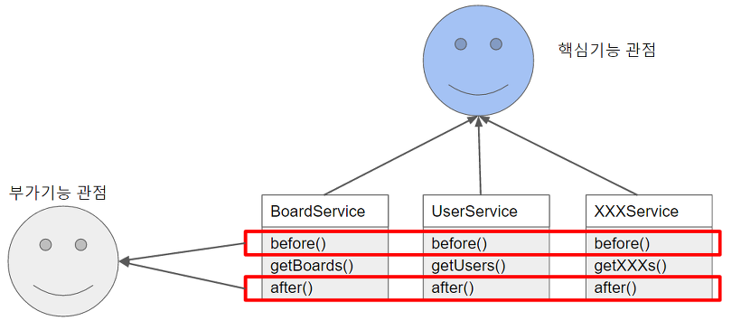
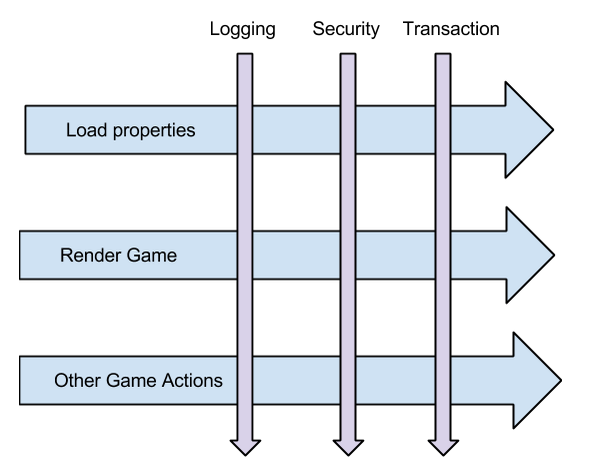
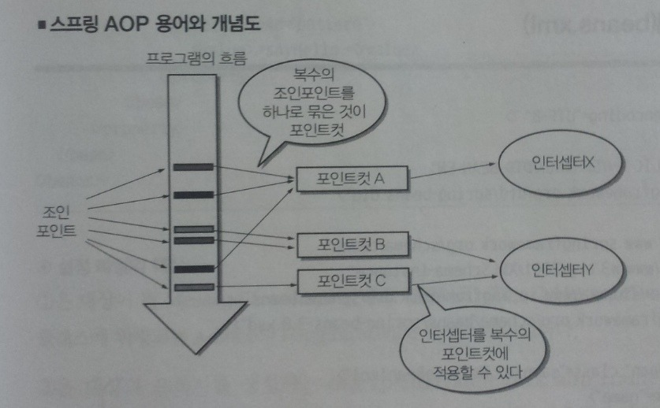
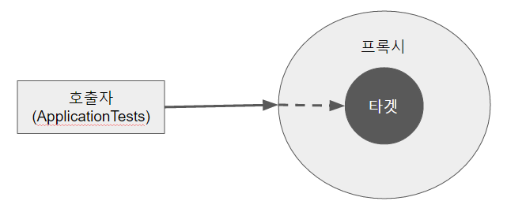

# AOP(1)

AOP(**A**spect **O**riented **P**rogramming)는 기능을 핵심 비즈니스 로직과 공통모듈(보안인증, 로깅 등)로 구분하고, 핵심 로직에 영향을 미치지 않고 사이사이에 공통모듈을 효과적으로 잘 활용하는 방법이다. 

**코드 밖에서 설정** 된다는 것이 핵심이며, 애플리케이션 전체에 걸쳐 **사용되는 기능을 재사용**할 수 있다는 장점이 있다.

핵심기능의 관점에서 보았을 때, BoardService, UserService, XXXService는 공통된 요소가 없다. 하지만, 이 관점을 부가기능 관점에서 바라보면 각각의 Service는 수행시간을 측정하는 before()와 after()가 공통적으로 사용되는 것을 볼 수 있다.

즉, AOP는 기존에 OOP에서 바라보던 관점을 **부가적인 측면에서 보았을 때 공통적인 측면을 추출하자는 것이다.** 이때, 가로(횡단) 영역의 공통된 부분을 잘랐다고 하여 **Cross-Cutting** 이라 부르기도 한다.

### AOP가 사용되는 경우

1. 간단한 메소드 성능 검사
   - DB에 다량의 데이터를 넣고 빼는 등의 **배치 작업에 대한 시간 측정**
2. Transaction 처리
   - 매번 `try catch` 문의 코드는 번거롭고 소스를 더욱 복잡하게 한다.
3. 예외반환
   - 구조가 좋지 않은 예외가 발생하였을때 잘 정의되어 있는 예외 계층 구조로 변환하고 싶은 경우
4. 아키텍처 검증
5. 기타(로깅, 보안)

### AOP 용어

| AOP 용어     | 설명                                                         |
| ------------ | ------------------------------------------------------------ |
| Target(타겟) | Aspect(부가기능)을 부여할 대상으로 **핵심 기능을 담당**      |
| Aspect       | **부가기능 모듈**, 핵심기능에 부가되어 의미를 갖는 특별한 모듈 Advice + PointCut으로 이루어져있다. JoinPoint를 기준으로 인터셉터 체인이 유지되므로, **하나의 조인포인트에 여러 개의 advice 적용 가능** |
| Advice       | **실질적으로 부가 기능을 담은 구현체**이다. 특정 JoinPoint에 Aspect가 **수행하는 행위**로서 @around, @before, @after 등 다양한 타입이 존재한다. Target에 종속되지 않기 때문에 순수하게 부가 기능에만 집중할 수 있다. |
| JoinPoint    | **Advice가 적용될 수 있는 위치** (끼어들 수 있는 지점. 메소드 진입 지점, 생성자 호출 시점, 필드에서 값을 꺼내올 때 등) 다양한 시점에 적용가능 |
| PointCut     | Advice(부가 기능)가 적용될 대상(JoinPoint)를 선정하는 방법을 정의한 모듈 **JointPoint의 상세한 스펙을 정의한 것.** 'A란 메서드의 진입 시점에 호출할 것'과 같이 더욱 구체적으로 Advice가 실행될 지점을 정할 수 있음 스프링에서는 정규 표현식이나 AspectJ의 문법을 이용하여 Poincut을 재정의 할 수 있다. |
| Proxy        | Target을 감싸 Target의 요청을 대신 받아주는 Wrapping Object이다. 호출자에서 타겟을 호출하게되면 타겟이 아닌 프록시가 호출되어, 타겟 메소드 실행전 선처리→타겟 메소드→후처리를 실행한다. |
| Introduction | 타겟 클래스에 코드 변경없이 신규 메소드, 멤버 변수 추가가 가능 |
| Weaving      | Aspect와 대상이 되는 핵심 코드를 연결하는 프로세스. 즉, **Advice(공통코드)를 핵심로직코드에 삽입하는 것** 지정된 객체에 Aspect를 적용해 새로운 Proxy 객체를 생성하는 과정 사용하는 AOP 프레임워크에 따라서 컴파일타임, 로드 타임, 런타임 시점으로 프로세스가 실행되는 시점이 다르다. |

### Spring AOP 특징

1. **프록시 패턴 기반의 AOP 구현체**이다. Proxy를 사용하는 이유는 접근 제어 및 부가기능을 추가하기 위해서이다.
2. **Spring Bean에만 AOP 적용가능**
3. 모든 AOP 기능을 제공하는 것이 아닌 스프링 컨테이너와 연동하여 가장 흔한 문제(중복코드, 프록시 클래스 작성의 번거로움, 객체들 간 관계 복잡도 증가)에 대한 해결책을 지원하는 것이 목적

## 참조

- [https://jojoldu.tistory.com/71](https://jojoldu.tistory.com/71)
- [http://isstory83.tistory.com/90](http://isstory83.tistory.com/90)
- [http://addio3305.tistory.com/86](http://addio3305.tistory.com/86)
- [http://private.tistory.com/43](http://private.tistory.com/43)
- [https://steemkr.com/kr-dev/@nhj12311/aop-jdk-dynamic-proxy-java-aop-2](https://steemkr.com/kr-dev/@nhj12311/aop-jdk-dynamic-proxy-java-aop-2)