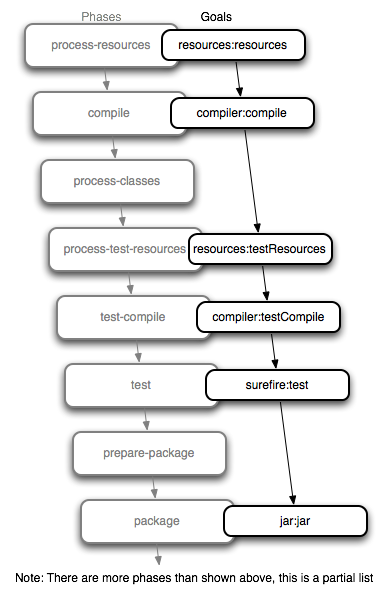

# Maven

```
Apache Maven은 자바용 프로젝트 관리도구로 Apache Ant의 대안으로 만들어졌다. Apache License로 배포되는 오픈 소스 소프트웨어
```

프로젝트를 진행하게 되면 많은 라이브러리들을 활용해서 개발을 하게된다. 이 때 사용되는 라이브러리들의 수가 수십개가 훌쩍 넘어버리는 일이 발생해 관리하기가 힘들어지는 경우가 발생한다. **Maven은 내가 사용할 라이브러리 뿐만 아니라 해당 라이브러리가 작동하는데에 필요한 다른 라이브러리들까지 관리하여 네트워크를 통해서 자동으로 다운**받아 준다.
Maven은 프로젝트의 전체적인 라이프 사이클을 관리하는 도구로 다음과 같은 장점이 있다.

1.  라이브러리의 관리를 매우 용이하게 해준다.

2. 프로젝트의 작성부터 compile, phase 등 프로젝트 라이프사이클에 포함되는 각 테스트를 지원해준다.

3. war파일 기반의 배포용으로도 자주 사용된다.

> war 이란?
> WAR(Web application ARchive, 웹 애플리케이션 아카이브) 파일은 소프트웨어 공학에서 자바서버 페이지, 자바 서블릿, 자바 클래스, XML, 파일, 태그 라이브러리, 정적 웹 페이지 (HTML 관련 파일) 및 웹 애플리케이션을 함께 이루는 기타 자원을 한데 모아 배포하는데 사용되는 JAR 파일이다.

## LifeCycle



maven에서는 **미리 정의하고 있는 빌드 순서가 있으며 이 순서를 라이프사이클(Lifecycle)**이라고 하며, 라이프 사이클의 **각 빌드 단계를 Phase**라고 한다. 또한 이런 각 Phase들은 의존 관계를 가지고 있어 해당 Phase가 수행되려면 이전 단계의 Phase가 모두 수행되어야 한다.

메이븐에서 제공되는 모든 기능은 플러그인을 기반으로 동작해 메이븐은 라이프사이클에 포함되어있는 Phase마저도 플러그인을 통하여 실질적인 작업이 수행된다. **즉 각각의 Phase는 어떤 일을 할지 정의하지 않고 어떤 플러그인의 Goal을 실행할지 설정**한다.

메이븐에서는 하나의 플러그인에서 여러 작업을 수행할 수 있도록 지원하며, **플러그인에서 실행할 수 있는 각각의 기능(명령)을 goal**이라고 한다.


| 각 단계   | 설명                                                         |
| --------- | ------------------------------------------------------------ |
| **Clean** | 이전 빌드에서 생성된 파일들을 삭제하는 단계                  |
| Validate  | 프로젝트가 올바른지 확인하고 필요한 모든 정보를 사용할 수 있는지 확인하는 단계 |
| Compile   | 프로젝트의 소스코드를 컴파일 하는 단계                       |
| Test      | 유닛(단위) 테스트를 수행 하는 단계(테스트 실패시 빌드 실패로 처리, 스킵 가능) |
| Pacakge   | 실제 컴파일된 소스 코드와 리소스들을 jar등의 배포를 위한 패키지로 만드는 단계 |
| Verify    | 통합 테스트 결과에 대한 검사를 실행하여 품질 기준을 충족하는지 확인하는 단계 |
| Install   | 패키지를 로컬 저장소에 설치하는 단계                         |
| **Site**  | 프로젝트 문서를 생성하는 단계                                |
| Deploy    | 만들어진 package를 원격 저장소에 release 하는 단계           |

일반적으로 메이븐은 Clean, Default(Build), Site 표준 라이프사이클을 지원한다.

- Default(Build)는 일반적인 빌드 프로세스를 위한 모델

각 단계를 모두 수행하는것이 아니라 원하는 단계까지만 수행할 수도 있으며 test 단계는 큰 프로젝트의 경우에 몇시간이 소요될수도 있으니 수행하지 않도록 스킵이 가능하다.


## POM


POM은 Project Object Model의 약자로 POM의 정보를 담고 있는 파일이다.

- 프로젝트 정보 : 프로젝트의 이름, 개발자 목록, 라이센스 등

- 빌드 설정 : 소스, 리소스, 라이프 사이클별 실행한 플러그인(goal)등 빌드와 관련된 설정

- 빌드 환경 : 사용자 환경 별로 달라질 수 있는 프로파일 정보

- POM 연관 정보 : 의존 프로젝트(모듈), 상위 프로젝트, 포함하고 있는 하위 모듈 등

다음과 같은 정보를 담고 있으며, `pom.xml` 에 필요한 라이브러리를 정의해 놓으면 Maven은 네트워크를 통해 해당 라이브러리를 다운받는다.

## Maven Wrapper

Maven을 사용하기위해서는 Maven을 설치하고, 환경변수 설정을 해줘야한다.


이때 `mvnw`, `mvnw.cmd` 이 있으면 maven을 따로 설치하지 않고도 사용가능하다.

mvnw는 maven wrapper의 약자로, **Maven이 설치되어있지 않는 환경에서도 Maven을 사용할 수 있도록 해주는 도구**이다. Maven의 버전 관리를 해주며, 만약 버전 정보를 명시하지 않으면 최신 버전으로 설정하며, 명시된 버전이 있으면 해당 버전의 Maven을 사용할 수 있다.

- mvnw : Maven을 설치하지 않아도 Maven을 실행시킬 수 있도록 해주는 유닉스 shell script

- mvnw.cmd : 위 스크립트의 배치 버전

### mvnw 실행하기

```shell
$ ./mvnw clean package
```


## 참조문서

- [https://mangkyu.tistory.com/8](https://mangkyu.tistory.com/8)
- [박스여우 - BoxFox](https://boxfoxs.tistory.com/324)
- [빨간색 코딩 - maven (메이븐 구조, 차이점, 플러그인, 라이프사이클, 의존성, pom.xml)](https://sjh836.tistory.com/131)
- [코기의 야근 - [Maven] mvnw, mvnw.cmd란?](https://m.blog.naver.com/PostView.nhn?blogId=ksw6169&logNo=221501516240&proxyReferer=https%3A%2F%2Fwww.google.com%2F)