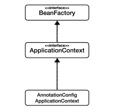
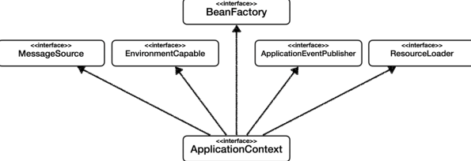
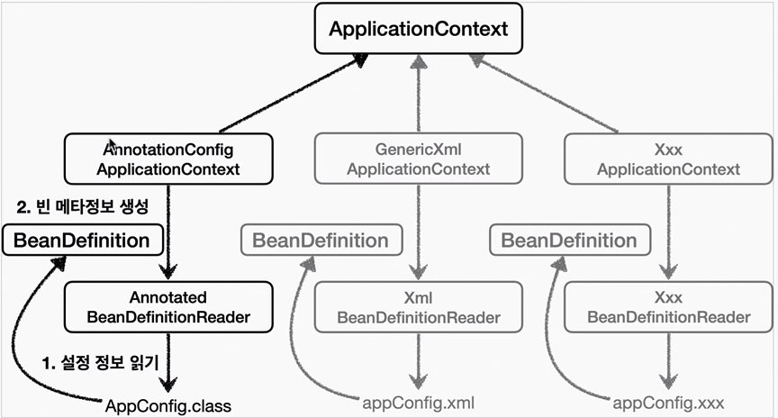

# Inversion of Control

IoC는 **Inversion of Control**의 약자로 제어의 역전이라는 의미이다. 제어의 역전이란 프로그램의 제어 흐름 구조가 뒤바뀌는 것이라 설명할 수 있다. IoC에서는 오브젝트가 자신이 사용할 오브젝트를 스스로 선택하거나 생성하지 않는다. 또한, 자신도 어떻게 만들어지고 어디서 사용되는지를 알 수 없다. **모든 제어 권한을 자신이 아닌 다른 대상에게 위임**하기 때문이다.

서블릿도 제어의 역전 개념이 적용되어있다고 볼 수 있다. 
일반적으로는 `main()` 메소드에서 시작해 개발자가 미리 정한 순서를 따라 오브젝트가 생성되고 실행된다. 하지만 서블릿은 실행을 개발자가 직접 제어할 수 있는 방법은 없다. 대신 서블릿에 대한 제어 권한을 가진 컨테이너가 적절한 시점에 서블릿 오브젝트를 만들고 그 안의 메소드를 호출한다.

프레임워크도 제어의 역전 개념이 적용된 대표 기술이다. 프레임워크는 애플리케이션 코드가 프레임워크에 의해 사용된다. 프레임워크가 흐름을 주도하는 중에 개발자가 애플리케이션 코드를 사용하도록 만든 구조이다.

## 프레임워크 vs 라이브러리

- 프레임워크가 내가 작성한 코드를 제어하고, 실행을하면 그것은 프레임워크이다.(ex. Junit)
- 내가 작성한 코드가 **직접 제어의 흐름을 담당**한다면 그것은 프레임워크가 아니라 **라이브러리**다. (ex. Java to Xml)

## Spring의 IoC 용어


- bean : **스프링이 IoC 방식으로 관리하는 오브젝트 or 관리되는 오브젝트**이다.
  ( 스프링이 직접 그 생성과 제어를 담당하는 오브젝트만을 빈이라고 부른다. )
- bean factory :  스프링의 IoC를 담당하는 **핵심 컨테이너로 빈을 등록, 생성, 조회, 반환과 같은 기능을 담당**한다. 보통 빈 팩토리를 확장한 Application Context를 사용한다.
- application context : **bean factory를 확장한 IoC 컨테이너**다.  bean factory에 추가로 스프링이 제공하는 각종 부가 서비스를 추가한다. 즉, **애플리케이션 지원 기능을 모두 포함해서 이야기하는 것**이라고 보면된다.
- Configuration metadata(설정/설정 메타 정보) : application context 또는 bean factory가 **IoC를 적용하기 위해 사용하는 메타정보**를 말한다. 보통 IoC 컨테이너에 의해 관리되는 애플리케이션 오브젝트를 생성하고 구성할 때 사용
  - `@Configuration` 어노테이션으로 설정
- IoC container(DI container) : IoC방식으로 빈을 관리한다는 뜻에서 application context나 bean factory를 그렇게 부른다. **IoC container는 빈 팩토리 관점에서 이야기 하는 것이며, 그냥 컨테이너 혹은 스프링 컨테이너라고 할때는 application context를 가리키는 것이라고 보면된다**.
- spring framework : IoC container, application context를 포함해서 스프링이 제공하는 모든 기능을 통틀어 말할때 주로 사용

> Factory는 객체의 생성 방법을 결정하고 그렇게 만들어진 Object를 돌려주는 역할을 하는 클래스이다. Factory는 단지 오브젝트를 생성하는 쪽과 생성된 오브젝트를 사용하는 쪽의 역할과 책임을 깔끔하게 분리하려는 목적으로 사용하는 것이다.

```java
package springbook.user.dao;

import org.springframework.context.annotation.Bean;
import org.springframework.context.annotation.Configuration;

@Configuration
public class DaoFactory {
	@Bean
	public UserDao userDao() {
		UserDao dao = new UserDao(connectionMaker());
		return dao;
	}

	@Bean
	public ConnectionMaker connectionMaker() {
		ConnectionMaker connectionMaker = new DConnectionMaker();
		return connectionMaker;
	}
}
```

- `@Configuration` : applicatoin context 또는 bean factory가 사용할 **설정정보**라는 어노테이션
- `@Bean` : **오브젝트 생성을 담당하는 IoC용 메소드**라는 표시

```java
import java.sql.SQLException;
import org.springframework.context.annotation.AnnotationConfigApplicationContext;
import org.springframework.context.ApplicationContext;
import springbook.user.domain.User;

public class UserDaoTest {
	public static void main(String[] args) throws ClassNotFoundException, SQLException {

		// applicationContext는 스프링 컨테이너이며, 인터페이스다.(다형성)
    // AnnotationConfigApplicationContext은 구현
		ApplicationContext applicationContext = new AnnotationConfigApplicationContext(DaoFactory.class);
		UserDao dao = context.getBean("userDao", UserDao.class);

		User user = new User();
		user.setId("testId");
		user.setName("testName");
		user.setPassword("testtest");

		dao.add(user);			
	}
}

```

`AnnotationConfigApplicationContext` 는 `@Configuration`(어노테이션 기반) 이 붙은 자바 코드를 설정정보로 사용할때 사용하면된다.


ApplicationContext는 DaoFactory 클래스를 설정정보로 등록해두고 `@Bean`이 붙은 메소드 이름을 가져와 빈 목록을 만들어 둔다. 

클라이언트가 ApplicationContext를 getBean()메소드를 호출하면 자신의 빈 목록에서 요청한 이름이 있다면 빈을 생성하는 메소드를 호출해 오브젝트를 생성한 후 반환한다.

ApplicationContext는 또한 싱글톤을 저장하고 관리하는 Singleton Registry이기도 하다. **스프링은 기본적으로 별다른 설정을 하지 않으면 내부에서 생성하는 빈 오브젝트를 모두 싱글톤**으로 만든다.

스프링은 서버 환경에서 싱글톤이 만들어져 서비스 오브젝트 방식으로 사용되는 것은 적극 지지한다. 하지만 자바의 기본적인 싱글톤 패턴의 구현 방식은 여러가지 단점이 있기때문에 스프링은 직접 싱글톤 형태의 오브젝트를 만들고 관리하는 기능을 제공한다.

Singleton Registry의 장점은 평범한 자바 클래스이더라도 IoC방식의 컨테이너를 사용해 생성과 관계설정, 사용 등에 대한 제어권을 손쉽게 싱글톤 방식으로 만들어져 관리되게 할 수 있다. 그렇기 때문에 테스트 환경에서도 자유롭게 오브젝트를 만들 수 있고, 테스트를 위한 목적으로 오브젝트를 대체하는 것도 간단하다.

싱글톤이 멀티스레드 환경에서 서비스 형태의 오브젝트로 사용되는 경우에는 stateless 방식으로 만들어져야한다. 이때는 읽기전용 값이라면 초기화 시점에 인스턴스 변수에 저장해두고 공유하는 것은 문제 없다. 만약 각 요청에 대한 정보나, DB 서버의 리소스로 부터 생성한 정보는 파라미터와 로컬 변수, 리턴 값을 이용하면 된다. 메소드 파라미터나, 메소드 안에서 생성되는 로컬 변수는 매번 새로운 값을 저장할 독립적인 공간이 만들어지기 때문에 싱글톤이라고 해도 문제없다.

### 등록된 빈 확인하기

실제로 개발시 아래 테스트 코드는 사용할 상황은 거의 없으나 아래 두가지 경우에 대비해 알아두는 것이 좋다.

- 순수한 자바 애플리케이션에서 스프링 컨텍스트를 생성하여 사용해야하는 경우
- 자동 의존 관계 주입시 이해를 위해

#### 모든 빈 가져오기

```java
package dh0023.springcore.beanfind;

import dh0023.springcore.config.AppConfig;
import org.junit.jupiter.api.DisplayName;
import org.junit.jupiter.api.Test;
import org.springframework.beans.factory.config.BeanDefinition;
import org.springframework.context.annotation.AnnotationConfigApplicationContext;

class ApplicationContextInfoTest {

    AnnotationConfigApplicationContext ac = new AnnotationConfigApplicationContext(AppConfig.class);


    @Test
    @DisplayName("모든 빈 출력하기")
    void findAllBean() {

        String[] beanDefinitionNames = ac.getBeanDefinitionNames();

        for(String beanDefinitionName : beanDefinitionNames){
            Object bean = ac.getBean(beanDefinitionName);
            System.out.println("name = " + beanDefinitionName + "object = " + bean);
        }
    }

    @Test
    @DisplayName("애플리케이션 빈 출력하기")
    void findApplicationBean() {

        String[] beanDefinitionNames = ac.getBeanDefinitionNames();

        for(String beanDefinitionName : beanDefinitionNames){
            BeanDefinition beanDefinition = ac.getBeanDefinition(beanDefinitionName);

            // BeanDefinition.ROLE_APPLICATION : 애플리케이션을 개발하기위해 직접 등록한 빈들(or 외부 라이브럴)
            // BeanDefinition.ROLE_INFRASTRUCTURE : 스프링 내부에서 사용하는 빈
            if (beanDefinition.getRole() == BeanDefinition.ROLE_APPLICATION) {
                Object bean = ac.getBean(beanDefinitionName);
                System.out.println("name = " + beanDefinitionName + " object = " + bean);
            }

        }
    }
}

```

#### 빈 이름 / 빈 타입으로 조회

```java
package dh0023.springcore.beanfind;

import dh0023.springcore.config.AppConfig;
import dh0023.springcore.member.service.MemberService;
import dh0023.springcore.member.service.MemberServiceImpl;
import org.junit.jupiter.api.DisplayName;
import org.junit.jupiter.api.Test;
import org.springframework.beans.factory.NoSuchBeanDefinitionException;
import org.springframework.context.annotation.AnnotationConfigApplicationContext;

import static org.assertj.core.api.Assertions.*;
import static org.junit.jupiter.api.Assertions.*;

public class ApplicationContextBasicFindTest {

    AnnotationConfigApplicationContext ac = new AnnotationConfigApplicationContext(AppConfig.class);

    @Test
    @DisplayName("빈 이름으로 조회")
    void findBeanByName() {
        MemberService memberService = ac.getBean("memberService", MemberService.class);
        assertThat(memberService).isInstanceOf(MemberServiceImpl.class);
    }


    @Test
    @DisplayName("이름없이 타입으로만 조회")
    void findBeanByType() {
        // 타입으로만 조회하면, 타입이 겹치는 경우에 문제가 있다.
        MemberService memberService = ac.getBean(MemberService.class);
        assertThat(memberService).isInstanceOf(MemberServiceImpl.class);
    }

    @Test
    @DisplayName("구체 타입으로 조회")
    void findBeanByName2() {

        // 역할과 구현을 구분하고, 역할에 의존해야한다.
        // 하지만 구체 타입으로 조회하는건 구현에 의존하는 것이므로 좋은 방식은 아니다.
        MemberService memberService = ac.getBean("memberService", MemberServiceImpl.class);
        assertThat(memberService).isInstanceOf(MemberServiceImpl.class);
    }

    @Test
    @DisplayName("빈 이름으로 조회X")
    void findBeanByNameX() {

//      ac.getBean("xxxxx", MemberService.class);

        // org.springframework.beans.factory.NoSuchBeanDefinitionException: No bean named 'xxxxx' available
        // lambda 실행히 왼쪽 Exception이 수행되어야한다.
        assertThrows(NoSuchBeanDefinitionException.class, () -> ac.getBean("xxxxx", MemberService.class));

    }
}

```

#### 같은 타입이 둘 이상인 경우 조회

```java
package dh0023.springcore.beanfind;

import dh0023.springcore.member.repository.MemberRepository;
import dh0023.springcore.member.repository.MemoryMemberRepository;
import org.junit.jupiter.api.DisplayName;
import org.junit.jupiter.api.Test;
import org.springframework.beans.factory.NoUniqueBeanDefinitionException;
import org.springframework.context.annotation.AnnotationConfigApplicationContext;
import org.springframework.context.annotation.Bean;
import org.springframework.context.annotation.Configuration;

import java.util.Map;

import static org.assertj.core.api.Assertions.*;
import static org.junit.jupiter.api.Assertions.*;

public class ApplicationContextSameBeanFindTest {

    AnnotationConfigApplicationContext ac = new AnnotationConfigApplicationContext(SameBeanConfig.class);

    @Test
    @DisplayName("타입으로 조회시 같은 타입이 둘 이상 있으면, 중복 오류 발생")
    void findBeanByTypeDuplicate() {
        // org.springframework.beans.factory.NoUniqueBeanDefinitionException: No qualifying bean of type 'dh0023.springcore.member.repository.MemberRepository' available: expected single matching bean but found 2: memberRepository,memberRepository2
        assertThrows(NoUniqueBeanDefinitionException.class, () -> ac.getBean(MemberRepository.class));
    }

    @Test
    @DisplayName("타입으로 조회시 같은 타입이 둘 이상 있으면, 빈 이름 지정하여 해결")
    void findBeanByName() {
        MemberRepository memberRepository = ac.getBean("memberRepository", MemberRepository.class);
        assertThat(memberRepository).isInstanceOf(MemberRepository.class);
    }

    @Test
    @DisplayName("특정 타입의 빈 모두 조회")
    void findAllBeanByType() {
        Map<String, MemberRepository> beansOfType = ac.getBeansOfType(MemberRepository.class);

        for (String key : beansOfType.keySet()) {
            System.out.println("key = " + key + " value = " + beansOfType.get(key));
        }
        System.out.println("beansOfType = " + beansOfType);

        assertThat(beansOfType.size()).isEqualTo(2);

    }

    /**
     * ApplicationContextSameBeanFindTest안에서만 테스트 용도로 사용할 Class
     */
    @Configuration
    static class SameBeanConfig {

        @Bean
        public MemberRepository memberRepository() {
            return new MemoryMemberRepository();
        }

        @Bean
        public MemberRepository memberRepository2() {
            return new MemoryMemberRepository();
        }

    }
}
```

#### 상속 관계

부모 타입으로 스프링 빈 조회시, 자식 타입도 함께 조회한다. 그러므로 자바 객체의 초상위 객체인 `Object` 로 조회시, 모든 스프링 빈을 조회한다.

```java
package dh0023.springcore.beanfind;

import dh0023.springcore.discount.service.DiscountPolicy;
import dh0023.springcore.discount.service.FixDiscountPolicy;
import dh0023.springcore.discount.service.RateDiscountPolicy;
import org.junit.jupiter.api.DisplayName;
import org.junit.jupiter.api.Test;
import org.springframework.beans.factory.NoUniqueBeanDefinitionException;
import org.springframework.context.annotation.AnnotationConfigApplicationContext;
import org.springframework.context.annotation.Bean;
import org.springframework.context.annotation.Configuration;

import java.util.Map;

import static org.assertj.core.api.Assertions.*;
import static org.junit.jupiter.api.Assertions.*;

public class ApplicationContextExtendsFindTest {
    AnnotationConfigApplicationContext ac = new AnnotationConfigApplicationContext(TestConfig.class);

    @Test
    @DisplayName("부모 타입으로 조회시, 자식이 둘 이상 있으면, 중복 오류 발생")
    void findBeanByParentTypeDuplicate() {
        // org.springframework.beans.factory.NoUniqueBeanDefinitionException: No qualifying bean of type 'dh0023.springcore.discount.service.DiscountPolicy' available: expected single matching bean but found 2: rateDiscountPolicy,fixDiscountPolicy
//        DiscountPolicy discountPolicy = ac.getBean(DiscountPolicy.class);

        assertThrows(NoUniqueBeanDefinitionException.class, () -> ac.getBean(DiscountPolicy.class));
    }

    @Test
    @DisplayName("부모 타입으로 조회시, 자식이 둘 이상 있으면, 빈 이름을 지정하면 된다.")
    void findBeanByParentTypeBeanName() {
        DiscountPolicy discountPolicy = ac.getBean("rateDiscountPolicy", DiscountPolicy.class);

        assertThat(discountPolicy).isInstanceOf(RateDiscountPolicy.class);
    }

    @Test
    @DisplayName("특정 하위 타입으로 조회")
    void findBeanBySubType() {
        RateDiscountPolicy rateDiscountPolicy = ac.getBean(RateDiscountPolicy.class);
        assertThat(rateDiscountPolicy).isInstanceOf(RateDiscountPolicy.class);
    }


    @Test
    @DisplayName("부모 타입으로 전체 조회")
    void findAllBeansByParentType() {
        Map<String, DiscountPolicy> beansOfType = ac.getBeansOfType(DiscountPolicy.class);
        assertThat(beansOfType.size()).isEqualTo(2);
    }

    @Test
    @DisplayName("부모 타입으로 전체 조회 - Object")
    void findAllBeansByObjectType() {
        Map<String, Object> beansOfType = ac.getBeansOfType(Object.class);
        for (String key : beansOfType.keySet()) {
            System.out.println("key = " + key + " object " + beansOfType.get(key));
        }
    }


    @Configuration
    static class TestConfig {

        /**
         * @return DiscountPolicy : 역할과 구현을 구분하기 위해서
         */
        @Bean
        public DiscountPolicy rateDiscountPolicy() {
            return new RateDiscountPolicy();
        }

        @Bean
        public DiscountPolicy fixDiscountPolicy() {
            return new FixDiscountPolicy();
        }
    }
}

```


### BeanFactory 와 ApplicationContext 관계



- BeanFactory와 ApplicationContext를 스프링 컨테이너라한다.

- BeanFactory를 직접 사용할 일은 거의 없으며, 부가기능이 포함된 ApplicationContext를 사용한다.

#### BeanFactory

- 스프링 컨테이너의 최상위 인터페이스
-  스프링 빈을 관리하고 조회하는 역할을 담당
- `getBean()` 을 제공

#### ApplicationContext



- BeanFactory 기능을 모두 상속받아서 제공
- 애플리케이션을 개발할 때는 빈은 관리하고 조회하는 기능은 물론이고, **수 많은 부가기능이 필요**하다.
- `MessageSource` : 메세지 소스를 활용한 국제화 기능
  - 한국에서 접속시 한국어로, 영어권에서 들어오면 영어로 출력
- `EnvironmentCapable` : 환경변수
  - local, dev, qa, stg, prod 등을 구분해서 처리
- `ApplicationEventPublisher` : 애플리케이션 이벤트
  - 이벤트를 발행하고 구독하는 모델을 편리하게 지원
- `ResourceLoader` : 편리한 리소스 조회
  - 파일, 클래스패스, 외부 등에서 리소스를 편리하게 조회

### Bean Scope

스프링이 관리하는 오브젝트(=빈)의 Scope는 **기본적으로 싱글톤**이다. 

- Singleton Scope : 컨테이너 내에 한개의 오브젝트만 만들어져 강제로 제거하지 않는 한 스프링 컨테이너가 존재하는 동안 계속 유지된다.
  - 상태가 없는 공유 객체 : 매번 새로운 객체를 생성할 이유가 없다.
  - 읽기용으로만 상태를 가진 공유 객체 : 매번 새로운 객체를 생성할 이유가 없다.
  - 공유가 필요한 상태를 지닌 공유 객체 : 객체 간 반드시 공유해야할 상태를 지닌 객체가 있다면 이 경우에는 Singleton적합
  - 쓰기가 가능하면서도 사용빈도가 매우 높은 객체 
    - 장시간에 걸쳐 매우 많은 객체가 생성되는 경우
    - 해당 객체가 매우 작은 양의 쓰기 상태를 가진 경우
    - 객체 생성 비용이 매우 큰 경우

-  Prototype Scope : 컨테이너에 **빈을 요청할 때마다 매번 새로운 오브젝트**를 만들어준다.(gc에 의해서 bean이 제거된다)
- Request Scope : HTTP 요청이 생길때마다 생성되는 요청 스코프
- Session Scope : 웹의 Session과 유사한 세션 스코프

## Dependency Injection

DI는 의존관계 주입은 말 그대로 **의존적인 객체를 직접 생성하거나 제어하는 것이 아니라,** **특정 객체에 필요한 객체를 외부에서 결정해서 연결**시키는 것을 의미한다.

인터페이스에 대해서만 의존관계를 만들어두면 인터페이스 구현 클래스와의 관계는 느슨해지면서 변화에 영향을 덜 받는 상태(= 결합도가 낮은 상태)가 된다. 의존관계란 한쪽의 변화가 다른 쪽에 영향을 주는 것인데, 인터페이스를 통해 의존 관계를 제안해주면 그만큼 변화로부터 자유로워질 수 있다.

런타임 시에 오브젝트 사이에서 만들어지는 의존관계도 있다. 런타임 의존관계 혹은 오브젝트 의존 관계인데, 설계 시점의 의존관계가 실체화된 것으로 볼 수 있다.

인터페이스를 통해 설계 시점에 느슨한 의존관계를 갖는 경우에는 런타임 시에 사용할 오브젝트가 어떤 클래스로 만든 것인지 미리 알 수 없다. 프로그램이 시작되고 오브젝트가 만들어지고 나서 런타임 시에 의존 관계를 맺는 대상을 의존 오브젝트(dependent object)라고 한다.

즉, **의존 관계 주입은 의존 오브젝트와 그것을 사용할 주체 오브젝트를 런타임 시에 연결해주는 작업**을 말한다.

1. 클래스 모델이나 코드에서 런타임 시점의 의존 관계가 드러나지 않는다. 그러기 위해서는 **인터페이스**에만 의존하고 있어야한다.
2. 런타임 시점의 의존관계는 컨테이너나 팩토리 같은 **제 3의 존재가 결정**한다.
3. 의존 관계는 사용할 오브젝트에 대한 레퍼런스를 외부에서 제공해줌으로써 만들어진다.

즉, **의존관계 주입을 사용하면 정적인 클래스 의존관계를 변경하지 않고, 동적인 객체 인스턴스 의존관계를 쉽게 변경할 수 있다.**

의존관계 주입(DI)의 핵심은 **설계 시점에 알지 못했던 두 오브젝트의 관계를 맺도록 도와주는 제 3의 존재**가 있다는 것이다. 여기서 제 3의 존재는 바로 **애플리케이션 컨텍스트, 빈 팩토리, IoC 컨테이너**라고 볼 수 있다.

스프링의 DI를 사용하면 "**기존 코드를 전혀 손대지 않고, 설정만으로 구현 클래스를 변경**"할 수 있다.

### 정적 클래스 의존 관계

클래스가 사용하는 import 코드만 보고 의존관계를 쉽게 판단할 수 있다. 정적인 의존관계는 애플리케이션 을 실행하지 않아도 분석할 수 있다.
클래스 다이어그램을 생각하면 된다.

## XML을 이용한 설정

최근에는 스프링 부트를 많이 사용하면서 XML기반의 설정은 잘 사용하지 않는다. 하지만, 아직 많은 레거시 프로젝트에서 XML로 설정되어있다. XML 사용시 컴파일 없이 빈 설정 정볼르 변경할 수 있으므로 알아두는 것이 좋다.

XML으로 의존관계 설정정보를 만들면 다음과 같은 장점이 있다.

1. 단순한 텍스트 파일이기때문에 다루기 쉬움
2. 쉽게 이해할 수 있으며, 컴파일과 같은 별도의 빌드 작업이 없음
3. 빠르게 변경사항을 반영할 수 있음
4. 스키마나 DTD를 이용해 정해진 포맷을 따라 작성했는지 쉽게 확인 가능

`GenericXmlApplicationContext` 를 사용하면서 `xml` 설정 파일을 넘기면 된다.

스프링의 application context는 XML에 담긴 DI정보를 활용할 수 있다. 앞서서 다뤘던 `@Configuration` 을 `<beans>` , `@bean` 을 `<bean>` 으로 대응해서 생각하면 이해하기 쉽다.

|               | 자바 코드 설정정보     | XML                                                   |
| ------------- | ---------------------- | ----------------------------------------------------- |
| Bean 설정파일 | @Configuration         | \<beans\>                                             |
| Bean 이름     | @Bean methodName()     | \<bean id="methodName"\>                              |
| Bean Class    | return new BeanClass() | class="a.b.c...BeanClass" (package까지 포함해야한다.) |
| Bean Scope    | @Scope()               | scope = "singleton"                                   |

- JAVA

```java
package dh0023.springcore.config;

import dh0023.springcore.discount.service.DiscountPolicy;
import dh0023.springcore.discount.service.RateDiscountPolicy;
import dh0023.springcore.member.repository.MemberRepository;
import dh0023.springcore.member.repository.MemoryMemberRepository;
import dh0023.springcore.member.service.MemberService;
import dh0023.springcore.member.service.MemberServiceImpl;
import dh0023.springcore.order.service.OrderService;
import dh0023.springcore.order.service.OrderServiceImpl;
import org.springframework.context.annotation.Bean;
import org.springframework.context.annotation.Configuration;

/**
 * 애플리케션의 실제 동작에 필요한 구현 객체 생성
 * 생성한 객체 인스턴스의 참조를 생성자를 통해 주입해준다.
 */
@Configuration
public class AppConfig {

    @Bean
    public MemberService memberService() {
        return new MemberServiceImpl(getMemberRepository());
    }

    @Bean
    public MemberRepository getMemberRepository() {
        return new MemoryMemberRepository();
    }

    @Bean
    public OrderService orderService(){
        return new OrderServiceImpl(getMemberRepository(), getDiscountPolicy());
    }

    @Bean
    public DiscountPolicy getDiscountPolicy() {
        return new RateDiscountPolicy();
    }

}
```

- XML

```xml
<?xml version="1.0" encoding="UTF-8"?>
<beans xmlns="http://www.springframework.org/schema/beans"
       xmlns:xsi="http://www.w3.org/2001/XMLSchema-instance"
       xsi:schemaLocation="http://www.springframework.org/schema/beans http://www.springframework.org/schema/beans/spring-beans.xsd">

    <bean id="memberService" class="dh0023.springcore.member.service.MemberServiceImpl">
        <constructor-arg name="memberRepository" ref="memberRepository"/>
    </bean>

    <bean id="memberRepository" class="dh0023.springcore.member.repository.MemoryMemberRepository" />

    <bean id="orderService" class="dh0023.springcore.order.service.OrderServiceImpl">
        <constructor-arg name="memberRepository" ref="memberRepository"/>
        <constructor-arg name="discountPolicy" ref="discountPolicy"/>
    </bean>
    <bean id="discountPolicy" class="dh0023.springcore.discount.service.RateDiscountPolicy" />
</beans>
```

```java
package dh0023.springcore.xml;

import dh0023.springcore.member.service.MemberService;
import dh0023.springcore.member.service.MemberServiceImpl;
import org.junit.jupiter.api.Test;
import org.springframework.context.support.GenericXmlApplicationContext;

import static org.assertj.core.api.Assertions.assertThat;

public class XmlAppContext {

    @Test
    void xmlAppContext() {
        GenericXmlApplicationContext ac = new GenericXmlApplicationContext("appConfig.xml");
        MemberService memberService = ac.getBean("memberService", MemberService.class);
        assertThat(memberService).isInstanceOf(MemberServiceImpl.class);
    }
}
```

## BeanDefinition - 빈 설정 메타 정보

스프링은 `BeanDefinition` 인터페이스를 중심으로 다양한 설정 형식을 지원하고 있다. 쉽게 말해 `BeanDefinition` 은 메타 정보를 기억하는 역할을 하고 있으며, 스프링 컨테이너는 자바코드로 설정이 된건지, XML 파일로 설정이 된건지 몰라도 된다.

`BeanDefinition` 은 **빈 설정 메타 정보**라 하며, `@Bean` , `<bean>` 당 각각 하나의 메타 정보가 생성된다. 스프링 컨테이너는 이 메타정보를 기반으로 스프링 빈을 생성한다.



1. `AnnotaionConfigApplicationContext` 는 `AnnotatedBeanDefinitionReader` 를 사용해 `AppConfig.class` (`@Configuration` 파일) 를 읽고 `BeanDefinition` 을 생성한다.
2. `GenericXmlApplicationContext`는 `XmlBeanDefinitionReader` 를 사용해 `appConfig.xml` 를 읽고 `BeanDefinition` 을 생성한다.
3. 새로운 형식의 경우에는 `XxxBeanDefinitionReader` 를 생성하여, `BeanDefinition` 을 생성하면 된다.


### 정보

```java
package dh0023.springcore.beandefinition;

import dh0023.springcore.config.AppConfig;
import org.junit.jupiter.api.DisplayName;
import org.junit.jupiter.api.Test;
import org.springframework.beans.factory.config.BeanDefinition;
import org.springframework.context.annotation.AnnotationConfigApplicationContext;

public class BeanDefinitionTest {

    AnnotationConfigApplicationContext ac = new AnnotationConfigApplicationContext(AppConfig.class);

    @Test
    @DisplayName("빈 설정 메타정보 확인")
    void findApplicationBean() {
        String[] beanDefinitionNames = ac.getBeanDefinitionNames();

        for (String beanDefinitionName : beanDefinitionNames) {
            BeanDefinition beanDefinition = ac.getBeanDefinition(beanDefinitionName);

            if (beanDefinition.getRole() == BeanDefinition.ROLE_APPLICATION) {
                System.out.println("BeanDefinitionName = " + beanDefinitionName + " beanDefinition = " + beanDefinition);
            }

        }
    }
}
```

```java
// Java Config
// 자바 설정은 팩토리 메서드 방식으로 생성
BeanDefinitionName = appConfig beanDefinition = Generic bean: class [dh0023.springcore.config.AppConfig$$EnhancerBySpringCGLIB$$eadd5c79]; scope=singleton; abstract=false; lazyInit=null; autowireMode=0; dependencyCheck=0; autowireCandidate=true; primary=false; factoryBeanName=null; factoryMethodName=null; initMethodName=null; destroyMethodName=null
BeanDefinitionName = memberService beanDefinition = Root bean: class [null]; scope=; abstract=false; lazyInit=null; autowireMode=3; dependencyCheck=0; autowireCandidate=true; primary=false; factoryBeanName=appConfig; factoryMethodName=memberService; initMethodName=null; destroyMethodName=(inferred); defined in dh0023.springcore.config.AppConfig
BeanDefinitionName = getMemberRepository beanDefinition = Root bean: class [null]; scope=; abstract=false; lazyInit=null; autowireMode=3; dependencyCheck=0; autowireCandidate=true; primary=false; factoryBeanName=appConfig; factoryMethodName=getMemberRepository; initMethodName=null; destroyMethodName=(inferred); defined in dh0023.springcore.config.AppConfig
BeanDefinitionName = orderService beanDefinition = Root bean: class [null]; scope=; abstract=false; lazyInit=null; autowireMode=3; dependencyCheck=0; autowireCandidate=true; primary=false; factoryBeanName=appConfig; factoryMethodName=orderService; initMethodName=null; destroyMethodName=(inferred); defined in dh0023.springcore.config.AppConfig
BeanDefinitionName = getDiscountPolicy beanDefinition = Root bean: class [null]; scope=; abstract=false; lazyInit=null; autowireMode=3; dependencyCheck=0; autowireCandidate=true; primary=false; factoryBeanName=appConfig; factoryMethodName=getDiscountPolicy; initMethodName=null; destroyMethodName=(inferred); defined in dh0023.springcore.config.AppConfig

```

```java
package dh0023.springcore.beandefinition;

import org.junit.jupiter.api.DisplayName;
import org.junit.jupiter.api.Test;
import org.springframework.beans.factory.config.BeanDefinition;
import org.springframework.context.support.GenericXmlApplicationContext;

public class BeanDefinitionTest {

    GenericXmlApplicationContext ac = new GenericXmlApplicationContext("appConfig.xml");

    @Test
    @DisplayName("빈 설정 메타정보 확인")
    void findApplicationBean() {
        String[] beanDefinitionNames = ac.getBeanDefinitionNames();

        for (String beanDefinitionName : beanDefinitionNames) {
            BeanDefinition beanDefinition = ac.getBeanDefinition(beanDefinitionName);

            if (beanDefinition.getRole() == BeanDefinition.ROLE_APPLICATION) {
                System.out.println("BeanDefinitionName = " + beanDefinitionName + " beanDefinition = " + beanDefinition);
            }

        }
    }
}
```

```java
// xml Config
BeanDefinitionName = memberService beanDefinition = Generic bean: class [dh0023.springcore.member.service.MemberServiceImpl]; scope=; abstract=false; lazyInit=false; autowireMode=0; dependencyCheck=0; autowireCandidate=true; primary=false; factoryBeanName=null; factoryMethodName=null; initMethodName=null; destroyMethodName=null; defined in class path resource [appConfig.xml]
BeanDefinitionName = memberRepository beanDefinition = Generic bean: class [dh0023.springcore.member.repository.MemoryMemberRepository]; scope=; abstract=false; lazyInit=false; autowireMode=0; dependencyCheck=0; autowireCandidate=true; primary=false; factoryBeanName=null; factoryMethodName=null; initMethodName=null; destroyMethodName=null; defined in class path resource [appConfig.xml]
BeanDefinitionName = orderService beanDefinition = Generic bean: class [dh0023.springcore.order.service.OrderServiceImpl]; scope=; abstract=false; lazyInit=false; autowireMode=0; dependencyCheck=0; autowireCandidate=true; primary=false; factoryBeanName=null; factoryMethodName=null; initMethodName=null; destroyMethodName=null; defined in class path resource [appConfig.xml]
BeanDefinitionName = discountPolicy beanDefinition = Generic bean: class [dh0023.springcore.discount.service.RateDiscountPolicy]; scope=; abstract=false; lazyInit=false; autowireMode=0; dependencyCheck=0; autowireCandidate=true; primary=false; factoryBeanName=null; factoryMethodName=null; initMethodName=null; destroyMethodName=null; defined in class path resource [appConfig.xml]
```

- BeanClassName: 생성할 빈의 클래스 명(자바 설정 처럼 팩토리 역할의 빈을 사용하면 없음)
-  factoryBeanName: 팩토리 역할의 빈을 사용할 경우 이름, 예) appConfig 
- factoryMethodName: 빈을 생성할 팩토리 메서드 지정, 예) memberService
-  Scope: 싱글톤(기본값)
-  lazyInit: 스프링 컨테이너를 생성할 때 빈을 생성하는 것이 아니라, 실제 빈을 사용할 때 까지 최대한 생성을 지연처리 하는지 여부
-  InitMethodName: 빈을 생성하고, 의존관계를 적용한 뒤에 호출되는 초기화 메서드 명
-  DestroyMethodName: 빈의 생명주기가 끝나서 제거하기 직전에 호출되는 메서드 명
-  Constructor arguments, Properties: 의존관계 주입에서 사용 (자바 설정 처럼 팩토리 역할의 빈을 사용하면 없음)

이러한 메타정보를 기반으로 스프링 컨테이너를 생성하는 것이다.

실무에서는 `BeanDefinition` 을 직접 정의하거나 사용할 일은 없으므로, 스프링이 다양한 형태의 설정 정보를 `BeanDefinition` 을 추상화해서 사용하는 것 정도만 이해하면 된다.


## 참고

- [(김영한)스프링 핵심 원리 - 기본편](https://inf.run/ayEn)