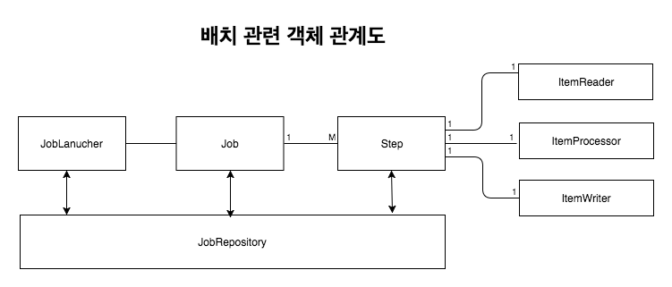
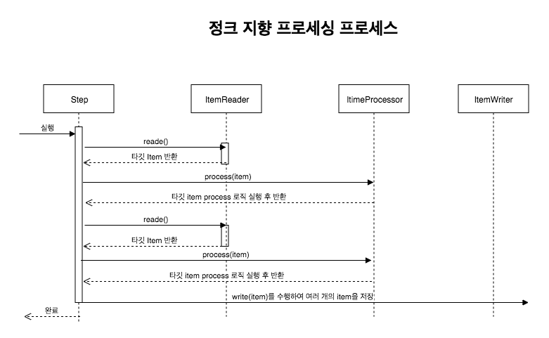

# Spring Batch

## Batch란?

Batch Processing(일괄 처리)란 컴퓨터 프로그램 흐름에 따라 순차적으로 자료를 처리하는 방식을 뜻한다.
개별적으로 어떤 요청이 있을때마다 실시간으로 통신하는 것이 아닌 **일괄적으로 대량 건을 처리**하는 것이다.

배치 애플리케이션은 다음의 조건을 만족해야한다.

- 대용량 데이터 : **대량의 데이터**를 전달, 계산, 가져오기등의 처리를 할 수 있어야한다.
- 자동화 : 심각한 문제 해결을 제외하고는 **사용자 개입없이 실행**
- 견고성 : **잘못된 데이터를 충돌/중단 없이 처리**
- 신뢰성 : **무엇이 잘못되었는지 추적 필요**(logging, 알림)
- 성능 : **지정된 시간안에 처리를 완료**하거나 동시에 실행되는 **다른 애플리케이션을 방해하지 않도록 수행**

여기서 중요한 것은 **대량의 데이터를 특정 시간에 일괄적으로 처리**한다는 것이다.


예를 하나 들자면 다음과 같이 배치 애플리케이션을 사용할 수 있다. 실시간 집계 쿼리로 해결하기엔 조회 시간이나 서버 부하가 생겨, 매일 새벽에 전날의 매출 집계를 만들어 외부 요청이 올 경우 미리 만들어둔 데이터를 바로 전달해 성능과 부하를 모두 잡을 수 있는 방법이다.

## Spring Boot Batch

Spring Batch는 백엔드 배치 처리 기능을 구현하는데 사용하는 프레임워크 이며, SpringBoot Batch는 Spring Batch의 설정 요소들을 간편화시켜 빠르게 설정하는데 도움을 준다.

### 장점

- 대용량 데이터 처리에 최적화되어 고성능을 발휘한다.
- 효과적인 로깅, 통계 처리, 트랜잭션 관리 등 재사용이 가능한 필수 기능을 지원한다.
- 수동으로 처리하지 않도록 자동화 되어있다.
- 예외사항과 비정상 동작에 대한 방어로직이 있다.
- 스프링 부트 배치의 반복되는 작업 프로세스를 이해하면 비즈니스 로직에 집중할 수 있다.

Spring Boot Batch 2.0 이상은 Spring Batch 4.0을 기반으로 하며, Spring Batch 4.0은 다음 특징이 있다.

- Java 8이상에서 동작한다.
- Spring Framework 5로 진화하며 새롭게 재배열된 의존성 트리를 지원한다.
- `ItemReaders` , `ItemProcessors`. `ItemWriters`에 대한 빌더를 제공한다.

### 주의사항

Spring Boot Batch는 Spring Batch를 간편하게 사용할 수 있게 래핑한 프로젝트 이므로 Spring Boot Batch, Spring Batch 모두 주의해야한다.

1. **가능하면 단순화**하여 복잡한 구조와 로직 피하기
2. 데이터를 직접 사용하는 작업이 빈번하게 일어나므로 **데이터 무결성을 유지하는 유효성 검사 등의 방어책**이 필요
3. 배치 처리 시 **시스템 I/O 사용 최소화**하기
   - 잦은 I/O로 **데이터베이스 커넥션과 네트워크 비용이 커지면 성능에 영향을 줄 수 있기 때문에 가능하면 한번에 데이터를 조회해 메모리에 저장해두고 처리**를 한 다음, 그 결과를 한번에 데이터 베이스에 저장하는 것이 좋음
4. 배치 처리가 진행되는 동안 **다른 프로젝트(웹, API, 기타 등) 요소에 영향을 주는 경우가 없는지 주의**
5. Spring Batch는 스케쥴러를 제공하지 않고, 배치 처리 기능만 제공한다.
   - 스케쥴러는 대표적으로 Crontab, Quartz, Jenkins등이 있다.
   - crontab의 경우 각 서버마다 따로 스케줄링을 관리해야 하며 무엇보다 클러스터링 기능이 제공되지 않아 추천하지 않는다.

### Spring Batch

1. 읽기(read) : 데이터 저장소에서 특정 데이터 레코드를 읽는다.
2. 처리(processing) : 원하는 방식으로 데이터 가공/처리 한다.
3. 쓰기(write) : 수정된 데이터를 다시 저장소에 저장한다.

배치 처리는 **`읽기 -> 처리 -> 쓰기`**의 흐름을 갖는다.



객체 관계도를 보면 하나의 큰 Job에 여러 Step(1:M 관계)을 두고, 각 단계의 배치 흐름대로 구성한다. 

### Job

Job은 **배치 처리 과정을 하나의 단위로 표현한 객체로 전체 배치 처리에 있어 최상단 계층**에 있다. Spring Batch에서 Job 객체는 여러 step 인스턴스를 포함하는 컨테이너이다. 

#### JobBuilderFactory

Job 객체를 만드는 빌더는 여러개가 있다. `JobBuilderFactory`는 여러 빌더를 통합 처리하는 공장이며, 원하는 Job을 손쉽게 만들 수 있다.

```java
package org.springframework.batch.core.configuration.annotation;

import org.springframework.batch.core.job.builder.JobBuilder;
import org.springframework.batch.core.repository.JobRepository;

public class JobBuilderFactory {
    private JobRepository jobRepository;

    public JobBuilderFactory(JobRepository jobRepository) {
        this.jobRepository = jobRepository;
    }

  	// JobBuilder 생성 반환
    public JobBuilder get(String name) {
        JobBuilder builder = (JobBuilder)(new JobBuilder(name)).repository(this.jobRepository);
        return builder;
    }
}
```

`JobBuilderFactory`의 `get` 메서드를 호출할 때마다 새로운 `JobBuilder`를 생성되며, 새로운 `JobBuilder`를 생성할 때마다 `JobBuilderFactory`가 생성될 때 주입받은 `JobRepository`를 설정하는 것을 볼 수 있다. 해당 `JobBuilderFactory`에서 생성되는 모든 `JobBuilder`가 동일한 `JobRepository`를 사용하는 것이다.

즉, `JobBuilderFactory`는 `JobBuilder`를 생성하는 역할만 수행한다.

#### JobBuilder

```java

public class JobBuilder extends JobBuilderHelper<JobBuilder> {
    public JobBuilder(String name) {
        super(name);
    }
		
    // 1. step을 추가하여 가장 기본이 되는 SimpleJobBuilder 생성
    public SimpleJobBuilder start(Step step) {
        return (new SimpleJobBuilder(this)).start(step);
    }

  	// 2. Flow를 실행할 JobFlowBuilder 생성
    public JobFlowBuilder start(Flow flow) {
        return (new FlowJobBuilder(this)).start(flow);
    }

  	// 3. Step을 실행할 JobFlowBuilder 생성
    public JobFlowBuilder flow(Step step) {
        return (new FlowJobBuilder(this)).start(step);
    }
}
```

`JobBuilder`는 직접적으로 `Job`을 생성하는 것이 아니라 별도의 구체적인 빌더를 생성해 반환한다. 왜냐하면 경우에 따라 `Job` 생성 방법이 모두 다르기 떄문에 별도의 구체적인 빌더를 구현하고, 이를 통해 `Job` 생성이 이루어지게 한다.

중간에 빌더를 한번 더 반환하여 사용해야하지만, 메서드 체인 방식을 활용하면  손쉽게 처리할 수 있다. `Job`은 `Step` / `Flow` 인스턴스의 컨테이너 역할을 하기 때문에 생성 이전에 인스턴스를 전달 받는다.

- `SimpleJobBuilder`로 `Job` 생성하기

```java
		@Autowired
    private JobBuilderFactory jobBuilderFactory;

    @Bean
    public Job simpleJob(){
        return jobBuilderFactory.get("simpleJob")	// "simpleJob" 이름을 가진 JobBuilder instance 반환
                                .start(simpleStep()) // step을 생성하는 메서드로 생성되는 SimpleJobBuilder
                                .build();						// build 메서드 호출로 Job 반환
    }
```

#### JobInstance

배치 처리에서 **`Job`이 실행될 때 하나의 `Job` 실행단위**이다. 예를들어 하루에 한번 배치 `Job`이 실행된다면, 어제 오늘 **각각 실행된 `Job`을 `JobInstance`라 부른다**. 

오늘 `Job`이 실패했다면 내일 동일한 `JobInstance`를 가지고 또 실행하는데, `Job`이 실패하면, `JobInstance`가 끝난 것으로 간주하지 않기 때문이다. 그러면 `JobInstance`는 어제 실패한 `JobExecution`과 오늘 수행한 `JobExecution`을 가질 수 있으며, 즉  `JobExecution`을 여러 개 가질 수 있다.


#### JobExecution

**`JobInstance`에 대한 한 번의 실행을 나타내는 객체**이다. `JobExecution`은 `Job` 실행에 대한 정보를 담고 있는 도메인 객체이며, `JobInstance`, 배치 실행 상태, 시작 시간, 끝난 시간, 오류 메세지 등의 정보를 담고 있다.

```java
public class JobExecution extends Entity {
    private final JobParameters jobParameters; //Job 실행에 필요한 매개 변수 데이터
    private JobInstance jobInstance; // Job 실행의 단위가 되는 객체
    private volatile Collection<StepExecution> stepExecutions; // StepExecution을 여러개 가질 수 있는 Collection 타입
    private volatile BatchStatus status; // Job의 실행 상태(COMPLETED, STARTING, STARTED ...)
    private volatile Date startTime; // Job이 실행된 시간(null은 시작하지 않은 것)
    private volatile Date createTime; // JobExecution이 생성된 시간
    private volatile Date endTime; // JobExecution 종료 시간
    private volatile Date lastUpdated; // 마지막 수정시간
    private volatile ExitStatus exitStatus; // Job 실행 결과에 대한 상태값(UNKOWN, EXECUTING, COMPLETE, ...)
    private volatile ExecutionContext executionContext;// Job 실행 사이에 유지해야하느 ㄴ사용자 데이터
    private transient volatile List<Throwable> failureExceptions; // Job 실행 중 발생한 예외 
    private final String jobConfigurationName; // Job 설정 이름
  	...
}
```


#### JobParameters

**`Job`이 실행될 때 필요한 파라미터들을 `Map` 타입으로 지정하는 객체**로 `JobInstance`(1:1 관계)를 구분하는 기준이 되기도 한다. 

하나의 `Job`을 생성할 때 시작 시간 등의 정보를 파라미터로 해서 하나의 `JobInstance`를 생성한다. 즉, 1:1 관계이다.

### Step

`Step`은 **실질적인 배치 처리를 정의하고 제어하는 데 필요한 모든 정보**가 들어있는 도메인 객체로, `Job`을 처리하는 실질적인 단위로 쓰인다.(Job:Step = 1:M)

#### StepExecution

`Step`의 실행 정보를 담는 객체로, 각각의 `Step`이 실행될 때마다 `StepExecution`이 생성된다.

```java
public class StepExecution extends Entity {
    private final JobExecution jobExecution; // 현재 JobExecution 정보
    private final String stepName; // Step 이름
    private volatile BatchStatus status; // Step의 실행 상태(COMPLETED, STARTING, STARTED ...)
    private volatile int readCount; // 성공적으로 읽은 레코드 수
    private volatile int writeCount; // 성공적으로 쓴 레코드 수
    private volatile int commitCount; // Step의 실행에 대해 커밋된 트랜잭션 수
    private volatile int rollbackCount; // Step의 실행에 대해 롤백된 트랜잭션 수
    private volatile int readSkipCount; // 읽기에 실패해 건너 띈 렉코드 수
    private volatile int processSkipCount; // 프로세스가 실패해 건너 띈 렉코드 수
    private volatile int writeSkipCount;// 쓰기에 실패해 건너 띈 렉코드 수
    private volatile Date startTime; // Step이 실행된 시간(null == 시작되지 않음)
    private volatile Date endTime; // Step의 실행 성공 여부와 관계 없이 끝난 시간
    private volatile Date lastUpdated; // 마지막으로 수정된 시간
    private volatile ExecutionContext executionContext; // Step 실행 사이에 유지해야하는 사용자 데이터
    private volatile ExitStatus exitStatus; // Step 실행 결과에 대한 상태 값(UNKOWN, EXECUTING, COMPLETE, ...)
    private volatile boolean terminateOnly; // Job 실행 중지 여부
    private volatile int filterCount; // 실행에서 필터링된 레코드 수
    private transient volatile List<Throwable> failureExceptions; // Step 실행중 발생한 예외 리스트
    ...
}
```

### JobRepository

`JobRepository`는 **배치 처리 정보**를 담고 있는 \*매커니즘이다. 어떤 Job이 실행되었으며 몇번 실행되었고, 언제 끝나는지 등 배치 처리에 대한 메타데이터를 저장한다.


예를 들어, `Job` 한개가 실행되면 `JobRepository`에서 배치 실행에 관련된 정보를 담고 있는 도메인 `JobExcution`을 생성하며, `Step`의 실행정보를 담고 있는 `StepExecution`도 저장소에 저장해 **전체 메타데이터를 저장/관리하는 역할을 수행**한다.


*\*매커니즘 : 어떠한 사물의 구조, 또는 그것이 작동하는 원리*

###  JobLauncher

`Job`, `JobParameters`와 함께 배치를 실행하는 인터페이스로, 메서드는 `run` 한개이다.

```java
public interface JobLauncher {
  	// Job과 JobParameters를 매개변수로 받아 JobExecution 반환
    // 매개변수가 동일하며, 이전 JobExecution가 중단된 적이 있으면 동일한 JobExecution 반환
    JobExecution run(Job var1, JobParameters var2) throws JobExecutionAlreadyRunningException, JobRestartException, JobInstanceAlreadyCompleteException, JobParametersInvalidException;
}
```

### 3단계 로직 분리

`ItemReader`, `ItemProcessor`, `ItemWriter` 3단계로 비지니스 로직을 분리해 역할을 명확하게 분리할 수 있다.

- 비즈니스 로직 분리
- 읽어온 배치 데이터와 쓰여질 데이터 타입이 다른 경우에 대한 대응

 그러므로 읽어온 배치의 데이터와 저장할 데이터 타입이 다른 경우에 대응할 수 있다.

### ItemReader

`Step`의 대상이 되는 **배치 데이터(File, Xml, DB 등)를 읽어오는 인터페이스**이다. 

```java
public interface ItemReader<T> {
  	// read 메서드의 반환 타입을 T(제너릭)으로 구현하여 직접 타입을 지정할 수 있음
    @Nullable
    T read() throws Exception, UnexpectedInputException, ParseException, NonTransientResourceException;
}
```

### ItemProcessor

`ItemReader`로 읽어 온 **배치 데이터를 변환하는 역할**을 수행한다.  `ItemProcessor`는 로직 처리만 수행하여 역할을 분리하고, 명확한 input/output을 `ItemProcessor`로 구현해놓으면 더 직관적인 코드가 될 것이다.

```java
public interface ItemProcessor<I, O> {
    @Nullable
    O process(@NonNull I var1) throws Exception;
}
```

### ItemWriter

**배치 데이터(DB, File 등)를 저장**한다.

```java
public interface ItemWriter<T> {
  	// T(제네릭)으로 지정한 타입을 List 매개변수로 받는다.
    void write(List<? extends T> var1) throws Exception;
}
```

리스트의 데이터 수는 설정한 \*청크(Chunk) 단위로 불러온다.

#### 청크 지향 프로세싱



Chunk란 **아이템이 트랜잭션에 commit되는 수**를 말한다.

즉, **청크 지향 처리란 한 번에 하나씩 데이터를 읽어 Chunk라는 덩어리를 만든 뒤, Chunk 단위로 트랜잭션을 다루는 것을 의미**한다.

Chunk 지향 프로세싱은 1000개의 데이터에 대해 배치 로직을 실행한다고 가정하면, Chunk 단위로 나누지 않았을 경우에는 한개만 실패해도 성공한 999개의 데이터가 롤백된다. Chunk 단위를 10으로 한다면, 작업 중에 다른 Chunk는 영향을 받지 않는다. 

### `Tasklet` 인터페이스

`Tasklet`은 임의의 `Step`을 실행할 때 하나의 작업을 처리하는 방식이다. 읽기, 처리, 쓰기로 나뉜 방식이 청크 지향 프로세싱이라면 이를 단일 작업으로 만드는 개념이 `Tasklet`이라고 할 수 있다. 

```java
public interface Tasklet {
  	// 내부에 원하는 단일 작업을 구현하고 나면, RepeatStatus.FINISHED 반환후 작업이 계속되면 RepeatStatus.CONTINUABLE 반환
    @Nullable
    RepeatStatus execute(StepContribution var1, ChunkContext var2) throws Exception;
}
```


## 참고

- [기억보단 기록을-Spring Batch 가이드](https://jojoldu.tistory.com/324)
- [Yun Blog-Spring Batch 간단정리](https://cheese10yun.github.io/spring-batch-basic/)
- [자몽아이스티맛의 기술블로그 - Chunk 지향 처리](https://jamong-icetea.tistory.com/232)
- [처음 배우는 스프링 부트2](https://www.hanbit.co.kr/store/books/look.php?p_code=B4458049183)

