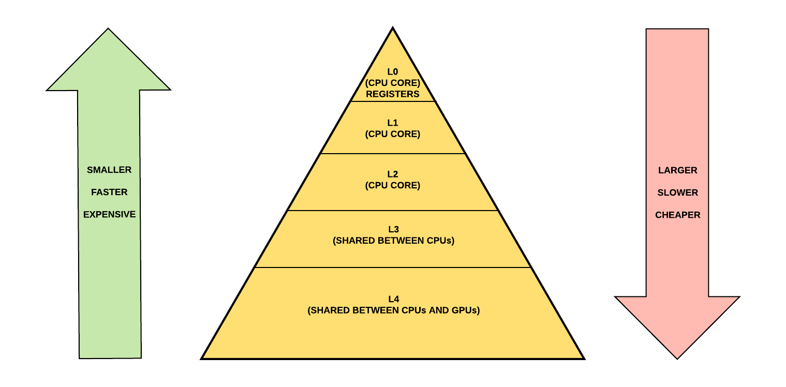

# Cache

## 캐시(cache)란?

프로그램이 수행될 때 나타나는 지역성을 이용해 메모리나 디스크에서 사용되었던 내용을 빠르게 접근할 수 있는 곳에 보관하고 관리함으로써 두 번째 접근 부터는 보다 빠르게 참조하도록 하는 것이다.

> 하드디스크는 용량이 아주 크지만 속도가 느리고, 메인 메모리(RAM)의 용량은 1/100정도로 작지만 속도는 십만배 정도 빠르다. **캐시 메모리는 메인 메모리(RAM)의 1/100 정도 용량이지만 속도는 훨씬 빠르다.**

즉, **사용되었던 데이터는 다시 사용되어질 가능성이 높다는 개념** 을 이용하여, 다시 사용될 확률이 높은 것은 더 빠르게 접근 가능한 저장소를 사용한다는 개념이다.



## 웹서버


웹에 요청을 날리면, 요청은 웹 브라우저로부터 하드 디스크의 파일 시스템에 있는 정적 리소스를 제공하는 웹 서버로 전달된다.

첫 번째 요청에서는 하드 디스크는 캐시를 확인하여 **캐시 미스(cache miss)**를 발생시킨다. 그리고 하드 드라이브로부터 데이터를 가져와 추후에 다시 요청 받을 수 있음을 가정하고 캐시에 저장한다.

이후 요청부터는 캐시 조회시 **캐시 히트(cache hit)**를 발생시킨다. 이 데이터는 캐시 미스를 일으키기 전까지 버퍼에서 제공된다.

> Cache Miss
>
> CPU가 참조하고자 하는 메모리가 캐시에 존재하지 않을 때
>
> Cache Hit
>
> CPU가 참조하고자 하는 메모리가 캐시에 존재할 때

### 데이터베이스 캐싱

데이터베이스 쿼리는 데이터베이스 서버에서 수행되기 때문에 속도가 느려지고 부하가 몰릴 수 있다. 결과값을 데이터베이스에 캐싱함으로써 응답 시간을 향상시킬 수 있다. 대다수의 머신이 동일한 데이터베이스에 동일한 쿼리를 사용하는 경우에 유용하다. 대다수의 데이터베이스 서버는 최적화된 캐싱을 위한 기능을 기본적으로 지원하며, 요구사항에 맞게 수정할 수 있는 파라미터들이 존재한다.

### 응답 캐싱

웹 서버의 응답은 메모리에 캐싱된다. 애플리케이션 캐시는 로컬 인메모리에 저장되거나 캐시 서버 위에서 실행되는 redis와 같은 인메모리 데이터베이스에 저장할 수 있다.

### HTTP 헤더를 통한 브라우저 캐싱

모든 브라우저는 HTML, JS, CSS, 이미지와 같은 파일들을 임시 저장을 위해 HTTP 캐시(웹 캐시)의 구현을 제공하고 있다. 서버 응답이 올바른 HTTP 헤더 지시자를 제공해 브라우저가 응답을 캐싱할 수 있는 시기와 지속 기간을 지시할 때 사용한다.

- 리소스가 로컬 캐시로부터 빠르게 로드되기 때문에 사용자 경험이 향상된다.
- 애플리케이션 서버 및 파이프라인의 다른 구성요소에 대한 부하가 줄어든다.
- 불필요한 대역폭에 대한 지불비용이 줄어든다.


## redis란?

**RE**mote **DI**ctionary **S**erver의 약자로 대용량 처리 관련 기술이다.

- 메모리 위에서 동작하는 Key/value 저장소(Store)인 Redis는 
  **NoSQL DBMS**로 분류되며 동시에 Memcached와 같은 **인메모리(In-memory) 솔루션**으로 분리된다.

- 명시적으로 삭제, expire를 설정하지 않으면 데이터는 삭제되지 않는다.(영구 보존)
- 여러대의 서버 구성이 가능하다.

**인메모리 캐시(In-memory Cache)란?**

인 메모리 캐시는 모든 데이터를 메모리(RAM)에만 올려놓고 사용하는 데이터베이스의 일종이다. 일반적인 데이터베이스(RDBMS)는 디스크(HDD, SSD)에 데이터를 영구적으로 저장해놓고, 필요한 데이터만 메모리에 읽어서 사용한다.

디스크에 접근하지 않고 메모리로만 모든 처리를 하기 때문에 데이터 저장 및 검색 속도가 매우 빠르지만 데이터는 딱 메모리 크기(운영체제 사용량 제외)까지만 저장할 수 있다.


## Varnish 란?


Varnish는 BSD 라이선스를 따르는 오픈 소스 웹 캐시 소프트웨어이다. 

주로 nginx 앞단에서 url 기반으로 동일한 url이 들어오면 응답값을 그대로 보내줄때 사용한다.

### VCL

Varnish는 설정을 위해 VCL이라는 별도의 DSL(Domain-Specific Language)을 제공한다. 사용자는 VCL을 사용하여 설정 파일을 작성한다. VCL로 작성된 설정 파일의 내용은 C 프로그램으로 변환되었다가 공유 라이브러리로 컴파일된다. Varnish는 시작할 때나 실행 중일 때 이 공유 라이브러리 파일을 로드하여 사용한다. 동시에 여러 개의 설정을 로드한 후에 Varnish 실행 중에 설정을 변경할 수 있다.


다음 그림은 Varnish가 웹 요청을 처리하는 과정을 간략하게 나타낸 것이다.

### purge

purge는 캐싱되어 있는 데이터를 TTL(Time - To - Live)이 지나가기전에 강제로 삭제하는 기능이다. 다음과 같은 두가지 형태로 purge 기능을 제공해주고 있다.

1. 특정 url을 지정하여 해당 데이터 삭제
2. 정규표현식을 사용해 해당 패턴의 데이터가 사용되지 않도록 하는 방법
   - 실제로 데이터를 삭제하지는 않기 때문에 `ban` 이라고 한다.

두 번째는 실제로 데이터를 삭제하지는 않기 때문에 ban이라고 한다. 캐시에서 데이터를 검색할 때 ban으로 지정된 정규 표현식에 해당하는지 검사한다. 정규 표현식을 추가할 때에는 데이터가 정규 표현식에 일치하는지 검사하지 않는다. 데이터를 검색할 때 새로이 추가된 ban 조건을 검사하여, 조건을 만족시키면 저장된 데이터를 사용하지 않는다.

```
ban req.http.host == "www.naver.com" && req.url ~ "\\.jpg$"
```

다음과 같이 ban을 지정할 수 있고, 해당 패턴에 포함되는 데이터는 캐싱되지 않는다.

> 예를 들어 쇼핑몰 상품상세 페이지는 변경이 적으니 url 기반으로 varnish cache를 태워 서버까지 안보내고, redis는 서비스 요청이 늘어나는 경우 DB 부하가 가중되는 API에 걸어서 메모리에 실시간으로 저장시키는 것이다.

## Spring Cache

Spring Caching Abstraction는 다른 캐시 솔루션을 Spring CacheManager를 통해서 쉽게 사용할 수 있도록 해준다. Spring Caching Abstraction는 **자바 메소드에 캐싱을 적용**하며, 메소드가 실행될 때 넘어온 **파라미터 값에 따라서 캐시**를 적용한다.

### 사용방법

```xml
<dependency>
  <groupId>org.springframework.boot</groupId>
  <artifactId>spring-boot-starter-cache</artifactId>
</dependency>
```

`pom.xml`에 다음과 같이 라이브러리를 추가한 후 `@EnableCaching` 어노테이션을 선언하게 되면 Spring Container에 빈이 등록된다. 기본적으로는 `ConcurrentMapCacheManager` 가 등록되며, 상황에 맞게 다른 캐시 구현체를 등록할 수 있다.

만약 EHCache, Redis 등 서드파티 모듈을 추가하게 되면, `EHCacheManager`, `RedisCacheManager` 를 Bean으로 등록해 사용할 수 있다. 

적용하고 싶은 메소드에 `@Cacheable` 어노테이션을 붙이면 적용된다.

### Cache Annotation

| 어노테이션     | 설명                             |
| :------------- | :------------------------------- |
| @Cacheable     | 메소드에 캐시 트리거 설정        |
| @CachePut      | 메소드 실행과 방해없이 캐시 갱신 |
| @CacheEvict    | 캐시되어있는 데이터 지우기       |
| @CacheConfig   | 캐시 관련 설정                   |
| @EnableCaching | 스프링 캐시활성화                |

#### Annotation 속성

| 어노테이션   | 설명                                                    |
| :----------- | :------------------------------------------------------ |
| value        | 캐시의 이름                                             |
| key          | 캐시할 키를 설정(기본설정하지 않으면 파라미터로 설정됨) |
| condition    | 특정 조건에 따라 캐시를 할지 않을지 결정                |
| cacheManager | 해당 캐시 매니저 설정가능                               |

## EHCache

### EHCache란?

- EHCache는 오픈 소스 기반의 Local Cache
- 속도가 빠르며, 경량 Cache 이다.
- Disk, Memory 저장이 가능
- 서버 간 분산 캐시를 지원
- JSR107 JCache 표준을 지원한다. JCache에서 제공하는 Annotation을 통해 이미 작성된 코드에 간단하게 기능을 추가할 수 있다.

> - **JSR**(Java Specification Requests) : 사양 및 기술적 변경에 대한 정식 제안 문서. 개인 및 조직은 JCP (Java Community Process)의 회원이 될 수 있으며 JSR에 언급 된 스펙에 따라 코드를 개발할 수 있다. 개발 된 기술적 변화는 JCP 회원들의 검토를 거쳐 승인된다.
> - **JSR-107**(JCACHE – **Java Temporary Caching API**) : 객체 생성, 공유 액세스, 스풀링, 무효화 및 JVM 전반에 걸친 일관성을 포함하여 **Java 객체의 메모리 캐싱에서 사용할 API 에 대한 기준**으로 볼 수 있다. 해당 Spec 으로 구현된 cache로는 **EhCache가** 유명하며, Hazelcast, Infinispan, Couchbase, Redis, Caffeine 등도 해당 기준을 따르는 것으로 알려져 있다.

### 설정 방법

- pom.xml

```xml
<dependency>
  <groupId>org.springframework.boot</groupId>
  <artifactId>spring-boot-starter-cache</artifactId>
</dependency>

<!-- ehcache -->
<dependency>
  <groupId>org.ehcache</groupId>
  <artifactId>ehcache</artifactId>
</dependency>		

<!-- JS107 -->
<dependency>
  <groupId>javax.cache</groupId>
  <artifactId>cache-api</artifactId>
</dependency>
```

EHCache를 적용하고 싶은 경우에는 `pom.xml` 에 다음과 같이 서드파티 모듈을 추가하면된다.

- @EnableCaching

```java
import org.springframework.cache.annotation.EnableCaching;
import org.springframework.context.annotation.Configuration;

// Configuration : IoC container(application context)를 적용하기 위해 사용하는 메타정보
// EnableCaching을 통해 스프링 캐시를 활성화 시켜준다.
@Configuration
@EnableCaching
public class CacheConfig {

}
```

Spring의 auto-configuration은 EHCache의 JSR-107을 찾지만 기본(default)로는 생성되지 않는다. 왜냐하면 `ehcache.xml` 을 찾지 못했기 때문이다. 그러므로, ehcache를 사용하기 위해서는 다음과 같은 설정을 해줘야한다.

- application.yml : 스프링이 구동될 때 자동으로 로딩하는 프로퍼티파일(application.properties로도 사용 가능) 스프링의 규약과 같음.

```yaml
spring:
  cache:
    jcache:
      config: classpath:ehcache.xml     # JSR-107(jcache) config 설정
```

- ehcache.xml

```xml
<config xmlns:xsi="http://www.w3.org/2001/XMLSchema-instance"
    xmlns="http://www.ehcache.org/v3"
    xmlns:jsr107="http://www.ehcache.org/v3/jsr107">
 
 	<service>
        <jsr107:defaults enable-statistics="true"/>
    </service>
    <!-- testCache 설정 expiry none으로 설정해 캐시 삭제전까지 유지 -->
    <cache alias="paymentMasterCache">
    
    	<key-type copier="org.ehcache.impl.copy.SerializingCopier">java.lang.String</key-type>
        <value-type copier="org.ehcache.impl.copy.SerializingCopier">java.util.ArrayList</value-type>
        <expiry>
            <none/>
        </expiry>
        <resources>
            <heap unit="entries">100</heap>
        </resources>
    </cache>
 
 </config>
```

그러면 환경 설정은 완료되었다.

```java
import java.util.List;

import org.springframework.cache.annotation.CacheEvict;
import org.springframework.cache.annotation.Cacheable;
import org.springframework.data.repository.CrudRepository;
import org.springframework.stereotype.Repository;

import com.example.cacheExample.entity.PaymentMaster;

/**
 * PaymentMasterRepository
 * JPA CrudRepository 상속
 * 
 * 변경이 자주안되는 데이터로 최초 한번 가져온 후 paymentMasterCache로 Ehcache에 저장해둔다.
 * 이때 만료기한(expiry)는 없음(삭제시까지 유지)
 *  
 * 수정/추가/삭제가 일어나는 경우에는 CacheEvict으로 paymentMasterCache를 삭제
 * 
 * Ehcache 설정정보는 ehcache.xml에서 확인할 수 있다.
 *
 */

@Repository
public interface PaymentMasterRepository extends CrudRepository<PaymentMaster,String>{

	@Cacheable(value="paymentMasterCache", key="#root.methodName")
	List<PaymentMaster> findAll();
	
	@CacheEvict(value="paymentMasterCache", allEntries=true)
	<S extends PaymentMaster> S save(S entity);

	@CacheEvict(value="paymentMasterCache", allEntries=true)	
    void deleteById(String pmtCode);
	
	@CacheEvict(value="paymentMasterCache", allEntries=true)
	void deleteAll();
}
```

## 참고

- [https://goodgid.github.io/Redis/](https://goodgid.github.io/Redis/)
- [공식문서](https://docs.spring.io/spring/docs/3.2.x/spring-framework-reference/html/cache.html)
- [Naver D2 -Varnish 이야기](https://d2.naver.com/helloworld/352076)
- [https://groups.google.com/forum/#!topic/ksug/Z1bhFNJcw9Q](https://groups.google.com/forum/#!topic/ksug/Z1bhFNJcw9Q)
