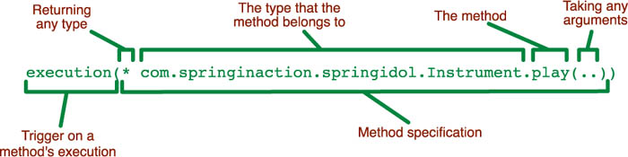

# AOP(4) AspectJ

AspectJ란 순수 Spring AOP API에서 제공하지 않은 필드에 대한 Advisor를 지원하고, CTW(Compile Time Weaving), LTW(Load Time Weaving)과 같은 다양한 위빙 방법을 제공해 프로그램의 퍼포먼스를 향상 시킬 수 있도록 해준다.

또한 `@Aspect` 어노테이션을 바탕으로 로직을 작성할 수 있어, xml 방식보다는 더 편리하다. 

### Weaving

Weaving은 Aspect 클래스에 정의 한 Advice 로직을 타겟에 적용하는 것을 의미하며, RTW, CTW, LTW 3가지가 있다.

#### RTW(Run Time Weaving)

Spring AOP에서 사용하는 방식으로, Proxy를 생성해 실제 타깃 오브젝트의 변형없이 위빙을 수행한다. 실제 런타임시 Method 호출 시에 위빙이 이루어지는 방식이다.

소스파일, 클래스 파일에 변형이 없다는 장점이 있지만, Point Cut에 대한  Advice 수가 늘어날수록 성능이 떨어진다는 단점이 있다.

#### CTW(Compile Time Weaving)

AspectJ에는 AJC (AspectJ Compiler)라는 컴파일러가 있는데 Java Compiler를 확장한 형태의 컴파일러이다. AJC를 통해 java파일을 컴파일 하며, 컴파일 과정에서 바이트 코드 조작을 통해 Advisor 코드를 직접 삽입하여 위빙을 수행한다. 장점으로는 3가지 위빙 중에서는 가장 빠른 퍼포먼스를 보여준다. 하지만 컴파일 과정에서 lombok과 같이 컴파일 과정에서 코드를 조작하는 플러그인과 충돌이 발생할 가능성이 아주 높다. (거의 같이 사용 불가)

#### LTW(Load Time Weaving)

ClassLoader를 이용해 클래스가 JVM에 로드될 때 바이트 코드 조작을 통해 위빙되는 방식으로 컴파일 시간은 상대적으로 CTW보다 짧다. 하지만 오브젝트가 메모리에 올라가는 과정에서 위빙이 일어나기때문에 런타임시 시간은 CTW보다 상대적으로 느리다.

Application Context에 객체가 로드될 때, 객체 핸들링이 발생하므로 퍼포먼스가 저하된다.

| Annotatoin      | 설명                                                         |
| --------------- | ------------------------------------------------------------ |
| @Before         | 메소드 실행 이전 부분에 대한 JoinPoint 설정                  |
| @Around         | 메소드 실행 전/후에 JoinPoint 설정                           |
| @After          | 메소드 실행 이후 붑ㄴ의 대한 JoinPoint설정                   |
| @AfterReturning | return 실행 이후 부분에 대한 JoinPoint 설정                  |
| @AfterThrowable | 메소드 실행시, Throw 이후 부분에  대한 Joinpoint 설정        |
| @Pointcut       | Pointcut에 대한 표현식을 가지며, @Pointcut이 적용된 메소드는 반드시 리턴타입이 void여야한다. |



1. 접근 제어자 패턴(public or protected)
   - `*`인 경우(or 생략) 모든 접근 제어자에 대해 설정 가능
2. 리턴타입 : 메소드의 리턴타입을 지정(해당 타입으로 리턴되는 모든 메소드에 대한 point cut)
   - 필수 기재
3. Class 타입 : 클래스 타입 패턴(해당 클래스에 대한 모든 메소드에 대해 Point cut)
   - 패키지 명도 기재 필요
   - 필수 기재
4. 메소드 명 : 특정 클래스 또는 패키지 하위의 메소드 명에 대해 Point Cut
   - 필수 기재
5. 예외타입 : 예외 클래스에 대해서 Jointpoint 설정 가능

## AOP 구현

스프링은 3가지 방식으로 AOP를 제공한다.

1. XML 스키마 기반의 POJO클래스를 이용한 AOP 구현
2. AspectJ에서 정의한 @Aspect 어노테이션 기반의 AOP 구현
3. [스프링 API를 이용한 AOP 구현](https://m.blog.naver.com/PostView.nhn?blogId=chocolleto&logNo=30086011474&proxyReferer=https:%2F%2Fwww.google.com%2F)


이중에서 `@Aspect` 어노테이션 기반의 AOP 구현을 예로 구현해볼 것이다.

1. maven(`pom.xml`) 설정

```xml
<!-- aop aspectj -->
<dependency>
  <groupId>org.springframework.boot</groupId>
  <artifactId>spring-boot-starter-aop</artifactId>
</dependency>
```

2. @EnableAspectJAutoProxy 적용 : 최상위 패키지의 클래스에 적용해 AOP를 찾을 수 있게해준다.

```java
package com.example.practiceAop;

import org.springframework.boot.SpringApplication;
import org.springframework.boot.autoconfigure.SpringBootApplication;
import org.springframework.context.annotation.EnableAspectJAutoProxy;

@EnableAspectJAutoProxy
@SpringBootApplication
public class PracticeAopApplication {

	public static void main(String[] args) {
		SpringApplication.run(PracticeAopApplication.class, args);
	}
}
```

3. 공통기능 정의 및 시점 정의(로그 적용)

```java
package com.example.practiceAop;

import org.aspectj.lang.ProceedingJoinPoint;
import org.aspectj.lang.annotation.Around;
import org.aspectj.lang.annotation.Aspect;
import org.slf4j.Logger;
import org.slf4j.LoggerFactory;
import org.springframework.stereotype.Component;


/**
 * LoggerAspect
 *  
 * pointcut 기준으로 Log 기록
 * @Aspect : 부가기능 모듈, 핵심기능에 부가되어 의미를 갖는 특별한 모듈(Pointcut + Advice)
 * Advice : 실제로 부가기능을 담은 구현체
 * PointCut : 복수의 조인 포인트를 하나로 묶은 것
 * JoinPoint : Advice가 적용될 위치
 */
@Aspect
@Component
public class LoggerAspect {

	private final Logger logger = LoggerFactory.getLogger(this.getClass());

	// AOP Point Cut
	// Controller, ServiceImpl, Repository 기준으로 로그 출력
	@Around("execution(* com.example.practiceAop.controller.*Controller.*(..)) or execution(* com.example.practiceAop.service.impl.*Impl.*(..)) or execution(* com.example.practiceAop.repository.*Repository.*(..))")
	public Object printLog(ProceedingJoinPoint joinPoint) throws Throwable {

		String type = "";
		String name = joinPoint.getSignature().getDeclaringTypeName(); // 실행되는 대상 메서드 정보
		if (name.contains("Controller") == true) {
			type = "Controller ===> ";

		}else if (name.contains("Service") == true) {
			type = "ServiceImpl ===> ";
		}else if (name.contains("Repository") == true) {
			type = "Repository ===> ";
		}

		logger.info(type + name + "." + joinPoint.getSignature().getName() + "( )" );
		
		return joinPoint.proceed();
	}

}
```


## 참조

- [Carrey's 기술블로그](https://jaehun2841.github.io/2018/07/22/2018-07-22-spring-aop4/)
- [https://jeong-pro.tistory.com/171](https://jeong-pro.tistory.com/171)