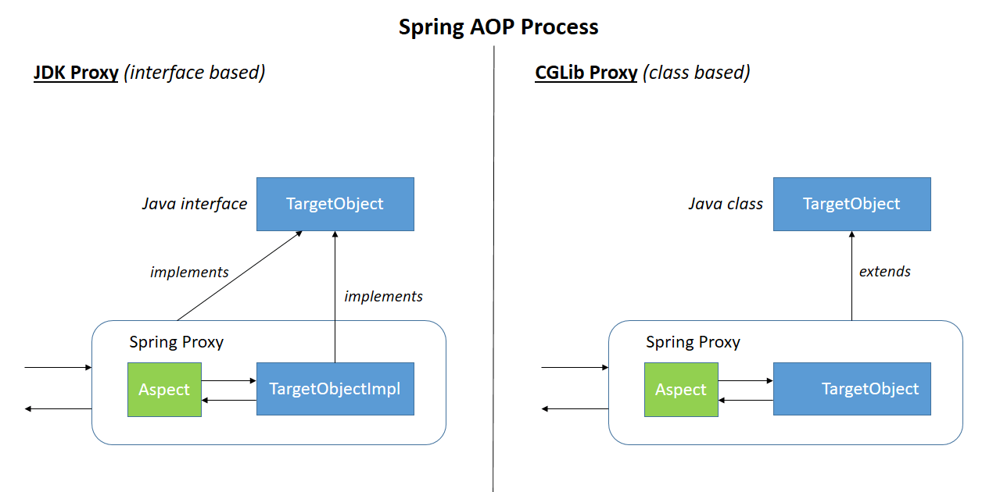

# AOP (3) Dynamic Proxy


## 다이나믹 프록시란?

- **런타임 시에 동적으로 만들어지는 오브젝트**
-  java의 **reflection을 이용해서 proxy 객체 생성**(`java.lang.reflect`)
- 타겟 인터페이스와 동일한 형태로 생성
  - **프록시 대상의 객체가 최소 하나 이상의 인터페이스를 구현했다면 JDK 동적 프록시를 이용**하면된다.
- FactoryBean(팩토리빈)을 통해 생성

> reflection이란 **객체를 통해 클래스의 정보를 분석해 내는 프로그램 기법**을 말한다.
>
> 스프링의 빈은 기본적으로 클래스 이름과 Property로 정의한다.
>
> 스프링은 **지정된 클래스 이름을 가지고 reflection을 이용해 해당 클래스의 객체(object)를 생성**한다.



스프링에서는 **JDK 동적 프록시**와 **CGLib 프록시**를 사용하고 있다.

## JDK Dynamic Proxy 

JDK Dynamic Proxy는 Proxy Factory에 의해 런타임시 동적으로 만들어지는 오브젝트이다. JDK Dynamic Proxy는 반드시 **인터페이스가 정의되어있고, 인터페이스에 대한 명세를 기준으로 Proxy를 생성**한다. 즉, 인터페이스 선언에 대한 강제성이 있다는 단점이 있다.

내부적으로 JDK Dynamic Proxy에서는 InvationHandler라는 인터페이스를 구현해 만들어지는데, invoke 함수를 오버라이딩하여 Proxy의 위임 기능을 수행한다. 이 과정에서 객체에 대한 Reflection 기능을 사용해 구현하기 때문에 퍼포먼스 하락의 원인이 되기도 한다.

#### 구현과정

1. Proxy.newProxyInstance() 를 통한 프록시 생성
2. Proxy.newProxyInstance() 호출할 때 전달하는 InvocationHandler 인터페이스의 단일 메소드인 invoke()에 부가기능을 단 한번만 구현함으로써 코드 중복을 해결할 수 있다.

다이나믹 프록시 객체는 클래스 파일 자체가 존재하지 않으며, 빈 객체로 등록이 불가하다.

```java
public interface ServiceTest {
  void print();
}

@Service
public class ServiceTestImpl implements ServiceTest {
  @Async
  public void print() {
  }
}

@RestController
public class HelloController {
  private final ServiceTest service;
  public HelloController(ServiceTest service) {
    this.service = service;
    System.out.println(service.getClass());
  }
}
```

```zsh
class com.sun.proxy.$Proxy60
```

위의 코드를 살펴보면 인터페이스(ServiceTest)를 구현한 객체(ServiceTestImpl)이 있다. print문의 결과를 보면 JDK 동적 프록시가 들어간 것을 확인할 수 있다.

스프링 AOP를 이용하여 프록시 객체를 생성해볼 것이다. 스프링 내부에서 제공하는 FactoryBean 클래스를 사용하여 생성할 것이다.

```java
ProxyFactory proxyFactory = new ProxyFactory();
proxyFactory.setInterfaces(ServiceTest.class);
proxyFactory.setTarget(new ServiceTestImpl());
proxyFactory.addAdvice(new ServiceAdvice());
final ServiceTest proxy = (ServiceTest) proxyFactory.getProxy();
System.out.println(proxy.getClass());
```

```java
class com.sun.proxy.$Proxy60
```

인터페이스가 있어서 JDK 동적 프록시가 생성된 것을 볼 수 있다.

## CGLib Proxy

CGLIB Proxy는 순수 Java JDK 라이브러리를 이용하는 것이 아닌 CGLIB라는 외부 라이브러리를 추가해야만 사용할 수 있다. CGLIB의 Enhancer 클래스를 바탕으로 Proxy를 생성하며, 인터페이스가 없어도 Proxy를 생성할 수 있다. CGBLIB Proxy는 타겟 클래스를 상속받아 생성하기 때문에 Proxy를 생성하기 위해 인터페이스를 만들어야하는 수고를 덜 수 있다.

하지만, 상속을 이용하므로 **final**이나 **private**와 같이 상속에 대해 오버라이딩을 지원하지 않는 경우에는 Aspect를 적용할 수 없다는 단점이 있다.

CGLIB Proxy는 바이트 코드를 조작해서 프록시 객체를 생성하므로 JDK Dynamic Proxy보다 퍼포먼스가 빠른 장점이 있다.

```java
@Service
public class ServiceTestImpl {
  @Async
  public void print() {
  }
}

@RestController
public class HelloController {
  private final ServiceTest service;
  public HelloController(ServiceTest service) {
    this.service = service;
    System.out.println(service.getClass());
  }
}
```

```java
class me.wonwoo.ServiceTestImpl$$EnhancerBySpringCGLIB$$bababcc1
```

인터페이스 없이 생성한 경우에는 CGLib 프록시로 생성된 것을 확인할 수 있다.

스프링 AOP를 이용하여 프록시 객체를 생성해볼 것이다. 스프링 내부에서 제공하는 FactoryBean 클래스를 사용하여 생성할 것이다.

```java
ProxyFactory proxyFactory = new ProxyFactory();
proxyFactory.setTarget(new ServiceTestImpl());
proxyFactory.addAdvice(new ServiceAdvice());
final ServiceTest proxy = (ServiceTest) proxyFactory.getProxy();
System.out.println(proxy.getClass());
```

```java
class me.wonwoo.ServiceTestImpl$$EnhancerBySpringCGLIB$$bababcc1
```

인터페이스 없이 생성한 경우에는 CGLib 프록시 객체가 생성된 것을 볼 수 있다.

프록시 객체에 CGLib을 강제화 하고 싶다면 다음과 같이 설정할 수 있다. **강제화를 하게되면 인터페이스가 있는 경우에도 CGLib 프록시 객체가 삽입**된다.

```java
@EnableAsync(proxyTargetClass = true)
@EnableCaching(proxyTargetClass = true)
```

## JDK Dynamic Proxy vs CGLIB

두 방식의 차이는 **인터페이스의 유무** 로서, AOP의 타겟이 되는 클래스가 인터페이스를 구현하였다면 JDK Dynamic Proxy 사용, 구현하지 않았다면 CGLIB 방식을 사용한다.

사용자가 어떻게 설정하느냐에 따라서 인터페이스를 구현했다 하더라도 **CGLIB 방식을 강제하거나 AspectJ를 사용**할 수 있다.

- CGLIB(스프링의 XML 설정 파일에 빈을 등록하는 방법)

```xml
<!--proxy-targetclass="true"을 추가하여 CGLIB을 사용하도록 한다.-->
<aop:config proxy-target-class="true"> 
    <!-- other beans defined here... -->
    <aop:pointcut id="fooServiceMethods" expression="execution(* x.y.service.*.*(..))"/>
    <aop:advisor advice-ref="txAdvice" pointcut-ref="fooServiceMethods"/>
</aop:config>
```

- AspectJ : 어노테이션 기반의 스타일 선호

```xml
<aop:aspectj-autoproxy proxy-target-class="true"> 
```


## 참조 페이지

- [http://ooz.co.kr/205?category=818548](http://ooz.co.kr/205?category=818548)
- [http://wonwoo.ml/index.php/post/1576](http://wonwoo.ml/index.php/post/1576)
- [http://ooz.co.kr/201?category=818548 ](http://ooz.co.kr/201?category=818548 )
- [http://private.tistory.com/43](