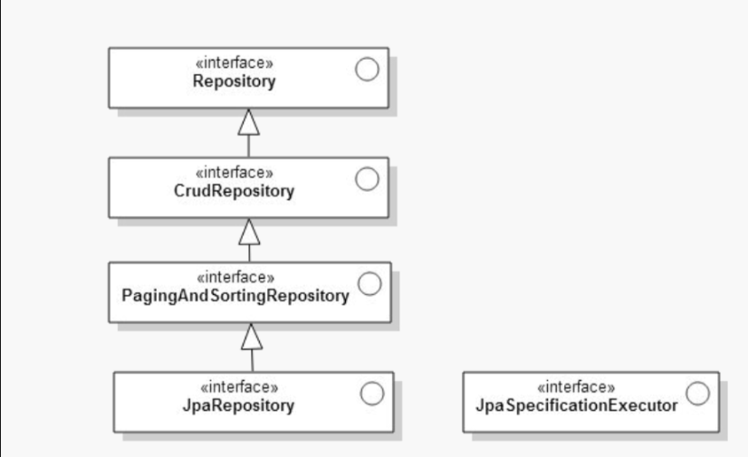

# Srping Data JPA



JPA 처리를 담당하는 Repository는 기본적으로 4가지가 있다.

- Repository는 CRUD 기능외의 처리를 할 때 사용하면 좋다.

```java
@Indexed
public interface Repository<T, ID> {

}
```

- CrudRepository는 기본적인 CRUD 기능을 제공해준다.

```java
public interface CrudRepository<T, ID> extends Repository<T, ID> {

  <S extends T> S save(S entity);      

  Optional<T> findById(ID primaryKey); 

  Iterable<T> findAll();               

  long count();                        

  void delete(T entity);               

  boolean existsById(ID primaryKey);   

  // … more functionality omitted.
}
```

- PagingAndSortingRepository : CRUD +  페이징과 sorting 기능 제공

```java
public interface PagingAndSortingRepository<T, ID> extends CrudRepository<T, ID> {
  Iterable<T> findAll(Sort sort);
  Page<T> findAll(Pageable pageable);
}
```

- JpaRepository는 PagingAndSortingRepository + JPA관련 특화 기능들(flusing, 배치성 작업) 기능을 제공해준다.

### Query Creation

사용자가 Repository 인터페이스에 정해진 규칙대로 메소드를 입력하면, Spring이 알아서 해당 메소드 이름에 적합한 쿼리를 날리는 구현체를 만들어 Bean으로 등록해준다. 이때 정해진 규칙은 아래 표를 참조하면 좋다.

| Keyword                | Sample                                                       | JPQL snippet                                                 |
| :--------------------- | :----------------------------------------------------------- | :----------------------------------------------------------- |
| `And`                  | `findByLastnameAndFirstname`                                 | `… where x.lastname = ?1 and x.firstname = ?2`               |
| `Or`                   | `findByLastnameOrFirstname`                                  | `… where x.lastname = ?1 or x.firstname = ?2`                |
| `Is`, `Equals`         | `findByFirstname`,`findByFirstnameIs`,`findByFirstnameEquals` | `… where x.firstname = ?1`                                   |
| `Between`              | `findByStartDateBetween`                                     | `… where x.startDate between ?1 and ?2`                      |
| `LessThan`             | `findByAgeLessThan`                                          | `… where x.age < ?1`                                         |
| `LessThanEqual`        | `findByAgeLessThanEqual`                                     | `… where x.age <= ?1`                                        |
| `GreaterThan`          | `findByAgeGreaterThan`                                       | `… where x.age > ?1`                                         |
| `GreaterThanEqual`     | `findByAgeGreaterThanEqual`                                  | `… where x.age >= ?1`                                        |
| `After`                | `findByStartDateAfter`                                       | `… where x.startDate > ?1`                                   |
| `Before`               | `findByStartDateBefore`                                      | `… where x.startDate < ?1`                                   |
| `IsNull`, `Null`       | `findByAge(Is)Null`                                          | `… where x.age is null`                                      |
| `IsNotNull`, `NotNull` | `findByAge(Is)NotNull`                                       | `… where x.age not null`                                     |
| `Like`                 | `findByFirstnameLike`                                        | `… where x.firstname like ?1`                                |
| `NotLike`              | `findByFirstnameNotLike`                                     | `… where x.firstname not like ?1`                            |
| `StartingWith`         | `findByFirstnameStartingWith`                                | `… where x.firstname like ?1` (parameter bound with appended `%`) |
| `EndingWith`           | `findByFirstnameEndingWith`                                  | `… where x.firstname like ?1` (parameter bound with prepended `%`) |
| `Containing`           | `findByFirstnameContaining`                                  | `… where x.firstname like ?1` (parameter bound wrapped in `%`) |
| `OrderBy`              | `findByAgeOrderByLastnameDesc`                               | `… where x.age = ?1 order by x.lastname desc`                |
| `Not`                  | `findByLastnameNot`                                          | `… where x.lastname <> ?1`                                   |
| `In`                   | `findByAgeIn(Collection ages)`                               | `… where x.age in ?1`                                        |
| `NotIn`                | `findByAgeNotIn(Collection ages)`                            | `… where x.age not in ?1`                                    |
| `True`                 | `findByActiveTrue()`                                         | `… where x.active = true`                                    |
| `False`                | `findByActiveFalse()`                                        | `… where x.active = false`                                   |
| `IgnoreCase`           | `findByFirstnameIgnoreCase`                                  | `… where UPPER(x.firstame) = UPPER(?1)`                      |

### Native Queries

`@Query` 어노테이션으로 원래 쿼리문을 그대로 사용할 수 있다.

```java
public interface UserRepository extends JpaRepository<User, Long> {

  @Query(value = "SELECT * FROM USERS WHERE EMAIL_ADDRESS = ?1", nativeQuery = true)
  User findByEmailAddress(String emailAddress);
}
```

```java
public interface UserRepository extends JpaRepository<User, Long> {

  @Query(value = "SELECT * FROM USERS WHERE LASTNAME = ?1",
    countQuery = "SELECT count(*) FROM USERS WHERE LASTNAME = ?1",
    nativeQuery = true)
  Page<User> findByLastname(String lastname, Pageable pageable);
}
```

## 예시

```java
public interface MemberRepository extends CrudRepository<Member, String>{
}
```

이렇게 상속만 하면, 기본적인 CrudRepository의 기능을 다 사용할 수 있다. CRUD에 추가적으로 구현하고 싶은 기능이 있으면 구현할 수 있다.

이때 별도로 `@Repository` 어노테이션을 추가하지 않아도 된다.

```java
@Service
public class MemeberServiceImpl implements MemberService {
	
	@Autowired
	MemberRepository memberRepository; 
	
	public boolean isEnrolledMember(String mbrId) {
		
		// mbrId(ID) 기준으로 회원 여부 확인(있으면 true, 없으면 false)
		boolean isEnrolledMember = memberRepository.existsById(mbrId);		 
		return isEnrolledMember;
	}
}
```


## 참조

- [http://arahansa.github.io/docs_spring/jpa.html#jpa.query-methods.query-creation](http://arahansa.github.io/docs_spring/jpa.html#jpa.query-methods.query-creation)

- [Spring Data Document 2.2.6](https://docs.spring.io/spring-data/jpa/docs/2.2.6.RELEASE/reference/html/)

