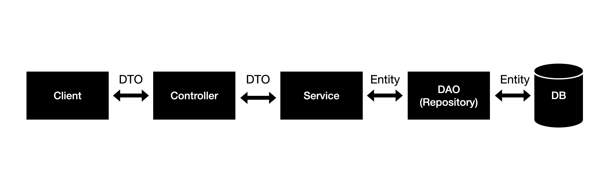

# Spring 서비스 구조

## Spring Architecture

### Controller

Client의 요청을 받아 Requestmapping을 수행하고,  응답을 전달한다.

- 해당 요청 url에 따라 적절한 view와 mapping
- `@Autowired Service` 를 통해 service의 method를 이용한다.
- 적절한 DTO(ResponseEntity)를 Client에 반환한다.

- @Controller : API와 View를 동시에 사용하는 경우에 사용(**view를 return**해주는게 주 목적)
- @ResponseBody :  API 서비스로 사용하는 경우
  - 메소드에서 @ResponseBody 어노테이션을 사용하면 Spring은 반환 값을 변환하여 HTTP Response 에 자동으로 씁니다. Controller 클래스의 각 메소드에는 @ResponseBody 어노테이션이 있어야한다.
- @RestController : @Controller + @ResponseBody
  - Method마다 @ResponseBody를 붙여주지 않아도 된다.
  - HTTP ResponseBody에 직접 쓰여짐
  - data(json, xml) return이 주목적이다.
- **@Controller 는 View Page를 반환**하지만, **@RestController는 객체(VO,DTO)를 반환하기만 하면, 객체데이터는 application/json 형식의** **HTTP ResponseBody에 직접 작성**되게 된다.

### Service

비지니스 로직을 처리한다.

- `@Autowired Repository` 를 통해 repository의 method를 이용
- @Service

### DAO(Repository)

실제로 DB에 접근하는 객체로, Service와 DB를 연결하는 고리의 역할을 한다.

- SQL을 사용해 적절한 CRUD API를 제공한다.
  - JPA 대부분 기본적인 CRUD method 제공
- @Repository
  - JPA를 사용하는 경우 @Repository 어노테이션을 추가하지 않아도 된다.

### DTO

- 계층간 데이터 교환을 위한 객체(Java Beans)이다.
  - DB에서 데이터를 얻어 Service나  Controller등으로 보낼 때 사용하는 객체이다.
  - 로직을 갖고 있지 않은 순수한 데이터 객체이며, getter/setter 메서드만을 갖는다.
- Request와 Response용 DTO는 View를 위한 클래스
  - 자주 변경이 필요하다
  - ModelMapper를 통해서 DTO에서 필요한 부분을 이용해 Entity로 만든다.
  - 또한 Controller Layer에서 Response DTO로 Client에 전달한다.

### Domain(Entity)

실제로 데이터베이스 물리 테이블과 1:1 매핑되어 바인딩 되어있다.

### Entity와 DTO를 분리하는 이유?

- View Layer와 DB Layer 역할을 철저하게 분리하기 위해서
- 테이블과 매핑되는 Entity 클래스가 변경되면 여러 클래스에 영향을 끼치게 되는 반면 View와 통신하는 DTO 클래스(Request / Response 클래스)는 자주 변경되므로 분리
- 즉 DTO는 Domain Model을 복사한 형태로, 다양한 Presentation Logic을 추가한 정도로 사용하며 Domain Model 객체는 Persistent만을 위해서 사용

## 참조

- [https://wondongho.tistory.com/76](https://wondongho.tistory.com/76)

- [https://velog.io/@sumusb/Spring-Service-Layer%EC%97%90-%EB%8C%80%ED%95%9C-%EA%B3%A0%EC%B0%B0](https://velog.io/@sumusb/Spring-Service-Layer에-대한-고찰)
- [https://heowc.tistory.com/65](https://heowc.tistory.com/65)
- [https://gmlwjd9405.github.io/2018/12/20/spring-mvc-framework.html](https://gmlwjd9405.github.io/2018/12/20/spring-mvc-framework.html)
- [https://elvis-note.tistory.com/entry/9-Spring-MVC-2-Service%EC%99%80-ServiceImpl](https://elvis-note.tistory.com/entry/9-Spring-MVC-2-Service와-ServiceImpl)