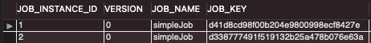

# 배치 메타테이블 알아보기


## BATCH_JOB_INSTANCE

Job Parameter에 따라 생성되는 테이블이다. Job Parameter는 Spring Batch가 실행될 때 외부에서 받을 수 있는 파라미터로, 같은 Batch Job이더라도 Job Parameter가 다르면, `BATCH_JOB_INSTANCE`에 기록이되고, Job Parameter가 동일하다면 기록되지 않는다.

| 필드명          | 설명                             |
| --------------- | -------------------------------- |
| JOB_INSTANCE_ID | `BATCH_JOB_INSTANCE` 테이블의 PK |
| JOB_NAME        | 수행한 Batch Job Name            |

```java
@Slf4j
@RequiredArgsConstructor
@Configuration
public class SimpleJobConfiguration {
    private final JobBuilderFactory jobBuilderFactory;
    private final StepBuilderFactory stepBuilderFactory;

    @Bean
    public Job simpleJob(){
        return jobBuilderFactory.get("simpleJob")
                .start(simpleStep(null))
                .build();
    }

    @Bean
    @JobScope
    public Step simpleStep(@Value("#{jobParameters[requestDate]}")String requestDate){
        return stepBuilderFactory.get("simpleStep")
                .tasklet((contribution, chunkContext) -> {
                    log.info(">>>>> This is Step1");
                    log.info(">>>>> This is requestDate = {}", requestDate);
                    return RepeatStatus.FINISHED;
                })
                .build();
    }
}
```


promgram arguements에 새로 추가한 jobParameter를 추가해준 후 실행하면, log도 정상적으로 찍히고, 새로운 BATCH_JOB_INSTANCE가 생긴것을 볼 수 있다.

```
2021-01-24 23:09:38.687  INFO 35371 --- [           main] o.s.b.c.l.support.SimpleJobLauncher      : Job: [SimpleJob: [name=simpleJob]] launched with the following parameters: [{requestDate=20210101}]
2021-01-24 23:09:38.900  INFO 35371 --- [           main] o.s.batch.core.job.SimpleStepHandler     : Executing step: [simpleStep]
2021-01-24 23:09:38.959  INFO 35371 --- [           main] s.b.p.jobs.SimpleJobConfiguration        : >>>>> This is Step1
2021-01-24 23:09:38.959  INFO 35371 --- [           main] s.b.p.jobs.SimpleJobConfiguration        : >>>>> This is requestDate = 20210101
2021-01-24 23:09:38.982  INFO 35371 --- [           main] o.s.batch.core.step.AbstractStep         : Step: [simpleStep] executed in 81ms
```



만약 동일한 파라미터로 다시 수행을 했을때, 

```
java.lang.IllegalStateException: Failed to execute ApplicationRunner
	at org.springframework.boot.SpringApplication.callRunner(SpringApplication.java:798) [spring-boot-2.4.2.jar:2.4.2]
	at org.springframework.boot.SpringApplication.callRunners(SpringApplication.java:785) [spring-boot-2.4.2.jar:2.4.2]
	at org.springframework.boot.SpringApplication.run(SpringApplication.java:333) [spring-boot-2.4.2.jar:2.4.2]
	at org.springframework.boot.SpringApplication.run(SpringApplication.java:1311) [spring-boot-2.4.2.jar:2.4.2]
	at org.springframework.boot.SpringApplication.run(SpringApplication.java:1300) [spring-boot-2.4.2.jar:2.4.2]
	at spring.batch.practice.PracticeApplication.main(PracticeApplication.java:14) [classes/:na]
Caused by: org.springframework.batch.core.repository.JobInstanceAlreadyCompleteException: A job instance already exists and is complete for parameters={requestDate=20210101}.  If you want to run this job again, change the parameters.
```

같은 파라미터로는 Job을 실행할 수 없다는 오류가 발생하는 것을 볼 수 있다.

즉, **동일한 Job이 Job Parameter가 달라지면 그때마다 `BATCH_JOB_INSTANCE`에 생성되며, 동일한 Job Parameter는 여러개 존재할 수 없다.**