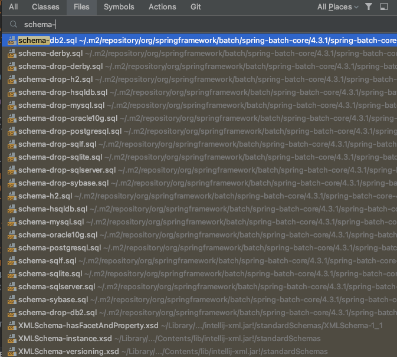
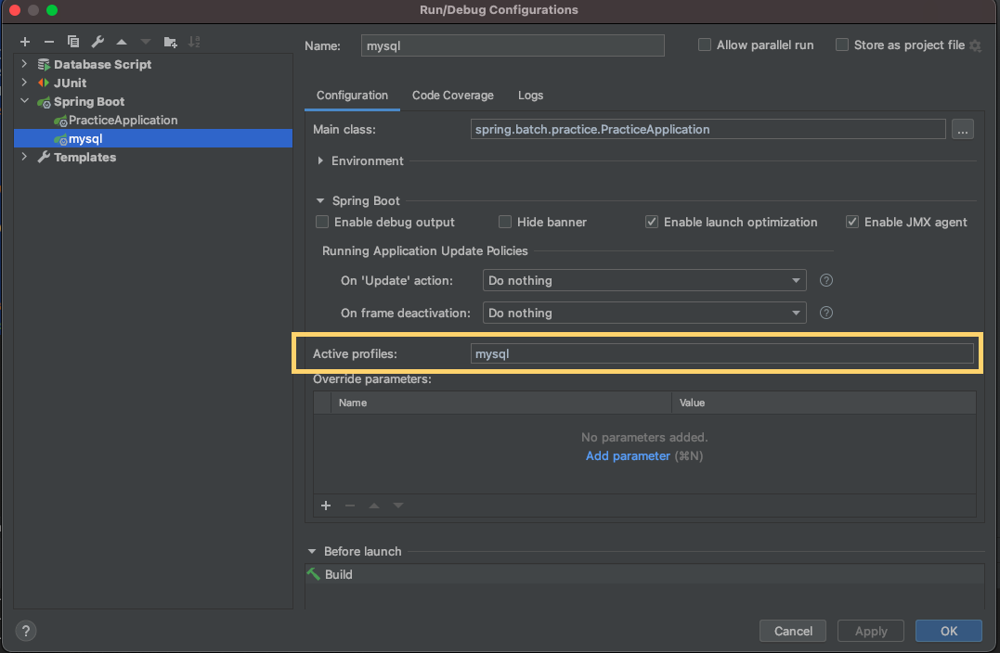

# Spring Boot Batch 시작

## Config 설정

### @EnableBatchProcessing

```java
import org.springframework.batch.core.configuration.annotation.EnableBatchProcessing;
import org.springframework.boot.SpringApplication;
import org.springframework.boot.autoconfigure.SpringBootApplication;

@SpringBootApplication
@EnableBatchProcessing
public class PracticeApplication {

    public static void main(String[] args) {
        SpringApplication.run(PracticeApplication.class, args);
    }

}
```

```java
@EnableBatchProcessing // 스프링부트 배치 스타터에 미리 정의된 설정들을 실행시키는 어노테이션으로 JobBuilder, StepBuilder 등 다양한 설정 주입
@Configuration
public class TestJobConfig {

    // Job 실행에 필요한 JobLauncher를 필드값으로 갖는 JobLauncherTestUtils를 빈으로 등록
    @Bean
    public JobLauncherTestUtils jobLauncherTestUtils(){
        return new JobLauncherTestUtils();
    }
}
```

배치 작업에 필요한 빈을 미리 등록하여 사용할 수 있도록 해준다. 

| 기본 포함 bean               | bean name          |
| ---------------------------- | ------------------ |
| `JobRepository`              | jobRepository      |
| `JobLauncher`                | jobLauncher        |
| `JobRegistry`                | jobRegistry        |
| `PlatformTransactionManager` | transactionManager |
| `JobBuilderFactory`          | jobBuilders        |
| `StepBuilderFactory`         | stepBuilders       |

#### DefaultBatchConfiguerer

만약 커스텀이 필요한 경우 `DefaultBatchConfiguerer`을 상속받아 필요한 설정만 재정의 하여 사용할 수 있다. 예를 들어, 여러 개의 DB에 접근하고 싶어 `DataSource`를 여러개 설정해야하는 경우이다.

```java
@Configuration
public class DatabaseConfig {
    @Bean
    @Primary
    public DataSource dataSource()
    {
        return .........;
    }
}
```

```java
@Configuration
@EnableBatchProcessing
@ComponentScan(basePackageClasses = DefaultBatchConfigurer.class)
public class MyBatchConfig {
}
```

- 참고 : [https://stackoverflow.com/questions/25540502/use-of-multiple-datasources-in-spring-batch](https://stackoverflow.com/questions/25540502/use-of-multiple-datasources-in-spring-batch)

## MySQL 환경에서 Spring Batch  실행하기

Spring Batch에서는 메타 데이터 테이블이 필요하다. 

- 이전에 실행한 Job 정보
- 최근 실패한 Batch Parameter가 어떤 것들이 있고, 성공한 Job은 어떤 것들인지
- 다시 실행한다면 어디서 부터 시작할지
- 어떤 Job에 어떤 Step이 있고, Step들 중 성공한 Step과 실패한 Step들은 어떤 것들이 있는지


기본적으로 H2 DB를 사용할 경우에는 해당 테이블을 Boot가 실행될때 자동으로 생성해주지만, **MySQL, Oracle**과 같은 DB는 개발자가 직접 생성해주어야 한다. 해당 sql문을 차례대로 실행해주면 된다.





## MySql, H2 Database 연결하기

### pom.xml

```xml
				<dependency>
            <groupId>com.h2database</groupId>
            <artifactId>h2</artifactId>
            <scope>runtime</scope>
        </dependency>
        <dependency>
            <groupId>mysql</groupId>
            <artifactId>mysql-connector-java</artifactId>
            <scope>runtime</scope>
        </dependency>
```

### application.yml

```yaml
spring:
  profiles:
    active: local
---
spring:
  profiles: local
  datasource:
    hikari:
      jdbc-url: jdbc:h2:mem:testdb;DB_CLOSE_DELAY=-1;DB_CLOSE_ON_EXIT=FALSE
      username: sa
      password:
      driver-class-name: org.h2.Driver
---
spring:
  profiles: mysql
  datasource:
    hikari:
      jdbc-url: jdbc:mysql://127.0.0.1:3306/spring_batch?serverTimezone=UTC
      username: ${user_name}
      password: ${password}
      driver-class-name: com.mysql.jdbc.Driver
```



Active profiles에 설정한 값이 `spring-profiles` 값이다. 다음과 같이 설정 후 실행해주면 mysql이 기본 DB로 실행되는 것을 볼 수 있다.

## 참고

- [기억보단 기록을-2.Spring Batch 가이드 - Batch Job 실행해보기](https://jojoldu.tistory.com/325?category=902551)
