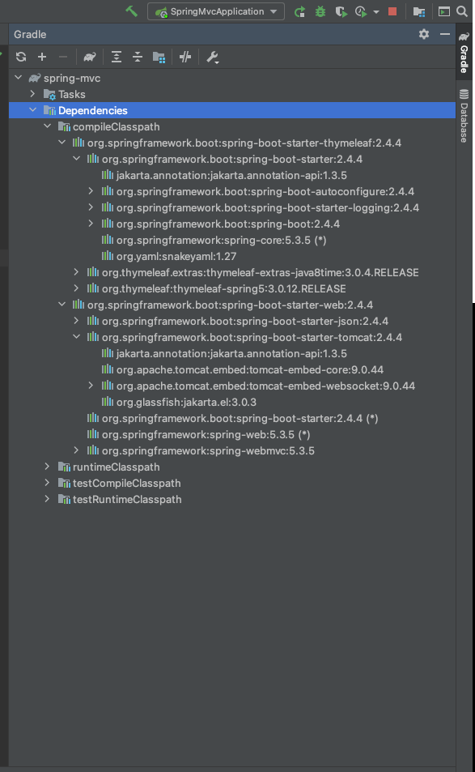

#빌드 도구

빌드 도구란, **빌드 자동화를 통해 실행가능한 프로그램(애플리케이션)을 만들어 주는 프로그램**을 말한다. 

- 빌드 : 소스코드 파일들을 컴퓨터에서 실행할 수 있는 소프트웨어로 변환하는 일련의 과정으로, compile, test, deploy 등 모든 과정의 집합

대표적인 빌드 도구 종류에는 Ant, Maven, Gradle이 있다.

## Ant

Ant의 가장 큰 장점은 개발자가 자유롭게 빌드 단위(target)을 지정하고 빌드 단위간의 의존관계를 자유롭게 설정할 수 있다는 것이다. 하지만 자유도가 높다는 것은 잘 활용할 경우 좋은 도구가 될 수 있지만 그렇지 않을 경우 애물단지로 전락할 가능성이 있다.

- XML 기반 빌드 스크립트(`build.xml`)
- 규칙이 없음
- 절차적
- 생명주기를 갖지 않아 각각의 target에 대한 의존성을 직접 정의 해줘야한다.

#### 단점

- 유연성이 높지만, 프로젝트가 복잡해지는 경우 build 과정의 이해가 어렵다
- XML, Remote Repository를 가져올 수 없다
- **스크립트의 재사용이 어렵다.**

## [Maven](./2020-03-16-maven.md)

- Apache Maven은 자바용 프로젝트 관리도구로 Apache Ant의 대안으로 만들어짐
- 프로젝트의 전체적인 라이프 사이클을  관리하는 도구
- `pom.xml` 파일에 필요한 라이브러리를 정의해 두면, 해당 라이브러리가 작동하는 의존성 라이브러리들까지 관리하여, 자동으로 다운로드 받아줌
- 간단한 설정을 통한 배포 관리가 가능

라이브러리가 서로 종속되어있을 경우 XML이 복잡해지며, 계층적인 데이터를 표현하기에는 좋지만, 플로우나 조건부 상황을 표현하기 어렵다는 단점이 있다.

## Gradle

- 현재 가장 많이 사용되는 빌드 도구
- Gradle은 프로젝트를 위한 범용 빌드 도구이다. 안드로이드 스튜디오에서 기본 빌드시스템으로 사용
- **Ant의 유연성(기본적인 빌드 도구 기능)과 효과적인 빌드 툴인 Maven의 편리성(의존 라이브러리 관리 기능)을 조합**하여 많은 오픈소스 프로젝트의 빌드 시스템으로 채택되고 있다
- xml 언어에 대한 단점도 Groovy 언어(JVM 환경언어)를 사용해 해결
  - Gradle은 Groovy DSL로 작성하며, 설정 정보는 변수에 값을 넣는 형태로, 동적인 빌드는 Groovy 스크립트로 Gradle용 플러그인을 호출하거나 직접 코드를 짤 수 있다.

기본적으로 프로젝트 하위에 `build.gradle` 파일로 생성이 되며, 프로젝트에서 사용할 라이브러리와 버전을 관리할 수 있다.

```gradle
plugins {
	id 'org.springframework.boot' version '2.4.4'
	id 'io.spring.dependency-management' version '1.0.11.RELEASE'
	id 'java'
}

group = 'dh0023'
version = '0.0.1-SNAPSHOT'
sourceCompatibility = '11' // java version

repositories {
	mavenCentral() // mavenCentral에서 다운 받음
}

dependencies {
	implementation 'org.springframework.boot:spring-boot-starter-thymeleaf'
	implementation 'org.springframework.boot:spring-boot-starter-web'
	testImplementation 'org.springframework.boot:spring-boot-starter-test'
}

test {
	useJUnitPlatform()
}
```

- `sourceCompatibility` : Java Version
- `dependencies` : 라이브러리 의존성 관리

만약 인텔리제이로 프로젝트 실행시에 Build and run이 Gradle로 되어있으면, 실행 속도가 느린 경우가 있으므로 아래와 같이 설정을 intellij로 변경해주는 것이 좋다.




다음과 같이 Gradle 에서 의존성을 확인할 수 있다.

### CLI로 빌드하기

```bash
$ gradlew build
Welcome to Gradle 6.8.3!

Here are the highlights of this release:
 - Faster Kotlin DSL script compilation
 - Vendor selection for Java toolchains
 - Convenient execution of tasks in composite builds
 - Consistent dependency resolution

For more details see https://docs.gradle.org/6.8.3/release-notes.html

Starting a Gradle Daemon, 1 incompatible Daemon could not be reused, use --status for details

> Task :test
2021-04-12 00:28:06.153  INFO 12948 --- [extShutdownHook] o.s.s.concurrent.ThreadPoolTaskExecutor  : Shutting down ExecutorService 'applicationTaskExecutor'

BUILD SUCCESSFUL in 1m 37s
6 actionable tasks: 6 executed
```

다음처럼 build를 수행하면  프로젝트 하위에 build(`{project명}/build/` )가 생성된 것을 볼 수 있다.

```bash
$ cd ./build/libs
$ ls -trl
total 36712
-rw-r--r--  1 dh0023  staff  18794659  4 12 00:27 spring-mvc-0.0.1-SNAPSHOT.jar
```

`/builds/libs` 하위에 `jar`파일이 생성된 것을 볼 수 있으며,

```bash
$ java -jar ./spring-mvc-0.0.1-SNAPSHOT.jar

  .   ____          _            __ _ _
 /\\ / ___'_ __ _ _(_)_ __  __ _ \ \ \ \
( ( )\___ | '_ | '_| | '_ \/ _` | \ \ \ \
 \\/  ___)| |_)| | | | | || (_| |  ) ) ) )
  '  |____| .__|_| |_|_| |_\__, | / / / /
 =========|_|==============|___/=/_/_/_/
 :: Spring Boot ::                (v2.4.4)

2021-04-12 00:29:14.647  INFO 14240 --- [           main] dh0023.springmvc.SpringMvcApplication    : Starting SpringMvcApplication using Java 15.0.2 on dahyeui-MacBook-Pro.local with PID 14240 (/Users/dh0023/Develop/spring/spring-mvc/build/libs/spring-mvc-0.0.1-SNAPSHOT.jar started by dh0023 in /Users/dh0023/Develop/spring/spring-mvc/build/libs)
2021-04-12 00:29:14.653  INFO 14240 --- [           main] dh0023.springmvc.SpringMvcApplication    : No active profile set, falling back to default profiles: default
2021-04-12 00:29:15.049  INFO 14240 --- [           main] .e.DevToolsPropertyDefaultsPostProcessor : For additional web related logging consider setting the 'logging.level.web' property to 'DEBUG'
2021-04-12 00:29:20.242  INFO 14240 --- [           main] o.s.b.w.embedded.tomcat.TomcatWebServer  : Tomcat initialized with port(s): 8080 (http)
2021-04-12 00:29:20.287  INFO 14240 --- [           main] o.apache.catalina.core.StandardService   : Starting service [Tomcat]
2021-04-12 00:29:20.288  INFO 14240 --- [           main] org.apache.catalina.core.StandardEngine  : Starting Servlet engine: [Apache Tomcat/9.0.44]
2021-04-12 00:29:20.673  INFO 14240 --- [           main] o.a.c.c.C.[Tomcat].[localhost].[/]       : Initializing Spring embedded WebApplicationContext
2021-04-12 00:29:20.674  INFO 14240 --- [           main] w.s.c.ServletWebServerApplicationContext : Root WebApplicationContext: initialization completed in 5622 ms
2021-04-12 00:29:21.827  INFO 14240 --- [           main] o.s.s.concurrent.ThreadPoolTaskExecutor  : Initializing ExecutorService 'applicationTaskExecutor'
2021-04-12 00:29:23.268  INFO 14240 --- [           main] o.s.b.w.embedded.tomcat.TomcatWebServer  : Tomcat started on port(s): 8080 (http) with context path ''
2021-04-12 00:29:23.294  INFO 14240 --- [           main] dh0023.springmvc.SpringMvcApplication    : Started SpringMvcApplication in 12.135 seconds (JVM running for 14.029)
```

로 스프링 서비스를 실행할 수 있다.

만약에 생성된 빌드를 지우고 싶으면 `gradlew clean` 을 수행하면된다.

```bash
$ gradlew clean

BUILD SUCCESSFUL in 2s
1 actionable task: 1 executed
 ~/Develop/spring/spring-mvc 
$ ls -trl                             
total 56
drwxr-xr-x@ 4 dh0023  staff   128  4 11 13:21 src
-rw-r--r--@ 1 dh0023  staff    32  4 11 13:21 settings.gradle
-rw-r--r--@ 1 dh0023  staff  2763  4 11 13:21 gradlew.bat
-rwxr-xr-x@ 1 dh0023  staff  5766  4 11 13:21 gradlew
drwxr-xr-x@ 3 dh0023  staff    96  4 11 13:21 gradle
-rw-r--r--@ 1 dh0023  staff  1435  4 11 13:21 HELP.md
-rw-r--r--  1 dh0023  staff   124  4 11 22:24 README.md
drwxr-xr-x  4 dh0023  staff   128  4 12 00:20 out
-rw-r--r--@ 1 dh0023  staff   634  4 12 00:21 build.gradle
```


## Gradle vs Maven

- Maven은 Build라는 동적인 요소를 XML로 정의하기에 어려운 부분이 많다.
  - 설정 내용이 길어지고 가독성이 떨어짐
  - 의존 관계가 복잡한 프로젝트 설정하기에 부적절
  - 상속 구조를 이용한 멀티 모듈 구현
  - 특정 설정을 소수의 모듈에서 공유하기 위해서는 부모 프로젝트를 생성하여 상속하게 해야함(상속의 단점)
-  Gradle은 Groovy DSL을 사용하기 때문에, 동적인 빌드는 빌드 스크립트로 플러그인을 호출하거나 직접 코드를 짤 수 있다.
  - Configuration Injection 방식을 사용해 공통 모듈을 상속해서 사용하는 단점 커버
  - 설정 주입시 프로젝트의 조건을 확인할 수 있어서 프로젝트별로 주입되는 설정을 다르게 할 수 있다.

## 참고

- [https://galid1.tistory.com/194](https://galid1.tistory.com/194)
- [https://velog.io/@dnstlr2933/%EC%9E%90%EB%B0%94-%EB%B9%8C%EB%93%9C-%EB%8F%84%EA%B5%AC](https://velog.io/@dnstlr2933/%EC%9E%90%EB%B0%94-%EB%B9%8C%EB%93%9C-%EB%8F%84%EA%B5%AC)
- [https://hyojun123.github.io/2019/04/18/gradleAndMaven/](https://hyojun123.github.io/2019/04/18/gradleAndMaven/)
- [https://bkim.tistory.com/13](https://bkim.tistory.com/13)


