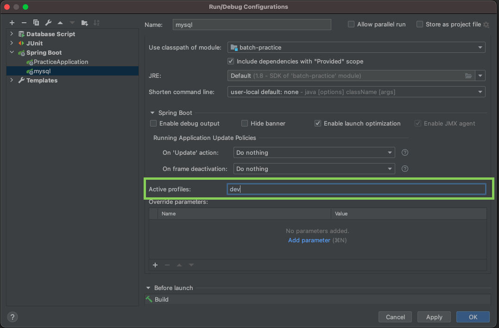

# YAML

기존에는 환경 프로퍼티 설정시에 `.propeties` 파일을 많이 사용했지만, 최근에는 표현의 한계로 YAML 파일(`.yml`)을 더 많이 사용한다.

```yaml
# 공통 부분(프로파일과 무관)
server:
	port: 80

--- 

spring:
	active:
		profiles: dev
server:
	port: 8081

--- 

spring:
	active:
		profiles: qa
server:
	port: 8082

--- 

spring:
	active:
		profiles: prod
server:
	port: 9091
```

YAML 파일에서 프로퍼티 설정을 구분할 때 `---`을 기준으로 설정값을 나눈다.

또는 `application-{profile}.yml` 로 파일을 생성하면 된다. `{profile}`에 원하는 프로파일 값으로 파일을 추가하면 애플리케이션 실행 시 지정한 프로파일 값을 바탕으로 실행된다.
`application.yml`은 디폴트 프로퍼티 값이며, `application-{profile}.yml`보다 우선순위가 낮다.

```bash
$ java -jar ... -D spring.profiles.actvie=dev
```
다음 명령어로 프로파일 값을 활성화할 수 있다.

- intellij

  


## 파일 매핑하기

| 기능            | `@Value` | `@ConfigurationProperties` |
| --------------- | -------- | -------------------------- |
| 유연한 바인딩   | X        | O                          |
| 메타데이터 지원 | X        | O                          |
| SpEL 평가       | O        | X                          |

- 유연한 바인딩 : 프로퍼티 값을 객체에 바인딩할 경우 필드를 Camel 표기법으로 선언하고, 프로퍼티의 키는 다양한 형식으로 선언하여 바인딩할 수 있다.

  ```java
  @Data
  @ConfigurationProperties("fruit")
  public class FruitProperties{
    private String colorName;
  }
  ```

  ```yaml
  # 스프링부트 2.0부터 Kebeb 표기법과 소문자표기법만 지원
  fruit.color-name:
  fruit.colorname:
  ```

- 메타데이터 지원: 프로퍼티의 키에 대한 정보를 메타데이터 파일로 제공한다. 키의 이름, 타입, 설명, 디폴트값 등 키사용에 앞서 힌트가 되는 정볼르 얻을 수 있다.

- SpEL(Spring Expression Language) 평가 : SpEL은 런타임에 객체 참조에 대해 질의하고 조작하는 기능을 지원하는 언어이다. 메서드 호출 및 기본 문자열 템플릿 기능을 제공한다.

### @Value

프로퍼티의 키를 사용해 특정 값을 호출할 수 있다. 키를 정확히 입력해야하며, 값이 없는 경우에 대해 예외 처리가 필요하다.

```yaml
property:
	test:
		name: property depth test
propertyTest: test
propertyTestList: a,b,c
```

```java
@RunWith(SpringRunner.class)
@SpringBootTest
public class AutoconfigurationApplicationTest{
  // depth가 존재하는 키값은 .으로 구분해 매핑
  @Value("${property.test.name}")
  private String propertyTestName;
  
  // 단일키값 매핑
  @Value("${propertyTest}")
  private String propertyTest;
  
  // 여러 값을 배열형으로 매핑
  @Value("${propertyTestList}")
  private String[] propertyTestArray;
  
  // 키가 없는 경우 디폴트 값이 매핑되도록 설정
  @Value("${noKey:default value}")
  private String defaultValue;
  
  // SpEL을 사용해 List에 매핑
  @Value("#{'${propertyTestList}'.split(,)}")
  private List<String> propertyTestList;
  
  @Test
  public void testValue(){
    assertThat(propertyTestName, is("property depth test"));
    
    assertThat(propertyTest, is("test"));
    
    assertThat(propertyTestArray[0], is("a"));
    assertThat(propertyTestArray[1], is("b"));
    assertThat(propertyTestArray[2], is("c"));
    
    assertThat(defaultValue, is("default value"));
    
    assertThat(propertyTestList.get(0), is("a"));
    assertThat(propertyTestList.get(1), is("b"));
    assertThat(propertyTestList.get(2), is("c"));
    
  }
}
```

YAML에 설정한 키값을 `@Value` 프로퍼티 값으로 주면 해당 값이 필드에 할당되며, 주로 단일 필드값을 가져오는데 사용한다.


### @ConfigurationProperties

`@ConfigurationProperties`는 다양한 형의 프로퍼티 값을 매핑할 수 있다. `@ConfigurationProperties`는 기본적으로 접두사(prefix)를 사용해 값을 바인딩한다.

```yaml
fruit:
	list:
		- name: banana
		  color: yellow
		- name: apple
		  color: red
```

```java
@Data
@Component
@ConfigurationProperties("fruit")
public class FruitProperties{
  private List<Map> list;
}
```

`@ConfigurationProperties`를 사용하려면 해당 클래스를 `@Component`로 선언해야 사용하는 곳에서 의존성 주입이 가능하다. 위의 예에서는 접두사가 fruit인 프로퍼티 값을 읽어와서 설정한다.

`application.yml`이 아닌 다른 이름의 YAML 파일을 따로 생성해서 관리하는 경우에는 아래와 같이 사용하면 된다.

```yaml
@ConfigurationProperties(prefix = "fruit")
```

```java
@RunWith(SpringRunner.class)
@SpringBootTest
public class AutoconfigurationApplicationTest{
  @Autowired
  FruitPoperty;
  
  @Test
  public void propertyTest(){
    List<Map> fruitData = fruitProperty.getList();
    
    assertThat(propertyTestList.get(0).get("name"), is("banana"));
    assertThat(propertyTestList.get(0).get("color"), is("yellow"));
    assertThat(propertyTestList.get(1).get("name"), is("apple"));
    assertThat(propertyTestList.get(1).get("color"), is("red"));
    
  }
}
```

#### POJO 타입 매핑

```java
@Data
public class Fruit{
  private String name;
  private String color;
}
```

```java
@Data
@Component
@ConfigurationProperties("fruit")
public class FruitProperties{
  private List<Fruit> list;
}
```

```java
@RunWith(SpringRunner.class)
@SpringBootTest
public class AutoconfigurationApplicationTest{
  @Autowired
  FruitPoperty;
  
  @Test
  public void propertyTest(){
    List<Map> fruitData = fruitProperty.getList();
    
    assertThat(propertyTestList.get(0).getName(), is("banana"));
    assertThat(propertyTestList.get(0).getColor(), is("yellow"));
    assertThat(propertyTestList.get(1).getName(), is("apple"));
    assertThat(propertyTestList.get(1).getColor(), is("red"));
    
  }
}
```