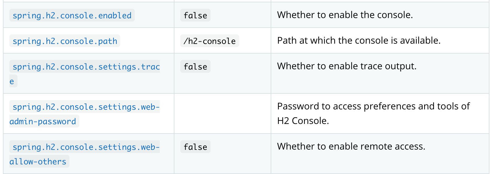
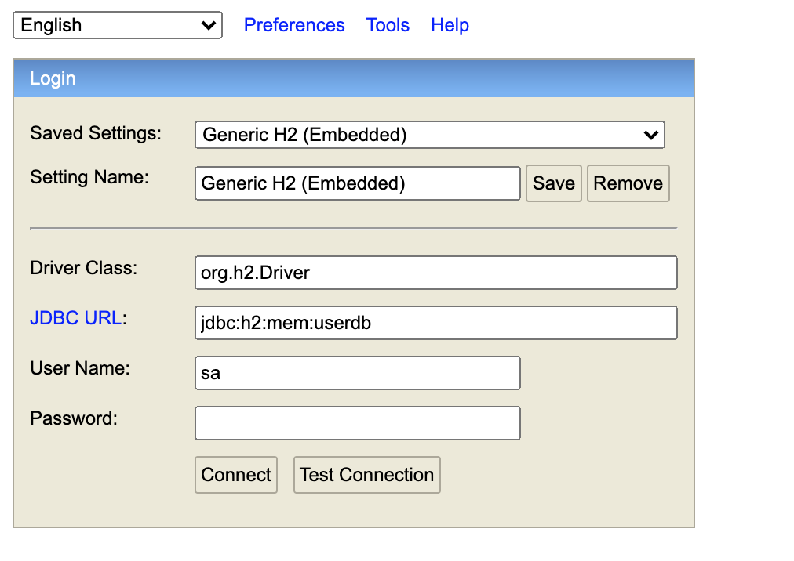
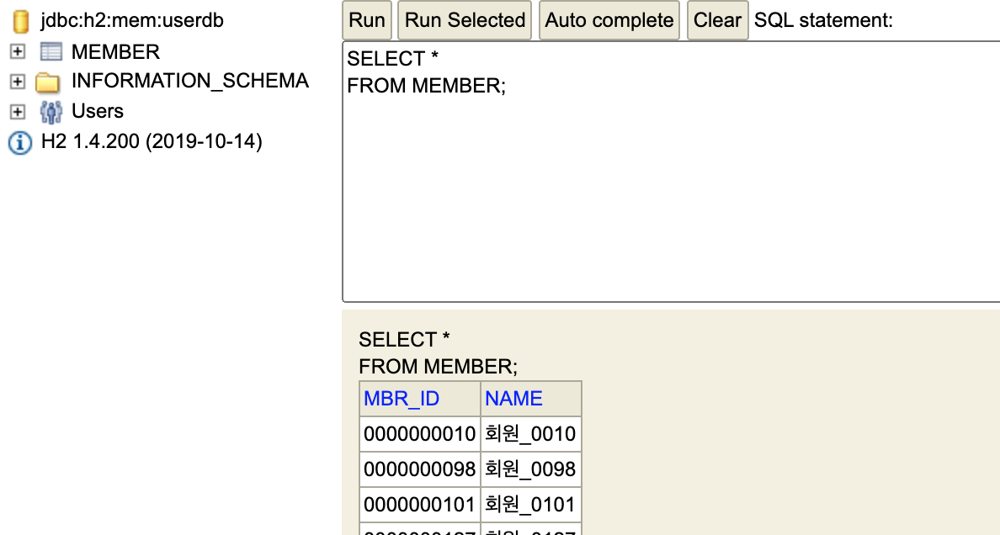

# SpringBoot H2

H2 DB는 컴퓨터에 내장된 램(RAM) 메모리에 의존하는 자바 기반의 RDBMS이다. 용량이 적고, 브라우저 기반의 콘솔 등을 지원해 장점이 많다. 또한, SpringBoot에서 별도 DB를 설치하지 않고 바로 사용할 수 있는 것도 장점이다. 메모리 데이터베이스로 보통 테스트용으로만 쓰인다.


## Gradle

```
implementation 'org.springframework.boot:spring-boot-starter-data-jpa'
runtimeOnly 'com.h2database:h2'
```

H2 의존성을 `build.gradle`에 추가해준다. `runtimeOnly` 로 런타임시점에만 의존하도록 변경해 주었다.

## 스프링 부트 자동 설정

빈을 등록해 H2 콘솔을 사용할 수 있으나, 스프링 부트 자동설정으로 H2를 설정할 수 있다.

스프링 부트 자동 설정 프로퍼티 문서를 살펴보면 다음과 같은 값이 있다.



`spring.h2.console.enabled`는 콘솔 사용여부 값으로 false가 디폴트 값이며, 이 값을 true로만 변경하면 별도 빈 설정을 해주지 않아도 된다.


### 프로퍼티 값 설정(`application.yml`)

```yaml
spring:
  h2:
    console:
      enabled: true # 콘솔 사용여부
  profiles:
    active: local
  # H2 메모리 DB를 위한 설정
  datasource:
    driver-class-name: org.h2.Driver
    url: jdbc:h2:mem:userdb;DB_CLOSE_DELAY=-1
    username: sa
    password:
```

[http://localhost:8080/h2-console](http://localhost:8080/h2-console)로 들어가면 아래 창이 뜨고, 위에서 설정한 프로퍼티 값으로 로그인을 할 수 있다.



## 테이블, 데이터 생성

spring은 기본값으로 classpath 루트에 `schema.sql`과 `data.sql` 파일이 있다면 서버 시작 시 스크립트를 실행한다.

- `src/main/java/resources/schema.sql` : 테이블 스키마(DDL)

  ```sql
  --
  -- 회원
  --
  DROP TABLE IF EXISTS MEMBER;
  
  CREATE TABLE MEMBER COMMENT '회원' (
      MBR_ID      VARCHAR(10)     NOT NULL    COMMENT '회원ID'
    , NAME        VARCHAR(100)                COMMENT '회원명'
    , PRIMARY KEY (MBR_ID)
  );
  
  ```

- `src/main/java/resources/data.sql` : DML

  ```sql
  INSERT INTO MEMBER
      (MBR_ID, NAME)
  VALUES ('0000000010', '회원_0010')
       , ('0000000098', '회원_0098')
       , ('0000000101', '회원_0101')
  ;
  ```

위 두개 파일을 생성후 다시 서버를 재시작하면 `schema.sql`의  `MEMBER` 테이블이 생성되었고, `data.sql`에 선언된 데이터들도 추가된 것을 확인할 수 있다.



특정 환경에 맞는 SQL을 실행시키고 싶은 경우에는 프로퍼티 설정을 추가해주면된다.

```properties
spring.datasource.platfrom= {platform}
```

그런후 플랫폼에 맞게 `schema-{platform}.sql` , `data-{platform}.sql` 을 생성하면 해당 플랫폼 스크립트가 실행된다. 기본적으로는 메모리 DB가 아닌경우 스크립드 문을 실행시키지 않는다.

메모리 DB가 아닌 경우에도 실행시키고 싶다면 아래 프로퍼티를 `always`로 설정해주면 된다.

```properties
spring.datasource.initialization-mode=always
```

초기화 설정을 하고싶지 않은 경우에는 `never` 설정을 하면된다.

```properties
spring.datasource.initialization-mode=never
```


## 참고

- [wan-blog | Spring 데이터베이스 Schema 및 Data 초기설정하기](https://wan-blog.tistory.com/52)

