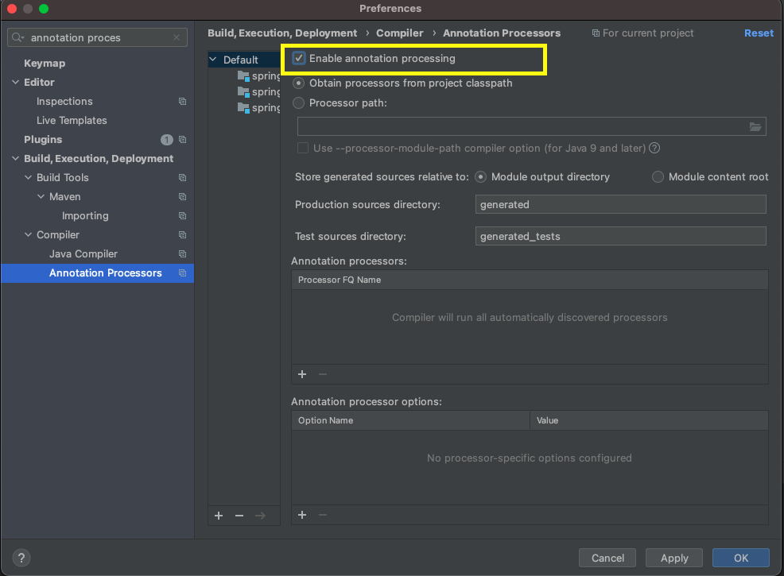
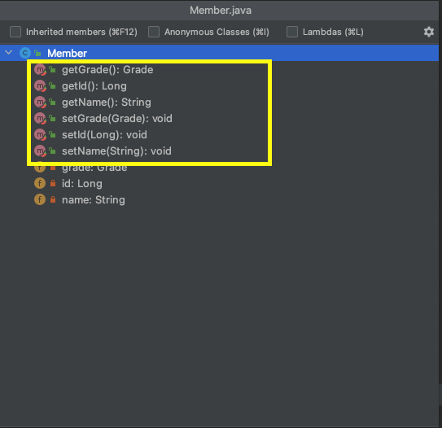
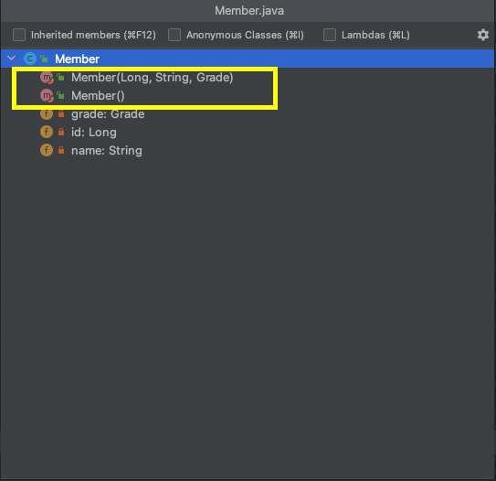
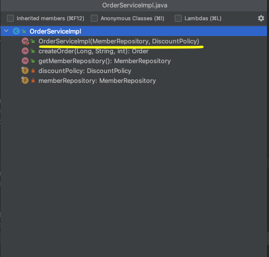

# Lombok 라이브러리 사용하기

## Gradle 설정

- [공식페이지](https://projectlombok.org/setup/gradle)
- build.gradle에 다음 롬복설정을 추가해준다.

```yaml
configurations {
	compileOnly {
		extendsFrom annotationProcessor
  }
}

repositories {
	mavenCentral()
}

dependencies {
	compileOnly 'org.projectlombok:lombok:1.18.20'
	annotationProcessor 'org.projectlombok:lombok:1.18.20'
	
	testCompileOnly 'org.projectlombok:lombok:1.18.20'
	testAnnotationProcessor 'org.projectlombok:lombok:1.18.20'
}
```

추가후에 반드시 아래 설정을 해줘야한다.

- Preferences -> Compiler -> Annotation Processors



Enable annotation processing을 반드시 설정해줘야한다.

## @Getter / @Setter

접근자(`getXxx()`)와 설정자(`setXxx()`)를 자동으로 생성해준다.

```java
package dh0023.springcore.member.domain;

import lombok.Getter;
import lombok.Setter;

@Getter
@Setter
public class Member {

    private Long id;
    private String name;
    private Grade grade;
    
}
```

다음과 같이 자동으로 getter와 setter가 생성된 것을 확인할 수 있다.



## 생성자 자동 생성

### @NoArgsConstructor

파라미터가 없는 생성자를 자동으로 생성해준다.

### @AllArgsConstructor

모든 필드 값을 파라미터로 받는 생성자를 생성해준다.

```java
@NoArgsConstructor
@AllArgsConstructor
public class Member {

    private Long id;
    private String name;
    private Grade grade;

}
```




### @RequiredArgsConstructor

`@RequiredArgsConstructor` 어노테이션은 `final`이나 `@NonNull`인 필드 값만 파라미터로 받는 생성자를 만들어준다.

이렇게 생성하면, 코드가 훨씬 깔끔해지고 간편한 것을 확인할 수 있다.

```java
@Component
public class OrderServiceImpl implements OrderService{

    // final은 반드시 값이 있어야한다.
    private final MemberRepository memberRepository;
    private final DiscountPolicy discountPolicy;

    public OrderServiceImpl(MemberRepository memberRepository, DiscountPolicy discountPolicy) {
        this.memberRepository = memberRepository;
        this.discountPolicy = discountPolicy;
    }
}

```

위와 같이 생성자를 직접 만들어줄 필요 없이 해당 어노테이션만 별도로 설정해주면 된다.

```java
@Component
@RequiredArgsConstructor
public class OrderServiceImpl implements OrderService{

    // final은 반드시 값이 있어야한다.
    private final MemberRepository memberRepository;
    private final DiscountPolicy discountPolicy;
}
```

intelliJ에서 `command + F12`로 해당 클래스의 메서드와 변수를 확인할 수 있는데, 아래와 같이 생성자가 생성된 것을 확인할 수 있다.



## @ToString

`toString()` 메소드도 lombok의 `@ToString` 어노테이션으로 간단하게 생성할 수 있다. 또한, `exclude` 옵션으로 특정 필드를 제외할 수 있다.

```java
@Getter
@Setter
@ToString(exclude = "grade")
@AllArgsConstructor
public class Member {

    private Long id;
    private String name;
    private Grade grade;

}
```

```java
public class LombokTest {
    @Test
    @DisplayName("toString() 테스트")
    void getToString() {
        Member member = new Member(1L, "test123", Grade.VIP);

        System.out.println(member);
    }
}
```

```
Member(id=1, name=test123)

Process finished with exit code 0
```

`exclude` 에 포함된 필드를 제외하고 전체 출력되는 것을 확인할 수 있다.

## 참고

- [https://www.daleseo.com/lombok-popular-annotations/](https://www.daleseo.com/lombok-popular-annotations/)

- [https://projectlombok.org/contributing/index](https://projectlombok.org/contributing/index)

- [김영한 스프링 핵심 원리 - 기본편](https://inf.run/deVM)

