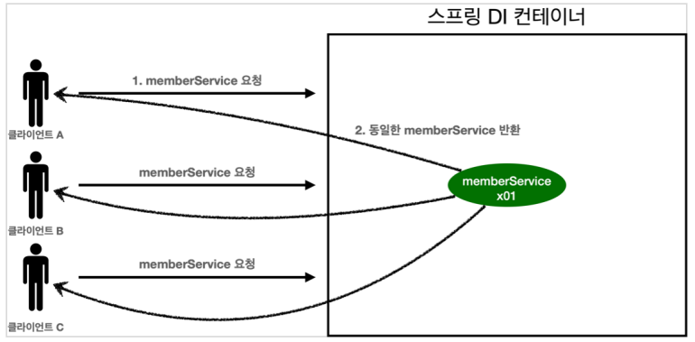
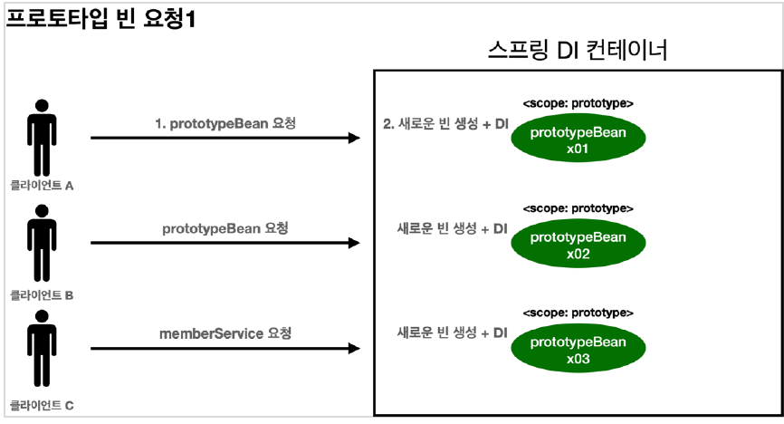
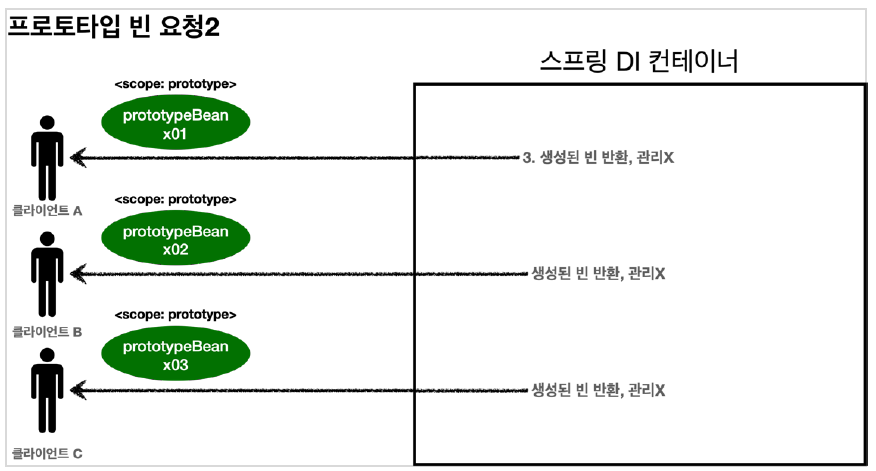

#    빈 스코프

```java
@Scope("{스코프종류}")
@Component
public class prototypeBean {}
```

- 싱글톤 : 기본 스코프, **스프링 컨테이너의 시작과 종료까지 유지되는 가장 넓은 범위의 스코프**
- 프로토타입 : 스프링 컨테이너는 프로토타입 빈의 생성과 의존관리 주입까지만 관여하고 더는 관리하지 않는 매우 짧은 범위의 스코프
- 웹 관련 스코프
  - request: 웹 요청이 들어오고 나갈때까지 유지
  - session: 웹 세션이 생성되고 종료될 때 까지 유지
  - application: 웹의 서블릿 컨텍스와 같은 범위로 유지

## 싱글톤



1. 싱글톤 스코프의 빈을 스프링 컨테이너에 요청
2. 스프링 컨테이너는 본인이 관리하는 스프링 빈 반환
3. 스프링 컨테이너에 같은 요청이 와도 **같은 인스턴스의 스프링 빈 반환**

```java
import org.junit.jupiter.api.Test;
import org.springframework.context.annotation.AnnotationConfigApplicationContext;
import org.springframework.context.annotation.Scope;

import javax.annotation.PostConstruct;
import javax.annotation.PreDestroy;

import static org.assertj.core.api.Assertions.*;

public class SingletonTest {

    @Test
    void singletonBeanFile() {
        AnnotationConfigApplicationContext ac = new AnnotationConfigApplicationContext(SingletonBean.class);
        System.out.println("find singletonBean1");
        SingletonBean singletonBean1 = ac.getBean(SingletonBean.class);
        System.out.println("find singletonBean2");
        SingletonBean singletonBean2 = ac.getBean(SingletonBean.class);

        System.out.println("singletonBean1 = " + singletonBean1);
        System.out.println("singletonBean2 = " + singletonBean2);


        assertThat(singletonBean1).isSameAs(singletonBean2);

        ac.close();
    }

    @Scope("singleton")
    static class SingletonBean {

        @PostConstruct
        public void init() {
            System.out.println("SingletonBean.init");
        }

        @PreDestroy
        public void destroy() {
            System.out.println("SingletonBean.destroy");
        }
    }
}
```

```java
org.springframework.beans.factory.support.DefaultListableBeanFactory - Creating shared instance of singleton bean 'singletonTest.SingletonBean'
SingletonBean.init
find singletonBean1
find singletonBean2
singletonBean1 = dh0023.springcore.scope.SingletonTest$SingletonBean@37e4d7bb
singletonBean2 = dh0023.springcore.scope.SingletonTest$SingletonBean@37e4d7bb
22:55:36.852 [main] DEBUG org.springframework.context.annotation.AnnotationConfigApplicationContext - Closing org.springframework.context.annotation.AnnotationConfigApplicationContext@193f604a, started on Mon May 17 22:55:36 KST 2021
SingletonBean.destroy
```

싱글톤 스코프의 빈은 동일한 빈을 생성하는 것을 확인할 수 있다. 또한 스프링 컨테이너 생성 시점에 초기화 메서드가 실행되며, 스프링컨테이너 종료전 `@PreDestroy` 메서드가 호출되는 것을 확인할 수 있다.

## 프로토타입

스프링 컨테이너는 **프로토타입 빈을 생성하고, 의존관계 주입, 초기화까지만 처리**한다. 프로토타입 빈을 관리할 책음은 프로토타입 빈을 받은 클라이언트에 있다.(`@PreDestroy` 같은 **종료 메서드가 호출되지 않음**.)





1. 프로토타입 스코프 빈을 스프링 컨테이너에 요청
2. 스프링 컨테이너는 이 시점에 프로토 타입 빈을 생성하고, 필요한 의존관계를 주입
3. 스프링 컨테이너는 생성한 프로토타입 빈을 클라이언트에 반환
4. 같은 요청이 와도 항상 새로운 프로토타입 빈을 생성해서 반환

```java
import org.junit.jupiter.api.Test;
import org.springframework.context.annotation.AnnotationConfigApplicationContext;
import org.springframework.context.annotation.Scope;

import javax.annotation.PostConstruct;
import javax.annotation.PreDestroy;

import static org.assertj.core.api.Assertions.assertThat;

public class PrototypeTest {

    @Test
    void PrototypeBeanFile() {
        AnnotationConfigApplicationContext ac = new AnnotationConfigApplicationContext(PrototypeBean.class);
        PrototypeBean prototypeBean1 = ac.getBean(PrototypeBean.class);
        System.out.println("find prototypeBean1");
        PrototypeBean prototypeBean2 = ac.getBean(PrototypeBean.class);
        System.out.println("find prototypeBean2");

        System.out.println("prototypeBean1 = " + prototypeBean1);
        System.out.println("prototypeBean2 = " + prototypeBean2);


        assertThat(prototypeBean1).isNotSameAs(prototypeBean2);

        ac.close();

    }

    @Scope("prototype")
    static class PrototypeBean {

        @PostConstruct
        public void init() {
            System.out.println("PrototypeBean.init");
        }

        @PreDestroy
        public void destroy() {
            System.out.println("PrototypeBean.destroy");
        }
    }
}

```

```java
DEBUG org.springframework.beans.factory.support.DefaultListableBeanFactory - Creating shared instance of singleton bean 'org.springframework.context.annotation.internalCommonAnnotationProcessor'
PrototypeBean.init
find prototypeBean1
PrototypeBean.init
find prototypeBean2
prototypeBean1 = dh0023.springcore.scope.PrototypeTest$PrototypeBean@37e4d7bb
prototypeBean2 = dh0023.springcore.scope.PrototypeTest$PrototypeBean@6f7923a5
22:44:40.464 [main] DEBUG org.springframework.context.annotation.AnnotationConfigApplicationContext - Closing org.springframework.context.annotation.AnnotationConfigApplicationContext@193f604a, started on Mon May 17 22:44:40 KST 2021

Process finished with exit code 0
```

- 스프링 컨테이너에서 빈을 조회할때 생성된다. (초기화 2번된 것 확인 가능)
- prototypeBean1과 prototypeBean2의 주소가 다른것을 확인할 수 있다. 즉, 새로운 빈을 생성한다.
- 또한, 프로토타입 빈은 스프링 컨테이너가 생성, 의존관계 주입, 초기화 까지 관여하므로 스프링 컨테이너 종료시 `@PreDestroy` 종료메서드인  `destroy()` 가 호출되지 않은 것을 확인할 수 있다.

만약 프로토타입 빈을 종료하고 싶은 경우에는 직접 아래와 같이 해당 메서드를 호출해줘야한다.

```java
// destroy 필요시 직접 호출 필요
prototypeBean1.destroy();
prototypeBean2.destroy();
```


### 프로토타입 스코프를 싱글톤 빈과 함께 사용하고 싶다면?

싱글톤 빈과 프로토타입 빈을 함께 사용할 때, 매번 새로운 프로토타입 빈을 생성하고 싶은 경우에는 `Provider`를 이용하면된다. 

#### ObjectProvider

```java
package org.springframework.beans.factory;

import java.util.Iterator;
import java.util.function.Consumer;
import java.util.function.Supplier;
import java.util.stream.Stream;

import org.springframework.beans.BeansException;
import org.springframework.lang.Nullable;

/**
 * A variant of {@link ObjectFactory} designed specifically for injection points,
 * allowing for programmatic optionality and lenient not-unique handling.
 *
 * <p>As of 5.1, this interface extends {@link Iterable} and provides {@link Stream}
 * support. It can be therefore be used in {@code for} loops, provides {@link #forEach}
 * iteration and allows for collection-style {@link #stream} access.
 *
 * @author Juergen Hoeller
 * @since 4.3
 * @param <T> the object type
 * @see BeanFactory#getBeanProvider
 * @see org.springframework.beans.factory.annotation.Autowired
 */
public interface ObjectProvider<T> extends ObjectFactory<T>, Iterable<T> {

	/**
	 * Return an instance (possibly shared or independent) of the object
	 * managed by this factory.
	 * <p>Allows for specifying explicit construction arguments, along the
	 * lines of {@link BeanFactory#getBean(String, Object...)}.
	 * @param args arguments to use when creating a corresponding instance
	 * @return an instance of the bean
	 * @throws BeansException in case of creation errors
	 * @see #getObject()
	 */
	T getObject(Object... args) throws BeansException;

	...
}

```

지정한 빈을 컨테이너에서 대신 찾아주는 DL(Dependency Lookup - 의존관계를 찾음) 서비스를 제공한다.

이때 `ObjectProvider`는 `ObjectFactory` 를 상속받고 있다.

#### ObjectFactory

```java
package org.springframework.beans.factory;

import org.springframework.beans.BeansException;

/**
 * Defines a factory which can return an Object instance
 * (possibly shared or independent) when invoked.
 *
 * <p>This interface is typically used to encapsulate a generic factory which
 * returns a new instance (prototype) of some target object on each invocation.
 *
 * <p>This interface is similar to {@link FactoryBean}, but implementations
 * of the latter are normally meant to be defined as SPI instances in a
 * {@link BeanFactory}, while implementations of this class are normally meant
 * to be fed as an API to other beans (through injection). As such, the
 * {@code getObject()} method has different exception handling behavior.
 *
 * @author Colin Sampaleanu
 * @since 1.0.2
 * @param <T> the object type
 * @see FactoryBean
 */
@FunctionalInterface
public interface ObjectFactory<T> {

	/**
	 * Return an instance (possibly shared or independent)
	 * of the object managed by this factory.
	 * @return the resulting instance
	 * @throws BeansException in case of creation errors
	 */
	T getObject() throws BeansException;

}

```

ObjectFactory의 `getObject()`를 호출하면 내부에서 스프링 컨테이너를 통해 해당 빈을 찾아서 반환한다.

```java
package dh0023.springcore.scope;

import lombok.RequiredArgsConstructor;
import org.assertj.core.api.Assertions;
import org.junit.jupiter.api.Test;
import org.springframework.beans.factory.ObjectProvider;
import org.springframework.beans.factory.annotation.Autowired;
import org.springframework.context.annotation.AnnotationConfigApplicationContext;
import org.springframework.context.annotation.Scope;

import javax.annotation.PostConstruct;
import javax.annotation.PreDestroy;

import static org.assertj.core.api.Assertions.*;

public class SingletonWithPrototypeTest {


    @Test
    void singletonClientUseObjectProvider() {

        AnnotationConfigApplicationContext ac = new AnnotationConfigApplicationContext(ClientBean.class, PrototypeBean.class);

        ClientBean clientBean1 = ac.getBean(ClientBean.class);
        int count1 = clientBean1.logic();
        assertThat(count1).isEqualTo(1);

        ClientBean clientBean2 = ac.getBean(ClientBean.class);
        int count2 = clientBean2.logic();
        assertThat(count2).isEqualTo(1);

    }


    @Scope("singleton")
    static class ClientBean {

        @Autowired
        private ObjectProvider<PrototypeBean> prototypeBeanObjectProvider;

        public int logic() {
            PrototypeBean prototypeBean = prototypeBeanObjectProvider.getObject();
            prototypeBean.addCount();
            return prototypeBean.getCount();
        }
    }

    @Scope("prototype")
    static class PrototypeBean {

        private int count = 0;

        public void addCount() {
            count++;
        }

        public int getCount() {
            return count;
        }

        @PostConstruct
        public void init() {
            System.out.println("PrototypeBean.init " + this);
        }

        @PreDestroy
        public void destroy() {
            System.out.println("PrototypeBean.destroy");
        }
    }


}

```

#### JSR-330 Provider

자바표준 Provider를 사용하려면, 해당 라이브러리를 추가해줘야한다.

- build.gradle

  ```groovy
  implementation 'javax.inject:javax.inject:1'
  ```

```java
public interface Provider<T> {

    /**
     * Provides a fully-constructed and injected instance of {@code T}.
     *
     * @throws RuntimeException if the injector encounters an error while
     *  providing an instance. For example, if an injectable member on
     *  {@code T} throws an exception, the injector may wrap the exception
     *  and throw it to the caller of {@code get()}. Callers should not try
     *  to handle such exceptions as the behavior may vary across injector
     *  implementations and even different configurations of the same injector.
     */
    T get();
}
```

```java
package dh0023.springcore.scope;

import lombok.RequiredArgsConstructor;
import org.assertj.core.api.Assertions;
import org.junit.jupiter.api.Test;
import org.springframework.beans.factory.ObjectProvider;
import org.springframework.beans.factory.annotation.Autowired;
import org.springframework.context.annotation.AnnotationConfigApplicationContext;
import org.springframework.context.annotation.Scope;

import javax.annotation.PostConstruct;
import javax.annotation.PreDestroy;
import javax.inject.Provider;

import static org.assertj.core.api.Assertions.*;

public class SingletonWithPrototypeTest {

     @Test
    void singletonClientUseObjectProvider() {

        AnnotationConfigApplicationContext ac = new AnnotationConfigApplicationContext(ClientBean.class, PrototypeBean.class);

        ClientBean clientBean1 = ac.getBean(ClientBean.class);
        int count1 = clientBean1.logic();
        assertThat(count1).isEqualTo(1);

        ClientBean clientBean2 = ac.getBean(ClientBean.class);
        int count2 = clientBean2.logic();
        assertThat(count2).isEqualTo(1);

    }

    @Scope("singleton")
    static class ClientBean {
        private final PrototypeBean prototypeBean;

        // ClientBean은 싱글톤이고, 최초 주입시에만 PrototypeBean이 생성된다.
        @Autowired
        public ClientBean(PrototypeBean prototypeBean) {
            this.prototypeBean = prototypeBean;
        }

        public int logic() {
            prototypeBean.addCount();
            return prototypeBean.getCount();
        }
    }


    @Scope("singleton")
    static class ClientBean {

        @Autowired
        private Provider<PrototypeBean> prototypeBeanProvider;

        public int logic() {
            PrototypeBean prototypeBean = prototypeBeanProvider.get();
            prototypeBean.addCount();
            return prototypeBean.getCount();
        }
    }

    @Scope("prototype")
    static class PrototypeBean {

        private int count = 0;

        public void addCount() {
            count++;
        }

        public int getCount() {
            return count;
        }

        @PostConstruct
        public void init() {
            System.out.println("PrototypeBean.init " + this);
        }

        @PreDestroy
        public void destroy() {
            System.out.println("PrototypeBean.destroy");
        }
    }


}

```

`prototypeBeanProvider.get()` 을 통해서 항상 새로운 프로토타입 빈이 생성되는 것을 확인할 수 있다.(DL) 자바 표준이며, 기능이 단순하므로 단위테스트를 만들거나 mock 코드를 만들기는 훨씬 쉬워진다.

하지만, 별도 라이브러리가 필요하며, 자바 표준이므로 스프링이 아닌 다른 컨테이너에서도 사용할 수 있다.

## 웹 스코프

- 웹 환경에서만 동작
- 스프링 컨테이너가 해당 스코프의 종료시점까지 관리한다. ( 종료메서드 호출됨 )

#### 종류

1. request: HTTP 요청 하나가 들어오고 나갈 때까지 유지되는 스코프
2. session: HTTP Session과 동일한 생명주기
3. application: 서블릿 컨텍스트(`ServletContext`)와 동일 생명주기
4. websocket: 웹 소켓과 동일한 생명주기

### request

```groovy
 implementation 'org.springframework.boot:spring-boot-starter-web'
```

웹환경이 동작하도록, 해당 라이브러리를 우선 추가해준다.

request 스코프는 동시에 여러 HTTP 요청이 오면 정확히 어떤 요청이 남긴 로그인지 구분할 때 사용하기 좋다.

- request scope object

```java
package dh0023.springcore.common;

import org.springframework.context.annotation.Scope;
import org.springframework.stereotype.Component;

import javax.annotation.PostConstruct;
import javax.annotation.PreDestroy;
import java.util.UUID;

@Component
@Scope("request")
public class MyLogger {

    private String uuid;
    private String requestUrl;

    public void setRequestUrl(String requestUrl) {
        this.requestUrl = requestUrl;
    }


    public void log(String message) {
        System.out.println("[" + uuid + "]" + " [" + requestUrl + "] " + message);
    }

    @PostConstruct
    public void init() {
        uuid = UUID.randomUUID().toString();
        System.out.println("[" + uuid + "] request scope bean create: " + this);
    }

    @PreDestroy
    public void close() {
        System.out.println("[" + uuid + "] request scope bean close: " + this);
    }


}
```

`@Scope("request")` 이므로 HTTP 요청당 하나씩 생성되며, HTTP 요청이 끝나는 시점에 소멸된다.

- controller

```java
package dh0023.springcore.web;

import dh0023.springcore.common.MyLogger;
import lombok.RequiredArgsConstructor;
import org.springframework.beans.factory.ObjectProvider;
import org.springframework.stereotype.Controller;
import org.springframework.web.bind.annotation.RequestMapping;
import org.springframework.web.bind.annotation.ResponseBody;

import javax.servlet.http.HttpServletRequest;

@Controller
@RequiredArgsConstructor
public class LogDemoController {

    private final LogDemoService logDemoService;
    private final ObjectProvider<MyLogger> myLoggerObjectProvider;

    @RequestMapping("log-demo")
    @ResponseBody
    public String logDemo(HttpServletRequest request) {

        String requestUrl = request.getRequestURL().toString();

        MyLogger myLogger = myLoggerObjectProvider.getObject();
        myLogger.setRequestUrl(requestUrl);
        myLogger.log("controller test");
      	

        logDemoService.logic("testId");

        return "OK";
    }
}

```

- service

```java
package dh0023.springcore.web;

import dh0023.springcore.common.MyLogger;
import lombok.RequiredArgsConstructor;
import org.springframework.beans.factory.ObjectProvider;
import org.springframework.stereotype.Service;

@Service
@RequiredArgsConstructor
public class LogDemoService {
    private final ObjectProvider<MyLogger> myLoggerObjectProvider;

    public void logic(String id){

        MyLogger myLogger = myLoggerObjectProvider.getObject();
        myLogger.log("logdemoservice: " + id);
    }
}
```

- [http://localhost:8080/log-demo](http://localhost:8080/log-demo) 요청 

```
44ebd516-6ce7-40ac-8838-1483bd875f17] request scope bean create: dh0023.springcore.common.MyLogger@3a354836
[ac6e0274-80da-4051-9f07-b61e01c6e261] request scope bean create: dh0023.springcore.common.MyLogger@4bb9ebc7
[ac6e0274-80da-4051-9f07-b61e01c6e261] [http://localhost:8080/log-demo] controller test
[44ebd516-6ce7-40ac-8838-1483bd875f17] [http://localhost:8080/log-demo] controller test
[5c0902a9-4401-4629-9bb1-f865d6bda02a] request scope bean create: dh0023.springcore.common.MyLogger@71f75886
[5c0902a9-4401-4629-9bb1-f865d6bda02a] [http://localhost:8080/log-demo] controller test
[4b601885-6795-42e6-a58e-f9ed92dbb819] request scope bean create: dh0023.springcore.common.MyLogger@58c3b813
[4b601885-6795-42e6-a58e-f9ed92dbb819] [http://localhost:8080/log-demo] controller test
[cf41f0c2-05f8-4922-818d-10294f5ea708] request scope bean create: dh0023.springcore.common.MyLogger@d34ed8
[cf41f0c2-05f8-4922-818d-10294f5ea708] [http://localhost:8080/log-demo] controller test
[44ebd516-6ce7-40ac-8838-1483bd875f17] [http://localhost:8080/log-demo] logdemoservice: testId
[ac6e0274-80da-4051-9f07-b61e01c6e261] [http://localhost:8080/log-demo] logdemoservice: testId
[ac6e0274-80da-4051-9f07-b61e01c6e261] request scope bean close: dh0023.springcore.common.MyLogger@4bb9ebc7
[44ebd516-6ce7-40ac-8838-1483bd875f17] request scope bean close: dh0023.springcore.common.MyLogger@3a354836
[5c0902a9-4401-4629-9bb1-f865d6bda02a] [http://localhost:8080/log-demo] logdemoservice: testId
[5c0902a9-4401-4629-9bb1-f865d6bda02a] request scope bean close: dh0023.springcore.common.MyLogger@71f75886
[4b601885-6795-42e6-a58e-f9ed92dbb819] [http://localhost:8080/log-demo] logdemoservice: testId
[4b601885-6795-42e6-a58e-f9ed92dbb819] request scope bean close: dh0023.springcore.common.MyLogger@58c3b813
[cf41f0c2-05f8-4922-818d-10294f5ea708] [http://localhost:8080/log-demo] logdemoservice: testId
[cf41f0c2-05f8-4922-818d-10294f5ea708] request scope bean close: dh0023.springcore.common.MyLogger@d34ed8
```

각각 요청별로 log가 남는것을 볼 수 있다.

### 프록시

```java
package dh0023.springcore.common;

import org.springframework.context.annotation.Scope;
import org.springframework.context.annotation.ScopedProxyMode;
import org.springframework.stereotype.Component;

import javax.annotation.PostConstruct;
import javax.annotation.PreDestroy;
import java.util.UUID;

@Component
@Scope(value = "request", proxyMode = ScopedProxyMode.TARGET_CLASS)
public class MyLogger {

}
```

`proxyMode = ScopedProxyMode.TARGET_CLASS` 추가로 가짜 프록시 클래스를 만들어두고, HTTP request와 상관없이 **가짜 프록시 클래스를 다른 빈에 미리 주입**해둘 수 있다.

#### ScopedProxyMode

```java
package org.springframework.context.annotation;

/**
 * Enumerates the various scoped-proxy options.
 *
 * <p>For a more complete discussion of exactly what a scoped proxy is, see the
 * section of the Spring reference documentation entitled '<em>Scoped beans as
 * dependencies</em>'.
 *
 * @author Mark Fisher
 * @since 2.5
 * @see ScopeMetadata
 */
public enum ScopedProxyMode {

	/**
	 * Default typically equals {@link #NO}, unless a different default
	 * has been configured at the component-scan instruction level.
	 */
	DEFAULT,

	/**
	 * Do not create a scoped proxy.
	 * <p>This proxy-mode is not typically useful when used with a
	 * non-singleton scoped instance, which should favor the use of the
	 * {@link #INTERFACES} or {@link #TARGET_CLASS} proxy-modes instead if it
	 * is to be used as a dependency.
	 */
	NO,

	/**
	 * Create a JDK dynamic proxy implementing <i>all</i> interfaces exposed by
	 * the class of the target object.
	 */
	INTERFACES,

	/**
	 * Create a class-based proxy (uses CGLIB).
	 */
	TARGET_CLASS

}
```

- `DEFAULT`: 컴포넌트 스캔 레벨
- `NO`: 프록시를 생성하지 않는다.
- `INTERFACES` : 적용대상이 인터페이스인 경우
- `TARGET_CLASS` : 적용 대상이 클래스인 경우

```java
package dh0023.springcore.web;

import dh0023.springcore.common.MyLogger;
import lombok.RequiredArgsConstructor;
import org.springframework.stereotype.Controller;
import org.springframework.web.bind.annotation.RequestMapping;
import org.springframework.web.bind.annotation.ResponseBody;

import javax.servlet.http.HttpServletRequest;

@Controller
@RequiredArgsConstructor
public class LogDemoController {

    private final LogDemoService logDemoService;
    private final MyLogger myLogger;

    @RequestMapping("log-demo")
    @ResponseBody
    public String logDemo(HttpServletRequest request) throws InterruptedException {

        String requestUrl = request.getRequestURL().toString();

        System.out.println("myLogger = " + myLogger.getClass());

        myLogger.setRequestUrl(requestUrl);
        myLogger.log("controller test");

        logDemoService.logic("testId");

        return "OK";
    }
}

```

```java
package dh0023.springcore.web;

import dh0023.springcore.common.MyLogger;
import lombok.RequiredArgsConstructor;
import org.springframework.stereotype.Service;

@Service
@RequiredArgsConstructor
public class LogDemoService {
    private final MyLogger myLogger;

    public void logic(String id){
        System.out.println("myLogger = " + myLogger.getClass());
        myLogger.log("logdemoservice: " + id);
    }
}

```

[http://localhost:8080/log-demo](http://localhost:8080/log-demo) 요청 로그 확인

```
myLogger = class dh0023.springcore.common.MyLogger$$EnhancerBySpringCGLIB$$db714d07
[65e23cc1-382e-4f2d-9500-f18d1b894b9f] request scope bean create: dh0023.springcore.common.MyLogger@24da7142
[65e23cc1-382e-4f2d-9500-f18d1b894b9f] [http://localhost:8080/log-demo] controller test
myLogger = class dh0023.springcore.common.MyLogger$$EnhancerBySpringCGLIB$$db714d07
[65e23cc1-382e-4f2d-9500-f18d1b894b9f] [http://localhost:8080/log-demo] logdemoservice: testId
[65e23cc1-382e-4f2d-9500-f18d1b894b9f] request scope bean close: dh0023.springcore.common.MyLogger@24da7142
```

클래스를 확인해보녀 순수한 MyLogger 클래스가 아니라 `MyLogger$$EnhancerBySpringCGLIB​` 이라는 클래스로 만들어진 객체가 대신 등록되었다.

또한, 스프링 컨테이너에 프록시 객체를 등록하며, 의존 관계 주입도 프록시 객체가 주입된다.

#### 동작 원리

1. `CGLIB` 라이브러리로 내 클래스를 상속 받은 프록시 객체를 만들어서 주입
2. 프록시 객체는 실제 요청이 들어오면 내부에서 실제 빈을 요청하는 위임 로직이 들어있다.
3. 프록시 객체는 실제 request scope와 관계 없으며, 내부에 단순한 위임 로직만 있고, 싱글톤처럼 동작한다.


즉, 프록시 객체를 사용하여 클라이언트는 싱글톤 빈을 사용하듯이 request scope를 사용할 수 있다. 어노테이션 설정 변경만으로 원본 객체를 프록시 객체로 대체할 수 있으며, 이는 다형성과 DI 컨테이너가 가진 가장 큰 강점이다.

하지만, 싱글톤을 사용하는 것처럼 느껴지지만 싱글톤과는 다르게 동작하기 때문에 주의해서 사용해야한다. 특별한 곳에서만 최소화해서 사용해야한다. 만약 무분별하게 사용하게 된다면 유지보수 및 테스트가 어려워진다.


## 참고

- [김영한 스프링 핵심 원리 - 기본편](https://inf.run/deVM)

