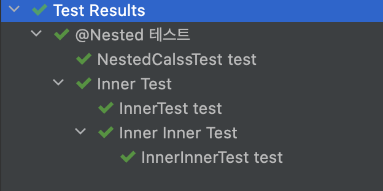
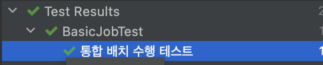
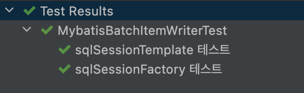
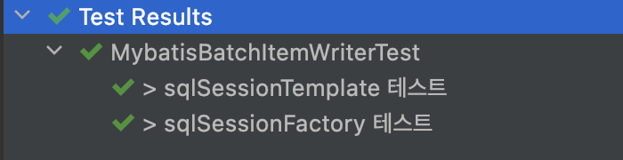
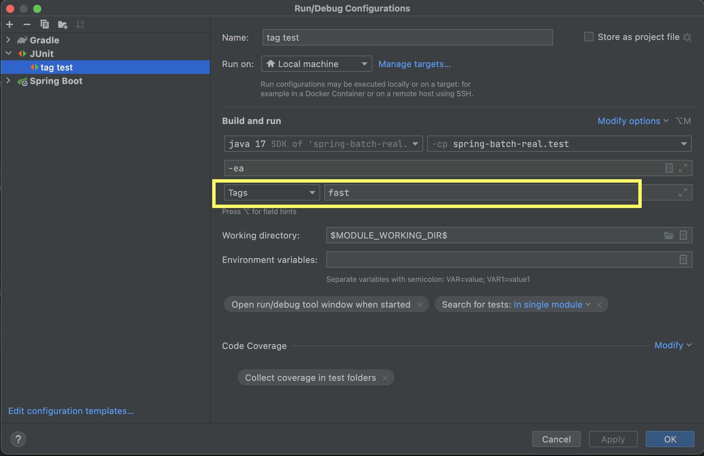
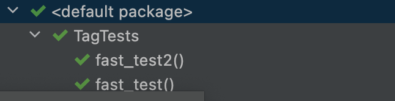

# Junit5 Annotation

테스트를 구성하고, 프레임워크를 상속하기 위한 어노테이션을 지원한다.
대부분 어노테이션은 `junit-jupiter-api`모듈의 `org.junit.jupiter.api` 패키지안에 존재한다.

## 기본 어노테이션

### @Test

테스트 메소드를 나타내는 어노테이션으로, 테스트하고자 하는 메서드에 필수로 작성되어야한다.

```java
public class JunitJupiterTests {
    @Test
    void stringTest() {
        assertThat(StringUtils.hasText("")).isFalse();
    }
}
```

- `@Test` 메서드는 정적 테스트 케이스로, 컴파일 시간에 모든 내용이 결정된다.
- 실행 시간 동안에는 TC의 동작을 변경할 수 없다.
- `Assumption` 메서드를 활용해 동적인 동작을 추가할 수 있으나 제한된 부분이 있다.

### @BeforeEach

각각의 테스트 메소드가 실행되기전에 실행되어야 하는 메서드임을 명시해준다.
`@Test`, `@RepetedTest`, `ParameterizedTest`, `@TestFactory`가 붙은 테스트 메서드가 실행되기 전에 실행된다.
(Junit4의 `@Before`와 동일)
테스트 수행전 필요한 목업 데이터를 설정해주기 위해 주로 사용한다.

```java
    @Mock
    private SqlSessionFactory sqlSessionFactory;

    @Mock
    private SqlSession sqlSession;

    @Mock
    private Cursor<Object> cursor;

    @BeforeEach
    void setUp() {
        MockitoAnnotations.openMocks(this);
    }
```

### @AfterEach

각각의 테스트 메소드가 실행 완료되고 난 후 실행되어야 하는 메소드임을 명시해준다.
`@Test`, `@RepetedTest`, `ParameterizedTest`, `@TestFactory`가 붙은 테스트 메서드가 실행된 후에 실행된다.
(Junit4의 `@After`와 동일)
테스트 수행 완료 후 테스트 데이터 삭제, 자원해제 등에 주로 사용한다.

```java
    @AfterEach
    public void tearDown() {
        this.jdbcTemplate.update("delete from customer");
    }
```

### @BeforeAll

테스트가 시작되기 전 **딱 한 번만 실행되며, 테스트 메서드간 공유 되어야하므로 static 메서드**여야한다.

### @AfterAll

테스트가 완료된 후 **딱 한 번만 실행되며, 테스트 메서드간 공유 되어야하므로 static 메서드**여야한다.

```java

public class JunitJupiterTests {

    @BeforeAll
    public static void beforeAll() {
        System.out.println("Before All");
    }


    @BeforeEach
    void beforeEach() {
        System.out.println("Before Each");
    }

    @Test
    void test1() {
        System.out.println("test1");
    }


    @Test
    void test2() {
        System.out.println("test2");
        assertThat(StringUtils.hasText("")).isFalse();
    }

    @AfterAll
    public static void afterAll() {
        System.out.println("After All");
    }


    @AfterEach
    void afterEach() {
        System.out.println("After Each");
    }
}
```

```
Before All
Before Each
test1
After Each
Before Each
test2
After Each
After All
```

## 테스트 LifeCycle

테스트 인스턴스 상태 변경가능성때문에 일어나는 사이드 이펙을 줄이고, 테스트 메서드를 독립된 환경에서 독립적으로 실행시키기 위해 Junit은 테스트 메소드를 실행시키기 전에 각각의 테스트 클래스의 새로운 인스턴스를 만든다.
**즉, 테스트 메소드마다 새로운 테스트 클래스의 인스턴스를 만들며, 디폴트 동작**이다.

### @TestInstance

같은 인스턴스 안에서 모든 테스트 메소드를 실행하고 싶다면 `@TestInstance(Lifecycle.PER_CLASS)` 어노테이션을 사용하면 된다.
이 어노테이션을 사용하면, 클래스 단위로 새로운 인스턴스가 생기며, 그 안에 있는 인스턴스 변수를 테스트 메소드들이 공유하므로, `@BeforeEach`와 `@AfterEach`를 사용해 내부 상태를 리셋해야한다.

`PER_CLASS` 는 `@BeforeAll`과 `@AfterAll`를 붙인 메서드를 static 메서드로 구현하지 않아도 되며, 인터페이스의 `default` 메서드에서도 사용하지 않아도 된다.

또한, `@Nested` 테스트 클래스에서도 `@BeforeAll`과 `@AfterAll` 메소드를 사용할 수 있게 해준다.

## 테스트 그룹 사이의 관계

### @Nested

중첩된 테스트 클래스 테스트 시 `@Nested`를 사용하면 테스트 그룹 간의 관계를 다양한 방법으로 더 명확하게 표시할 수 있다.

`@Nested` 사용시 아래 내용들을 주의해야한다.

- `@Nested` 클래스는 정적 클래스(static)이 아닌 내포된 클래스(inner class)여야한다.
- Java는 이너 클래스 안에 `static` 멤버 변수를 두는 것을 허락하지 않기 때문에 기본 `PER_METHOD` 생명 주기에서는 `@BeforeAll`과 `@AfterAll` 이 동작하지 않는다.
- `@TestInstance(Lifecycle.PER_CLASS)`로 클래스 단위로 인스턴스를 생성하는 경우에는  `@BeforeAll`과 `@AfterAll`를 사용할 수 있다.

```java
@DisplayName("@Nested 테스트")
public class NestedClassTests {

    @Test
    @DisplayName("NestedCalssTest test")
    public void test() {
    }

    @Nested
    @DisplayName("Inner Test")
    class InnerTest {

        @DisplayName("InnerTest test")
        @Test
        void test() {

        }

        @Nested
        @DisplayName("Inner Inner Test")
        class InnerInnerTest{
            @DisplayName("InnerInnerTest test")
            @Test
            void test() {

            }
        }
    }
}
```



## Dependency Injection

Junit Jupiter의 주된 변화로 테스트 클래스의 생성와 메서드가 파라미터를 가질 수 있게 되었다.
이는 코드의 유연함이 증가할 뿐만 아니라, 의존성 주입 또한 가능하게 되었다.

`ParameterResolver`는 실행 시간 동안에 동적으로 파라미터를 해석할 수 있는 API를 정의하고 있다.
현재 자동으로 등록되는 3개의 Resolver가 있다.

| ParmeterResolver                | 설명                                                         |
| ------------------------------- | ------------------------------------------------------------ |
| TestInfoParameterResolver       | `TestInfo` Resolver이다.<br />`TestInfo` 객체는 테스트 클래스, 메서드명, 디스플레이명과 같은 현재 테스트에 대한 정보를 가지고 있다. |
| RepetitionInfoParameterResolver | 반복 실행 가능한 메서드(`@RepeatedTest` ,`@BeforeEach` ,`@AfterEach`)와 같은 메서드 정보를 가지는 `RepetionInfo` 객체에 대한 Resolver이다. |
| TestReporterParameterResolver   | 현재 실행하는 테스트에 대한 추가 정보를 표시할 수 있는 `TestReporter` 객체에 대한 Resolver이다. |

### TestInfoParameterResolver

```java
@DisplayName("TestInfo 테스트")
public class TestInfoTest {

    TestInfoTest(TestInfo testInfo) {
        assertThat("TestInfo 테스트").isEqualTo(testInfo.getDisplayName());
    }

    @BeforeEach
    void setUp(TestInfo testInfo) {
        String displayName = testInfo.getDisplayName();
        assertThat("demo test").isEqualTo(testInfo.getDisplayName());
    }

    @Test
    @Tag("demo1")
    @DisplayName("demo test")
    void test(TestInfo testInfo) {
        assertThat(testInfo.getTags().contains("demo1")).isTrue();
    }
}
```

## 동적 테스트

### @TestFactory

`@TestFactory` 가 붙은 팩토리 메소드에 의해 런타임시 만들어지는 동적 테스트를 구현할 수 있다.

- `@TestFactory` 메소드는 그 자체로 테스트는 아니며, 팩토리 메소드가 테스트 케이스이다.
- `@TestFactory` 메소드는 반드시 하나의 `DynamicNode`, `Stream`, `Collection`, `Interable`, `Interator`, `DynamicNode` 인스턴스의 배열을 반환해야한다.
- `@TestFactory`가 리턴하는 Stream은 `stream.close()`을 호출해서 닫아줘야 리소스를 안전하게 사용할 수 있다.

즉, 런타임시 만들어지는 테스트 케이스를 말하며, 람다 표현식이나 메서드 추론 방식으로 제공될 수 있는 함수형 인터페이스의 조합이다.

동적 테스트는 콜백 라이플 사이클이 존재하지 않는다.
`@BeforeEach` 와 `@AfterEach` 메소드는 `@TestFactory` 메소드에서는 실행하지만, 각각의 Dynamic 테스트에 대해서는 실행하지 않는다.
즉, Dynamic 테스트 관한 람다 표현식안의 테스트 인스턴스의 필드에 접근하기위해서 해당 필드는 초기화 되지 않는다.

## 테스트 이름 표기

### @DisplayName

테스트 클레스, 메서드에 이름을 붙여주는 경우에 사용하며, 메서드 이름은 그대로 둔 채 테스트명을 변경하고 싶을 때 사용한다.

```java
    @Test
    @DisplayName("통합 배치 수행 테스트")
    public void test() throws Exception {
```



### @DisplayNameGeneration

클래스에 어노테이션을 붙이면, `@Test` 메서드 이름에 정의된 DisplayNameGenerator로 이름을 변형시켜준다.

| DisplayNameGenerator 클래스명 | 설명                                                         |
| ----------------------------- | ------------------------------------------------------------ |
| **Standard**                  | 기존 클래스, 메서드명 사용(default)                          |
| Simple                        | 괄호`(`, `)` 제외                                            |
| ReplaceUnderscores            | `_`(언더바)로 표시한 모든 부분이 공백으로 처리               |
| IndicativeSentences           | 클래스명 + 구분자(`,`) + 메서드명으로 변경<br />이때 구분자는 `@IndicativeSentencesGeneration` 으로 커스텀 가능 |

```java
@DisplayNameGeneration(DisplayNameGenerator.ReplaceUnderscores.class)
public class MybatisBatchItemWriterTest {

    @Test
    public void sqlSessionFactory_테스트() {}
    
    @Test
    public void sqlSessionTemplate_테스트() {}
}
```



### @IndicativeSentencesGeneration

구분자를 커스텀하게 사용할 수 있게 해준다.

| 파라미터명 | 타입명                                  | 설명                                     |
| ---------- | --------------------------------------- | ---------------------------------------- |
| seperator  | String                                  | 구분자( default : `,`)                   |
| generator  | `Class<? extends DisplayNameGenerator>` | 정의된 DisplayNameGenerator 중 하나 사용 |

```java
@IndicativeSentencesGeneration(separator = "> ", generator = DisplayNameGenerator.ReplaceUnderscores.class)
class MybatisBatchItemWriterTest {
    @Test
    public void sqlSessionFactory_테스트() {}
    
    @Test
    public void sqlSessionTemplate_테스트() {}
}
```



### 어노테이션 우선 순위

1. @DisplayName

2. @DisplayNameGeneration

3. properties에 명시한 Default 값

   ```groovy
   junit.jupiter.displayname.generator.default = org.junit.jupiter.api.DisplayNameGenerator$ReplaceUnderscores
   ```

4. DisplayNameGenerator.Standard.class

## 태그와 필터링

### @Tag

테스트 클래스와 메서드를 `@Tag` 를 통해 태그할 수 있으며, 이 태그들로 나중에 테스트를 필터링할 수 있다.

#### 사용 규칙

- 태그는 공백이나 `null`이 있으면 안된다.
- ISO 제어문자가 있으면 안된다.
- `,`, `(`, `)`, `|`, `!`, `&` 과 같은 문자열이 표함되면 안된다.

```java
public class TagTests {

    @Test
    @Tag("fast")
    void fast_test() {
    }

    @Test
    @Tag("fast")
    void fast_test2() {
    }

    @Test
    @Tag("slow")
    void slow_test() {
    }
    
    @Test
    @Tag("slow")
    void slow_test2() {
    }
}
```



Test Kind를 Tags로 변경 후 Tag Expression에 수행할 Tag 값을 입력하면된다.

- `!` : NOT
- `&` : AND
- `|` : OR

위 3개 Operator로 수행할 수 있다.



위에서 수행한 fast 태그만 수행된 것을 확인할 수 있다.

추후에 특정 태그를 계속해서 사용한다면 어노테이션을 생성해서 사용하면 좋다.

```java
@Target({ ElementType.TYPE, ElementType.METHOD })
@Retention(RetentionPolicy.RUNTIME) 
@Tag("fast") 
@Test
public @interface FastTest { }
```

다음과 같이 `@FastTest` 어노테이션을 생성해서 사용하면, 오타를 방지하고, 간편하게 사용할 수 있다.

## 참고

- [https://donghyeon.dev/junit/2021/04/11/JUnit5-%EC%99%84%EB%B2%BD-%EA%B0%80%EC%9D%B4%EB%93%9C/](https://donghyeon.dev/junit/2021/04/11/JUnit5-%EC%99%84%EB%B2%BD-%EA%B0%80%EC%9D%B4%EB%93%9C/)
- [https://awayday.github.io/2017-11-12/junit5-05/](https://awayday.github.io/2017-11-12/junit5-05/)