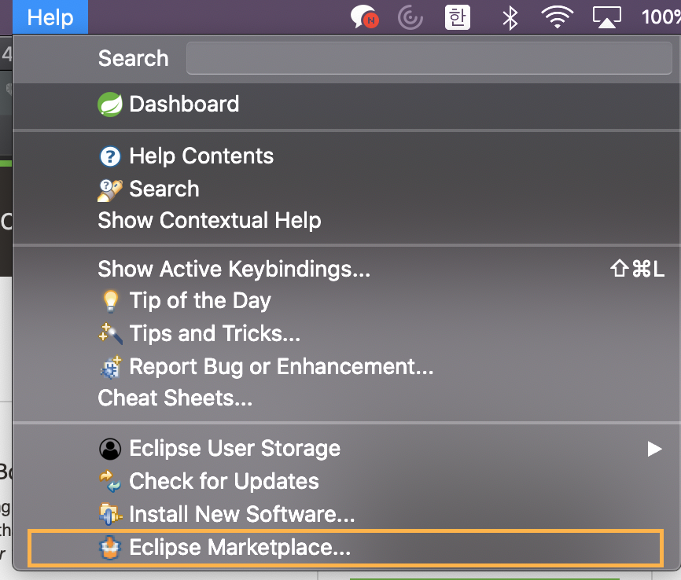
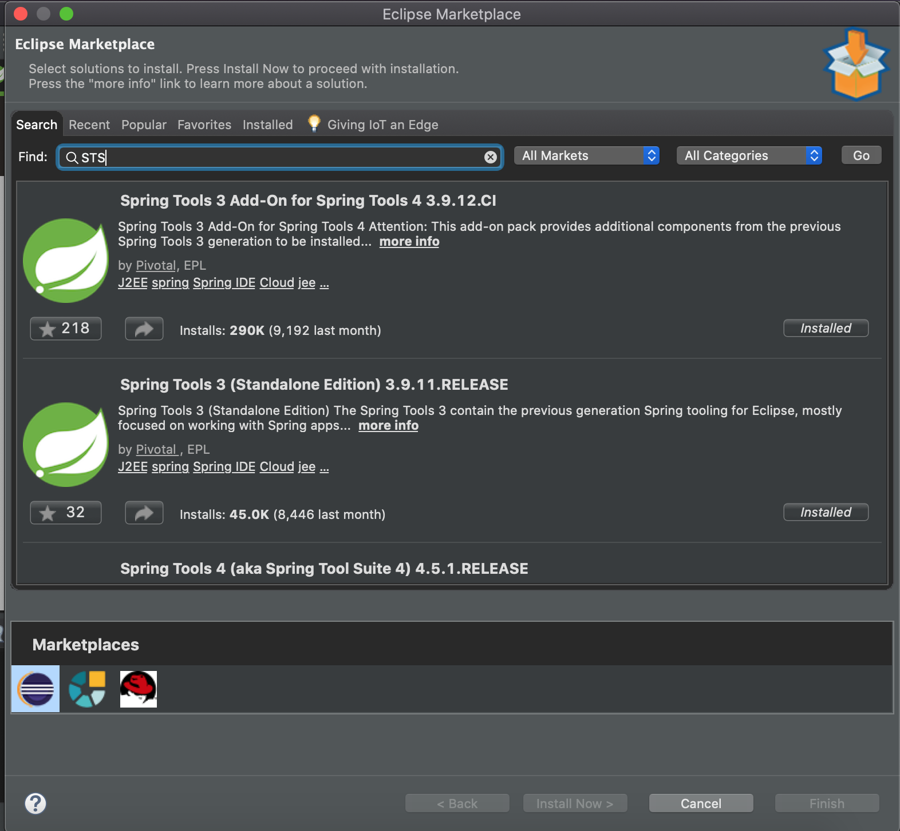

# Introduction

Spring 프레임워크에 관련된 내용을 공부하고 정리한 내용입니다.

- 토비의 Spring 3.0 책
- 김영한의 스프링 로드맵

+ 각종 포스트 글 참조

## STS 환경설정

- JDK, MySQL, STS를 기준으로 설명할 것이다.
- [Install MySQL on Mac](https://dahye-jeong.gitbook.io/database/mysql/2019-03-16-install)

[https://spring.io/tools](https://spring.io/tools) 에서 STS최신버전을 다운로드할 수 있다.

STS4를 사용하게되면 Spring Boot를 기본으로 하고 있으며, 'Spring Legacy Project'는 제공하지 않고있다.

만약 Spring Legacy Project를 생성하고 싶은 경우에는 다음과정을 거치면된다.

1. Help → Eclipse Market

2. STS 검색 → Spring Tools 3 Add-On 설치

3. 설치가 완료되면 재시작
4. File → New → Others → Spring → Spring Legacy Project 생성

### 참고 페이지

- [https://codedragon.tistory.com/8954](https://codedragon.tistory.com/8954)

