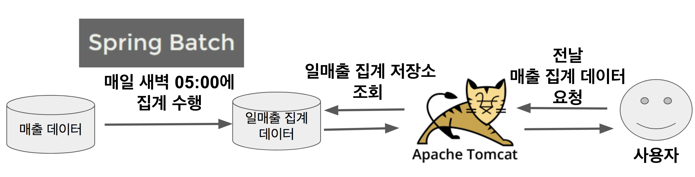

# Spring Batch

## Batch란?

Batch Processing(일괄 처리)란 컴퓨터 프로그램 흐름에 따라 순차적으로 자료를 처리하는 방식을 뜻한다.
개별적으로 어떤 요청이 있을때마다 실시간으로 통신하는 것이 아닌 **일괄적으로 대량 건을 처리**하는 것이다.

배치 애플리케이션은 다음의 조건을 만족해야한다.

- 대용량 데이터 : **대량의 데이터**를 전달, 계산, 가져오기등의 처리를 할 수 있어야한다.
- 자동화 : 심각한 문제 해결을 제외하고는 **사용자 개입없이 실행**
- 견고성 : **잘못된 데이터를 충돌/중단 없이 처리**
- 신뢰성 : **무엇이 잘못되었는지 추적 필요**(logging, 알림)
- 성능 : **지정된 시간안에 처리를 완료**하거나 동시에 실행되는 **다른 애플리케이션을 방해하지 않도록 수행**

여기서 중요한 것은 **대량의 데이터를 특정 시간에 일괄적으로 처리**한다는 것이다.

예를 하나 들자면 다음과 같이 배치 애플리케이션을 사용할 수 있다. 실시간 집계 쿼리로 해결하기엔 조회 시간이나 서버 부하가 생겨, 매일 새벽에 전날의 매출 집계를 만들어 외부 요청이 올 경우 미리 만들어둔 데이터를 바로 전달해 성능과 부하를 모두 잡을 수 있는 방법이다.

## Spring Boot Batch

Spring Batch는 백엔드 배치 처리 기능을 구현하는데 사용하는 프레임워크 이며, SpringBoot Batch는 Spring Batch의 설정 요소들을 간편화시켜 빠르게 설정하는데 도움을 준다.

### 장점

- 대용량 데이터 처리에 최적화되어 고성능을 발휘한다.
- 효과적인 로깅, 통계 처리, 트랜잭션 관리 등 재사용이 가능한 필수 기능을 지원한다.
- 수동으로 처리하지 않도록 자동화 되어있다.
- 예외사항과 비정상 동작에 대한 방어로직이 있다.
- 스프링 부트 배치의 반복되는 작업 프로세스를 이해하면 비즈니스 로직에 집중할 수 있다.

Spring Boot Batch 2.0 이상은 Spring Batch 4.0을 기반으로 하며, Spring Batch 4.0은 다음 특징이 있다.

- Java 8이상에서 동작한다.
- Spring Framework 5로 진화하며 새롭게 재배열된 의존성 트리를 지원한다.
- `ItemReaders` , `ItemProcessors`. `ItemWriters`에 대한 빌더를 제공한다.

### 주의사항

Spring Boot Batch는 Spring Batch를 간편하게 사용할 수 있게 래핑한 프로젝트 이므로 Spring Boot Batch, Spring Batch 모두 주의해야한다.

1. **가능하면 단순화**하여 복잡한 구조와 로직 피하기
2. 데이터를 직접 사용하는 작업이 빈번하게 일어나므로 **데이터 무결성을 유지하는 유효성 검사 등의 방어책**이 필요
3. 배치 처리 시 **시스템 I/O 사용 최소화**하기
   - 잦은 I/O로 **데이터베이스 커넥션과 네트워크 비용이 커지면 성능에 영향을 줄 수 있기 때문에 가능하면 한번에 데이터를 조회해 메모리에 저장해두고 처리**를 한 다음, 그 결과를 한번에 데이터 베이스에 저장하는 것이 좋음
4. 배치 처리가 진행되는 동안 **다른 프로젝트(웹, API, 기타 등) 요소에 영향을 주는 경우가 없는지 주의**
5. Spring Batch는 스케쥴러를 제공하지 않고, 배치 처리 기능만 제공한다.
   - 스케쥴러는 대표적으로 Crontab, Quartz, Control-M, Jenkins등이 있다.
   - crontab의 경우 각 서버마다 따로 스케줄링을 관리해야 하며 무엇보다 클러스터링 기능이 제공되지 않아 추천하지 않는다.

## Spring Batch

1. 읽기(read) : 데이터 저장소에서 특정 데이터 레코드를 읽는다.
2. 처리(processing) : 원하는 방식으로 데이터 가공/처리 한다.
3. 쓰기(write) : 수정된 데이터를 다시 저장소에 저장한다.

배치 처리는 **읽기 -> 처리 -> 쓰기**의 흐름을 갖는다.

객체 관계도를 보면 하나의 큰 Job에 여러 Step(1:M 관계)을 두고, 각 단계의 배치 흐름대로 구성한다. 

## 참고

- [기억보단 기록을-Spring Batch 가이드](https://jojoldu.tistory.com/324)
- [Yun Blog-Spring Batch 간단정리](https://cheese10yun.github.io/spring-batch-basic/)
- [자몽아이스티맛의 기술블로그 - Chunk 지향 처리](https://jamong-icetea.tistory.com/232)
- [처음 배우는 스프링 부트2](https://www.hanbit.co.kr/store/books/look.php?p_code=B4458049183)

