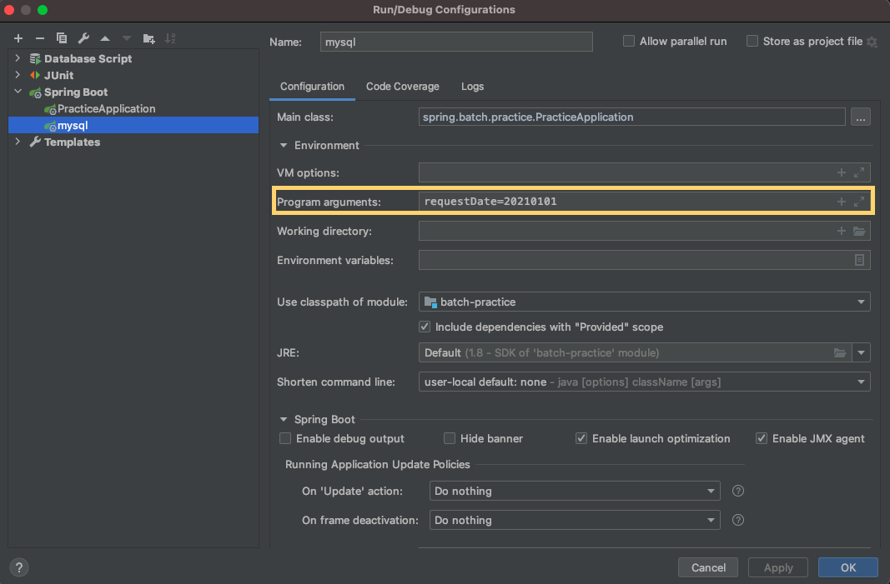
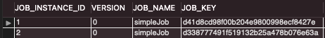
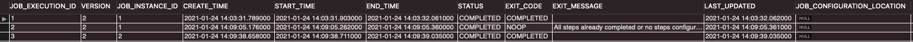
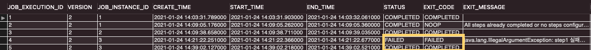
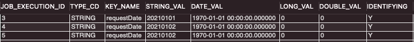

# JobRepository와 메타데이터

## JobRepository

- `org.springframework.batch.core.repository.JobRepository` ( 인터페이스 )


`JobRepository`는 **배치 처리 정보**를 담고 있는 \*매커니즘이다. 

- 배치 수행과 관련된 수치 데이터(시작/종료 시간, 상태, 읽기/쓰기 횟수)
- Job의 상태 유지 관리
- RDBMS(관계형 데이터베이스)/인메로리 저장소를 사용
- 배치 내 대부분 주요 컴포넌트가 공유

예를 들어, `Job` 한개가 실행되면 `JobRepository`에서 배치 실행에 관련된 정보를 담고 있는 도메인 `JobExcution`을 생성하며, `Step`의 실행정보를 담고 있는 `StepExecution`도 저장소에 저장해 **전체 메타데이터를 저장/관리하는 역할을 수행**한다.

1. Job 실행하면 Job은 각 Step실행
2. 각 Step이 실행되면 `JobRepository` 현재 상태로 갱신

즉, 실행된 Step,  현재 상태, 읽은 아이템 및 처리된 아이템 수 등이 모두 저장된다.

*\*매커니즘 : 어떠한 사물의 구조, 또는 그것이 작동하는 원리*

### 배치 메타테이블 알아보기

(`schema-{rdbms종류}.sql`에 DDL이 작성되어있다.)


`JobRepository`에는 6개의 테이블이 존재한다.

- `BATCH_JOB_INSTANCE`
- `BATCH_JOB_EXECUTION`
- `BATCH_JOB_EXECUTION_PARAMS`
- `BATCH_JOB_EXECUTION_CONTEXT`
- `BATCH_STEP_EXECUTION`
- `BATCH_STEP_EXECUTION_CONTEXT`

#### BATCH_JOB_INSTANCE

Job Parameter에 따라 생성되는 테이블이다. Job Parameter는 Spring Batch가 실행될 때 외부에서 받을 수 있는 파라미터로, 같은 Batch Job이더라도 Job Parameter가 다르면, `BATCH_JOB_INSTANCE`에 기록이되고, Job Parameter가 동일하다면 기록되지 않는다.

| 필드명          | 설명                                                         |
| --------------- | ------------------------------------------------------------ |
| JOB_INSTANCE_ID | `BATCH_JOB_INSTANCE` 테이블의 PK                             |
| VERSION         | [낙관적인 락](https://sabarada.tistory.com/175)에 사용되는 레코드 버전 |
| JOB_NAME        | 수행한 Batch Job Name                                        |
| JOB_KEY         | 잡 이름과 잡 파라미터 해시 값으로, JobInstance를 고유하게 식별하는데 사용하는 값 |

```java
@Slf4j
@RequiredArgsConstructor
@Configuration
public class SimpleJobConfiguration {
    private final JobBuilderFactory jobBuilderFactory;
    private final StepBuilderFactory stepBuilderFactory;

    @Bean
    public Job simpleJob(){
        return jobBuilderFactory.get("simpleJob")
                .start(simpleStep(null))
                .build();
    }

    @Bean
    @JobScope
    public Step simpleStep(@Value("#{jobParameters[requestDate]}")String requestDate){
        return stepBuilderFactory.get("simpleStep")
                .tasklet((contribution, chunkContext) -> {
                    log.info(">>>>> This is Step1");
                    log.info(">>>>> This is requestDate = {}", requestDate);
                    return RepeatStatus.FINISHED;
                })
                .build();
    }
}
```



promgram arguements에 새로 추가한 jobParameter를 추가해준 후 실행하면, log도 정상적으로 찍히고, 새로운 BATCH_JOB_INSTANCE가 생긴것을 볼 수 있다.

```
2021-01-24 23:09:38.687  INFO 35371 --- [           main] o.s.b.c.l.support.SimpleJobLauncher      : Job: [SimpleJob: [name=simpleJob]] launched with the following parameters: [{requestDate=20210101}]
2021-01-24 23:09:38.900  INFO 35371 --- [           main] o.s.batch.core.job.SimpleStepHandler     : Executing step: [simpleStep]
2021-01-24 23:09:38.959  INFO 35371 --- [           main] s.b.p.jobs.SimpleJobConfiguration        : >>>>> This is Step1
2021-01-24 23:09:38.959  INFO 35371 --- [           main] s.b.p.jobs.SimpleJobConfiguration        : >>>>> This is requestDate = 20210101
2021-01-24 23:09:38.982  INFO 35371 --- [           main] o.s.batch.core.step.AbstractStep         : Step: [simpleStep] executed in 81ms
```



만약 동일한 파라미터로 다시 수행을 했을때, 

```
java.lang.IllegalStateException: Failed to execute ApplicationRunner
	at org.springframework.boot.SpringApplication.callRunner(SpringApplication.java:798) [spring-boot-2.4.2.jar:2.4.2]
	at org.springframework.boot.SpringApplication.callRunners(SpringApplication.java:785) [spring-boot-2.4.2.jar:2.4.2]
	at org.springframework.boot.SpringApplication.run(SpringApplication.java:333) [spring-boot-2.4.2.jar:2.4.2]
	at org.springframework.boot.SpringApplication.run(SpringApplication.java:1311) [spring-boot-2.4.2.jar:2.4.2]
	at org.springframework.boot.SpringApplication.run(SpringApplication.java:1300) [spring-boot-2.4.2.jar:2.4.2]
	at spring.batch.practice.PracticeApplication.main(PracticeApplication.java:14) [classes/:na]
Caused by: org.springframework.batch.core.repository.JobInstanceAlreadyCompleteException: A job instance already exists and is complete for parameters={requestDate=20210101}.  If you want to run this job again, change the parameters.
```

같은 파라미터로는 Job을 실행할 수 없다는 오류가 발생하는 것을 볼 수 있다.

즉, **동일한 Job이 Job Parameter가 달라지면 그때마다 `BATCH_JOB_INSTANCE`에 생성되며, 동일한 Job Parameter는 여러개 존재할 수 없다.**

#### BATCH_JOB_EXECUTION

배치 잡의 실제 실행 기록을 나타낸다. Job이 실행될 떄마다 새 레코드가 해당 테이블에 생성되고, Job이 진행되는 동안 주기적으로 업데이트 된다.

| 필드             | 설명                                                         |
| ---------------- | ------------------------------------------------------------ |
| JOB_EXECUTION_ID | PK                                                           |
| VERSION          | [낙관적인 락](https://sabarada.tistory.com/175)에 사용되는 레코드 버전 |
| JOB_INSTANCE_ID  | BATCH_JOB_INSTANCE 참조하는 외래키                           |
| CREATE_TIME      | 레코드 생성된 시간                                           |
| START_TIME       | 잡 실행이 시작된 시간                                        |
| END_TIME         | 잡 실행이 완료된 시간                                        |
| STATUS           | 잡 실행의 배치 상태                                          |
| EXIT_CODE        | 잡 실행의 종료코드                                           |
| EXIT_MESSAGE     | EXIT_CODE와 관련된 메세지나 스택 트레이스                    |
| LAST_UPDATED     | 레코드가 마지막으로 갱신된 시간                              |



여기서 보면, `JOB_INSTANCE_ID`는 2개가 있는 것을 볼 수 있다. 이는 각각 파라미터 없이 실행한 simpleJob, `requestDate=2021010`로 실행한  simpleJob임을 알 수 있따.

**JOB_INSTANCE와 JOB_EXECUTION는 부모-자식 관계**이며, JOB_EXECUTION는 자신의 부모 JOB_INSTANCE가 성공/실패한 모든 기록을 기록하고 있다.

```java
package spring.batch.practice.jobs;

import lombok.RequiredArgsConstructor;
import lombok.extern.slf4j.Slf4j;
import org.springframework.batch.core.Job;
import org.springframework.batch.core.Step;
import org.springframework.batch.core.configuration.annotation.JobBuilderFactory;
import org.springframework.batch.core.configuration.annotation.JobScope;
import org.springframework.batch.core.configuration.annotation.StepBuilderFactory;
import org.springframework.batch.repeat.RepeatStatus;
import org.springframework.beans.factory.annotation.Value;
import org.springframework.context.annotation.Bean;
import org.springframework.context.annotation.Configuration;

@Slf4j
@RequiredArgsConstructor
@Configuration
public class SimpleJobConfiguration {
    private final JobBuilderFactory jobBuilderFactory;
    private final StepBuilderFactory stepBuilderFactory;

    @Bean
    public Job simpleJob(){
        return jobBuilderFactory.get("simpleJob")
                .start(simpleStep(null))
                .build();
    }

    @Bean
    @JobScope
    public Step simpleStep(@Value("#{jobParameters[requestDate]}")String requestDate){
        return stepBuilderFactory.get("simpleStep")
                .tasklet((contribution, chunkContext) -> {
                    throw new IllegalArgumentException("step1 실패");
                })
                .build();
    }
    
}
```



파라미터를 `20210102` 로 변경한 후에 일부러 실패한 후 다시 똑같은 파라미터로 수행을 하면 다음과 같이 **FAILED, COMPLETED** 두개의 row가 생긴것을 볼 수 있다. 
여기서 알 수 있는점은 **수행 결과가 성공한 기록이 있을때만 재수행이 안된다(실패)는 점**이다.

#### BATCH_JOB_EXECUTION_CONTEXT

`ExecutionContext` 를 저장하는 테이블이다.

| 필드               | 설명                          |
| ------------------ | ----------------------------- |
| JOB_EXECUTION_ID   | PK                            |
| SHORT_CONTEXT      | Trim처리된 SERIALIZED_CONTEXT |
| SERIALIZED_CONTEXT | 직렬화된 ExecutionContext     |

`ExecutionContext`를 직렬화하는 방법은 여러가지가 있는데, 스프링 배치 4이전에는 XSteam의 JSON 처리 기능을 기본으로 사용했으나, 4가 출시될 때 Jackson2를 기본적으로 사용하도록 변경됐다.

#### BATCH_JOB_EXECUTION_PARAMS

Job이 매번 실행될 때 마다 사용된  파라미터를 저장한다. Job 수행시 필요한 모든 파라미터가 저장된다.

| 필드             | 설명                                         |
| ---------------- | -------------------------------------------- |
| JOB_EXECUTION_ID | PK                                           |
| TYPE_CD          | 파라미터 값의 타입을 나타내는 문자열         |
| KEY_NAME         | 파라미터 이름                                |
| STRING_VAL       | 타입이 String인 경우 파라미터의 값           |
| DATE_VAL         | 타입이 Date인 경우 파라미터의 값             |
| LONG_VAL         | 타입이 Long인 경우 파라미터의 값             |
| DOUBLE_VAL       | 타입이 Double인 경우 파라미터의 값           |
| IDENTIFYING      | 파라미터가 식별되는지 여부를 나타내는 플래그 |



JOB_EXECUTION으로 그 당시 입력된 Job Parameter값을 담고 있다.

#### BATCH_STEP_EXECUTION

- 스텝의 시작, 완료, 상태에 대한 메타데이터를 저장
- 스텝 분석이 가능하도록 다양한 횟수 값을 추가 저장
- 읽기 횟수, 처리 횟수, 쓰기 횟수, 건너뛰기 횟수 등 모든 데이터가 저장된다.

| 필드               | 설명                                                  |
| ------------------ | ----------------------------------------------------- |
| STEP_EXECUTION_ID  | PK                                                    |
| VERSION            | 낙관적인 락에 사용되는 레코드의 버전                  |
| STEP_NAME          | 스텝 이름                                             |
| JOB_EXECUTION_ID   | BATCH_JOB_EXECUTION을 참조하는 외래키                 |
| START_TIME         | 스텝 실행 시작 시간                                   |
| END_TIME           | 스텝 실행 완료 시간                                   |
| STATUS             | 스텝의 배치 상태                                      |
| COMMIT_COUNT       | 스텝 실행중 커밋된 트랜잭션 수                        |
| READ_COUNT         | 읽은 아이템 수                                        |
| FILTER_COUNT       | 아이템 프로세서가 null을 반환해 필터링된 아이템 수    |
| WRITE_COUNT        | 기록된 아이템 수                                      |
| READ_SKIP_COUNT    | `ItemReader`내에서 예외가 발생해 건너뛴 아이템 수     |
| WRITE_SKIP_COUNT   | `ItemProcessor` 내에서 예외가 발생해 건너뛴 아이템 수 |
| PROCESS_SKIP_COUNT | `ItemWriter` 내에서 예외가 발생해 건너뛴 아이템 수    |
| ROLLBACK_COUNT     | 스텝 실행에서 롤백된 트랜잭션 수                      |
| EXIT_CODE          | 스텝의 종료코드                                       |
| EXIT_MESSAGE       | 스텝 실행에서 반환된 메세지나 스택 트레이스           |
| LAST_UPDATED       | 레코드가 마지막으로 업데이트 된 시간                  |

#### BATCH_STEP_EXECUTION_CONTEXT

`StepExecution`의 `ExecutionContext` 를 저장하는 테이블로, 스텝 수준에서의 컴포넌트 상태를 저장하는데 사용한다.

| 필드               | 설명                          |
| ------------------ | ----------------------------- |
| STEP_EXECUTION_ID  | PK                            |
| SHORT_CONTEXT      | Trim처리된 SERIALIZED_CONTEXT |
| SERIALIZED_CONTEXT | 직렬화된 ExecutionContext     |

### 인메모리 JobRepository

스프링 배치 잡을 개발하거나 단위 테스트를 수행할 때 외부 데이터데이스를 구축하는 작업이 실제로 얻는 이익보다 더 많은 문제를 발생시킬 수 있다.

스프링 배치는 `Map` 객체를 데이터 저장소로 사용하는 `JobRepository` 구현체를 제공한다.

`Map` 객체기반의 `JobRepository`는 실제 운영 시 사용하지 않으며, 외부 데이터베이스 없이 배치 잡을 실행하려면 멀티 스레딩 및 트랜잭션 기능을 더 잘 지원하는 H2 혹은 HSQLDB와 같은 인메모리 데이터베이스를 사용하는 것을 권장한다.

## 참고

- [기억보단 기록을 - 3. Spring Batch 가이드 - 메타테이블엿보기](https://jojoldu.tistory.com/326?category=902551)