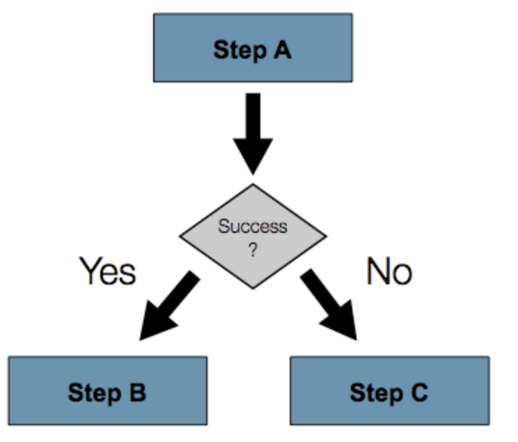

# Sprinb Batch Job Flow

##  Batch Step 

**`Step`은 실제 Batch 작업을 수행하는 역할**을 한다. 즉, 실제 비지니스 로직을 처리하는 기능은 `Step`에 구현되어있다.

이처럼 `Step` 에서는 Batch에서 처리하고자 하는 기능과 설정을 모두 포함하는 장소라 생각하면된다.

### Next

**`.next()`는 순차적으로 `Step` 들을 연결시킬때 사용**한다.

```java
@Slf4j
@Configuration
@RequiredArgsConstructor
public class StepNextJobConfiguration {

    private final JobBuilderFactory jobBuilderFactory;
    private final StepBuilderFactory stepBuilderFactory;

    @Bean
    public Job stepNextJob(){
        return jobBuilderFactory.get("stepNextJob")
                .start(step1())
                .next(step2())
                .next(step3())
                .build();
    }

    @Bean
    public Step step1(){
        return stepBuilderFactory.get("step1")
                .tasklet((stepContribution, chunkContext) -> {
                    log.info(">>> this is step1");
                    return RepeatStatus.FINISHED;
                }).build();
    }

    @Bean
    public Step step2(){
        return stepBuilderFactory.get("step2")
                .tasklet((stepContribution, chunkContext) -> {
                    log.info(">>> this is step2");
                    return RepeatStatus.FINISHED;
                }).build();
    }

    @Bean
    public Step step3(){
        return stepBuilderFactory.get("step3")
                .tasklet((stepContribution, chunkContext) -> {
                    log.info(">>> this is step3");
                    return RepeatStatus.FINISHED;
                }).build();
    }

}
```

### Flow

Next는 순차적으로 Step의 순서를 제어하지만, 앞의 Step에서 오류가 발생하게 되면, 뒤의 Step들은 실행되지 못하게 된다. 하지만 상황에 따라 정상 수행인 경우엔 Step B로, 오류가 발생했을 땐 Step C로 수행해야하는 경우가 있다.



이러한 경우에 대비해 조건별로 Step을 사용할 수 있다.

```java
    @Bean
    public Job stepNextConditionalJob(){
        return jobBuilderFactory.get("tepNextConditionalJob")
                .start(conditionalJobStep1())
                    .on("FAILED") // step1 FAILED 인 경우
                    .to(conditionalJobStep3()) // step3으로 이동
                    .on("*") // step3의 결과와 상관없이
                    .end() // step3으로 이동시 Flow 종료
                .from(conditionalJobStep1()) // step1에서부터
                    .on("*") // FAILED가 아닌 모든 경우에
                    .to(conditionalJobStep2()) // step2로 이동
                    .next(conditionalJobStep3()) // step2가 정상 종료시 step3으로 이동
                    .on("*") // step3의 결과와 상관없이
                    .end() // step3으로 이동시 flow 종료
                .end() // job 종
                .build();
    }

```

#### `.on()`

- **`ExitStatus` 를 지정**한다.

- `*` 의 경우 모든 `ExitStatus` 가 지정된다.

#### `.to()`

- **다음으로 이동할 Step을 지정**한다.

#### `.from()`

- 상태값을 보고 일치하는 상태라면 `to()` 에 포함된 `step`을 호출하며, 일종의 **이벤트 리스너 역할**을 한다고 보면 된다.
- **추가로 이벤트를 캐치하는 경우에 사용**한다.

#### `.end()`

- FlowBuilder를 반환
  - `.on("*")` 뒤에 있는 `end()`
  - FlowBuilder를 반환하는 `end()`의 경우 계속해서 `from()`을 이어갈 수 있다.
- FlowBuilder 종료
  - `build()` 앞에 있는 `end()`

#### Flow 수행 해보기

  ```java
  		@Bean
      public Step conditionalJobStep1(){
          return stepBuilderFactory.get("step1")
                  .tasklet((stepContribution, chunkContext) -> {
                      log.info(">>> this is step1");
  
                    	//  ExitStatus.FAILED로 지정
                    	// 해당 Status 로 flow가 진행된다.
                      stepContribution.setExitStatus(ExitStatus.FAILED);
                      return RepeatStatus.FINISHED;
                  }).build();
      }
  ```

  ```
  Job: [FlowJob: [name=stepNextConditionalJob]] launched with the following parameters: [{version=3}]
o.s.batch.core.job.SimpleStepHandler     : Executing step: [step1]
.p.j.StepNextConditionalJobConfiguration : >>> this is step1
o.s.batch.core.step.AbstractStep         : Step: [step1] executed in 75ms
o.s.batch.core.job.SimpleStepHandler     : Executing step: [step3]
.p.j.StepNextConditionalJobConfiguration : >>> this is step3
o.s.batch.core.step.AbstractStep         : Step: [step3] executed in 19ms
o.s.b.c.l.support.SimpleJobLauncher      : Job: [FlowJob: [name=stepNextConditionalJob]] completed with the following parameters: [{version=3}] and the following status: [COMPLETED] in 252ms
  ```

`ExitStatus.FAILED`로 수행하는 경우 step1 -> step3이 수행되고 종료되는 것을 볼 수 있다.

```java
    @Bean
    public Step conditionalJobStep1(){
        return stepBuilderFactory.get("step1")
                .tasklet((stepContribution, chunkContext) -> {
                    log.info(">>> this is step1");

//                    stepContribution.setExitStatus(ExitStatus.FAILED);
                    return RepeatStatus.FINISHED;
                }).build();
    }

```

```
o.s.b.c.l.support.SimpleJobLauncher      : Job: [FlowJob: [name=stepNextConditionalJob]] launched with the following parameters: [{version=4}]
o.s.batch.core.job.SimpleStepHandler     : Executing step: [step1]
.p.j.StepNextConditionalJobConfiguration : >>> this is step1
o.s.batch.core.step.AbstractStep         : Step: [step1] executed in 33ms
o.s.batch.core.job.SimpleStepHandler     : Executing step: [step2]
.p.j.StepNextConditionalJobConfiguration : >>> this is step2
o.s.batch.core.step.AbstractStep         : Step: [step2] executed in 28ms
o.s.batch.core.job.SimpleStepHandler     : Executing step: [step3]
.p.j.StepNextConditionalJobConfiguration : >>> this is step3
o.s.batch.core.step.AbstractStep         : Step: [step3] executed in 23ms
o.s.b.c.l.support.SimpleJobLauncher      : Job: [FlowJob: [name=stepNextConditionalJob]] completed with the following parameters: [{version=4}] and the following status: [COMPLETED] in 309ms
```

`ExitStatus` 설정한 부분을 주석 처리한 후 수행 결과를 보면  step1 -> step2 -> step3 순서대로 수행된 것을 확인할 수 있다.


하지만 이렇게 Step을 수행하게 되면 다음 두가지 문제가 있다.

1. Step이 담당하는 역할이 2개 이상이다. 실제 해당 Step이 처리해야할 로직외에도 분기처리를 위한 `ExitStatus` 조작이 필요하다.
2. 다양한 분기 로직 처리의 어려움이 있다. `ExitStatus` 를 커스텀하게 고치려면 `Listener` 를 생성하고, Job Flow에 등록하는 등 번거로움이 존재한다.

### Decide

Spring Batch에서 **`JobExecutionDecider`는 Step들의 Flow속에서 분기만 담당하는 타입**이다.

```java

@Slf4j
@Configuration
@RequiredArgsConstructor
public class DeciderJobConfiguration {

    private final JobBuilderFactory jobBuilderFactory;
    private final StepBuilderFactory stepBuilderFactory;

    @Bean
    public Job deciderJob(){
        return jobBuilderFactory.get("deciderJob")
                .start(startStep())
                .next(decider()) // 홀수 || 짝수 구분
                .from(decider()) // decider의 상태가
                    .on("ODD") // 홀수라면
                    .to(oddStep()) // oddStep 실행
                .from(decider())// decider의 상태가
                    .on("EVEN") // 짝수라면
                    .to(evenStep()) // evenStep() 실행
                .end() // builder 종료
                .build();
    }

    @Bean
    public Step startStep(){
        return stepBuilderFactory.get("startStep")
                .tasklet((stepContribution, chunkContext) -> {
                    log.info(">>> Start step");
                    return RepeatStatus.FINISHED;
                }).build();
    }

    @Bean
    public Step oddStep(){
        return stepBuilderFactory.get("oddStep")
                .tasklet((stepContribution, chunkContext) -> {
                    log.info(">>> 홀수");
                    return RepeatStatus.FINISHED;
                }).build();
    }

    @Bean
    public Step evenStep(){
        return stepBuilderFactory.get("evenStep")
                .tasklet((stepContribution, chunkContext) -> {
                    log.info(">>> 짝수 ");
                    return RepeatStatus.FINISHED;
                }).build();
    }

    @Bean
    public JobExecutionDecider decider(){
        return new OddDecider();
    }

    public static class OddDecider implements JobExecutionDecider {

        @Override
        public FlowExecutionStatus decide(JobExecution jobExecution, StepExecution stepExecution) {
            Random rand = new Random();

            int randomNum = rand.nextInt(50)+1;
            log.info("random number : {}", randomNum);

            if(randomNum % 2 == 0 ){
               	// Step으로 처리가 하는 것이 아니므로, FlowExecutionStatus로 상태 관리
                return new FlowExecutionStatus("EVEN");
            }else{
                return new FlowExecutionStatus("ODD");
            }
        }
    }
}

```

```

o.s.b.c.l.support.SimpleJobLauncher      : Job: [FlowJob: [name=deciderJob]] launched with the following parameters: [{version=1}]
o.s.batch.core.job.SimpleStepHandler     : Executing step: [startStep]
s.b.p.jobs.DeciderJobConfiguration       : >>> Start step
o.s.batch.core.step.AbstractStep         : Step: [startStep] executed in 45ms
s.b.p.jobs.DeciderJobConfiguration       : random number : 13
o.s.batch.core.job.SimpleStepHandler     : Executing step: [oddStep]
s.b.p.jobs.DeciderJobConfiguration       : >>> 홀수
o.s.batch.core.step.AbstractStep         : Step: [oddStep] executed in 18ms


o.s.b.a.b.JobLauncherApplicationRunner   : Running default command line with: [version=3]
o.s.b.c.l.support.SimpleJobLauncher      : Job: [FlowJob: [name=deciderJob]] launched with the following parameters: [{version=3}]
o.s.batch.core.job.SimpleStepHandler     : Executing step: [startStep]
s.b.p.jobs.DeciderJobConfiguration       : >>> Start step
o.s.batch.core.step.AbstractStep         : Step: [startStep] executed in 31ms
s.b.p.jobs.DeciderJobConfiguration       : random number : 50
o.s.batch.core.job.SimpleStepHandler     : Executing step: [evenStep]
s.b.p.jobs.DeciderJobConfiguration       : >>> 짝수 
```

계속해서 수행하면, 홀수와 짝수가 번갈아가면서 수행되는 것을 볼 수 있다.

## BatchStatus vs ExitStatus

### BatchStatus

```java
public enum BatchStatus {
    COMPLETED,
    STARTING,
    STARTED,
    STOPPING,
    STOPPED,
    FAILED,
    ABANDONED,
    UNKNOWN;
  ...
```

**`Job` 혹은 `Step`의 실행 결과를 Spring에 기록할 때 사용**하는 Enum이다.

### ExitStatus

```java
public class ExitStatus implements Serializable, Comparable<ExitStatus> {
    public static final ExitStatus UNKNOWN = new ExitStatus("UNKNOWN");
    public static final ExitStatus EXECUTING = new ExitStatus("EXECUTING");
    public static final ExitStatus COMPLETED = new ExitStatus("COMPLETED");
    public static final ExitStatus NOOP = new ExitStatus("NOOP");
    public static final ExitStatus FAILED = new ExitStatus("FAILED");
    public static final ExitStatus STOPPED = new ExitStatus("STOPPED");
  ...
}
```

**`Step`의 실행 후 상태**를 말하며, `ExitStatus`는 Enum이 아니다. 


### Custom ExitStatus

본인만의 custom ExitStatus가 필요한 경우가 있다.

```java
.start(step1())
    .on("FAILED")
    .end()
.from(step1())
    .on("COMPLETED WITH SKIPS")
    .to(errorPrint1())
    .end()
.from(step1())
    .on("*")
    .to(step2())
    .end()
```

- step1 FAILED -> job 실패
- step1 성공적으로 완료되어, `COMPLETED WITH SKIPS` 로 종료
- step1 성공 -> step2 성공

```java
public class SkipCheckingListener extends StepExecutionListenerSupport {

    public ExitStatus afterStep(StepExecution stepExecution) {
        String exitCode = stepExecution.getExitStatus().getExitCode();
      
      	// step이 잘 수행되고, skip 횟수가 0보다 큰 경우에 COMPLETED WITH SKIPS return
        if (!exitCode.equals(ExitStatus.FAILED.getExitCode()) && 
              stepExecution.getSkipCount() > 0) {
            return new ExitStatus("COMPLETED WITH SKIPS");
        }
        else {
            return null;
        }
    }
}
```


## 참고

- [기억보단 기록을 - 4. Spring Batch 가이드 - Spring Batch Job Flow](https://jojoldu.tistory.com/328?category=902551)