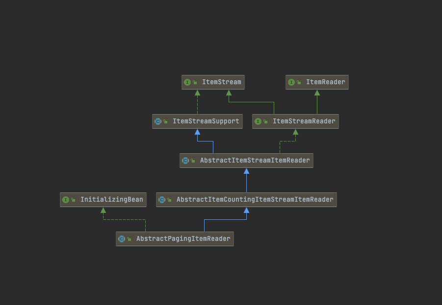

# ItemReader


Spring Batch의 Reader에서 읽어올 수 있는 데이터 유형은 다음과 같다.

- 입력 데이터에서 읽어오기
- 파일에서 읽어오기
- DB에서 읽어오기
- Java Message Service 등 다른 소스에서 읽어오기
- 커스텀한 Reader로 읽어오기

```java
package org.springframework.batch.item;

public interface ItemReader<T> {

	@Nullable
	T read() throws Exception, UnexpectedInputException, ParseException, NonTransientResourceException;

}
```

`ItemReader`의 `read()`를 호출하면, 해당 메서드는 스텝 내에서 처리할 Item한개를 반환하며, 스텝에서는 아이템 개수를 세어 청크 내 데이터가 몇개가 처리됐는지 관리한다.
해당 Item은 `ItemProcessor`로 전달되며, 그 뒤 `ItemWriter`로 전달된다.

가장 대표적인 구현체인 `JdbcPagingItemReader`의 클래스 계층 구조를 보면 다음과 같다.



여기서 `ItemReader`와 `ItemStream` 인터페이스도 같이 구현하고 있는 것을 볼 수 있다. 

```java
public interface ItemStream {
    void open(ExecutionContext var1) throws ItemStreamException;

    // Batch의 처리 상태 업데이트
    void update(ExecutionContext var1) throws ItemStreamException;

    void close() throws ItemStreamException;
}
```

`ItemStream`은 주기적으로 상태를 저장하고, 오류가 발생하면 해당 상태에서 복원하기 위한 마커인터페이스이다. 즉, **`ItemReader` 의 상태를 저장하고 실패한 곳에서 다시 실행할 수 있게 해주는 역할**을 한다. `ItemReader`와 `ItemStream` 인터페이스를 직접 구현하여 원하는 형태의 ItemReader를 만들 수 있다.

- [공식문서](https://docs.spring.io/spring-batch/docs/4.0.x/reference/html/readersAndWriters.html#readersAndWriters)

## 파일 입력

### FlatFileItemReader

- `org.springframework.batch.item.file.FlatFileItemReader`
- flat file
    - 한 개 혹은 그 이상의 레코드가 포함된 특정 파일
    -  파일의 내용을 봐도 데이터의 의미를 알 수 없다.
    - 파일 내 데이터의 포맷이나 의미를 정의하는 메타 데이터가 없다.

| 옵션                  | 타입                  | default                      | 설명                                                         | 구현체                                                       |
| --------------------- | --------------------- | ---------------------------- | ------------------------------------------------------------ | ------------------------------------------------------------ |
| comments              | String[]              | null                         | 문자열 배열에 파일을 파싱할 떄 건너뛰어야할 주석 줄을 나타내는 접두어 지정 |                                                              |
| encoding              | String                | 플랫폼의 기본 Charset        | 파일에 사용된 문자열 인코딩                                  |                                                              |
| **lineMapper**        | **LineMapper**        | **null(필수)**               | **파일 한줄을 String으로 읽은 뒤 처리 대상인 도메인 객체(Item)으로 변환** | `DefaultLineMapper`<br />`JsonLineMapper`<br />`PassThroughLineMapper` |
| lineToSkip            | int                   | 0                            | 파일을 읽어올 떄 몇 줄을 건너띄고 시작할지 지정              |                                                              |
| recordSeparatorPolicy | RecordSeparatorPolicy | DefaultRecordSeparatorPolicy | 각 줄의 마지막을 정의하는데 사용<br />별도로 지정하지 않으면 개행 문자가 레코드의 끝 부분을 나타낸다. |                                                              |
| **resource**          | **Resource**          | **null(필수)**               | **읽을 대상 리소스**                                         |                                                              |
| skippedLinesCallback  | LineCallbackHandler   | null                         | 줄을 건너뛸 떄 호출되는 콜백 인터페이스<br />건너띈 모든 줄은 이 콜백이 호출된다. |                                                              |
| strict                | boolean               | false                        | true로 지정시, 리소스를 찾을 수 없는 경우 Exception을 던진다. |                                                              |
| saveState             | boolean               | true                         | true : 재시작 가능하도록 각 청크 처리 후 `ItemReader` 상태 저장<br />false : 다중 스레드 환경에선 false 지정 |                                                              |

#### 고정된 너비 파일

```
Aimee      CHoover    7341Vel Avenue          Mobile          AL35928
Jonas      UGilbert   8852In St.              Saint Paul      MN57321
Regan      MBaxter    4851Nec Av.             Gulfport        MS33193
Octavius   TJohnson   7418Cum Road            Houston         TX51507
Sydnee     NRobinson  894 Ornare. Ave         Olathe          KS25606
Stuart     KMckenzie  5529Orci Av.            Nampa           ID18562
```

```java
    @Bean
    @StepScope
    public FlatFileItemReader<Customer> customerItemReader(@Value("#{jobParameters['customerFile']}") PathResource inputFile) {
        return new FlatFileItemReaderBuilder<Customer>()
                .name("customerItemReader") // 각 스텝의 ExecutionContext에 추가되는 특정키의 접두문자로 사용될 이름(saveState false인 경우 지정할 필요X)
                .resource(inputFile)
                .fixedLength() // FixedLengthBuilder
                .columns(new Range[]{new Range(1,11), new Range(12,12), new Range(13,22), new Range(23,26)
                        , new Range(27,46), new Range(47,62), new Range(63,64), new Range(65,69)}) // 고정너비
                .names(new String[]{"firstName", "middleInitial", "lastName", "addressNumber", "street"
                        , "city", "state", "zipCode"}) // 각 컬럼명
//                .strict(false) // 정의된 파싱 정보 보다 많은 항목이 레코드에 있는 경우(true 예외)
                .targetType(Customer.class) // BeanWrapperFieldSetMapper 생성해 도메인 클레스에 값을 채움
                .build();
    }
```

#### 구분자 파일

```
Aimee,C,Hoover,7341,Vel Avenue,Mobile,AL,35928
Jonas,U,Gilbert,8852,In St.,Saint Paul,MN,57321
Regan,M,Baxter,4851,Nec Av.,Gulfport,MS,33193
Octavius,T,Johnson,7418,Cum Road,Houston,TX,51507
Sydnee,N,Robinson,894,Ornare. Ave,Olathe,KS,25606
Stuart,K,Mckenzie,5529,Orci Av.,Nampa,ID,18562
```

```java
    @Bean
    @StepScope
    public FlatFileItemReader<Customer> delimitedCustomerItemReader(@Value("#{jobParameters['customerFile']}") PathResource inputFile) {
        return new FlatFileItemReaderBuilder<Customer>()
                .name("delimitedCustomerItemReader") // 각 스텝의 ExecutionContext에 추가되는 특정키의 접두문자로 사용될 이름(saveState false인 경우 지정할 필요X)
                .resource(inputFile)
                .delimited() // default(,) DelimitedLineTokenizer를 사용해 각 레코드를 FieldSet으로 변환
                .names(new String[]{"firstName", "middleInitial", "lastName", "addressNumber", "street"
                        , "city", "state", "zipCode"}) // 각 컬럼명
                .targetType(Customer.class) // BeanWrapperFieldSetMapper 생성해 도메인 클레스에 값을 채움
                .build();
    }
```

#### FieldSetMapper 커스텀

```java
public interface FieldSetMapper<T> {
	T mapFieldSet(FieldSet fieldSet) throws BindException;
}
```

`org.springframework.batch.item.file.mapping.FieldSetMapper`를 구현하여 커스텀 매퍼를 만들 수 있다.

```java
public class CustomFieldSetMapper implements FieldSetMapper<Customer> {

    @Override
    public Customer mapFieldSet(FieldSet fieldSet) throws BindException {
        Customer customer = new Customer();
        customer.setAddress(fieldSet.readString("addressNumber") + " " + fieldSet.readString("street"));
        customer.setCity(fieldSet.readString("city"));
        customer.setFirstName(fieldSet.readString("firstName"));
        customer.setLastName(fieldSet.readString("lastName"));
        customer.setMiddleInitial(fieldSet.readString("middleInitial"));
        customer.setState(fieldSet.readString("state"));
        customer.setZipCode(fieldSet.readString("zipCode"));

        return customer;
    }
}
```

```java
    @Bean
    @StepScope
    public FlatFileItemReader<Customer> delimitedCustomerItemReader(@Value("#{jobParameters['customerFile']}") PathResource inputFile) {
        return new FlatFileItemReaderBuilder<Customer>()
                .name("delimitedCustomerItemReader")
                .resource(inputFile)
                .delimited() 
                .names(new String[]{"firstName", "middleInitial", "lastName", 														"addressNumber", "street", "city", "state", "zipCode"})
                .fieldSetMapper(new CustomFieldSetMapper()) // customMapper 설정
                .build();
    }
```

`.fieldSetMapper()`에 커스텀 매퍼를 지정하면 된다.

#### LineTokenizer 커스텀

- `org.springframework.batch.item.file.transform.LineTokenizer`

```java
public interface LineTokenizer {
	FieldSet tokenize(@Nullable String line);
}
```

```java
public class CustomFileLineTokenizer implements LineTokenizer {

    @Setter
    private String delimiter = ",";

    private String[] names = new String[]{
              "firstName"
            , "middleInitial"
            , "lastName"
            , "address"
            , "city"
            , "state"
            , "zipCode"
    };

    private FieldSetFactory fieldSetFactory = new DefaultFieldSetFactory();

    @Override
    public FieldSet tokenize(String line) {

        // 구분자로 필드 구분
        String[] fields = line.split(delimiter);

        List<String> parsedFields = new ArrayList<>();

        for (int i = 0; i < fields.length; i++) {
            if (i == 4) {
                // 3,4번쨰 필드 단일 필드로 구성
                parsedFields.set(i - 1, parsedFields.get(i - 1) + " " + fields[i]);
            } else {
                parsedFields.add(fields[i]);
            }
        }


        // 값의 배열 & 필드 이름 배열을 넘겨 필드를 생성
        return fieldSetFactory.create(parsedFields.toArray(new String[0]), names);
    }
}
```

```java
    @Bean
    @StepScope
    public FlatFileItemReader<Customer> lineTokenizerCustomerItemReader(@Value("#{jobParameters['customerFile']}") PathResource inputFile) {
        return new FlatFileItemReaderBuilder<Customer>()
                .name("lineTokenizerCustomerItemReader")
                .resource(inputFile)
                .lineTokenizer(new CustomFileLineTokenizer()) // lineTokenzier Custom
                .targetType(Customer.class) // BeanWrapperFieldSetMapper 생성해 도메인 클레스에 값을 채움
                .build();
    }
```

#### LineMapper

- `org.springframework.batch.item.file.mapping.PatternMatchingCompositeLineMapper`
    - 여러개의 `LineTokenizer`로 구성된  Map을 선언할 수 있음.
        - `PatternMatcher<LineTokenizer> tokenizers`
    - 각 `LineTokenizer`를 필요로 하는 여러개의 `FieldSetMapper` Map 선언할 수 있음.
        - `PatternMatcher<FieldSetMapper<T>> patternMatcher`

```
CUST,Warren,Q,Darrow,8272 4th Street,New York,IL,76091
TRANS,1165965,2011-01-22 00:13:29,51.43
CUST,Ann,V,Gates,9247 Infinite Loop Drive,Hollywood,NE,37612
CUST,Erica,I,Jobs,8875 Farnam Street,Aurora,IL,36314
TRANS,8116369,2011-01-21 20:40:52,-14.83
TRANS,8116369,2011-01-21 15:50:17,-45.45
TRANS,8116369,2011-01-21 16:52:46,-74.6
TRANS,8116369,2011-01-22 13:51:05,48.55
TRANS,8116369,2011-01-21 16:51:59,98.53
```

여러 형식으로 구성된 csv 파일이다.

```java
		@Bean
    public PatternMatchingCompositeLineMapper lineTokenizer() {
        Map<String, LineTokenizer> lineTokenizerMap = new HashMap<>(2);

        lineTokenizerMap.put("TRANS*", transactionLineTokenizer()); // TRANS로 시작하면 transactionLineTokenizer
        lineTokenizerMap.put("CUST*", customerLineTokenizer()); // CUST로 시작하면, customerLineTokenizer

        Map<String, FieldSetMapper> fieldSetMapperMap = new HashMap<>(2);

        BeanWrapperFieldSetMapper<Customer> customerFieldSetMapper = new BeanWrapperFieldSetMapper<>();
        customerFieldSetMapper.setTargetType(Customer.class);

        fieldSetMapperMap.put("TRANS*", new TransactionFieldSetMapper()); // 일반적이지 않은 타입 필드 변환시 FieldSetMapper 필요(Date, Double)
        fieldSetMapperMap.put("CUST*", customerFieldSetMapper);

        PatternMatchingCompositeLineMapper lineMappers = new PatternMatchingCompositeLineMapper();

        lineMappers.setTokenizers(lineTokenizerMap);
        lineMappers.setFieldSetMappers(fieldSetMapperMap);

        return lineMappers;
    }
```

TRANS로 시작하는 경우와 CUST로 시작하는 경우 각각 `FieldSetMapper`, `LineTokenizer`를 사용해 파싱 및 set을 할 수 있다.

```java

    @Bean
    public DelimitedLineTokenizer transactionLineTokenizer() {
        DelimitedLineTokenizer delimitedLineTokenizer = new DelimitedLineTokenizer();

        delimitedLineTokenizer.setNames("prefix", "accountNumber", "transactionDate", "amount");

        return delimitedLineTokenizer;
    }

    @Bean
    public DelimitedLineTokenizer customerLineTokenizer() {
        DelimitedLineTokenizer delimitedLineTokenizer = new DelimitedLineTokenizer();

        delimitedLineTokenizer.setNames("firstName", "middleInitial", "lastName", "address", "city", "state", "zipCode");
        delimitedLineTokenizer.setIncludedFields(1,2,3,4,5,6,7); // prefix제외한 모든 필드

        return delimitedLineTokenizer;
    }
```

####  ItemStreamReader 커스텀

두개의 다른 포맷의 데이터가 사실은 서로 연관이 있는 데이터일 수 있다.
그 경우에는 한개의 도메인이 다른 한개의 도메인의 내용을 포함하고 있을 수 있다.

```
CUST,Warren,Q,Darrow,8272 4th Street,New York,IL,76091
TRANS,1165965,2011-01-22 00:13:29,51.43
CUST,Ann,V,Gates,9247 Infinite Loop Drive,Hollywood,NE,37612
CUST,Erica,I,Jobs,8875 Farnam Street,Aurora,IL,36314
TRANS,8116369,2011-01-21 20:40:52,-14.83
TRANS,8116369,2011-01-21 15:50:17,-45.45
TRANS,8116369,2011-01-21 16:52:46,-74.6
TRANS,8116369,2011-01-22 13:51:05,48.55
TRANS,8116369,2011-01-21 16:51:59,98.53
```

거래내역(TRANS) 데이터는 그 위의 고객(CUST)의 계약 정보라고 가정해볼 것이다.

```java
@AllArgsConstructor
@NoArgsConstructor
@Getter
@Setter
@ToString
public class Customer {

    private Long id;
    private String firstName;
    private String middleInitial;
    private String lastName;
    private String addressNumber;
		private String street;
    private String city;
    private String state;
    private String zipCode;

    private String address;

    private List<Transaction> transactions; // 고객의 개약정보

}
```

Custom 도메인 객체에 Transaction 거래내역 정보를 포함하게 변경해준다.

```java
public class CustomerFileReader implements ItemStreamReader<Customer> {

    private Object curItem = null;

    private ItemStreamReader<Object> delegate;

    public CustomerFileReader(ItemStreamReader<Object> delegate) {
        this.delegate = delegate;
    }

    @Override
    public Customer read() throws Exception, UnexpectedInputException, ParseException, NonTransientResourceException {
        if (curItem == null) {
            curItem = delegate.read(); // 고객 정보를 읽음.
        }

        Customer item = (Customer) curItem;
        curItem = null;

        if (item != null) {
            item.setTransactions(new ArrayList<>());

            // 다음 고객 레코드를 만나기 전까지 거래내역 레코드를 읽는다.
            while (peek() instanceof Transaction) {
                item.getTransactions().add((Transaction) curItem);
                curItem = null;
            }
        }

        return item;
    }

    private Object peek() throws Exception {
        if (curItem == null) {
            curItem = delegate.read();
        }
        return curItem;
    }


    @Override
    public void open(ExecutionContext executionContext) throws ItemStreamException {
        delegate.open(executionContext);
    }

    @Override
    public void update(ExecutionContext executionContext) throws ItemStreamException {
        delegate.update(executionContext);
    }

    @Override
    public void close() throws ItemStreamException {
        delegate.close();
    }
}

```

여기서 핵심은 `read()` 메서드이다. 한줄씩 읽어올 때 다음 고객정보가 나올때까지 거래내역 레코드를 읽어 해당 고객이 가지고 있게 한다.

```java
    @Bean
    @StepScope
    public FlatFileItemReader multiLineItemReader(@Value("#{jobParameters['customFile']}") PathResource resource) {
        return new FlatFileItemReaderBuilder<Customer>()
                .name("multiLineItemReader")
                .lineMapper(multiLineTokenizer())
                .resource(resource)
                .build();
    }

    @Bean
    public CustomerFileReader customerFileReader() {
        return new CustomerFileReader(multiLineItemReader(null));
    }

```

Job에서 itemReader부분에 위에서 생성한 `CustomerFileReader`를 설정해주면 된다.

```
Customer(id=null, firstName=Warren, middleInitial=Q, lastName=Darrow, addressNumber=null, street=null, city=New York, state=IL, zipCode=76091, address=8272 4th Street, transactions=[Transaction(accountNumber=1165965, transactionDate=Sat Jan 22 00:13:29 KST 2011, amount=51.43, dateFormat=java.text.SimpleDateFormat@7c669100)])
Customer(id=null, firstName=Ann, middleInitial=V, lastName=Gates, addressNumber=null, street=null, city=Hollywood, state=NE, zipCode=37612, address=9247 Infinite Loop Drive, transactions=[])
Customer(id=null, firstName=Erica, middleInitial=I, lastName=Jobs, addressNumber=null, street=null, city=Aurora, state=IL, zipCode=36314, address=8875 Farnam Street, transactions=[Transaction(accountNumber=8116369, transactionDate=Fri Jan 21 20:40:52 KST 2011, amount=-14.83, dateFormat=java.text.SimpleDateFormat@7c669100), Transaction(accountNumber=8116369, transactionDate=Fri Jan 21 15:50:17 KST 2011, amount=-45.45, dateFormat=java.text.SimpleDateFormat@7c669100), Transaction(accountNumber=8116369, transactionDate=Fri Jan 21 16:52:46 KST 2011, amount=-74.6, dateFormat=java.text.SimpleDateFormat@7c669100), Transaction(accountNumber=8116369, transactionDate=Sat Jan 22 13:51:05 KST 2011, amount=48.55, dateFormat=java.text.SimpleDateFormat@7c669100), Transaction(accountNumber=8116369, transactionDate=Fri Jan 21 16:51:59 KST 2011, amount=98.53, dateFormat=java.text.SimpleDateFormat@7c669100)])
```

다음과 같이 고객이 가지고 있는 거래내역을 출력할 수 있다.

#### MultiResourceItemReader

동일한 포맷으로 작성된 여러개의 파일을 읽어들이는 `ItemReader`를 제공한다.

- `org.springframework.batch.item.file.MultiResourceItemReader`

`MultiResourceItemReader`는 읽어야할 파일명의 패턴을 `MultiResourceItemReader`의 의존성으로 정의한다.

```java
public class MultiResourceCustomerFileReader implements ResourceAwareItemReaderItemStream<Customer> {

    private Object curItem = null;

    private ResourceAwareItemReaderItemStream<Object> delegate;

    public MultiResourceCustomerFileReader(ResourceAwareItemReaderItemStream<Object> delegate) {
        this.delegate = delegate;
    }


    /**
     * Resource를 주입함으로 ItemReader가 파일 관리하는 대신
     * 각 파일을 스프링 배치가 생성해 주입
     * @param resource
     */
    @Override
    public void setResource(Resource resource) {
        System.out.println(resource);
        this.delegate.setResource(resource);
    }

    @Override
    public Customer read() throws Exception, UnexpectedInputException, ParseException, NonTransientResourceException {
        if (curItem == null) {
            curItem = delegate.read(); // 고객 정보를 읽음.
        }

        Customer item = (Customer) curItem;
        curItem = null;

        if (item != null) {
            item.setTransactions(new ArrayList<>());

            // 다음 고객 레코드를 만나기 전까지 거래내역 레코드를 읽는다.
            while (peek() instanceof Transaction) {
                item.getTransactions().add((Transaction) curItem);
                curItem = null;
            }
        }

        return item;
    }

    private Object peek() throws Exception {
        if (curItem == null) {
            curItem = delegate.read();
        }
        return curItem;
    }

    @Override
    public void open(ExecutionContext executionContext) throws ItemStreamException {
        delegate.open(executionContext);
    }

    @Override
    public void update(ExecutionContext executionContext) throws ItemStreamException {
        delegate.update(executionContext);
    }

    @Override
    public void close() throws ItemStreamException {
        delegate.close();
    }
}
```

위에서 다룬 `ItemStreamReader` 와 다른 점은 `Resource` 주입부분이다. `Resource`를 주입하게 되면 필요한 각 파일을 스프링 배치가 생성해  `ItemReader`에 주입할 수 있다.

```java
@Bean
    @StepScope
    public MultiResourceItemReader multiResourceItemReader(@Value("#{jobParameters['customFile']}") Resource[] resources) {
        return new MultiResourceItemReaderBuilder<>()
                .name("multiResourceItemReader")
                .resources(resources) // resources 배열
                .delegate(multiResourceCustomerFileReader()) // 실제 작업을 수행할 위임 컴포넌트
                .build();
    }

    @Bean
    public MultiResourceCustomerFileReader multiResourceCustomerFileReader() {
        return new MultiResourceCustomerFileReader(multiResourceCustomerItemReader());
    }

    @Bean
    @StepScope
    public FlatFileItemReader multiResourceCustomerItemReader() {
        return new FlatFileItemReaderBuilder<Customer>()
                .name("multiResourceCustomerItemReader")
                .lineMapper(multiResourceTokenizer())
                .build();
    }

```

읽어야할 파일 목록(resources)을 설정해주고, `delegate()`에 실제로 작업을 수행할 위임 컴포넌트를 지정해주면된다.

여러 개의 파일을 다룰때는 재시작을 하게되는 상황에서 스프링배치가 추가적인 안정장치를 제공해주지 않는다.
예를들어 file1.csv, file2.csv, file3.csv가 있는데, file2.csv 처리하는 과정에서 오류가 발생하여 잡이 실패 된 이후 재시작을 할때 file4.csv를 추가한다면, 최초 실행시  file4.csv가 없었음에도 불구하고, 포함하여 실행한다.

이러한 문제점을 해결하기 위해서 배치 실행 시 사용할 디렉터리를 별도로 생성하는 것이 일반적이며, 새로 생성된 모든 파일은 새로운 디렉터리에 넣어주어 현재 수행중인 잡에 영향을 주지않게 할 수 있다.

### XML

XML은 파일 내 데이터를 설명할 수 있는 태그를 사용해 파일에 포함된 데이터를 설명하므로, Flat file과는 다르다.

XML parser로 주로 DOM과 SAX를 많이 사용한다.

#### Dom vs SAX vs StAX

- 참고 : [https://gohlab2017.tistory.com/3](https://gohlab2017.tistory.com/3)

**DOM(Document Object Model)** 방식

- XML문서 **전체를 메모리에 로드하여 값을 읽는다**.
- XML문서를 읽으면 모든 Element, Text, Attribute 등에 대한 객체를 생성하고, 이를 Document 객체로 리턴한다.
- Document 객체는 DOM API에 알맞는 트리 구조의 자바 객체로 표현되어 있다.
- XML문서가 메모리에 모두 올라가 있어서 **노드들의 검색, 수정, 구조변경이 빠르고 용이**하다.
- SAX 방식 보다 직관적이며 파싱이 단순하기 때문에 일반적으로 DOM 방식을 채택하여 개발하게 된다.

**SAX(Simple API for XML) 방식**

- SAX 방식은 XML 문서를 하나의 긴 문자열로 간주한다.
- XML문서를 앞에서 부터 순차적으로 읽어가면서 노드가 열리고 닫히는 과정에서 이벤트가 발생한다.
- 각각의 이벤트가 발생될 때마다 수행하고자 하는 기능을 이벤트 핸들러 기술을 이용하여 구현한다.
- XML문서를 메모리에 전부 로딩하고 파싱하는 것이 아니기 때문에 **메모리 사용량이 적고 단순히 읽기만 할때 속도가 빠르다**.
- 발생한 이벤트를 핸들링하여 변수에 저장하고 활용하는 것이기 때문에 복잡하고 노드 수정이어렵다.
- XML 오브젝트에 Random Access를 하지 못해, 지난 엘리먼트를 참조할 경우 다시 처음부터 읽어야한다.

**StAX(Streaming API for XML)**

- StAX는 push 와 pull 방식을 동시에 제공하는 하이브리드한 형태
- XML 문서를 파싱할때 하나의 Fragment로 구분
    - 정해진 엘리먼트를 읽을때는 DOM 방식을 사용하며, Fragement로 처리하는 것은  SAX의 Push 방식을 사용
    - 즉, 각 세션을 독립적으로 파싱하는 기능을 제공

스프링 배치에서는 StAX 파서를 사용한다.

#### StaxEventItemReader

- `org.springframework.batch.item.xml.StaxEventItemReader`

```xml
<customers>
    <customer>
        <firstName>Laura</firstName>
        <middleInitial>O</middleInitial>
        <lastName>Minella</lastName>
        <address>2039 Wall Street</address>
        <city>Omaha</city>
        <state>IL</state>
        <zipCode>35446</zipCode>
        <transactions>
            <transaction>
                <accountNumber>829433</accountNumber>
                <transactionDate>2010-10-14 05:49:58</transactionDate>
                <amount>26.08</amount>
            </transaction>
        </transactions>
    </customer>
  ...
</customers>
```

위 예제 파일을 파싱하는 Reader를 구현해볼것이다.

```java
@Bean
    @StepScope
    public StaxEventItemReader<Customer> staxCustomerFileReader(@Value("#{jobParameters['customFile']}")Resource resource) {
        return new StaxEventItemReaderBuilder<Customer>()
                .name("staxCustomerFileReader")
                .resource(resource)
                .addFragmentRootElements("customer") // 프레그먼트 루트 엘리먼트
                .unmarshaller(customerMarshaller()) // XML을 도메인 객체로 반환 JAXB 사용
                .build();
    }
```

- `.addFragmentRootElements()` : `StaxEventItemReader`를 사용하려면 XML 프래크먼트 루트 엘리먼트를 지정
    XML내에서 Item으로 취급할 fragment의 root 엘리먼트를 식별하는데 사용
- `.unmarshaller()` : `org.springframework.oxm.Unmarshaller`  구현체를 전달 받으며, XML을 도메인 객체로 반환

이번 예제에서는 `org.springframework.oxm.jaxb.Jaxb2Marshaller`를 사용했으며, `Jaxb2Marshaller`를 사용하기 위해서는 의존성 추가가 필요하다.

**build.gradle**

```groovy
dependencies {
    implementation 'org.springframework:spring-oxm'
    implementation 'javax.xml.bind:jaxb-api:2.3.1'
    implementation 'javax.activation:activation:1.1'
    implementation 'com.sun.xml.bind:jaxb-core:2.3.0.1'
    implementation 'com.sun.xml.bind:jaxb-impl:2.3.1'
}
```

JAXB 의존성과 Spring OXM 모듈로 JAXB를 사용하는 스프링 컴포넌트 의존성을 추가해준다.

XML을 파싱할 수 있게 하려면 도매인 객체에  JAXB 어노테이션을 추가해줄 것이다.

```java
@NoArgsConstructor
@Getter
@Setter
@ToString
@XmlRootElement
public class Customer {

    private Long id;
    private String firstName;
    private String middleInitial;
    private String lastName;
    private String addressNumber;
    private String street;
    private String city;
    private String state;
    private String zipCode;

    private String address; // customAddressMapper

    private List<Transaction> transactions;

    @XmlElementWrapper(name = "transactions")
    @XmlElement(name = "transaction")
    public void setTransactions(List<Transaction> transactions) {
        this.transactions = transactions;
    }
}
```

```java
@Getter
@Setter
@ToString
@XmlType(name = "transaction")
public class Transaction {
    private String accountNumber;
    private Date transactionDate;
    private Double amount;

    @Setter(value = AccessLevel.NONE)
    private DateFormat dateFormat = new SimpleDateFormat("MM/dd/yyyy");

}
```

도메인 객체 설정이 끝났으면, 각 블록을 파싱하는데 사용할 Unmarshaller를 구현해주면 된다.

```java
		@Bean
    public Jaxb2Marshaller customerMarshaller() {
        Jaxb2Marshaller jaxb2Marshaller = new Jaxb2Marshaller();
        jaxb2Marshaller.setClassesToBeBound(Customer.class, Transaction.class); // 도메인 객체

        return jaxb2Marshaller;
    }
```

### JSON

#### JsonItemReader

- `org.springframework.batch.item.json.JsonItemReader`
- 청크를 읽어 객체로 파싱한다.
- 실제 파싱 작업은 `JsonObjectReader` 인터페이스 구현체에 위임한다.

#### JsonObjectReader

실제로 JSON 객체를 파싱하는 역할을 한다.
스프링 배치는 2개의 `JsonObjectReader`를 제공해준다.

- Jackson
- Gson

```json
[
  {
    "firstName": "Laura",
    "middleInitial": "O",
    "lastName": "Minella",
    "address": "2039 Wall Street",
    "city": "Omaha",
    "state": "IL",
    "zipCode": "35446",
    "transactions": [
      {
        "accountNumber": 829433,
        "transactionDate": "2010-10-14 05:49:58",
        "amount": 26.08
      }
    ]
  },
  ...
]
```

위 구조로되어있는 JSON을 파싱해 볼것이다.

```java
		@Bean
    @StepScope
    public JsonItemReader<Customer> jsonFileReader(@Value("#{jobParameters['customFile']}") Resource resource) {

        // Jackson이 JSON을 읽고 쓰는데 사용하는 주요 클래스
        ObjectMapper objectMapper = new ObjectMapper();
        objectMapper.setDateFormat(new SimpleDateFormat("yyyy-MM-dd hh:mm:ss"));

        JacksonJsonObjectReader<Customer> jsonObjectReader = new JacksonJsonObjectReader<>(Customer.class); // 반환할 클래스 설정
        jsonObjectReader.setMapper(objectMapper); // ObjectMapper

        return new JsonItemReaderBuilder<Customer>()
                .name("jsonFileReader")
                .jsonObjectReader(jsonObjectReader) // 파싱에 사용
                .resource(resource)
                .build();
    }
```

- `ObjectMapper`는 Jackson이 JSON을 읽고 쓰는데 사용하는 주요 클래스로 커스텀 데이터 포맷들을 설정하면된다.
- `JacksonJsonObjectReader` 생성시 반환할 클래스를 설정하고, 커스텀한 `ObjectMapper`를 설정해주면된다.
- `JsonItemReaderBuilder`는 파싱에 사용할 `JsonObjectReader`를 설정해주면된다.


## Database Reader


- Cursor 방식은 DB와 커넥션을 맺은 후, Cursor를 한칸씩 옮기면서 지속적으로 데이터를 가져온다.
  - JdbcCursorItemReader
  - HibernateCursorItemReader
  - StoredProcedureItemReader
- Paging 방식은 한번에 지정한 PageSize만큼 데이터를 가져온다.
  - JdbcPagingItemReader
  - HibernatePagingItemReader
  - JpaPagingItemReader
  - [MybatisItemReader](http://mybatis.org/spring/ko/batch.html)

### CursorItemReader

CursorItemReader는 streaming으로 데이터를 처리한다. 대표적인 CursorItemReader중 하나인 `JdbcCursorItemReader`와 Spring Batch v4.3.0  이후에 도입된 `JpaCursorItemReader`를 살펴볼 것이다.

#### JdbcCursorItemReader

```java

@Slf4j
@RequiredArgsConstructor
@Configuration
public class JdbcCursorItemReaderJobConfiguration {
    private final JobBuilderFactory jobBuilderFactory;
    private final StepBuilderFactory stepBuilderFactory;
    private final DataSource dataSource;


    private static final int CHUNK_SIZE = 10;

    @Bean
    public Job jdbcCursorItemReaderJob(){
        return jobBuilderFactory.get("jdbcCursorItemReaderJob")
                .start(jdbcCursorItemReaderStep())
                .build();
    }
    @Bean
    public Step jdbcCursorItemReaderStep(){
        return stepBuilderFactory.get("jdbcCursorItemReaderStep")
                .<Pay, Pay>chunk(CHUNK_SIZE)
                .reader(jdbcCursorItemReader())
                .writer(jdbcCursorItemWriter())
                .build();
    }
    @Bean
    public JdbcCursorItemReader<Pay> jdbcCursorItemReader(){
        return new JdbcCursorItemReaderBuilder<Pay>()
                .fetchSize(CHUNK_SIZE)
                .dataSource(dataSource)
                .rowMapper(new BeanPropertyRowMapper<>(Pay.class))
                .sql("SELECT id, amount, tx_name, tx_date_time FROM pay")
                .name("jdbcCursorItemReader")
                .build();
    }
    @Bean
    public ItemWriter<Pay> jdbcCursorItemWriter(){
        return list -> {
            for(Pay pay : list){
                log.info("Current Pay={}", pay);
            }
        };
    }
}
```

- `<T, T> chunk(int chunkSize)` : 첫번째 T는 Reader에서 반환할 타입, 두번째 T는 Writer에 파라미터로 넘어올 타입이다.
- fetchSize : DB에서 한번에 가져올 데이터 양을 나타낸다. Paging은 실제 쿼리를 limit, offset으로 분할 처리하는 반면, Cursor는 분할 처리없이 실행되나 내부적으로 가져온는 데이터는 FetchSize만큼 가져와 `read()`를 통해서 하나씩 가져온다.
- dataSource : DB에 접근하기 위해 사용할 DataSource객체
- rowMapper : 쿼리 결과를 인스턴스로 매핑하기 위한 매퍼
- sql : Reader에서 사용할 쿼리문
- name : Reader의 이름, ExecutionContext에 저장되어질 이름

```java
@Slf4j
@Configuration
@RequiredArgsConstructor
public class JpaCursorItemReaderJobConfiguration {

    private final JobBuilderFactory jobBuilderFactory;
    private final StepBuilderFactory stepBuilderFactory;
    private final EntityManagerFactory entityManagerFactory;

    private static final int CHUNK_SIZE = 10;


    @Bean
    public Job jpaCursorItemReaderJob() throws Exception {
        return jobBuilderFactory.get("jpaCursorItemReaderJob")
                .start(jpaCursorItemReaderStep())
                .build();
    }

    @Bean
    public Step jpaCursorItemReaderStep() throws Exception {
        return stepBuilderFactory.get("jpaCursorItemReaderStep")
                .<Pay, Pay>chunk(CHUNK_SIZE)
                .reader(jpaCursorItemReader())
                .writer(jpaCursorItemWriter())
                .build();
    }

    @Bean
    public JpaCursorItemReader<Pay> jpaCursorItemReader() throws Exception{
        return new JpaCursorItemReaderBuilder<Pay>()
                .name("jpaCursorItemReader")
                .entityManagerFactory(entityManagerFactory)
                .queryString("SELECT p FROM Pay p")
                .build();
    }

    private ItemWriter<Pay> jpaCursorItemWriter() {
        return list -> {
            for (Pay pay: list) {
                log.info("Current Pay={}", pay);
            }
        };
    }

}
```


Cursor는 하나의 Connection으로 Batch가 끝날때가지 사용되기 때문에 Batch가 끝나기전에 DB와 어플리케이션 Connection이 끊어질 수 있으므로, DB와  SocketTimeout을 충분히 큰 값으로 설정해야한다.

**Batch 수행시간이 오래 걸리는 경우에는 `PagingItemReader`를 사용**하는 것이 좋다. **Paging의 경우 한 페이지를 읽을때마다 Connection을 맺고 끊기 때문에 아무리 많은 데이터라도 타임아웃과 부하 없이 수행**될 수 있다.


### PagingItemReader

SpringBatch에서 offset과 limit을 PageSize에 맞게 자동으로 생성해준다. 다만 각 쿼리는 개별적으로 실행되므로, 페이징시 결과를 정렬(order by)하는 것이 중요하다.

#### JdbcPagingItemReader

```java
package spring.batch.practice.jobs;

import lombok.RequiredArgsConstructor;
import lombok.extern.slf4j.Slf4j;
import org.springframework.batch.core.Job;
import org.springframework.batch.core.Step;
import org.springframework.batch.core.configuration.annotation.JobBuilderFactory;
import org.springframework.batch.core.configuration.annotation.StepBuilderFactory;
import org.springframework.batch.item.ItemWriter;
import org.springframework.batch.item.database.JdbcPagingItemReader;
import org.springframework.batch.item.database.Order;
import org.springframework.batch.item.database.PagingQueryProvider;
import org.springframework.batch.item.database.builder.JdbcPagingItemReaderBuilder;
import org.springframework.batch.item.database.support.SqlPagingQueryProviderFactoryBean;
import org.springframework.context.annotation.Bean;
import org.springframework.context.annotation.Configuration;
import org.springframework.jdbc.core.BeanPropertyRowMapper;
import spring.batch.practice.domain.Pay;

import javax.sql.DataSource;
import java.util.HashMap;
import java.util.Map;

@Slf4j
@RequiredArgsConstructor
@Configuration
public class JdbcPagingItemReaderJobConfiguration {
    private final JobBuilderFactory jobBuilderFactory;
    private final StepBuilderFactory stepBuilderFactory;
    private final DataSource dataSource;


    private static final int CHUNK_SIZE = 10;

    @Bean
    public Job jdbcPagingItemReaderJob() throws Exception {
        return jobBuilderFactory.get("jdbcPagingItemReaderJob")
                .start(jdbcPagingItemReaderStep())
                .build();
    }
    @Bean
    public Step jdbcPagingItemReaderStep() throws Exception {
        return stepBuilderFactory.get("jdbcPagingItemReaderStep")
                .<Pay, Pay>chunk(CHUNK_SIZE)
                .reader(jdbcPagingItemReader())
                .writer(jdbcPagingItemWriter())
                .build();
    }
    @Bean
    public JdbcPagingItemReader<Pay> jdbcPagingItemReader() throws Exception {
        Map<String, Object> params = new HashMap<>();
        params.put("amount", 2000);

        return new JdbcPagingItemReaderBuilder<Pay>()
                .fetchSize(CHUNK_SIZE)
                .dataSource(dataSource)
                .rowMapper(new BeanPropertyRowMapper<>(Pay.class))
                .queryProvider(createQueryProvider())
                .parameterValues(params)
                .name("jdbcPagingItemReader")
                .build();
    }
    @Bean
    public ItemWriter<Pay> jdbcPagingItemWriter(){
        return list -> {
            for(Pay pay : list){
                log.info("Current Pay={}", pay);
            }
        };
    }

    @Bean
    public PagingQueryProvider createQueryProvider() throws Exception {
        SqlPagingQueryProviderFactoryBean queryProvider = new SqlPagingQueryProviderFactoryBean();
        queryProvider.setDataSource(dataSource);
        queryProvider.setSelectClause("id, amount, tx_name, tx_date_time");
        queryProvider.setFromClause("from pay");
        queryProvider.setWhereClause("where amount >= :amount");

        Map<String, Order> sortKeys = new HashMap<>();
        sortKeys.put("id", Order.ASCENDING);

        queryProvider.setSortKeys(sortKeys);

        return queryProvider.getObject();
    }
}

```

`PagingItemReader`는 `PagingQueryProvider`를 통해 쿼리를 생성한다. 이렇게 생성하는 이유는 각 DB에는 Paging을 지원하는 자체적인 전략이 있으며, Spring은 각 DB의 Paging 전략에 맞춰 구현되어야만 한다.

```java
public SqlPagingQueryProviderFactoryBean() {
        this.providers.put(DatabaseType.DB2, new Db2PagingQueryProvider());
        this.providers.put(DatabaseType.DB2VSE, new Db2PagingQueryProvider());
        this.providers.put(DatabaseType.DB2ZOS, new Db2PagingQueryProvider());
        this.providers.put(DatabaseType.DB2AS400, new Db2PagingQueryProvider());
        this.providers.put(DatabaseType.DERBY, new DerbyPagingQueryProvider());
        this.providers.put(DatabaseType.HSQL, new HsqlPagingQueryProvider());
        this.providers.put(DatabaseType.H2, new H2PagingQueryProvider());
        this.providers.put(DatabaseType.MYSQL, new MySqlPagingQueryProvider());
        this.providers.put(DatabaseType.ORACLE, new OraclePagingQueryProvider());
        this.providers.put(DatabaseType.POSTGRES, new PostgresPagingQueryProvider());
        this.providers.put(DatabaseType.SQLITE, new SqlitePagingQueryProvider());
        this.providers.put(DatabaseType.SQLSERVER, new SqlServerPagingQueryProvider());
        this.providers.put(DatabaseType.SYBASE, new SybasePagingQueryProvider());
    }
```

Spring Batch에서는 `SqlPagingQueryProviderFactoryBean`을 통해 DataSource 설정 값을 보고, 위 Provider중 하나를 자동 선택하도록 한다.

```sql
SELECT id, amount, tx_name, tx_date_time FROM pay WHERE amount >= :amount ORDER BY id ASC LIMIT 10
```

실행된 쿼리 로그를 보면 LIMIT 10이 들어간 것을 볼 수 있다.

#### JpaPagingItemReader

Jpa에서는 Cursor 기반 DB 접근을 지원하지 않는다.

```java

@Slf4j
@RequiredArgsConstructor
@Configuration
public class JpaPagingItemReaderJobConfiguration {
    private final JobBuilderFactory jobBuilderFactory;
    private final StepBuilderFactory stepBuilderFactory;
    private final EntityManagerFactory entityManagerFactory;


    private static final int CHUNK_SIZE = 10;

    @Bean
    public Job jpaPagingItemReaderJob() {
        return jobBuilderFactory.get("jpaPagingItemReaderJob")
                .start(jpaPagingItemReaderStep())
                .build();
    }
    @Bean
    public Step jpaPagingItemReaderStep() {
        return stepBuilderFactory.get("jpaPagingItemReaderStep")
                .<Pay, Pay>chunk(CHUNK_SIZE)
                .reader(jpaPagingItemReader())
                .writer(jpaPagingItemWriter())
                .build();
    }
    @Bean
    public JpaPagingItemReader<Pay> jpaPagingItemReader(){
        return new JpaPagingItemReaderBuilder<Pay>()
                .name("jpaPagingItemReader")
                .entityManagerFactory(entityManagerFactory)
                .pageSize(CHUNK_SIZE)
                .queryString("SELECT p FROM Pay p WHERE amount >= 2000")
                .build();
    }
    @Bean
    public ItemWriter<Pay> jpaPagingItemWriter(){
        return list -> {
            for(Pay pay : list){
                log.info("Current Pay={}", pay);
            }
        };
    }
}

```

`.entityManagerFactory`를 설정하는 것 이외에 Jdbc와 크게 다른 점은 없다.

### MyBatisPagingItemReader

```xml
<!--mybatis-config.xml-->
<?xml version="1.0" encoding="UTF-8" ?>
<!DOCTYPE configuration
        PUBLIC "-//mybatis.org//DTD Config 3.0//EN"
        "http://mybatis.org/dtd/mybatis-3-config.dtd">
<configuration>
    <settings>
        <setting name="defaultStatementTimeout" value="25"/>
    </settings>
</configuration>
```

```java
package spring.batch.practice.config;

import lombok.extern.slf4j.Slf4j;
import org.apache.ibatis.session.SqlSessionFactory;
import org.mybatis.spring.SqlSessionFactoryBean;
import org.mybatis.spring.SqlSessionTemplate;
import org.mybatis.spring.annotation.MapperScan;
import org.springframework.beans.factory.annotation.Qualifier;
import org.springframework.beans.factory.annotation.Value;
import org.springframework.boot.context.properties.ConfigurationProperties;
import org.springframework.boot.context.properties.ConfigurationPropertiesScan;
import org.springframework.boot.jdbc.DataSourceBuilder;
import org.springframework.context.ApplicationContext;
import org.springframework.context.annotation.Bean;
import org.springframework.context.annotation.Configuration;
import org.springframework.core.io.Resource;
import org.springframework.core.io.support.PathMatchingResourcePatternResolver;

import javax.sql.DataSource;

@Slf4j
@Configuration
public class MysqlMybatisConfig {

    @Value("${mybatis.mapper-locations}")
    private String mapperLocations;

    @Bean(name = "mybatisDataSource")
    @ConfigurationProperties(prefix = "spring.datasource.hikari")
    public DataSource dataSource(){
        return DataSourceBuilder.create().build();
    }

    @Bean(name = "mybatisSqlSessionFactory")
    public SqlSessionFactory sqlSessionFactory(@Qualifier("mybatisDataSource") DataSource dataSource, ApplicationContext applicationContext) throws Exception{
        SqlSessionFactoryBean sqlSessionFactoryBean = new SqlSessionFactoryBean();
        sqlSessionFactoryBean.setDataSource(dataSource);
        sqlSessionFactoryBean.setConfigLocation(applicationContext.getResource("classpath:mybatis/mybatis-config.xml"));
        Resource[] resources = new PathMatchingResourcePatternResolver().getResources(mapperLocations);
        System.out.println(resources[0].getURL());
        sqlSessionFactoryBean.setMapperLocations(new PathMatchingResourcePatternResolver().getResources(mapperLocations));

        return sqlSessionFactoryBean.getObject();

    }

    @Bean
    public SqlSessionTemplate sqlSessionTemplate(@Qualifier("mybatisSqlSessionFactory") SqlSessionFactory sqlSessionFactory) {
        return new SqlSessionTemplate(sqlSessionFactory);
    }
}
```

```xml
<?xml version="1.0" encoding="UTF-8" ?>
<!DOCTYPE mapper PUBLIC "-//mybatis.org//DTD Mapper 3.0//EN" "http://mybatis.org/dtd/mybatis-3-mapper.dtd">
<mapper namespace="spring.batch.practice.dao.PayMapper">

    <select id="selectPayList" parameterType="hashmap" resultType="spring.batch.practice.domain.Pay">
	<![CDATA[
        SELECT ID, AMOUNT, TX_NAME, TX_DATE_TIME
        FROM PAY
        WHERE AMOUNT <= #{amount}
        ]]>
	</select>

</mapper>
```

```java

@Slf4j
@RequiredArgsConstructor
@Configuration
public class MybatisPagingItemReaderJobConfiguration {
    private final JobBuilderFactory jobBuilderFactory;
    private final StepBuilderFactory stepBuilderFactory;

    @Autowired
    @Qualifier("mybatisSqlSessionFactory")
    private SqlSessionFactory sqlSessionFactory;


    private static final int CHUNK_SIZE = 10;

    @Bean
    public Job mybatisPagingItemReaderJob() throws Exception {
        return jobBuilderFactory.get("mybatisPagingItemReaderJob")
                .start(mybatisPagingItemReaderStep())
                .build();
    }
    @Bean
    public Step mybatisPagingItemReaderStep() throws Exception {
        return stepBuilderFactory.get("mybatisPagingItemReaderStep")
                .<Pay, Pay>chunk(CHUNK_SIZE)
                .reader(mybatisPagingItemReader())
                .writer(mybatisPagingItemWriter())
                .build();
    }
    @Bean
    public MyBatisPagingItemReader<Pay> mybatisPagingItemReader() throws Exception {
        Map<String, Object> params = new HashMap<>();
        params.put("amount", 2000);

        return new MyBatisPagingItemReaderBuilder<Pay>()
                .pageSize(CHUNK_SIZE)
                .sqlSessionFactory(sqlSessionFactory)
                .queryId("spring.batch.practice.dao.PayMapper.selectPayList")
                .parameterValues(params)
                .build();
    }
    @Bean
    public ItemWriter<Pay> mybatisPagingItemWriter() {
        return list -> {
            for (Pay pay : list) {
                log.info("Current Pay={}", pay);
            }
        };
    }
}
```


## 주의 사항

- `JpaRepository`를 `ListItemReader`, `QueueItemReader`에 사용하면 안된다.
  - 이렇게 구현하는 경우 Spring Batch의 장점인 Paging & Cursor 구현이 없어 대규모 데이터 처리가 불가능하다.
  - `JpaRepository`를 사용해야하는 경우 `RepositoryItemReader`를 사용하는 것을 권장한다.
- Hibernate, JPA등 영속성 컨텍스트가 필요한 Reader 사용시 fetch size와 chunk size는 동일한 값을 유지해야 한다.