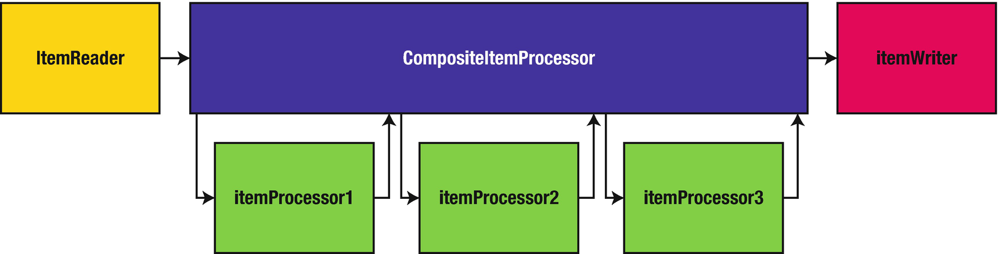
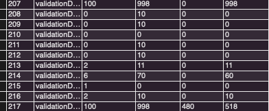

# ItemProcessor

`ItemPorcessor`는 데이터를 가공하거나 필터링하는 역할을 하며, 필수가 아니다. 이 역할은 `ItemWriter`에서도 구현이 가능하지만, 분리함으로써 비즈니스 코드가 섞이는 것을 방지할 수 있다.

```java
public interface ItemProcessor<I, O> {
    @Nullable
    O process(@NonNull I var1) throws Exception;
}
```

`I`는 ItemReader에서 받을 데이터 타입이며, `O`는 ItemWriter에 보낼 데이터 타입이다. 즉, Reader에서 읽은 데이터가 ItemProcessor의 `process()`를 통과한 후 Writer에 전달된다. 구현해야할 메소드는 process하나이며, **Java 8부터는 인터페이스의 추상 메서드가 1개인 경우 람다식을 사용**할 수 있다.

```java
@Bean(BEAN_PREFIX + "processor")
@StepScope
public ItemProcessor<ReadType, WriteType> processor() {
    return item -> {
        item.convert();
        return item;
    };
}
```

- 불필요한 코드가 없어 구현 코드 양이 적다. (빠르게 구현 가능)
- 고정된 형태가 없어 원하는 형태의 어떤 처리도 가능하다.
- Batch Config 클래스 안에 포함되어 있어야만 하며, Batch Config 코드 양이 많아질 수 있다.
  - 코드 양이 많아지만 별도 클래스로 Processor를 분리해서 사용하기도 한다.

크게 ItemProcessor는 다음 역할을 한다.

- 변환 : Reader에서 읽은 데이터를 원하는 타입으로 변환하여, Writer에 넘겨줄 수 있다.

  ```java
  		// Pay -> String 타입 변환
  		@Bean
      public ItemProcessor<Pay, String> processor(){
          return pay -> {
              return pay.getTxName();
          };
      }
  ```

- 필터 : Reader에서 넘겨준 데이터를 Writer로 넘겨줄 것인지 결정할 수 있으며, `null`을 반환하면 Writer에 전달되지 않는다.

  ```java
  		// amount가 10000이상인 값만 Writer에 넘어가도록 필터
  		@Bean
      public ItemProcessor<Pay, Pay> nullProcessor(){
          return pay -> {
              if(pay.getAmount() < 10000){
                  log.info("Pay amount :{}", pay.getAmount());
                  return null;
              }
              return pay;
          };
      }
  ```

ItemProcessor가 `null`을 반환하면 해당 Item의 모든 이후 처리가 중지된다. 이때 null을 반환하더라도 다른 Item 처리가 계속 이루어진다.

## 구현체

Spring Batch 에서는 자주 사용하는 용도의 Processor를 미리 클래스로 만들어서 제공해주고 있다.

- ItemProcessorAdapter
- ValidatingItemProcessor
- CompositeItemProcessor

하지만 최근에는 대부분 processor를 직접 구현하는 경우가 많고, 람다식으로 빠르게 구현할때도 많다. 그래서 `ItemProcessorAdapter`와 `ValidatingItemProcessor`는 거의 사용하지 않는다.

입력 데이터 유효성 검증에 사용하는 ItemProcessor 구현체이다. 입력 아이템의 유효성 검증을 수행하는 스프링배치 `Validator`를 사용할 수 있으며, 유효성 검증이 실패하면, `ValidationException`이 발생한다.

- `org.springframework.batch.item.validator.ValidatingItemProcessor`

### BeanValidatingItemProcessor

JSR 303은 빈 유효성 검증을 위한 것으로, 스프링 배치는 미리 정의된 유효성 검증 기능을 어노테이션으로 제공해준다.
해당 어노테이션을 사용하려면, 다음 의존성을 추가해줘야한다.

```groovy
implementation 'org.springframework.boot:spring-boot-starter-validation'
```

| 어노테이션                     | 속성                                                         | 설명                                                         |
| ------------------------------ | ------------------------------------------------------------ | ------------------------------------------------------------ |
| @NotNull<br />@Null            |                                                              | 값이 null인지 아닌지 검사                                    |
| @Size                          | int min : 최소 크기(default : 0)<br />int max : 최대크기     | 길이나 크기가 지정한 값 범위에 있는지 검사<br />null은 유효하다고 판단 |
| @Pattern                       | String regexp = 정규표현식                                   | 값이 정규 표현식에 일치하는지 검사<br />null은 유효하다고 판단 |
| @AssertTrue<br />@AssertFalse  |                                                              | 값이 true인지 false인지 검사<br />null은 유효하다 판단       |
| @DecmialMax<br />@DecimalMin   | String value: 최대값 또는 최솟값<br />boolean inclusive : 지정값 포함 여부(default : true) | 지정한 값보다 작거나 같은지 혹은 크거나 같은지 검사<br />null은 유효하다 판단 |
| @Max<br />@Min                 | long value                                                   | 지정한 값보다 작거나 같은지 혹은 크거나 같은지 검사<br />null은 유효하다 판단 |
| @Digits                        | int integer : 허용가능한 정수 자릿수<br />int fraction : 허용 가능한 소수점 이하 자릿수 | 자릿수가 지정한 크기를 넘지 않는지 검사<br />null은 유효하다 판단 |
| @NotEmpty                      |                                                              | 문자열, 배열 :  null이 아니고, 길이가 0이 아닌지 검사<br />Collection :  null이 아니고, 크기가 0이 아닌지 검사 |
| @NotBlank                      |                                                              | null이 아니고 최소한 한개 이상의 공백이 아닌 문자를 포함하는지 검사 |
| @Positive<br />@PositiveOrZero |                                                              | 양수인지 검사<br />OrZero는 양수 혹은 0인지 검사<br />null은 유효하다 판단 |
| @Negative<br />@NegativeOrZero |                                                              | 음수인지 검사<br />OrZero는 음수 혹은 0인지 검사<br />null은 유효하다 판단 |
| @Email                         |                                                              | 이메일 주소가 유효한지 검사<br />null은 유효하다 판단        |
| @Future<br />@FuterOrPresent   |                                                              | 해당 시간이 미래인지 검사<br />OrPresent는 현재 또는 미래시간인지 검사<br />null은 유효하다 판단 |
| @Past<br />@PastOrPresent      |                                                              | 해당 시간이 과거인지 검사<br />OrPresent는 현재 또는 과거시간인지 검사<br />null은 유효하다 판단 |

```java
public class Customer {

    @NotNull(message = "firstname은 필수값입니다.")
    @Pattern(regexp = "[a-zA-Z]+", message = "firstname은 영어여야합니다.")
    private String firstName;

    @NotNull(message = "city 필수값입니다.")
    @Pattern(regexp = "[a-zA-Z\\. ]+")
    private String city;

    @NotNull(message = "state 필수값입니다.")
    @Size(min=2, max=2)
    @Pattern(regexp = "[A-Z{2}]+")
    private String state;

  // ...
}
```

위 예제와 같이 고유한 메세지를 지정할 수 있으며, 필드 값의 길이가 잘못됐는지 형식이 잘못됐는지 식별할 수 있다.

```java
    @Bean
    public Step validationDelimitedFileStep() {
        return this.stepBuilderFactory.get("validationDelimitedFileStep")
                .<Customer, Customer>chunk(10)
                .reader(validationDelimitedCustomerItemReader(null))
                .processor(validationCustomerProcessor()) // processor
                .writer(validationDelimitedCustomerItemWriter())
                .build();
    }

    /**
     * BeanValidationItemProcessor 설정
     * @return
     */
    @Bean
    public BeanValidatingItemProcessor<Customer> validationCustomerProcessor() {
        return new BeanValidatingItemProcessor<>();
    }
```

```alidation failed for Customer(firstName=Athena, middleInitial=YS, lastName=Burt, addressNumber=4951, street=Mollis Rd., city=Newark, state=DE, zipCode=41034, address=null, transactions=null): 
Field error in object 'item' on field 'middleInitial': rejected value [YS]; codes [Size.item.middleInitial,Size.middleInitial,Size.java.lang.String,Size]; arguments [org.springframework.context.support.DefaultMessageSourceResolvable: codes [item.middleInitial,middleInitial]; arguments []; default message [middleInitial],1,1]; default message [크기가 1에서 1 사이여야 합니다]
Field error in object 'item' on field 'middleInitial': rejected value [YS]; codes [Pattern.item.middleInitial,Pattern.middleInitial,Pattern.java.lang.String,Pattern]; arguments [org.springframework.context.support.DefaultMessageSourceResolvable: codes [item.middleInitial,middleInitial]; arguments []; default message [middleInitial],[Ljavax.validation.constraints.Pattern$Flag;@5c7a06ec,[a-zA-Z]]; default message [middleInitial는 반드시 영어여야합니다.]
```

다음과 같이 지정한 validation에 맞지 않으면 예외가 발생하는 것을 볼 수 있다.

### ValidatingItemProcessor

데이터셋 내에서 한개의 필드의 값이 고유해야하는 경우가 있을 수 있다.
고유한 값의 필드를 `ItemStream` 인터페이스를 구현하여, 각 커밋과 필드 값을 `ExecutionContext`에 저장해 상태를 유지할 수 있다.

```java

/**
 * JobExecution 간의 상태를 저장하기 위해 ItemStreamSupport 상속
 */
public class UniqueLastNameValidator extends ItemStreamSupport implements Validator<Customer> {

    private Set<String> lastNames = new HashSet<>();

    @Override
    public void validate(Customer value) throws ValidationException {
        if (lastNames.contains(value.getLastName())) {
            throw new ValidationException(value.getLastName() + " lastName이 중복됩니다.");
        }
        this.lastNames.add(value.getLastName());
    }

    @Override
    public void open(ExecutionContext executionContext) {

        String lastNames = getExecutionContextKey("lastNames");

        // lastNames가 Execution에 저장되어있는지 확인 후 저장되어있다면, 스텝 처리 이전에 해당값으로 원복
        if (executionContext.containsKey(lastNames)) {
            this.lastNames = (Set<String>) executionContext.get(lastNames);
        }
    }

    /**
     * 청크 단위로 수행되는데, 오류가 발생할 경우 현재 상태를 ExecutionContext에 저장
     * @param executionContext
     */
    @Override
    public void update(ExecutionContext executionContext) {
        Iterator<String> itr = lastNames.iterator();
        Set<String> copiedLastNames = new HashSet<>();

        while (itr.hasNext()) {
            copiedLastNames.add(itr.next());
        }

        executionContext.put(getExecutionContextKey("lastNames"), copiedLastNames);
    }
}
```

Validator를 구현한 후 Step을 다음과 같이 구현하면 된다.

```java
@Bean
    public Step validationDelimitedFileStep() {
        return this.stepBuilderFactory.get("validationDelimitedFileStep")
                .<Customer, Customer>chunk(10)
                .reader(validationDelimitedCustomerItemReader(null))
                .processor(customerValidatingItemProcessor()) // 프로세서
                .writer(validationDelimitedCustomerItemWriter())
                .stream(uniqueLastNameValidator()) // stream 설정
                .build();
    }


    @Bean
    public ValidatingItemProcessor<Customer> customerValidatingItemProcessor() {
        return new ValidatingItemProcessor<>(uniqueLastNameValidator());
    }

    @Bean
    public UniqueLastNameValidator uniqueLastNameValidator() {
        UniqueLastNameValidator uniqueLastNameValidator = new UniqueLastNameValidator();

        uniqueLastNameValidator.setName("uniqueLastNameValidator");

        return uniqueLastNameValidator;
    }
```

### ItemProcessorAdapter

- `org.springframework.batch.item.adapter.ItemProcessorAdapter`

서비스를 `ItemProcessor` 역할을 하도록 만들 수 있다.

```java
@Service
public class UpperCaseNameService {
    public Customer upperCase(Customer customer) {

        Customer newCustomer = new Customer(customer);

        newCustomer.setFirstName(newCustomer.getFirstName().toUpperCase());
        newCustomer.setLastName(newCustomer.getLastName().toUpperCase());
        newCustomer.setMiddleInitial(newCustomer.getMiddleInitial().toUpperCase());

        return newCustomer;
    }
}
```

고객의 이름을 대문자로 바꿔주는 서비스이다. 이 서비스를 `ItemProcessorAdapter`를 사용하여 Processor로 사용할 수 있다.

```java
@Bean
public Step validationDelimitedFileStep() {
  	return this.stepBuilderFactory.get("validationDelimitedFileStep")
                .<Customer, Customer>chunk(10)
                .reader(validationDelimitedCustomerItemReader(null))
                .processor(customerItemProcessorAdapter())
                .writer(validationDelimitedCustomerItemWriter())
                .stream(uniqueLastNameValidator())
                .build();
}


@Bean
public ItemProcessorAdapter<Customer, Customer> customerItemProcessorAdapter() {
		ItemProcessorAdapter<Customer, Customer> adapter = new ItemProcessorAdapter<>();
    adapter.setTargetObject(upperCaseNameService);
    adapter.setTargetMethod("upperCase");
    return adapter;
}
```

### ScriptItemProcessor

Ruby, JavaScript, Groovy 등 다양한 스크립트 언어를 실행할 수 있다.

- `org.springframework.batch.item.support.ScriptItemProcessor`

```js
// lowerCase.js
item.setFirstName(item.getFirstName().toLowerCase());
item;
```

```java
@Bean
@StepScope
public ScriptItemProcessor<Customer, Customer> scriptItemProcessor(@Value("#{jobParameters['script']}") Resource script) {
  	ScriptItemProcessor<Customer, Customer> itemProcessor = new ScriptItemProcessor<>();

    itemProcessor.setScript(script);

    return itemProcessor;
}
```

수행하고 싶은 스크립트를 다음과 같이 바인딩하여 사용할 수 있다.

### CompositeItemProcessor



`CompositeItemProcessor`는 **ItemProcessor간의 체이닝을 지원**하는 Processor이다.

```java
    @Bean
    public CompositeItemProcessor compositeItemProcessor(){
        List<ItemProcessor> delegates = new ArrayList<>(2);
        delegates.add(nullProcessor());
        delegates.add(processor());

        CompositeItemProcessor processor = new CompositeItemProcessor();
        processor.setDelegates(delegates);
        return processor;
    }

		@Bean
    public ItemProcessor<Pay, String> processor(){
        return pay -> {
            return pay.getTxName();
        };
    }


    @Bean
    public ItemProcessor<Pay, Pay> nullProcessor(){
        return pay -> {
            if(pay.getAmount() < 10000){
                log.info("Pay amount :{}", pay.getAmount());
                return null;
            }
            return pay;
        };
    }
```

다음과 같이 Processor가 여러개 필요한 경우 체이닝 작업을 할 수 있다.

하지만, 여기서 제네릭 타입은 사용하지 못하며, 만약 제네릭타입을 사용하게 되면 `delegates`에 포함된 `ItemProcessor`는 모두 같은 제네릭 타입을 가져야한다. 만약 같은 제네릭 타입을 사용할 수 있는 ItemProcessor간 체이닝이라면 제네릭을 선언하는 것이 더 안전한 코드가 될 수 있다.

### ClassifierCompositeItemProcessor

-  `org.springframework.batch.item.support.ClassifierCompositeItemProcessor`

`Classifier` 구현체로 사용할 ItemProcessor를 선정해 `classify` 메서드를 수행해 분류 처리를 할 수 있다.

```java
public interface Classifier<C, T> extends Serializable {

	T classify(C classifiable);

}
```

다음은 우편번호를 짝수 홀수로 분류한 `Classifier` 구현체이다.

```java
@AllArgsConstructor
public class ZipCodeClassifier implements Classifier<Customer, ItemProcessor<Customer, Customer>> {

    private ItemProcessor<Customer, Customer> oddProcessor;
    private ItemProcessor<Customer, Customer> evenProcessor;


    @Override
    public ItemProcessor<Customer, Customer> classify(Customer classifiable) {
        if (Integer.parseInt(classifiable.getZipCode()) % 2 == 0) {
            return evenProcessor;
        } else {
            return oddProcessor;
        }
    }
}

```

구현한 `Classifier`를 `ClassifierCompositeItemProcessor`로 구현하여 수행할 수 있다.

```java
		// 홀수, 짝수 프로세서 설정
		@Bean
    public Classifier classifier() {
        return new ZipCodeClassifier(customerItemProcessorAdapter(), scriptItemProcessor());
    }

    @Bean
    public ClassifierCompositeItemProcessor<Customer, Customer> classifierCompositeItemProcessor() {
        ClassifierCompositeItemProcessor<Customer, Customer> itemProcessor = new ClassifierCompositeItemProcessor<>();
        itemProcessor.setClassifier(classifier());
        return itemProcessor;
    }

```

홀수인 경우에는 upperCase출력, 짝수인 경우 lowerCase로 분류해서 출력하도록 구현하였으며, 다음과 같이 정상적으로 출력되는걸 확인할 수 있다.

```
Customer(firstName=aimee, middleInitial=C, lastName=Hoover, addressNumber=7341, street=Vel Avenue, city=Mobile, state=AL, zipCode=35928, address=null, transactions=null)
Customer(firstName=JONAS, middleInitial=U, lastName=GILBERT, addressNumber=8852, street=In St., city=Saint Paul, state=MN, zipCode=57321, address=null, transactions=null)
Customer(firstName=REGAN, middleInitial=M, lastName=BAXTER, addressNumber=4851, street=Nec Av., city=Gulfport, state=MS, zipCode=33193, address=null, transactions=null)
Customer(firstName=OCTAVIUS, middleInitial=T, lastName=DAUGHERTY, addressNumber=7418, street=Cum Road, city=Houston, state=TX, zipCode=51507, address=null, transactions=null)
Customer(firstName=stuart, middleInitial=K, lastName=Mckenzie, addressNumber=5529, street=Orci Av., city=Nampa, state=ID, zipCode=18562, address=null, transactions=null)
Customer(firstName=PETRA, middleInitial=Z, lastName=LARA, addressNumber=8401, street=Et St., city=Georgia, state=GA, zipCode=70323, address=null, transactions=null)
Customer(firstName=cherokee, middleInitial=T, lastName=Laradd, addressNumber=8516, street=Mauris St., city=Seattle, state=WA, zipCode=28720, address=null, transactions=null)
Customer(firstName=athena, middleInitial=Y, lastName=Burt, addressNumber=4951, street=Mollis Rd., city=Newark, state=DE, zipCode=41034, address=null, transactions=null)
Customer(firstName=kaitlin, middleInitial=M, lastName=Macias, addressNumber=5715, street=Velit St., city=Chandler, state=AZ, zipCode=86176, address=null, transactions=null)
Customer(firstName=LEROY, middleInitial=X, lastName=CHERRY, addressNumber=7810, street=Vulputate St., city=Seattle, state=WA, zipCode=37703, address=null, transactions=null)
```

### ItemProcessor 직접 구현하기

커스텀 프로세서를 생성하여 짝수 우편번호는 필터링하고 홀수 우편번호만 남겨두는 `ItemProcessor` 예제를 살펴볼 것이다.

`ItemProcessor`는 **`null`**을 반환하면 해당 아이템은 그 이후 수행되는 `ItemProcessor`나  `ItemWriter`로 전달되지 않고, 필터링된다. 이렇게 필터링된 레코드의 수를 `JobRepository`에 관리하고 있다.

```java
public class EvenFilteringItemProcessor implements ItemProcessor<Customer, Customer> {
    @Override
    public Customer process(Customer item) throws Exception {
        return Integer.parseInt(item.getZipCode()) % 2 == 0 ? null : item;
    }
}
```

다음과 같이 `ItemProcessor`를 구현하여, `process` 메서드에 원하는 로직을 작성해주면 된다.

```sql
SELECT	STEP_EXECUTION_ID AS ID, STEP_NAME, COMMIT_COUNT, READ_COUNT, FILTER_COUNT, WRITE_COUNT
FROM		BATCH_STEP_EXECUTION;
```

`BATCH_STEP_EXECUTION` 내에 성공한 수, 필터링 걸린 아이템 수를 확인할 수 있다.



## 참고

- [기억보단 기록을 - 9. Spring Batch 가이드 - ItemProcessor](https://jojoldu.tistory.com/347?category=902551)

