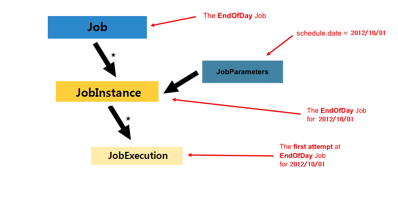
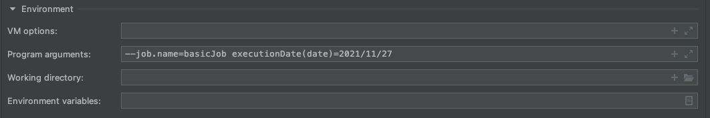

# Job

##  JobLauncher

`Job`, `JobParameters`와 함께 배치를 실행하는 인터페이스로, 메서드는 `run` 한개이다.

- Job을 실행하는 역할
- `Job.execute()` 호출
- Job재실행 가능 여부 검증
- Job 실행 방법(현재 스레드에서 수행할지, 스레드 풀을 통해 실행할지 등)
- 파라미터 유효성 검증
- 스프링부트를 사용하면 스프링 부트가 즉시 Job를 시작하는 기능을 제공해, 일반적으로는 직접 다룰 필요 없음

```java
public interface JobLauncher {
  	// Job과 JobParameters를 매개변수로 받아 JobExecution 반환
    // 매개변수가 동일하며, 이전 JobExecution가 중단된 적이 있으면 동일한 JobExecution 반환
    JobExecution run(Job var1, JobParameters var2) throws JobExecutionAlreadyRunningException, JobRestartException, JobInstanceAlreadyCompleteException, JobParametersInvalidException;
}
```

## Job



- **배치 처리 과정을 하나의 단위로 표현한 객체로 전체 배치 처리에 있어 최상단 계층**
- Job은 중단이나 상호작용 없이 처음부터 끝까지 실행되는 처리
- Spring Batch에서 Job 객체는 여러 step 인스턴스를 포함하는 컨테이너
- [`org.springframework.batch.core.Job`](https://docs.spring.io/spring-batch/docs/4.3.x/api/index.html)

### Job Runner

Job의 실행은  job runner에서 시작된다. job runner는 잡 이름과 파라미터로 해당 잡을 실행시키는 역할을 한다.

- `CommandLineJobRunner` : 스크립트를 이용하거나 명령행에서 직접 Job을 수행할 때 사용
    - 스프링 배치 제공
    - 스프링을 부트스트랩하며 전달받은 파라미터를 사용해 요청된 잡 실행
    - `org.springframework.batch.core.launch.support.CommandLineJobRunner`
- `JobRegistryBackgroundJobRunner` : 스프링을 부트스트랩에서 기동한 자바 프로세스 내에서 Quartz나 Jmx 후크와 같은 스케줄러를 사용해 잡을 실행하면 `JobReistry`를 생성하게 된다. `JobRegistryBackgroundJobRunner`는 `JobRegistry`를 생성하는 데 사용
    - 스프링 배치 제공
    - `org.springframework.batch.core.launch.support.JobRegistryBackgroundJobRunner`
- **`JobLauncherCommandLineRunner`** 
    - 스프링 부트 제공
    - 별도의 구성이 없다면 기본적으로 `ApplicationContext`에 정의된 Job 타입의 모든 빈을 기동시 실행

Job Runner는 프레임워크가 제공하는 표준 모듈이 아니며, 각 시나리오마다 다른 구현체가 필요하기 때문에 프레임워크가 `JobRunner` 인터페이스를 별도로 제공하지 않는다.

실제로  잡 러너가 아닌 `org.springframework.batch.core.launch.JobLauncher` 인터페이스가 프레임워크 실행시작점이며, 스프링 배치는 `SimpleJobLauncher` 만 제공한다.

### JobBuilderFactory

Job 객체를 만드는 빌더는 여러개가 있다. `JobBuilderFactory`는 여러 빌더를 통합 처리하는 공장이며, 원하는 Job을 손쉽게 만들 수 있다.

```java
package org.springframework.batch.core.configuration.annotation;

import org.springframework.batch.core.job.builder.JobBuilder;
import org.springframework.batch.core.repository.JobRepository;

public class JobBuilderFactory {
    private JobRepository jobRepository;

    public JobBuilderFactory(JobRepository jobRepository) {
        this.jobRepository = jobRepository;
    }

  	// JobBuilder 생성 반환
    public JobBuilder get(String name) {
        JobBuilder builder = (JobBuilder)(new JobBuilder(name)).repository(this.jobRepository);
        return builder;
    }
}
```

`JobBuilderFactory`의 `get` 메서드를 호출할 때마다 새로운 `JobBuilder`를 생성되며, 새로운 `JobBuilder`를 생성할 때마다 `JobBuilderFactory`가 생성될 때 주입받은 `JobRepository`를 설정하는 것을 볼 수 있다. 해당 `JobBuilderFactory`에서 생성되는 모든 `JobBuilder`가 동일한 `JobRepository`를 사용하는 것이다.

즉, `JobBuilderFactory`는 `JobBuilder`를 생성하는 역할만 수행한다.

### JobBuilder

```java

public class JobBuilder extends JobBuilderHelper<JobBuilder> {
    public JobBuilder(String name) {
        super(name);
    }
		
    // 1. step을 추가하여 가장 기본이 되는 SimpleJobBuilder 생성
    public SimpleJobBuilder start(Step step) {
        return (new SimpleJobBuilder(this)).start(step);
    }

  	// 2. Flow를 실행할 JobFlowBuilder 생성
    public JobFlowBuilder start(Flow flow) {
        return (new FlowJobBuilder(this)).start(flow);
    }

  	// 3. Step을 실행할 JobFlowBuilder 생성
    public JobFlowBuilder flow(Step step) {
        return (new FlowJobBuilder(this)).start(step);
    }
}
```

`JobBuilder`는 직접적으로 `Job`을 생성하는 것이 아니라 별도의 구체적인 빌더를 생성해 반환한다. 왜냐하면 경우에 따라 `Job` 생성 방법이 모두 다르기 떄문에 별도의 구체적인 빌더를 구현하고, 이를 통해 `Job` 생성이 이루어지게 한다.

중간에 빌더를 한번 더 반환하여 사용해야하지만, 메서드 체인 방식을 활용하면  손쉽게 처리할 수 있다. `Job`은 `Step` / `Flow` 인스턴스의 컨테이너 역할을 하기 때문에 생성 이전에 인스턴스를 전달 받는다.

- `SimpleJobBuilder`로 `Job` 생성하기

```java
		@Autowired
    private JobBuilderFactory jobBuilderFactory;

    @Bean
    public Job simpleJob(){
        return jobBuilderFactory.get("simpleJob")	// "simpleJob" 이름을 가진 JobBuilder instance 반환
                                .start(simpleStep()) // step을 생성하는 메서드로 생성되는 SimpleJobBuilder
                                .build();						// build 메서드 호출로 Job 반환
    }
```

### JobInstance

배치 처리에서 **`Job`이 실행될 때 하나의 `Job` 실행단위**이다. 예를들어 하루에 한번 배치 `Job`이 실행된다면, 어제 오늘 **각각 실행된 `Job`을 `JobInstance`라 부른다**. 

JobInstance는 **이름**과 논리적 실행을 위해 제공되는 **고유한 식별 파라미터 모음**으로 유일하게 존재한다.

- `ExampleGenerator` 이름의 Job이 다른 파라미터로 실행될 때마다 새로운 `JobInstace`가 생성된다.
- `BATCH_JOB_INSTANCE` 테이블로 관리
- `BATCH_JOB_EXECUTION_PARAMS` 에서 실제 식별 파라미터 관리

Job을 처음 실행하면 새로운 JobInstance를 얻는다. 하지만 실행에 실패한 이후 다시 실행하면, 여전히 동일한 논리적 실행(파라미터 동일)이므로 새로운 JobInstance를 얻지 못하며, 실제 실행을 추적하기 위한 새로운 `JobExecution`을 얻을 것이다.

즉, `JobInstance`는 실패한 `JobExecution`과 새로 수행한 `JobExecution`과 같이  `JobExecution`을 여러 개 가질 수 있다.

### JobExecution

**`JobInstance`에 대한 한 번의 실행(실제 시도)을 나타내는 객체**이다. `JobExecution`은 `Job` 실행에 대한 정보를 담고 있는 도메인 객체이며, `JobInstance`, 배치 실행 상태, 시작 시간, 끝난 시간, 오류 메세지 등의 정보를 담고 있다.

- JobExecution은 Job이 구동될 때 마다 매번 새로운 JobExecution을 얻게된다.
- `BATCH_JOB_EXECUTION` 테이블에 각 레코드로 저장
- `BATCH_JOB_EXECUTION_CONTEXT` 테이블에 상태 값 저장

```java
public class JobExecution extends Entity {
    private final JobParameters jobParameters; //Job 실행에 필요한 매개 변수 데이터
    private JobInstance jobInstance; // Job 실행의 단위가 되는 객체
    private volatile Collection<StepExecution> stepExecutions; // StepExecution을 여러개 가질 수 있는 Collection 타입
    private volatile BatchStatus status; // Job의 실행 상태(COMPLETED, STARTING, STARTED ...)
    private volatile Date startTime; // Job이 실행된 시간(null은 시작하지 않은 것)
    private volatile Date createTime; // JobExecution이 생성된 시간
    private volatile Date endTime; // JobExecution 종료 시간
    private volatile Date lastUpdated; // 마지막 수정시간
    private volatile ExitStatus exitStatus; // Job 실행 결과에 대한 상태값(UNKOWN, EXECUTING, COMPLETE, ...)
    private volatile ExecutionContext executionContext;// Job 실행 사이에 유지해야하느 ㄴ사용자 데이터
    private transient volatile List<Throwable> failureExceptions; // Job 실행 중 발생한 예외 
    private final String jobConfigurationName; // Job 설정 이름
  	...
}
```

### JobParameters

**`Job`이 실행될 때 필요한 파라미터들을 `Map` 타입으로 지정하는 객체**로 `JobInstance`(1:1 관계)를 구분하는 기준이 되기도 한다. 

하나의 `Job`을 생성할 때 시작 시간 등의 정보를 파라미터로 해서 하나의 `JobInstance`를 생성한다. 즉, 1:1 관계이다.

- 파라미터는 `key=value`로 이루어져있다.

- JobParameters는 ` Map<String,JobParameter>`의  wrapper에 불과하다.

	 ```java
   public class JobParameters implements Serializable {
     private final Map<String,JobParameter> parameters;
     ...
   }
   ```
   
- 파라미터 타입은 String, Double, Date 타입도 기본적으로 제공한다.

- 파라미터 이름 뒤에 괄호를 쓰고 해당 파라미터 타입을 명시해 지정할 수 있다.

   - 이때, 파라미터 타입의 이름은 모두 소문자여야한다.

     ```java
     executionDate(date)=2021/11/27
     ```

   
   
   - `BATCH_JOB_EXECUTION_PARAMS`
   
   
   
- 식별에 사용하지 않는 파라미터도 있을 수 있다. 식별에 사용하고 싶지 않는 파라미터는 앞에 `-`를 다음과 같이 붙여주면 된다.

   ```java
   executionDate(date)=2021/11/27 -filename=test
   ```

   ```
   Caused by: org.springframework.batch.core.repository.JobInstanceAlreadyCompleteException: A job instance already exists and is complete for parameters={executionDate=1637938800000, filename=test}.  If you want to run this job again, change the parameters.
   	at org.springframework.batch.core.repository.support.SimpleJobRepository.createJobExecution(SimpleJobRepository.java:139) ~[spring-batch-core-4.3.3.jar:4.3.3]
   	at java.base/jdk.internal.reflect.NativeMethodAccessorImpl.invoke0(Native Method) ~[na:na]
   	at java.base/jdk.internal.reflect.NativeMethodAccessorImpl.invoke(NativeMethodAccessorImpl.java:62) ~[na:na]
   	at java.base/jdk.internal.reflect.DelegatingMethodAccessorImpl.invoke(DelegatingMethodAccessorImpl.java:43) ~[na:na]
   	at java.base/java.lang.reflect.Method.invoke(Method.java:566) ~[na:na]
   	at org.springframework.aop.support.AopUtils.invokeJoinpointUsingReflection(AopUtils.java:344) ~[spring-aop-5.3.12.jar:5.3.12]
   	at org.springframework.aop.framework.ReflectiveMethodInvocation.invokeJoinpoint(ReflectiveMethodInvocation.java:198) ~[spring-aop-5.3.12.jar:5.3.12]
   	at org.springframework.aop.framework.ReflectiveMethodInvocation.proceed(ReflectiveMethodInvocation.java:163) ~[spring-aop-5.3.12.jar:5.3.12]
   ```

   다음과 같이 `-`를 붙인 파라미터는 식별 파라미터로 사용하지 않아, 기존에 이미 수행된 Job으로 실패한 것을 알 수 있다.

#### 파라미터에 접근하는 방법

1. `ChunkContext` 인스턴스

    - 실행 시점의 Job 상태 제공

    - tasklet 내에서 처리중인 chunk와 관련된 정보(스탭 및 잡과 관련된 정보 포함) 제공

    - `JobParametes`가 포함된 `StepContext`참조가 있음

        ```java
        public class ChunkContext extends AttributeAccessorSupport {
        
        	private final StepContext stepContext;
        	...
        }
        ```

        ```java
        public class StepContext extends SynchronizedAttributeAccessor {
        
        	private StepExecution stepExecution;
        
        	private Map<String, Set<Runnable>> callbacks = new HashMap<>();
        
        	private BatchPropertyContext propertyContext = null;
        
        	...
            
        	/**
        	 * @return a map containing the items from the {@link JobParameters}
        	 */
        	public Map<String, Object> getJobParameters() {
        		Map<String, Object> result = new HashMap<>();
        		for (Entry<String, JobParameter> entry : stepExecution.getJobParameters().getParameters().entrySet()) 		{
        			result.put(entry.getKey(), entry.getValue().getValue());
        		}
        		return Collections.unmodifiableMap(result);
        	}
          ...
        }
        ```

    - 예제

        ```java
            @Bean Step step2(){
                return this.stepBuilderFactory.get("step2")
                        .tasklet(helloWorldTasklet())
                        .build();
            }
        
            @Bean
            public Tasklet helloWorldTasklet() {
                return ((contribution, chunkContext) -> {
                    String name = (String) chunkContext.getStepContext()
                                        .getJobParameters() // Map<String, Object>이므로 타입 캐스팅 필요
                                        .get("name");
        
                    System.out.println(String.format("Hello, %s", name));
                    return RepeatStatus.FINISHED;
                });
            }
        ```

2. Late Binding : 스프링 구성을 사용해 주입하는 방법으로, `JobParameters`는 변경할 수 없으므로 부트스트랩시 바인딩하는 것이 좋다.

    ```java
    		@StepScope
    		@Bean
        public Tasklet lateBindingParamTasklet(@Value("#{jobParameters['name']}") String name) {
            return ((contribution, chunkContext) -> {
                System.out.println(String.format("Hello, %s", name));
                return RepeatStatus.FINISHED;
            });
        }
    ```

#### 파라미터 유효성 검증

- `org.springframework.batch.core.JobParametersValidator`

    ```java
    public interface JobParametersValidator {
    
    	/**
    	 * Check the parameters meet whatever requirements are appropriate, and
    	 * throw an exception if not.
    	 * 
    	 * @param parameters some {@link JobParameters} (can be {@code null})
    	 * @throws JobParametersInvalidException if the parameters are invalid
    	 */
    	void validate(@Nullable JobParameters parameters) throws JobParametersInvalidException;
    
    }
    ```

`JobParametersValidator` 인터페이스를 구현하고, 해당 구현체를 잡 내에 구성해 파라미터 유효성 검증을 할 수 있다.


스프링은 필수 파라미터가 누락없이 전달됐는지 확인하는 `DefaultJobParametersValidator`를 기본적으로 제공해준다.

- `DefaultJobParametersValidator` 사용한 유효성 검증 : 파라미터 존재 여부를 제외한 다른 유효성 검증은 수행하지 않음.

    ```java
        @Bean
        public JobParametersValidator validator() {
            DefaultJobParametersValidator validator = new DefaultJobParametersValidator();
    
            validator.setRequiredKeys(new String[] {"executionDate", "fileName"}); // 필수 파라미터 확인
            validator.setOptionalKeys(new String[] {"name"}); // 선택 파라미터
            validator.afterPropertiesSet(); // 선택 파라미터에 필수 파라미터가 포함되지 않았는지 확인
    
            return validator;
        }
    ```

    - 필수 파라미터 미포함시 오류

        ```
        Caused by: org.springframework.batch.core.JobParametersInvalidException: The JobParameters do not contain required keys: [fileName]
        	at org.springframework.batch.core.job.DefaultJobParametersValidator.validate(DefaultJobParametersValidator.java:120) ~[spring-batch-core-4.3.3.jar:4.3.3]
        ```

    - 선택 파라미터와 필수 파라미터 겹치는 경우 오류

        ```
        Caused by: java.lang.IllegalStateException: Optional keys cannot be required: fileName
        	at org.springframework.util.Assert.state(Assert.java:76) ~[spring-core-5.3.12.jar:5.3.12]
        	at org.springframework.batch.core.job.DefaultJobParametersValidator.afterPropertiesSet(DefaultJobParametersValidator.java:73) ~[spring-batch-core-4.3.3.jar:4.3.3]
        ```

    - 선택 파라미터와 필수 파라미터에 포함되지 않은 파라미터 전송시 오류

        ```
        Caused by: org.springframework.batch.core.JobParametersInvalidException: The JobParameters contains keys that are not explicitly optional or required: [displyYn]
        	at org.springframework.batch.core.job.DefaultJobParametersValidator.validate(DefaultJobParametersValidator.java:107) ~[spring-batch-core-4.3.3.jar:4.3.3]
        ```

- 커스텀 유효성 검증 : 파라미터 존재 여부 외의 추가 유효성 검증이 필요한 경우 커스텀 `JobParametersValidator` 구현 필요

    ```java
    public class ParameterValidator implements JobParametersValidator {
        @Override
        public void validate(JobParameters parameters) throws JobParametersInvalidException {
            String fileName = parameters.getString("fileName");
    
            if (!StringUtils.hasText(fileName)) {
                throw new JobParametersInvalidException("fileName 파라미터가 존재하지 않습니다.");
            } else if (!StringUtils.endsWithIgnoreCase(fileName, ".csv")) {
                throw new JobParametersInvalidException("csv 파일이 아닙니다.");
            }
        }
    }
    ```

- `CompositeJobParametersValidator` : 여러개의 유효성 검증

    ```java
        @Bean
        public CompositeJobParametersValidator validator() {
    
            CompositeJobParametersValidator validator = new CompositeJobParametersValidator();
    
            // 파라미터 유무 검증
            DefaultJobParametersValidator defaultJobParametersValidator = new DefaultJobParametersValidator();
    
            defaultJobParametersValidator.setRequiredKeys(new String[] {"executionDate", "fileName"}); // 필수 파라미터 확인
            defaultJobParametersValidator.setOptionalKeys(new String[] {"name"}); // 선택 파라미터
            defaultJobParametersValidator.afterPropertiesSet(); // 선택 파라미터에 필수 파라미터가 포함되지 않았는지 확인
    
          	// custom validator와 defaultJobParametersValidator List로 전송
            validator.setValidators(Arrays.asList(new ParameterValidator(), defaultJobParametersValidator));
            return validator;
        }
    ```

#### 잡 파라미터 증가시키기

- `org.springframework.batch.core.JobParametersIncrementer`

    ```java
    public interface JobParametersIncrementer {
    
    	/**
    	 * Increment the provided parameters. If the input is empty, then this
    	 * should return a bootstrap or initial value to be used on the first
    	 * instance of a job.
    	 * 
    	 * @param parameters the last value used
    	 * @return the next value to use (never {@code null})
    	 */
    	JobParameters getNext(@Nullable JobParameters parameters);
    
    }
    ```

`JobParametersIncrementer`는 사용할 파라미터를 고유하게 생성할 수 있게 스프링 배치가 제공하는 인터페이스로 매 실행 시 timestamp를 추가하거나 파라미터를 증가시켜야하는 경우에 사용하기 적합하다.

- `RunIdIncrementer` : 파라미터 이름이 `run.id`(long)의 값을 증가

- Custom Incrementer

    ```java
    public class DailyJobTimestamper implements JobParametersIncrementer {
        @Override
        public JobParameters getNext(JobParameters parameters) {
            return new JobParametersBuilder(parameters)
                    .addDate("executionDate", new Date())
                    .toJobParameters();
        }
    }
    ```

jobBuilderFactory에서 `.incrementer()` 로 수행할 수 있다.

```java
 @Bean
    public Job job() {
        // jobBuilderFactory.get("잡이름")
        return this.jobBuilderFactory.get("basicJob")
                .start(step1())
                .validator(validator())
                .incrementer(new RunIdIncrementer())
                .next(step2())
                .build(); // 실제 job 생성
    }
```

#### JobListener

모든 Job은 생명주기를 가지고 있으며, 스프링 배치는 생명주기의 특정 시점에서 로직을 추가할 수 있게 기능을 제공해준다.

- `JobExecutionListener` : Job 실행과 관련된 리스너 인터페이스

    ```java
    public interface JobExecutionListener {
    
    	/**
    	 * Callback before a job executes.
    	 *
    	 * @param jobExecution the current {@link JobExecution}
    	 */
    	void beforeJob(JobExecution jobExecution);
    
    	/**
    	 * Callback after completion of a job. Called after both both successful and
    	 * failed executions. To perform logic on a particular status, use
    	 * "if (jobExecution.getStatus() == BatchStatus.X)".
    	 *
    	 * @param jobExecution the current {@link JobExecution}
    	 */
    	void afterJob(JobExecution jobExecution);
    
    }
    ```

    - `beforeJob` : Job 수행 이전에 수행
    - `afterJob` : Job 수행완료 후 수행하며 Job의 완료 상태와 상관 없이 호출된다.

Job Listener를 작성하는데 두가지 방법이 있다.

1. `JobExecutionListener` 인터페이스 구현

    ```java
    public class JobLoggerListener implements JobExecutionListener {
    
        private static String START_MESSAGE = "%s is beginning execution";
        private static String END_MESSAGE = "%s has completed with the status %s";
    
        @Override
        public void beforeJob(JobExecution jobExecution) {
            System.out.println(String.format(START_MESSAGE, jobExecution.getJobInstance().getJobName()));
        }
    
        @Override
        public void afterJob(JobExecution jobExecution) {
            System.out.println(String.format(END_MESSAGE, jobExecution.getJobInstance().getJobName()
                                                        , jobExecution.getStatus()));
        }
    }
    ```

    `JobBuilder` 의 `listener` 메서드를 호출하면 다음과 같이 Job수행 전후로 수행된 것을 볼 수 있다.

    ```java
    return this.jobBuilderFactory.get("basicJob")
                    .start(step1())
                    .validator(validator())
                    .incrementer(new DailyJobTimestamper())
                    .listener(new JobLoggerListener())
                    .next(step2())
                    .build(); // 실제 job 생성
    ```

    ```
    2021-11-16 23:35:57.266  INFO 80890 --- [           main] o.s.b.c.l.support.SimpleJobLauncher      : Job: [SimpleJob: [name=basicJob]] launched with the following parameters: [{name=faker, executionDate=1637073357082, fileName=test4.csv, run.id=3}]
    basicJob is beginning execution
    ...
    2021-11-16 23:35:57.656  INFO 80890 --- [           main] o.s.batch.core.step.AbstractStep         : Step: [step2] executed in 129ms
    basicJob has completed with the status COMPLETED
    ```

2. 어노테이션 사용(`@BeforeJob`, `@AfterJob`) : 인터페이스를 구현할 필요 없이 어노테이션만으로 구현하면 된다.

    ```java
    public class JobLoggerListener {
    
        private static String START_MESSAGE = "%s is beginning execution";
        private static String END_MESSAGE = "%s has completed with the status %s";
    
        @BeforeJob
        public void beforeJob(JobExecution jobExecution) {
            System.out.println(String.format(START_MESSAGE, jobExecution.getJobInstance().getJobName()));
        }
    
        @AfterJob
        public void afterJob(JobExecution jobExecution) {
            System.out.println(String.format(END_MESSAGE, jobExecution.getJobInstance().getJobName()
                                                        , jobExecution.getStatus()));
        }
    }
    ```

    어노테이션으로 구현하는 경우 `JobListenerFactoryBean` 으로 리스너를 주입할 수 있다.

    ```java
    return this.jobBuilderFactory.get("basicJob")
                    .start(step1())
                    .validator(validator())
                    .incrementer(new DailyJobTimestamper())
                    .listener(JobListenerFactoryBean.getListener(new JobLoggerListener()))
                    .next(step2())
                    .build(); // 실제 job 생성
    ```

    

