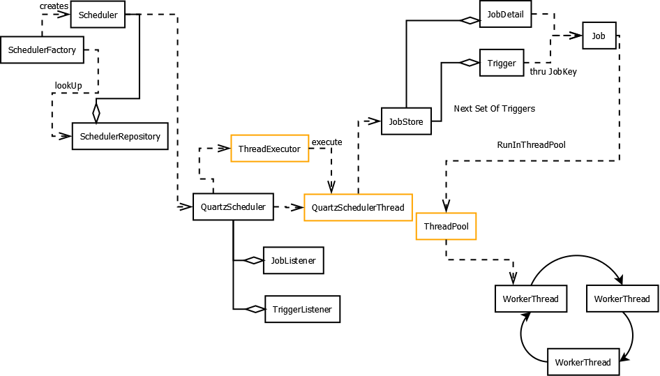

# 배치 스케쥴러

## Crontab

- history 관리 불가능
- 실수로 해당 스케쥴링 전체를 날릴 수 있음
- 배치 수행 실패시 배치 모니터링 관리 대상나 오류 모니터링 로직을 별도로 추가하지 않으면 알기 어려움
- 운영배치를 예로 들면, crontab에 스케쥴링 관리가 제대로 되지 않음(주석 처리되어있는 job들 다수)
- crontab의 경우 **각 서버마다 따로 스케줄링을 관리해야 하며 무엇보다 클러스터링 기능이 제공되지 않아** 추천하지 않는다.

## Quartz

- [http://www.quartz-scheduler.org/](http://www.quartz-scheduler.org/)

Quartz는 오픈소스  Job Scheduling 라이브러리로, 완전히 자바로 개발되어 자바 환경, 규모와 상관없이 사용할 수 있다. Quartz는 수천 개의 작업도 실행 가능하며, 간단한 interval 형식이나 Cron 표현식으로 복잡한 스케쥴링도 지원한다.

#### 장점

- DB 기반으로 스케줄러 간의 Clustering 기능을 제공
- 시스템 Fail-over와 Random 방식의 로드 분산처리를 지원한다
- In-memory Job Scheduler도 제공
- 여러 기본 Plug-in을 제공
- `ShutdownHookPlugin` - JVM 종료 이벤트를 캐치해서 스케줄러에게 종료를 알려줌
    - `LoggingJobHistoryPlugin` - Job 실행에 대한 로그를 남겨 디버깅할 때 사용
- 배치 수행중 이슈가 생겼을 때 쉽게 파악할 수 있는 구조로 설계되어있음(로그 관리/방어로직에 좋음)

#### 단점

- Clustering 기능을 제공하지만, 단순한 random 방식이라서 완벽한 Cluster 간의 로드 분산은 안됨.
- 어드민 UI을 제공하지 않음.
- 스케줄링 실행에 대한 History는 보관하지 않음.
- Fixed Delay 타입을 보장하지 않으므로 추가 작업이 필요
- 스케쥴링을 변경하려면 써드파티를 사용하거나, 배포가 필요함
- 모든 것을 커스텀해야해서 시간 소요가 많이든다.

## Jenkins

- 무료 CI툴로, 배치 스케쥴링으로 많이 사용
- 파이프라인 설정도 가능
- 배치 빌드 실패시 슬랙 등으로 바로 알림 생성 가능
- 해당 배치 로그도 확인 가능
- 수정 히스토리 관리 가능
- jenkins 자체에서 배치 수행 on/off 가능
- 클러스터링 가능

## 참고

- [https://advenoh.tistory.com/51](https://advenoh.tistory.com/51)

