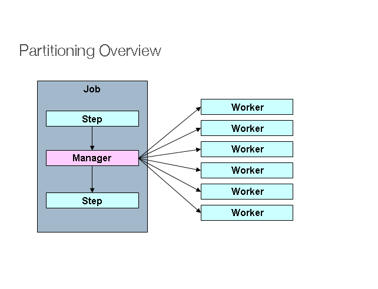

# Spring Batch Scaling out

처리해야할 데이터가 증가하여 일정 규모 이상이 되는 경우 배치도 Scaling이 필요하다.
Spring Batch에서 제공하는 Scaling기능은 다음과 같다.

|기능|프로세스||설명|
|:-----|:-----|:-----|:-----|
|Multi-threaded Step|Single process|Local|단일 Step 수행시, 해당 Step내의 각 Chunk를 별도의 여러 쓰레드에서 실행하는 방법|
|Parallel Steps|Single process|Local|여러개의 Step을 병렬로 실행하는 방법으로, 단일 Step내의 성능 향상은 없다.|
|Remote Chunking|Multi process|Remote|Step처리가 여러 프로세스로 분할되어 외부의 다른 서버로 전송하여 처리하는 방식<br> 어느 서버에서 어떤 데이터를 처리하고 있는지 관리하지 않기 때문에 메세지 유실이 안되는 것이 100% 보장 되어야한다.(AWS SQS, Kafka 등 MQ사용 권장)|
|Partitioning|Single/Multi process|Local/Remote|매니저(마스터)를 이용해 데이터를 더 작은 파티션으로 나누고, 파티션에서 슬레이브가 독립적으로 작동하는 방식|
|`AsyncItemProcessor`와 `AsyncItemWriter`||Local|별개의 쓰레드를 통해 ItemProcessor와 ItemWriter를 처리<br>`spring-batch-integration`의존성에서 지원|

이 중 일부를 구현해볼 것이다.

## Multi-threaded Step


스프링 배치의 멀티 쓰레드 Step은 `TaskExecutor`를 이용해 **각 쓰레드가 Chunk단위로 실행되게 하는 방식**이다.

- `SimpleAsyncTaskExecutor` : chunk 단위별로 쓰레드 생성
- `ThreadPoolTaskExecutor` : 쓰레드풀 내에서 지정된 갯수의 쓰레드만을 재사용하면서 실행(운영에서 사용할 때는 쓰레드풀로 사용하는 것을 권장)

멀티쓰레드 환경 구성시 사용하고자 하는 Reader와 Writer가 멀티쓰레드를 지원하는지 파악이 필요하다.

예를 들어 [JpaPagingItemReader](https://docs.spring.io/spring-batch/docs/current/api/org/springframework/batch/item/database/JpaPagingItemReader.html)의 경우는 아래와 같이 thread-safe를 제공해주고 있는것을 볼 수 있으며,

```
public class JpaPagingItemReader<T>
extends AbstractPagingItemReader<T>
ItemReader for reading database records built on top of JPA.

It executes the JPQL setQueryString(String) to retrieve requested data. The query is executed using paged requests of a size specified in AbstractPagingItemReader.setPageSize(int). Additional pages are requested when needed as AbstractItemCountingItemStreamItemReader.read() method is called, returning an object corresponding to current position.

The performance of the paging depends on the JPA implementation and its use of database specific features to limit the number of returned rows.

Setting a fairly large page size and using a commit interval that matches the page size should provide better performance.

In order to reduce the memory usage for large results the persistence context is flushed and cleared after each page is read. This causes any entities read to be detached. If you make changes to the entities and want the changes persisted then you must explicitly merge the entities.

The reader must be configured with an EntityManagerFactory. All entity access is performed within a new transaction, independent of any existing Spring managed transactions.

The implementation is thread-safe in between calls to AbstractItemCountingItemStreamItemReader.open(ExecutionContext), but remember to use saveState=false if used in a multi-threaded client (no restart available).
```

[JpaCursorItemReader](https://docs.spring.io/spring-batch/docs/current/api/org/springframework/batch/item/database/JpaCursorItemReader.html)는 thread-safe하지 않은 것을 볼 수 있다.

```
public class JpaCursorItemReader<T>
extends AbstractItemCountingItemStreamItemReader<T>
implements org.springframework.beans.factory.InitializingBean
ItemStreamReader implementation based on JPA Query.getResultStream(). It executes the JPQL query when initialized and iterates over the result set as AbstractItemCountingItemStreamItemReader.read() method is called, returning an object corresponding to the current row. The query can be set directly using setQueryString(String), or using a query provider via setQueryProvider(JpaQueryProvider). The implementation is not thread-safe.
```

여기서 또 한가지 알아둬야할 점이 있다. 멀티쓰레드로 각 chunk들이 개별로 진행되는 경우 실패 지점에서 재시작하는 것이 불가능하다. 왜냐하면, 멀티쓰레드의 경우 1~n개의 chunk가 동시에 실행되며, 5번째 chunk가 실패했다고 해서 1~4 chunk가 모두 성공했다는 보장이 없다.

그래서 멀티쓰레드 적용시 일반적으로 ItemReader의 `saveState` 옵션을 false로 설정한다.

> saveState : `ItemStream#update(ExecutionContext)` 메소드로 `ExectuionContext`에  reader의 상태값을 저장할지 결정한다.
> (Defualt : true)

### Thread-safe

#### PagingItemReader

- [Multithread Job구현시 이슈사항 정리](./2021-12-09-multithread-error.md) 

위에서 봤듯이 PagingItemReader는 thread-safe한 것을 알 수 있다.
멀티쓰레드로 수행하는 배치가 있다면, DB접근시 PagingItemReader를 사용하는 것을 권장한다.

- application.yml

    ```yaml
    spring:
      datasource:
        hikari:
          driver-class-name: com.mysql.cj.jdbc.Driver
          jdbc-url: jdbc:mysql://localhost:3306/spring_batch
          username: spring
          password: Springtest2021!
          maximum-pool-size: 10 # pool에 유지할 최대 connection 수
          auto-commit: false # 자동 commit 여부
    ```
    
- main() 메서드 설정

    ```java
    @SpringBootApplication(exclude = DataSourceAutoConfiguration.class)
    public class SpringBatchRealApplication {
    
        public static void main(String[] args) {
            // main thread가 종료되면 jvm 강제 종료
            // main thread가 종료됐다는 것은 자식 thread도 모두 종료됐다는 것을 보장
            System.exit(SpringApplication.exit(SpringApplication.run(SpringBatchRealApplication.class, args)));
        }
    }
    ```

- Job 구현

    ```java
        @Bean(JOB_NAME)
        public Job job() {
            return this.jobBuilderFactory.get(JOB_NAME)
                    .incrementer(new RunIdIncrementer())
                    .start(step())
                    .build();
    
        }
    
        @Bean(JOB_NAME + "Step")
        public Step step() {
            return this.stepBuilderFactory.get(JOB_NAME + "Step")
                    .<Ncustomer, Ncustomer> chunk(chunkSize)
                    .reader(reader(null))
                    .writer(writer())
                    .taskExecutor(executor())
                    .throttleLimit(poolSize) // default : 4, 생성된 쓰레드 중 몇개를 실제 작업에 사용할지 결정
                    .build();
        }
    
        @Bean(JOB_NAME + "TaskPool")
        public TaskExecutor executor() {
            // 쓰레드 풀을 이용한 쓰레드 관리 방식
            ThreadPoolTaskExecutor executor = new ThreadPoolTaskExecutor();
            executor.setCorePoolSize(poolSize); // 풀의 기본 사이즈
            executor.setMaxPoolSize(poolSize); // 풀의 최대 사이즈
            executor.setThreadGroupName("multi-thread-");
            executor.setWaitForTasksToCompleteOnShutdown(Boolean.TRUE);
    
            // allowCoreThreadTimeOut을 true로 설정해
            // core thread 가 일정시간 태스크를 받지 않을 경우 pool 에서 정리하고,
            // 모든 자식 스레드가 정리되면 jvm 도 종료 되게 설정한다.
            executor.setKeepAliveSeconds(30);
            executor.setAllowCoreThreadTimeOut(true);
    
            executor.initialize();
            return executor;
        }
    
        @Bean(JOB_NAME + "Reader")
        public JdbcPagingItemReader<Ncustomer> reader(PagingQueryProvider pagingQueryProvider) {
    
            return new JdbcPagingItemReaderBuilder<Ncustomer>()
                    .name("customerJdbcPagingItemReader")   // Reader의 이름, ExecutionContext에 저장되어질 이름
                    .dataSource(dataSource)                 // DB에 접근하기 위해 사용할 DataSource객체
                    .queryProvider(pagingQueryProvider)     // PagingQueryProvider
                    .pageSize(10)                           // 각 페이지 크기
                    .rowMapper(new BeanPropertyRowMapper<>(Ncustomer.class)) // 쿼리 결과를 인스턴스로 매핑하기 위한 매퍼
                    .saveState(false)                       // Reader가 실패한 지점을 저장하지 않도록 설정
                    .build();
        }
    ```

    여기서 핵심은 `TaskExecutor`을 구현하는 부분과 Step실행시 `.saveState(false)`로 설정하여, Reader가 실패한 지점을 저장하지 않고, 실패시 다시 처음부터 실행하도록 하는 것이다. (다른 thread들의 성공을 보장하지 않으므로!)

    `TaskExecutor` 구현시에는 allowCoreThreadTimeOut을 설정해 특정시간(KeepAliveSeconds)이후에 사용하지 않으면 종료되도록 설정한다.

    다음 Job을 수행하면 각 thread별로 병렬로 수행되는 것을 확인할 수 있다.

### Not Thread Safety

#### CursorItemReader

cursorItemReader의 경우에는 thread safety를 보장하지 않는다. Reader 영역을 `SynchronizedItemStreamReader`로 wrapping하여 thread safety하게 구현할 수 있다.

```java
@Bean(JOB_NAME + "Reader")
    public SynchronizedItemStreamReader<Ncustomer> reader() {

        String sql = "SELECT N.CUSTOMER_ID" +
                ", CONCAT(N.LAST_NAME, \" \", N.FIRST_NAME) AS FULL_NAME\n" +
                " , N.ADDRESS1 AS ADDRESS\n" +
                ", N.POSTAL_CODE\n" +
                "FROM NCUSTOMER N\n" +
                "LIMIT 55";

        JdbcCursorItemReader itemReader =  new JdbcCursorItemReaderBuilder<Ncustomer>()
                .name(JOB_NAME + "Reader")   // Reader의 이름, ExecutionContext에 저장되어질 이름
                .dataSource(dataSource)                 // DB에 접근하기 위해 사용할 DataSource객체
                .rowMapper(new BeanPropertyRowMapper<>(Ncustomer.class)) // 쿼리 결과를 인스턴스로 매핑하기 위한 매퍼
                .sql(sql)
                .saveState(false)                       // Reader가 실패한 지점을 저장하지 않도록 설정
                .build();

        return new SynchronizedItemStreamReaderBuilder<Ncustomer>()
                .delegate(itemReader)
                .build();
    }
```

`SynchronizedItemStreamReader`의 `delegate`에 수행하고 싶은 `CursorItemReader`를 등록해주면 된다.

```java
public class SynchronizedItemStreamReader<T> implements ItemStreamReader<T>, InitializingBean {

	private ItemStreamReader<T> delegate;

	public void setDelegate(ItemStreamReader<T> delegate) {
		this.delegate = delegate;
	}

	/**
	 * This delegates to the read method of the <code>delegate</code>
	 */
	@Nullable
	public synchronized T read() throws Exception, UnexpectedInputException, ParseException, NonTransientResourceException {
		return this.delegate.read();
	}
```

`SynchronizedItemStreamReader`의 `read()` 메서드를 보면 **`synchronized`** 메서드로 감싸 동기화된 읽기가 가능하다.

```
2021-12-12 23:02:25.062  INFO 31421 --- [ multi-thread-5] d.e.s.j.m.l.CursorItemReaderListener     : Reading customer id=1
2021-12-12 23:02:25.062  INFO 31421 --- [ multi-thread-2] d.e.s.j.m.l.CursorItemReaderListener     : Reading customer id=2
2021-12-12 23:02:25.062  INFO 31421 --- [ multi-thread-4] d.e.s.j.m.l.CursorItemReaderListener     : Reading customer id=3
2021-12-12 23:02:25.062  INFO 31421 --- [ multi-thread-1] d.e.s.j.m.l.CursorItemReaderListener     : Reading customer id=4
2021-12-12 23:02:25.062  INFO 31421 --- [ multi-thread-3] d.e.s.j.m.l.CursorItemReaderListener     : Reading customer id=5
2021-12-12 23:02:25.063  INFO 31421 --- [ multi-thread-4] d.e.s.j.m.l.CursorItemReaderListener     : Reading customer id=6
2021-12-12 23:02:25.063  INFO 31421 --- [ multi-thread-3] d.e.s.j.m.l.CursorItemReaderListener     : Reading customer id=7
2021-12-12 23:02:25.063  INFO 31421 --- [ multi-thread-5] d.e.s.j.m.l.CursorItemReaderListener     : Reading customer id=8
2021-12-12 23:02:25.063  INFO 31421 --- [ multi-thread-2] d.e.s.j.m.l.CursorItemReaderListener     : Reading customer id=9
2021-12-12 23:02:25.063  INFO 31421 --- [ multi-thread-1] d.e.s.j.m.l.CursorItemReaderListener     : Reading customer id=10
2021-12-12 23:02:25.064  INFO 31421 --- [ multi-thread-2] d.e.s.j.m.l.CursorItemReaderListener     : Reading customer id=11
```

수행 결과를 보면, 각 thread가 순차적으로 읽어와 개별로 처리하는 것을 확인할 수 있다.

이미 네트워크/DISK IO/CPU/Memory 등 서버 자원이 이미 **단일 쓰레드에서도 리소스 사용량이 한계치에 달했다면** 멀티쓰레드로 진행한다고 해서 성능 향상을 기대할 수 없으며, 실제 운영 환경 적용 이전에 충분히 테스트를 진행해보고 해야한다.

## Parallel Steps


각 역할을 여러 step(Flow)으로 나누어 병렬화 할 수 있다.

```java
    @Bean(JOB_NAME)
    public Job job() {
        Flow flow1 = new FlowBuilder<Flow>("flow1")
                .start(step1())
                .build();

        Flow flow2 = new FlowBuilder<Flow>("flow2")
                .start(step2())
                .build();


        Flow flow3 = new FlowBuilder<Flow>("flow3")
                .start(step3())
                .build();

        Flow parelleFlow = new FlowBuilder<Flow>("parelleFlow")
                .split(executor())
                .add(flow1, flow2, flow3)
                .build();

        return this.jobBuilderFactory.get(JOB_NAME)
                .incrementer(new UniqueRunIdIncrementer())
                .start(parelleFlow)
                .end()
                .build();
    }
```

`Flow`는 자체 스레드에서 진행되며, 여러 `Flow`를 병렬로 실행할 수 있다.
`FlowBuilder`의 `.split()` 메서드는 `TaskExecutor`를 받아 각 Flow는 자체 스레드에서 실행된다.
위와 같이 구현하면 각 step이나 step의 flow를 병렬로 수행할 수 있다.

```
2021-12-13 18:30:08.267  INFO 35926 --- [ multi-thread-3] d.e.s.j.m.ParallelStepsConfiguration     : [step] : 7910
Naccount(accountId=10, balance=24319.5, lastStatementDate=2018-05-02 22:25:15.0)
2021-12-13 18:30:08.267  INFO 35926 --- [ multi-thread-3] d.e.s.j.m.ParallelStepsConfiguration     : [step] : 7911
2021-12-13 18:30:08.267  INFO 35926 --- [ multi-thread-3] d.e.s.j.m.ParallelStepsConfiguration     : [step] : 7912
...(생략)
2021-12-13 18:30:08.275  INFO 35926 --- [ multi-thread-3] d.e.s.j.m.ParallelStepsConfiguration     : [step] : 9345
Ncustomer(customerId=141, fullName=Docket Jonah, address=92125 Crownhardt Junction, postalCode=08638)
Ncustomer(customerId=142, fullName=Fullerlove Lani, address=02750 Lindbergh Center, postalCode=84189)
Ncustomer(customerId=143, fullName=Boich Orin, address=928 Crownhardt Road, postalCode=31205)
Ncustomer(customerId=144, fullName=Yeoland Maximo, address=930 Prairie Rose Pass, postalCode=33129)
2021-12-13 18:30:08.275  INFO 35926 --- [ multi-thread-3] d.e.s.j.m.ParallelStepsConfiguration     : [step] : 9346
2021-12-13 18:30:08.275  INFO 35926 --- [ multi-thread-3] d.e.s.j.m.ParallelStepsConfiguration     : [step] : 9347
2021-12-13 18:30:08.275  INFO 35926 --- [ multi-thread-3] d.e.s.j.m.ParallelStepsConfiguration     : [step] : 9348
2021-12-13 18:30:08.275  INFO 35926 --- [ multi-thread-3] d.e.s.j.m.ParallelStepsConfiguration     : [step] : 9349
2021-12-13 18:30:08.275  INFO 35926 --- [ multi-thread-3] d.e.s.j.m.ParallelStepsConfiguration     : [step] : 9350
Ncustomer(customerId=145, fullName=Nystrom Christoforo, address=52 Anhalt Circle, postalCode=64136)
2021-12-13 18:30:08.275  INFO 35926 --- [ multi-thread-3] d.e.s.j.m.ParallelStepsConfiguration     : [step] : 9351
Ncustomer(customerId=146, fullName=Enderwick Karin, address=62338 Fieldstone Hill, postalCode=32309)
```

각 Step들이 병렬로 수행되는 것을 볼 수 있으며, 이때 모든 Flow가 종료되면 Job이 종료된다.

## `AsyncItemProcessor`와 `AsyncItemWriter`

특정 배치 처리의 병목구간이 ItemProcessor에 존재하는 경우가 있는데, 그런 경우 Step의 ItemProcessor 부분만 별도 스레드에서 실행하여 성능을 향상시킬 수 있다.
`AsyncItemProcessor`는 `ItemProcessor` 구현체를 래핑하는 데코레이터로, 새로운 스레드에서 ItemProcessor 로직을 수행하며, 처리를 완료하고 난 후 결과값으로 반환된 `Future`를 `AsyncItemWriter`로 전달한다.
`AsyncItemWriter` 또한, `ItemWrite` 구현체를 래핑한 데코레이터이다.  `AsyncItemWriter`는 `Future`를 처리한 후 그 결과를 `ItemWriter`에 전달한다.
그러므로 **반드시 `AsyncItemProcessor`와 `AsyncItemWriter`는 함께 사용**해야한다.

### dependency

```groovy
dependencies {
    implementation 'org.springframework.batch:spring-batch-integration'
}
```

위 의존성을 추가해주어야 `AsyncItemProcessor`와 `AsyncItemWriter`를 사용할 수 있다.

### example

```java
    @Bean(JOB_NAME + "AccountProcessor")
    public ItemProcessor<Naccount, Naccount> processor() {
        return (account)->{
            Thread.sleep(5);; // 비동기 처리 이전 일부러 늦춤
            return account;
        };
    }
```

프로세서 병목현상을 구현하기 위해 임의로 5밀리초씩 쉬도록 만들었다. 그 후 배치를 수행해보면, 

```
2021-12-13 20:24:14.945  INFO 36579 --- [           main] d.e.s.SpringBatchRealApplication         : Starting SpringBatchRealApplication using Java 17.0.1 on

...(생략)

2021-12-13 20:24:23.155  INFO 36579 --- [           main] com.zaxxer.hikari.HikariDataSource       : HikariPool-1 - Shutdown initiated...
2021-12-13 20:24:23.159  INFO 36579 --- [           main] com.zaxxer.hikari.HikariDataSource       : HikariPool-1 - Shutdown completed.
```

배치 수행시작부터 종료까지 약 9초가 걸린것을 볼 수 있다.

이제 비동기처리를 통해 성능을 개선해볼 것이다.

```java
    @Bean(JOB_NAME + "AccountProcessor")
    public ItemProcessor<Naccount, Naccount> processor() {
        return (account)->{
            Thread.sleep(5);; // 비동기 처리 이전 일부러 늦춤
            return account;
        };
    }

    @Bean
    public AsyncItemProcessor<Naccount, Naccount> asyncItemProcessor() {
        AsyncItemProcessor<Naccount, Naccount> processor = new AsyncItemProcessor<>();
        processor.setDelegate(processor());
        processor.setTaskExecutor(executor());
        return processor;
    }

    @Bean
    public AsyncItemWriter<Naccount> asyncItemWriter() {
        AsyncItemWriter<Naccount> writer = new AsyncItemWriter<>();
        writer.setDelegate(naccountItemWriter());
        return writer;
    }

    @Bean(JOB_NAME + "AccountWriter")
    public ItemWriter<Naccount> naccountItemWriter() {
        return (items) -> items.forEach(System.out::println);
    }
```

`AysncItemProcessor`의 `setDelegate()` 메서드에 래핑할 ItemProcessor를 지정해주고, 별도 스레드에서 실행하기 위한 TaskExecutor를 설정해준다.
그 후 `AsyncItemWriter`를 구현하여 `Future` 를 받아와 쓰기 작업을 할 수 있도록 구현한다. 수행할 ItemWriter를 `setDelegate` 메서드에 지정해준다.

```java
    @Bean(JOB_NAME + "AccountStep")
    public Step step2() {
        return this.stepBuilderFactory.get(JOB_NAME + "AccountStep")
                .<Naccount, Future<Naccount>>chunk(chunkSize)
                .reader(jpaCursorItemReader())
                .processor(asyncItemProcessor())
                .writer(asyncItemWriter())
                .build();
    }
```

 chunk메서드 처리시 `AsyncItemProcessor`가 반환하는 타입인 `Future<T>`로 반환 타입을 변경해주면된다. 그 후 배치를 수행해보면,

```
2021-12-13 20:28:11.286  INFO 36626 --- [           main] d.e.s.SpringBatchRealApplication         : Starting SpringBatchRealApplication using Java 17.0.1 on PID 36626 

...(생략)

2021-12-13 20:28:15.158  INFO 36626 --- [           main] com.zaxxer.hikari.HikariDataSource       : HikariPool-1 - Shutdown initiated...
2021-12-13 20:28:15.162  INFO 36626 --- [           main] com.zaxxer.hikari.HikariDataSource       : HikariPool-1 - Shutdown completed.
```

약 4초만에 수행이 완료된 것을 확인할 수 있다.

## Partitioning

배치 기반 워크로드의 대부분은 I/O에 있다. 스프링 배치는 여러 개의 워커가 완전한 스텝을 실행할 수 있도록 기능을 제공한다. 



파티셔닝은 Master Step이 대량의 데이터를 처리하기 위해 지정된 수의 Worker Step으로 일을 분할하여 처리하는 방식을 말한다.
대량의 데이터를 더 작은 파티션으로 나누어 각 워커가 나눠진 파티션을 병렬로 처리하는 것이다.
각 워커는 자체적으로 읽기(ItemReader), 처리(ItemProcessor), 쓰기(ItemWriter) 등을 담당하는 온전한 배치  Step이며, 재시작과 같이 스프링 배치가 기본적으로 제공하는 모든 기능을 사용할 수 있다.

### Multi-threaded Step vs Partitioning

- 멀티쓰레드 Step은 **단일 Step을 Chunk 단위로 쓰레드를 생성해 분할** 처리
  - 어떤 쓰레드에서 어떤 데이터들을 처리할지에 대한 세밀한 조정이 불가능
  - 해당 Step의 ItemReader/ItemWriter등이 멀티쓰레드 환경을 지원하는지 유무가 중요함
- 파티셔닝은 독립적인 Step(Worker Step)을 구성하고, 각각 별도의 StepExecution 파라미터 환경을 가지고 처리
  - 멀티쓰레드로 동작하지만, ItemReader/ItemWriter이 멀티쓰레드 환경을 지원하는지 중요하지 않다.

### 주요 인터페이스


#### Partitioner

`Partitioner`는 파티셔닝할 데이터를 여러 파티션으로 나누는 역할을 한다.
즉, 파티셔닝된 Worker Step을 위한 StepExecution을 생성하는 인터페이스다.

```java
public interface Partitioner {
	Map<String, ExecutionContext> partition(int gridSize);
}
```

`partition(int gridSize)` 단일 메서드로 구현되어있으며, 여기서 gridSize는 분할할 워커 개수가 몇개인지 결정하는 설정값이다. gridSize를 계산하거나 설정하는것은 오로지 개발자들 몫이다.

- `org.springframework.batch.core.partition.support.SimplePartitioner`
  - 기본 구현으로, 빈 StepExecution을 생성
- `org.springframework.batch.core.partition.support.MultiResourcePartitioner`
  - 여러 리소스의 배열을 확인하고, 리소스당 파티션을 생성

#### PartitionHandler

`PartitionHandler`는 Master Step이 Worker Step을 어떻게 다룰지 정의하는 인터페이스이다.
즉, 워커와 의사소통을 하는데 사용하는 인터페이스이다.

```java
public interface PartitionHandler {
	Collection<StepExecution> handle(StepExecutionSplitter stepSplitter, StepExecution stepExecution) throws Exception;
}
```

여기서 다루는 내용은 각 워커에게 작업 대상을 어떻게 알려줄지, 병렬로 수행하게되는 경우 쓰레드풀은 어떻게 관리할지, 모든 작업이 완료되었는지 식별하는지 이다.

스프링 배치 사용시 `Partitioner` 구현체를 직접 구현하는 경우는 있지만, `PartitionHandler`를 구현하는 경우는 없을 것이다.

- `org.springframework.batch.core.partition.support.TaskExecutorPartitionHandler`
  - 단일 JVM 내에서 파티셔닝 개념을 사용할 수 있도록, 동일한 JVM내의 여러 스레드에서 워커 분할 실행
- `org.springframework.batch.core.partition.support.MessageChannelPartitionHandler`
  - 원격 JVM에 메타데이터 전송
- `org.springframework.cloud.task.batch.partition.DeployerPartitionHandler`
  - Spring Cloud Task 프로젝트가 제공
  - 지원되는 플랫폼상에서 온디맨드 방식으로 워커 실행

### TaskExecutorPartitionHandler (단일 JVM) 예제

단일 JVM내에서 여러 스레드를 사용해 워커를 실행할 수 있게 해주는 컴포넌트로, 단일 장비내에서 수행할 수 있는 작업에는 제약(네트워크/DISK IO/CPU/Memory)이 존재한다.

```java

    @Bean(JOB_NAME + "TaskPool")
    public TaskExecutor executor() {
        // 쓰레드 풀을 이용한 쓰레드 관리 방식
        ThreadPoolTaskExecutor executor = new ThreadPoolTaskExecutor();
        executor.setCorePoolSize(poolSize); // 풀의 기본 사이즈
        executor.setMaxPoolSize(poolSize); // 풀의 최대 사이즈
        executor.setThreadNamePrefix("partition-thread-");
        executor.setWaitForTasksToCompleteOnShutdown(Boolean.TRUE);
        executor.initialize();
        return executor;
    }


    @Bean(name = JOB_NAME + "PartitionHandler")
    public TaskExecutorPartitionHandler partitionHandler() {
        // 로컬에서 멀티쓰레드로 파티셔닝 사용
        TaskExecutorPartitionHandler partitionHandler = new TaskExecutorPartitionHandler();

        // worker로 수행할 step
        partitionHandler.setStep(step());

        // 멀티쓰레드 수행을 위한 TaskExecutor설정
        partitionHandler.setTaskExecutor(executor());

        // 쓰레드 개수와 gridSize를 맞춰준다.
        partitionHandler.setGridSize(poolSize);

        return partitionHandler;
    }
```

다음과 같이 `TaskExecutorPartitionHandler`에 worker로 수행할 step, 멀티쓰레드 처리를 위한 `TaskExecutor` 설정, 파티셔닝 수(gridSize)를 지정해준다.

#### Partitioner 구현

```java
@RequiredArgsConstructor
public class AccountIdRangePartitioner implements Partitioner {

    private final NaccountRepository naccountRepository;
    private final LocalDate startDate;
    private final LocalDate endDate;

    /**
     * 특정기간 내 존재하는 최소 accountId와 최대 accountId를 가져와 gridSize로 분할처리
     * @param gridSize
     * @return
     */
    @Override
    public Map<String, ExecutionContext> partition(int gridSize) {

        long min = naccountRepository.findMinId(startDate, endDate);
        long max = naccountRepository.findMaxId(startDate, endDate);
        long targetSize = (max - min) / gridSize + 1;

        Map<String, ExecutionContext> result = new HashMap<>();
        long number = 0;
        long start = min;
        long end = start + targetSize - 1;

        while (start <= max) {
            ExecutionContext value = new ExecutionContext();
            result.put("partition" + number, value);

            if (end >= max) {
                end = max;
            }

            value.putLong("minId", start); // 각 파티션마다 사용될 minId
            value.putLong("maxId", end); // 각 파티션마다 사용될 maxId

            start += targetSize;
            end += targetSize;
            number++;
        }


        return result;
    }
}
```

```java
    @Bean(name = JOB_NAME + "Partitioner")
    @StepScope
    public AccountIdRangePartitioner partitioner(
            @Value("#{jobParameters['startDate']}") String startDate,
            @Value("#{jobParameters['endDate']}") String endDate) {
        LocalDate startLocalDate = LocalDate.parse(startDate, DateTimeFormatter.ofPattern("yyyy-MM-dd"));
        LocalDate endLocalDate = LocalDate.parse(endDate, DateTimeFormatter.ofPattern("yyyy-MM-dd"));

        return new AccountIdRangePartitioner(naccountRepository, startLocalDate, endLocalDate);
    }
```

- 생성할 Worker Step 수 결정
  - `long targetSize = (max - min) / gridSize + 1`
- 각 Worker Step이 어떤 변수를 가지게 할지 결정
  - `value.putLong("minId", start)`
  - `value.putLong("maxId", end)`

```
2021-12-13 22:48:47.105  INFO 38038 --- [           main] o.s.batch.core.job.SimpleStepHandler     : Executing step: [step.manager]
Hibernate: select min(naccount0_.account_id) as col_0_0_ from naccount naccount0_ where naccount0_.last_statement_date between ? and ?
Hibernate: select max(naccount0_.account_id) as col_0_0_ from naccount naccount0_ where naccount0_.last_statement_date between ? and ?
2021-12-13 22:48:47.178  INFO 38038 --- [tition-thread-1] d.e.s.j.m.PartitioningConfiguration      : reader minId=601, maxId=800
2021-12-13 22:48:47.179  INFO 38038 --- [tition-thread-4] d.e.s.j.m.PartitioningConfiguration      : reader minId=801, maxId=1000
2021-12-13 22:48:47.179  INFO 38038 --- [tition-thread-2] d.e.s.j.m.PartitioningConfiguration      : reader minId=201, maxId=400
2021-12-13 22:48:47.180  INFO 38038 --- [tition-thread-3] d.e.s.j.m.PartitioningConfiguration      : reader minId=401, maxId=600
2021-12-13 22:48:47.180  INFO 38038 --- [tition-thread-5] d.e.s.j.m.PartitioningConfiguration      : reader minId=1, maxId=200
H
```

다음과 같이 각 파티션별로 수행할 StepExecution이 정상적으로 잘 구현된 것을 확인할 수 있다.

#### Step 구현

```java
    @Bean(JOB_NAME + "StepManager")
    public Step stepManager() {
        // 파티셔닝 대상 step과 이름을 연관지어 지어준다. (여러개의 step이 있을 수도 있으므로)
        return this.stepBuilderFactory.get("step.manager")
                .partitioner("step", partitioner(null, null)) // Partitioner 구현체 등록
                .step(step()) // 파티셔닝될 Step등록
                .partitionHandler(partitionHandler()) // PartitionHandler 등록
                .build();
    }

	@Bean(JOB_NAME + "Step")
    public Step step() {
        return this.stepBuilderFactory.get(JOB_NAME + "Step")
                .<Naccount, Naccount>chunk(chunkSize)
                .reader(reader(null, null))
                .writer(writer(null, null))
                .build();
    }
```

`partitioner()` 메서드를 이용해 step에 사용될 `Partitioner` 구현체를 등록해주고, 파티셔닝될 Step을 `.step()` 메서드에 등록해준다.
그리고 사용할 `partitionHandler()`를 등록해주면 master step구현이 완료된다.

#### ItemReader/ItemWriter

```java
    @Bean(JOB_NAME + "Reader")
    @StepScope
    public JpaPagingItemReader<Naccount> reader(@Value("#{stepExecutionContext[minId]}") Long minId,
                                                @Value("#{stepExecutionContext[maxId]}") Long maxId) {

        Map<String, Object> params = new HashMap<>();
        params.put("minId", minId);
        params.put("maxId", maxId);

        log.info("reader minId={}, maxId={}", minId, maxId);

        return new JpaPagingItemReaderBuilder<Naccount>()
                .name(JOB_NAME + "Reader")
                .entityManagerFactory(entityManagerFactory)
                .pageSize(chunkSize)
                .queryString("SELECT n FROM Naccount n WHERE n.accountId BETWEEN :minId AND :maxId")
                .parameterValues(params)
                .build();
    }

    @Bean(JOB_NAME + "Writer")
    @StepScope
    public ItemWriter<Naccount> writer(@Value("#{stepExecutionContext[minId]}") Long minId,
                                       @Value("#{stepExecutionContext[maxId]}") Long maxId) {
        log.info("minId : {}, maxId: {}", minId, maxId);
        return (items) -> items.forEach(System.out::println);
    }
```

다음과 같이 `#{stepExecutionContext['변수명']}`으로 위 `Partitioner`에서 각 파티션 별로 지정한 StepExecution 변수를 가져올 수 있다.
해당 변수를 전달받아 각 파티션 별로 처리하도록 구현하면 된다.

#### Job

그 후 해당 Master Step을 Job에 등록해주면 구현이 완료된다.

```java
    @Bean(JOB_NAME)
    public Job job() {
        return this.jobBuilderFactory.get(JOB_NAME)
                .incrementer(new RunIdIncrementer())
                .start(stepManager())
                .build();
    }
```


## 참고

- [토리맘의 한글라이즈 프로젝트](https://godekdls.github.io/Spring%20Batch/scalingandparallelprocessing/#71-multi-threaded-step)
- [기억보단 기록을](https://jojoldu.tistory.com/)
- [스프링 배치 완벽가이드 2/e](https://book.naver.com/bookdb/book_detail.naver?bid=18990242)

