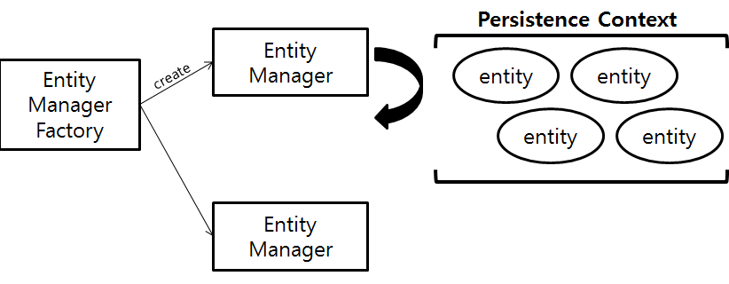

# 영속성 관리



## Entity Manager Factory

- Entity Manager Factory는 Entity Manager 인스턴스를 관리하는 주체
- Entity Manager Factory를 생성하는 비용은 아주 크므로 애플리케이션 실행시 데이터베이스 당 딱 1개씩만 생성하고 공유해서 사용해야 함.
- Entity Manager Factory는 여러 스레드가 동시에 접근해도 안전하므로 스레드간 공유 가능

## Entity Manager

- Entity Manager Factory에서 Entity Manager를 생성
  - 이때 생성하는 비용은 거의 들지 않음.
- 대부분의 JPA 기능을 Entity Manager가 제공
  - Entity를 데이터 베이스에 등록/수정/삭제/조회 등 엔티티와 관련된 모든일 처리

Entity Manager는 말 그대로 Entity를 관리하는 관리자로, 개발자 입장에서 Entity를 저장하는 가상의 데이터베이스로 생각하면 된다.

Entity Manager는 데이터베이스 연결이 꼭 필요한 시점까지 커넥션을 얻지 않으며, 보통 트랜잭션을 시작할 때 커넥션을 획득한다.  **Entity Manager는 데이터베이스 커넥션과 밀접한 관계가 있어 여러 스레드가 동시에 접근하면 동시성 문제가 발생하므로 절대로 스레드간에 공유를 하거나 재사용하면 안된다.**

## 영속성 컨텍스트란?

영속성 컨텍스트(persistence context)는 **Entity를 영구 저장하는 환경**이라는 뜻이다.
Entity Manager로 Entity를 저장하거나 조회하면 Entity Manager는 영속성 컨텍스트에 Entity를 보관하고 관리한다.

```kotlin
// Entity Manager를 사용해 회원 entity를 영속성 컨텍스트에 저장
em.persist(member)
```

영속성 컨텍스트는 Entity Manager 생성시 만들어지며, Entity Manager를 통해 접근하고 관리할 수 있다.

### Entity 생명주기


- 비영속(new/transient) : 영속성 컨텍스트와 전혀 관계가 없는 상태
- 영속(managed) : 영속성 컨텍스트에 저장된 상태
- 준영속(detached) : 영속성 컨텍스트에 저장되어있다가 분리된 상태
  - `detach()`, `clear()`, `close()` 호출시 준영속 상태가 됨
- 삭제(removed) : 삭제된 상태

### 특징

- 영속성 컨텍스트는 엔티티를 식별자 값(`@Id`)으로 구분하므로, **영속 상태는 식별자 값이 반드시 있어야한다**.
  - 식별자 값 없는 경우 예외 발생
- 영속성 컨텍스트에 저장된 내용을 `flush()` 로 데이터베이스에 반영한다.
- 영속성 컨텍스트로 Entity 관리시 장점
  - 1차 캐시
  - 동일성 보장
  - 트랜잭션을 지원하는 쓰기 지연
  - 변경 감지
  - 지연 로딩

#### 1차 캐시

영속성 컨텍스트는 내부에 캐시를 가지고 있으며, 이를 1차 캐시라고 한다. 영속 상태의 엔티티는 `Map<K, V>` 형태로 모두 여기에 저장된다.

- Key : `@Id`로 매핑한 식별자 값 
- Value : Entity 인스턴스

`entityManager.find()` 메소드 호출시 영속성 컨텍스트의 1차 캐시를 먼저 조회한다.
 조회 후 Entity가 1차 캐시에 존재하지 않으면, 데이터베이스를 조회하여 Entity 생성 후 1차 캐시에 저장한 후에 영속상태의 Entity를 반환한다.

#### 동일성 보장

```kotlin
val juergen = User("springjuergen", "Juergen", "Hoeller")

//  persistenceContext(영속성 컨텍스트)에 저장
entityManager.persist(juergen)
val user1 = entityManager.find(User::class.java, 1L)
val user2 = entityManager.find(User::class.java, 1L)

user1 shouldBe juergen
user1 shouldBe user2

```

영속성 컨텍스트는 1차 캐시에 있는 같은 엔티티 인스턴스를 반환하므로, user1과 user2는 동일한 인스턴스인 것을 확인할 수 있다.

**즉, 영속성 컨텍스트는 성능성 이점과 엔티티의 동일성을 보장한다.**

- *동일성(identity) : 실제 인스턴스가 같음 ( `==` 비교 값이 같음)*
- *동등성(equality) : 실제 인스턴스는 다를 수 있지만, 인스턴스가 가지고 있는 값이 같음.*

#### Transactional write-behind(트랜잭션을 지원하는 쓰기 지연)

Entity Manager는 트랜잭션을 커밋하기 직전까지 데이터베이스에 Entity를 저장하지 않고, 내부 쿼리 저장소에 쿼리를 모아두다가 커밋시 모아둔 쿼리를 데이터베이스에 보낸다.

트랜잭션 커밋시 Entity Manager는 우선 영속성 컨텍스트를 `flush` 하여 변경 내용을 데이터 베이스에 동기화 한다. 즉, 이때 등록, 수정 삭제한 Entity를 데이터베이스에 반영한다. 

영속성 컨텍스트의 변경 내용을 데이터베이스에 동기화한 후에 실제 데이터베이스 트랜잭션을 커밋한다.

#### 변경 감지(dirty checking)

JPA는 Entity를 영속성 컨텍스트에 보관할 때, 최초 상태를 복사해서 저장해둔다. ( 스냅샷 )
그리고 flush 시점에 스냅샷과 비교하여 변경된 내용이 있다면, UPDATE SQL문을 쓰기 지연 SQL 저장소에 저장해 둔 후 데이터베이스 커밋 시점에 변경 내용을 자동으로 반영한다.

**변경 감지는 영속성 컨텍스트가 관리하는 영속 상태의 Entity에만 적용**된다.

```java
val user1 = entityManager.find(User::class.java, 1L)

// 영속성 데이터 수정
// 변경 감지(dirty checking)으로 데이터 베이스에 자동 반영
user1.firstname = "test2"
```

위 코드에서 수정 쿼리에서 실제로 수정된 필드만 반영될거라 예상할 수 있지만, 

```sql
UPDATE USER
SET
		firstname = ?
WHERE
		id = ?
```

JPA의 기본 전략은 **Entity의 모든 필드를 업데이트한다.**

```sql
UPDATE USER
SET
		firstname = ?
	, lastname = ?
	, description = ?
WHERE
		id = ?
```

그 이유는 다음과 같은 장점이 있기 때문이다.

1. 모든 필드를 사용하면 수정 쿼리가 항상 같다. (바인딩되는 데이터는 다름) 애플리케이션 로딩 시점에 수정쿼리를 미리 생성해두고 재사용할 수 있다.
2. 데이터베이스에 동일한 쿼리를 보내면, 데이터베이스는 이전에 한 번 파싱된 쿼리를 재사용할 수 있다.

이렇게 모든 필드를 사용해 데이터 베이스에 전송하는 것이 필드가 많거나 저장되는 내용이 너무 크면 수정된 데이터만 사용해서 동적으로 UPDATE SQL을 생성하는 전략을 선택할 수 있다.

```kotlin
@Entity
@DynamicUpdate
data class Member(...)
```

`@DynamicUpdate` / `@DynamicInsert` 어노테이션으로 동적으로 SQL을 생성하게 지정할 수 있다.

하나의 테이블에 많은 수의 컬럼이 있는데, 몇몇개의 컬럼만 자주 업데이트 하는 경우에 사용하는 것을 권장한다. 기본 전략 사용 후, 최적화가 필요할 정도로 느린 경우 전략을 수정하면 된다.

( 상황에 따라 다르지만, 컬럼이 30개 이상이 되면, 정적 수정 쿼리보다 `@DynamicUpdate`를 사용한 동적 수정 쿼리가 더 빠르다고 한다. )

### Flush

`flush()`는 **영속성 컨텍스트의 변경 내용을 데이터베이스에 반영**한다. 영속성 컨텍스트를 flush하는 방법은 3가지이다.

1. `flush()` 직접 호출
   - 테스트나 다른 프레임워크와 JPA를 함께 사용하는 경우를 제외하고 거의 사용하지 않음
2. 트랜잭션 커밋 시 `flush()` 자동 호출
   - 변경 내용을 `flush()`로 전달하지 않고, 커밋만 하는 경우 변경 데이터가 반영 되지 않는다. 그러므로 트랜잭션 커밋 전 `flush()`를 호출하여 영속성 컨텍스트의 변경 내용을  데이터베이스에 반영해야한다.
3. JPQL 쿼리 실행시 `flush()` 자동 호출
   - 식별자 기준으로 조회하는 `find()` 메소드 호출시에는 flush가 실행되지 않는다.

#### FlushModeType

- `FlushModeType.AUTO` : 커밋이나 쿼리 실행시 flush (default)
- `FlushModeType.COMMIT` : 커밋할 때만 flush
  - 성능 최적화를 위해 사용할 수 있음

```kotlin
entityManager.flushMode = FlushModeType.COMMIT
```

### 준영속 상태

준영속 상태란, 영속성 컨텍스트가 관리하는 영속 상태의 Entity가 영속성 컨텍스트에서 분리된 것을 의미한다. 즉, **준영속 상태의 Entity는 영속성 컨텍스트가 제공하는 기능을 사용할 수 없다.**

1. `em.detach(entity)` : 특정 엔티티만 준영속 상태로 전환
2. `em.clear()` : 영속성 컨텍스트 완전히 초기화
3. `em.close()` : 영속성 컨텍스트 종료

주로 영속성 컨텍스트가 종료되면서 준영속 상태가 되며, 개발자가 직접 준영속 상태로 만드는 일은 거의 없다.

#### 특징

- 비영속 상태에 가깝다.
  - 1차 캐시, 쓰기 지연, 변경 감지, 지연 로딩을 포함한 영속성 컨텍스트가 제공하는 어떠한 기능도 동작하지 않음
- 식별자 값을 가지고 있다.
  - 준영속 상태는 이미 한 번 영속 상태였으므로, 반드시 식별자 값을 가지고 있따.
- 지연 로딩을 할 수 없음
  - 지연 로딩은 실제 객체 대신 프록시 객체를 로딩해두고, 해당 객체를 실제로 사용할 때 영속성 컨텍스트를 통해 데이터를 불러오는 방법
  - 준영속 상태는 영속성 컨텍스트가 더이상 관리하지 않으므로 지연 로딩시 문제 발생

#### merge()

비영속/준영속 상태의 Entity를 다시 영속 상태로 변경하려면 `merge()`를 사용하면 된다. `merge()`는 새로운 영속 상태의 Entity를 반환한다.

merge는 비영속, 준영속 상태를 신경 쓰지 않으며, 식별자 값으로 Entity를 조회할 수 있으면 조회 후 병합하고, 조회할 수 없는 경우 새로 생성하여 병합한다. (save or update)