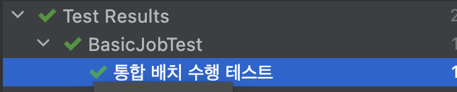
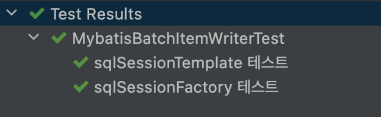

# 테스트 이름 표기

## @DisplayName

테스트 클레스, 메서드에 이름을 붙여주는 경우에 사용하며, 메서드 이름은 그대로 둔 채 테스트명을 변경하고 싶을 때 사용한다.

```java
    @Test
    @DisplayName("통합 배치 수행 테스트")
    public void test() throws Exception {
```



## @DisplayNameGeneration

클래스에 어노테이션을 붙이면, `@Test` 메서드 이름에 정의된 DisplayNameGenerator로 이름을 변형시켜준다.

| DisplayNameGenerator 클래스명 | 설명                                                         |
| ----------------------------- | ------------------------------------------------------------ |
| **Standard**                  | 기존 클래스, 메서드명 사용(default)                          |
| Simple                        | 괄호`(`, `)` 제외                                            |
| ReplaceUnderscores            | `_`(언더바)로 표시한 모든 부분이 공백으로 처리               |
| IndicativeSentences           | 클래스명 + 구분자(`,`) + 메서드명으로 변경<br />이때 구분자는 `@IndicativeSentencesGeneration` 으로 커스텀 가능 |

```java
@DisplayNameGeneration(DisplayNameGenerator.ReplaceUnderscores.class)
public class MybatisBatchItemWriterTest {

    @Test
    public void sqlSessionFactory_테스트() {}
    
    @Test
    public void sqlSessionTemplate_테스트() {}
}
```



### @IndicativeSentencesGeneration

구분자를 커스텀하게 사용할 수 있게 해준다.

| 파라미터명 | 타입명                                  | 설명                                     |
| ---------- | --------------------------------------- | ---------------------------------------- |
| seperator  | String                                  | 구분자( default : `,`)                   |
| generator  | `Class<? extends DisplayNameGenerator>` | 정의된 DisplayNameGenerator 중 하나 사용 |

```java
@IndicativeSentencesGeneration(separator = "> ", generator = DisplayNameGenerator.ReplaceUnderscores.class)
class MybatisBatchItemWriterTest {
    @Test
    public void sqlSessionFactory_테스트() {}
    
    @Test
    public void sqlSessionTemplate_테스트() {}
}
```


## 어노테이션 우선 순위

1. @DisplayName

2. @DisplayNameGeneration

3. properties에 명시한 Default 값

   ```groovy
   junit.jupiter.displayname.generator.default = org.junit.jupiter.api.DisplayNameGenerator$ReplaceUnderscores
   ```

4. DisplayNameGenerator.Standard.class


## 참고

- [민동현 - JUnit5 완벽가이드](https://donghyeon.dev/junit/2021/04/11/JUnit5-%EC%99%84%EB%B2%BD-%EA%B0%80%EC%9D%B4%EB%93%9C/)
- [노력남자 - JUnit 5 (2) - Test Results 테스트명 바꾸기](https://effortguy.tistory.com/114?category=841326)