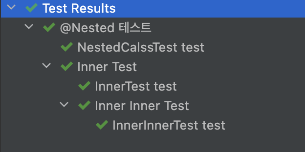

# 테스트 그룹 사이의 관계

## @Nested

중첩된 테스트 클래스 테스트 시 `@Nested`를 사용하면 테스트 그룹 간의 관계를 다양한 방법으로 더 명확하게 표시할 수 있다.

`@Nested` 사용시 아래 내용들을 주의해야한다.

- `@Nested` 클래스는 정적 클래스(static)이 아닌 내포된 클래스(inner class)여야한다.
- Java는 이너 클래스 안에 `static` 멤버 변수를 두는 것을 허락하지 않기 때문에 기본 `PER_METHOD` 생명 주기에서는 `@BeforeAll`과 `@AfterAll` 이 동작하지 않는다.
- `@TestInstance(Lifecycle.PER_CLASS)`로 클래스 단위로 인스턴스를 생성하는 경우에는  `@BeforeAll`과 `@AfterAll`를 사용할 수 있다.

```java
@DisplayName("@Nested 테스트")
public class NestedClassTests {

    @Test
    @DisplayName("NestedCalssTest test")
    public void test() {
    }

    @Nested
    @DisplayName("Inner Test")
    class InnerTest {

        @DisplayName("InnerTest test")
        @Test
        void test() {

        }

        @Nested
        @DisplayName("Inner Inner Test")
        class InnerInnerTest{
            @DisplayName("InnerInnerTest test")
            @Test
            void test() {

            }
        }
    }
}
```




## 참고

- [민동현 - JUnit5 완벽가이드](https://donghyeon.dev/junit/2021/04/11/JUnit5-%EC%99%84%EB%B2%BD-%EA%B0%80%EC%9D%B4%EB%93%9C/)