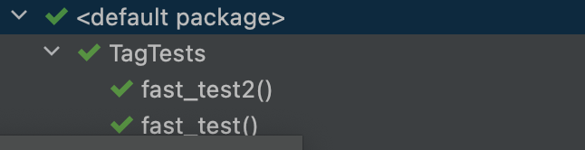

# 태그와 필터링

## @Tag

테스트 클래스와 메서드를 `@Tag` 를 통해 태그할 수 있으며, 이 태그들로 나중에 테스트를 필터링할 수 있다.

#### 사용 규칙

- 태그는 공백이나 `null`이 있으면 안된다.
- ISO 제어문자가 있으면 안된다.
- `,`, `(`, `)`, `|`, `!`, `&` 과 같은 문자열이 표함되면 안된다.

```java
public class TagTests {

    @Test
    @Tag("fast")
    void fast_test() {
    }

    @Test
    @Tag("fast")
    void fast_test2() {
    }

    @Test
    @Tag("slow")
    void slow_test() {
    }
    
    @Test
    @Tag("slow")
    void slow_test2() {
    }
}
```


Test Kind를 Tags로 변경 후 Tag Expression에 수행할 Tag 값을 입력하면된다.

- `!` : NOT
- `&` : AND
- `|` : OR

위 3개 Operator로 수행할 수 있다.



위에서 수행한 fast 태그만 수행된 것을 확인할 수 있다.

추후에 특정 태그를 계속해서 사용한다면 어노테이션을 생성해서 사용하면 좋다.

```java
@Target({ ElementType.TYPE, ElementType.METHOD })
@Retention(RetentionPolicy.RUNTIME) 
@Tag("fast") 
@Test
public @interface FastTest { }
```

다음과 같이 `@FastTest` 어노테이션을 생성해서 사용하면, 오타를 방지하고, 간편하게 사용할 수 있다.


## 참고

- [민동현 - JUnit5 완벽가이드](https://donghyeon.dev/junit/2021/04/11/JUnit5-%EC%99%84%EB%B2%BD-%EA%B0%80%EC%9D%B4%EB%93%9C/)
- [노력남자 - JUnit 5 (3) - 태깅, 필터링 테스트 (@Tag)](https://effortguy.tistory.com/115?category=841326)