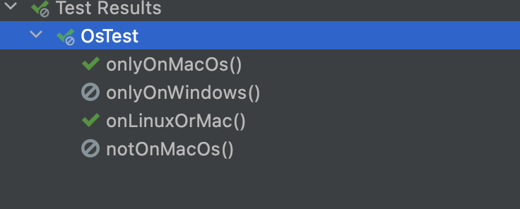
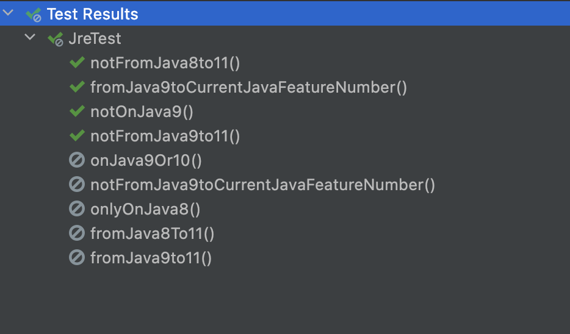

# 테스트 실행 조건

JUnit Juptier에 있는 `ExecutionCondition` API는 개발자가 특정 조건에 따라 테스트를 실행할지 말지 결정한다.

`org.junit.jupiter.api.condition` 패키지에 있는 어노테이션 기반 조건을 지원하고 있으며, 여러개의 `ExecutionCondition`이 등록되는 경우에는 한 개의 조건이라도 만족하면, 테스트를 비활성화시킨다.

- `org.junit.jupiter.api.Disabled`
- `org.junit.jupiter.api.condition.EnabledIfEnvironmentVariable `
- `org.junit.jupiter.api.condition.DisabledIfEnvironmentVariable`
- `org.junit.jupiter.api.condition.EnabledIfSystemProperty`
- `org.junit.jupiter.api.condition.DisabledIfSystemProperty`
- `org.junit.jupiter.api.condition.EnabledOnJre`
- `org.junit.jupiter.api.condition.DisabledOnJre`
- `org.junit.jupiter.api.condition.EnabledForJreRange`
- `org.junit.jupiter.api.condition.DisabledForJreRange`
- `org.junit.jupiter.api.condition.EnabledOnOs`
- `org.junit.jupiter.api.condition.DisabledOnOs`
- `org.junit.jupiter.api.extension.ExecutionCondition`
- `org.junit.jupiter.api.extension.ExecutionCondition`

## @Disabled

```java
@Target({ ElementType.TYPE, ElementType.METHOD })
@Retention(RetentionPolicy.RUNTIME)
@Documented
@API(status = STABLE, since = "5.0")
public @interface Disabled {

	/**
	 * The reason this annotated test class or test method is disabled.
	 */
	String value() default "";

}
```

테스트 클래스나, 메소드의 테스트를 비활성화 하며, 비활성화한 이유에 대해 짧은 설명을 추가하는 것을 권장하고 있다.
(Junit4의 `@Ignore`와 동일)

```java
public class DisabledTests {

    @Test
    void test1() {}

    @Test
    void test2() {}

    @Test
    @Disabled("bug:123")
    void disabled_test1() {}

    @Test
    @Disabled("bug:123")
    void disabled_test2() {}
}
```

```java
@Disabled("bug:124 해결전까지 비활성화")
public class DisabledClassTest {

    @Test
    void test1() {}

    @Test
    void test2() {}

}
```


## OS 환경 별 테스트

### @EnableOnOs, @DisableOnOs

| 파라미터명     | 타입   | 설명                                                      |
| -------------- | ------ | --------------------------------------------------------- |
| value          | OS[]   | 테스트 OS <br />AIX, LINUX, MAC, SOLARIS, WINDOWS, OTHER, |
| disabledReason | String | disabled 이유  <br />`@Disabled` 사용했을 경우 사용       |

```java

public class OsTest {
    @Test
    @EnabledOnOs(MAC)
    void onlyOnMacOs() {
    }

    @Test
    @EnabledOnOs(WINDOWS)
    void onlyOnWindows() {
    }

    @Test
    @EnabledOnOs({LINUX, MAC})
    void onLinuxOrMac() {
    }

    @Test
    @DisabledOnOs(value = MAC,disabledReason = "MAC OS에서 테스트하지 않음")
    void notOnMacOs() {
    }
}
```



## 자바 환경변수 별 테스트

### @EnabledOnJre, @DisabledOnJre

| **파라미터명** | **타입** | **설명**                                                     |
| -------------- | -------- | ------------------------------------------------------------ |
| value          | JRE[]    | JAVA_8, JAVA_9, JAVA_10, JAVA_11, JAVA_12, JAVA_13, JAVA_14, OTHER, |
| disabledReason | String   | disabled 이유  <br />`@Disabled` 사용했을 경우 사용          |

### @EnabledForJreRange, @DisabledForJreRange

| **파라미터명** | **타입** | **설명**                                            |
| -------------- | -------- | --------------------------------------------------- |
| min            | JRE      | 테스트할 최소 JRE 버전                              |
| max            | JRE      | 테스트할 최대 JRE 버전                              |
| disabledReason | String   | disabled 이유  <br />`@Disabled` 사용했을 경우 사용 |

```java
public class JreTest {

    @Test
    @EnabledOnJre(JAVA_8)
    void onlyOnJava8() {
    }

    @Test
    @EnabledOnJre({JAVA_9, JAVA_10})
    void onJava9Or10() {
    }

    @Test
    @EnabledForJreRange(min = JAVA_9, max = JAVA_11)
    void fromJava9to11() {
    }

    @Test
    @EnabledForJreRange(min = JAVA_9)
    void fromJava9toCurrentJavaFeatureNumber() {
    }

    @Test
    @EnabledForJreRange(max = JAVA_11)
    void fromJava8To11() {
    }

    @Test
    @DisabledOnJre(JAVA_9)
    void notOnJava9() {

    }

    @Test
    @DisabledForJreRange(min = JAVA_9, max = JAVA_11)
    void notFromJava9to11() {

    }

    @Test
    @DisabledForJreRange(min = JAVA_9)
    void notFromJava9toCurrentJavaFeatureNumber() {
    }

    @Test
    @DisabledForJreRange(max = JAVA_11)
    void notFromJava8to11() {
    }
}
```



## 시스템 속성 조건 테스트

### @EnabledIfSystemProperty, @DisabledIfSystemProperty

JVM 시스템 속성에 따라 테스트를 활성화 혹은 비활성화 할 수 있다.

### @EnabledIfSystemProperties, @DisabledIfSystemProperties

Junit Jupiter 5.6부터 `@RepeatedTest`로 변경되었으며, 테스트 시 여러개를 중첩해 사용할 수 있다.

| 파라미터명     | 타입   | 설명                                                |
| -------------- | ------ | --------------------------------------------------- |
| named          | String | JVM의 Systme Property 명                            |
| matches        | String | 찾고자하는 이름, 정규식                             |
| disabledReason | String | disabled 이유  <br />`@Disabled` 사용했을 경우 사용 |

```java
public class SystemPropertyTest {
    @Test
    @EnabledIfSystemProperty(named = "java.vm.name", matches = ".*OpenJDK.*")
    void javaVmOpenJdk() {
    }
}
```

## 환경 변수 조건

### @EnabledIfEnvironmentVariable, @DisabledIfEnvironmentVariable

운영체제 시스템의 환경 변수에 따라 테스트를 활성화 혹은 비활성화 할 수 있다.

| **파라미터명** | **타입** | **설명**                                            |
| -------------- | -------- | --------------------------------------------------- |
| named          | String   | 환경변수명                                          |
| matches        | String   | 찾고자하는 이름, 정규식                             |
| disabledReason | String   | disabled 이유  <br />`@Disabled` 사용했을 경우 사용 |

```java
public class EnvironmentTest {
    @Test
    @EnabledIfEnvironmentVariable(named = "JUnit", matches = "5")
    void testEnabledIfEnvironmentVariable() {
    }

    @Test
    @DisabledIfEnvironmentVariable(named = "JUnit", matches = "5")
    void testDisabledIfEnvironmentVariable() {
    }
}
```

## 사용자 커스텀 조건

### @EnabledIf, @DisabledIf

지정한 메서드가 반환하는 `boolean`값에 따라 테스트를 활성화 혹은 비활성화 할 수 있다.

| **파라미터명** | **타입** | **설명**                                            |
| -------------- | -------- | --------------------------------------------------- |
| value          | String   | 조건 로직이 있는 메소드명                           |
| disabledReason | String   | disabled 이유  <br />`@Disabled` 사용했을 경우 사용 |

테스트 클래스 밖에 있는 메소드의 경우, 클래스를 포함한 전체 경로를 써줘야한다.
만약 클래스 레벨에 사용하는 경우에는 컨디션 메서드는 반드시 static으로 선언되어야한다.

```java
public class CustomConditionalTest {
    @Test
    @DisabledIf("customCondition")
    void disabled() {

    }

    @Test
    @EnabledIf("customCondition")
    void enabled() {

    }

    boolean customCondition() {
        return true;
    }
}
```

## 참고

- [민동현 - JUnit5 완벽가이드](https://donghyeon.dev/junit/2021/04/11/JUnit5-%EC%99%84%EB%B2%BD-%EA%B0%80%EC%9D%B4%EB%93%9C/)
- [노력남자 - JUnit 5 (7) - OS, JAVA, JVM, 시스템 환경변수 별 테스트](https://effortguy.tistory.com/121?category=841326)